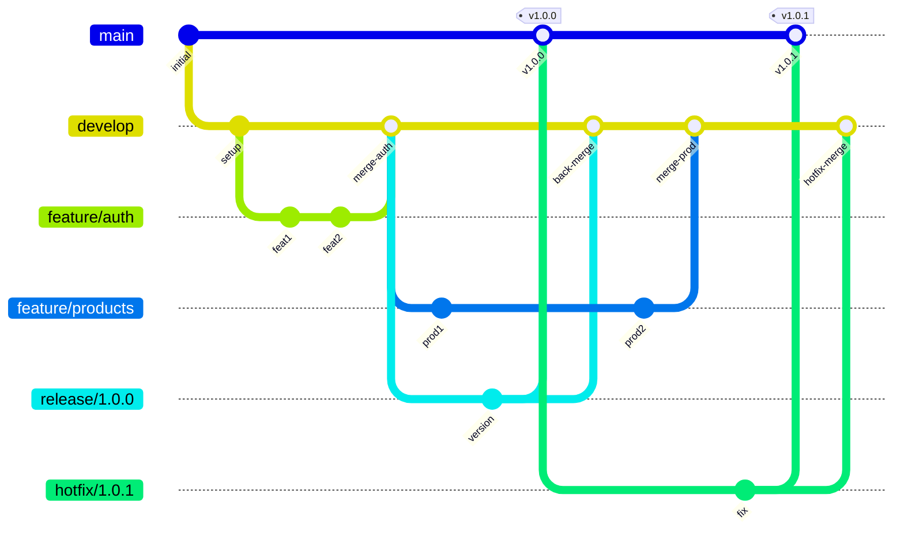

# Tasks 17-20: Branch Verification

> **Phase:** 01 - Project Foundation & Setup  
> **SubPhase:** 06 - Git Workflow & Standards  
> **Group:** B - Branching Strategy Definition  
> **Document:** 03 of 03  
> **Tasks Covered:** 17, 18, 19, 20

---

## Navigation

- **↑ Parent:** [00_GROUP_OVERVIEW.md](00_GROUP_OVERVIEW.md)
- **← Previous Document:** [02_Tasks-13-16_Branch-Patterns.md](02_Tasks-13-16_Branch-Patterns.md)
- **→ Next Group:** [../Group-C_Commit-Message-Conventions/00_GROUP_OVERVIEW.md](../Group-C_Commit-Message-Conventions/00_GROUP_OVERVIEW.md)

---

## Document Overview

This document covers develop branch creation and verification.

### Tasks in This Document
| Task # | Task Name | Complexity |
|--------|-----------|------------|
| 17 | Create Branch from Main | Simple |
| 18 | Document Merge Strategies | Medium |
| 19 | Create Branch Naming Validation | Medium |
| 20 | Add Branching Diagram | Simple |

---

## Task 17: Create Branch from Main

### Overview
Create the develop branch from main.

### Dependencies
- Task 10: Main branch defined

### Instructions

1. **Ensure on main**
   - Checkout main

2. **Create develop**
   - New branch

3. **Push to remote**
   - Set upstream

### Create Develop Branch

```bash
# Ensure on main branch
git checkout main
git pull origin main

# Create develop branch
git checkout -b develop

# Push develop to remote
git push -u origin develop

# Verify branches
git branch -a
```

### Branch Setup After Creation

```bash
# Verify branch exists remotely
git fetch --all
git branch -r

# Expected output
# origin/main
# origin/develop
```

### Protect Develop Branch

Configure on GitHub:
1. Go to Settings > Branches
2. Add branch protection rule
3. Branch name pattern: `develop`
4. Enable protections

### Expected Outcome
- Develop branch created
- Pushed to remote

### Verification Checklist
- [ ] develop branch exists locally
- [ ] develop branch on remote
- [ ] Both branches identical
- [ ] Protection rule added

---

## Task 18: Document Merge Strategies

### Overview
Document merge strategies for different scenarios.

### Dependencies
- Task 16: Branch lifecycle documented

### Instructions

1. **Add merge section**
   - Strategy overview

2. **Document each strategy**
   - When to use

3. **Add command examples**
   - How to merge

### BRANCHING.md Merge Strategies Section

```markdown
## Merge Strategies

### Available Strategies

| Strategy | Command | When to Use |
|----------|---------|-------------|
| Squash Merge | `--squash` | Features, bugfixes |
| Regular Merge | `--no-ff` | Releases, hotfixes |
| Rebase | `rebase` | Syncing with base |

### Squash Merge

**Use for:** Feature branches, bugfix branches

Combines all commits into a single commit, creating a clean history.

```bash
# Via GitHub PR: "Squash and merge"

# Or via command line
git checkout develop
git merge --squash feature/LCC-123-feature
git commit -m "feat(module): add feature description (#123)"
```

**Benefits:**
- Clean, linear history
- One commit per feature
- Easy to revert
- Cleaner git log

**Commit Message:**
Use PR title as commit message.

### Regular Merge (No Fast-Forward)

**Use for:** Release branches, hotfix branches

Preserves branch history with a merge commit.

```bash
# Via GitHub PR: "Create a merge commit"

# Or via command line
git checkout main
git merge --no-ff release/1.0.0 -m "Merge release 1.0.0"
```

**Benefits:**
- Preserves history
- Shows branch structure
- Clear release points

**When to Use:**
- Merging release to main
- Merging hotfix to main
- Merging hotfix to develop (after main)

### Rebase

**Use for:** Syncing feature branch with develop

Replays commits on top of base branch.

```bash
# Update feature branch with latest develop
git checkout feature/LCC-123-feature
git fetch origin
git rebase origin/develop

# Resolve conflicts if any
git add .
git rebase --continue

# Force push (required after rebase)
git push --force-with-lease
```

**Benefits:**
- Linear history
- Clean commit order
- Latest base changes

**Rules:**
- Never rebase public branches (main, develop)
- Use force-with-lease, not force
- Rebase before creating PR

### Merge Strategy by Branch Type

| Source | Target | Strategy | Reason |
|--------|--------|----------|--------|
| feature | develop | Squash | Clean history |
| bugfix | develop | Squash | Clean history |
| release | main | Merge (no-ff) | Preserve history |
| release | develop | Merge (no-ff) | Back-merge |
| hotfix | main | Merge (no-ff) | Preserve history |
| hotfix | develop | Merge (no-ff) | Back-merge |

### Conflict Resolution

1. **Pull latest changes**
   ```bash
   git fetch origin
   git checkout develop
   git pull origin develop
   ```

2. **Merge or rebase**
   ```bash
   git checkout feature/LCC-123-feature
   git rebase develop
   ```

3. **Resolve conflicts**
   - Edit conflicting files
   - Remove conflict markers
   - Test changes

4. **Complete merge/rebase**
   ```bash
   git add .
   git rebase --continue
   # or
   git commit
   ```

5. **Push changes**
   ```bash
   git push --force-with-lease
   ```
```

### Expected Outcome
- Merge strategies documented
- Clear guidance for each scenario

### Verification Checklist
- [ ] All strategies explained
- [ ] Commands included
- [ ] Branch type mapping complete
- [ ] Conflict resolution documented

---

## Task 19: Create Branch Naming Validation

### Overview
Create script to validate branch names.

### Dependencies
- Tasks 12-15: All branch patterns defined

### Instructions

1. **Create scripts directory**
   - If not exists

2. **Create validation script**
   - Shell script

3. **Document usage**
   - How to run

### File Location

```
/                            # Repository root
├── scripts/
│   └── validate-branch.sh   # Validation script
└── ...
```

### validate-branch.sh Script

```bash
#!/bin/bash
# ==================================================
# LankaCommerce Cloud - Branch Name Validation
# ==================================================
# Validates branch names follow naming conventions
# ==================================================

set -e

# Get current branch name
if [ -z "$1" ]; then
    BRANCH=$(git rev-parse --abbrev-ref HEAD)
else
    BRANCH="$1"
fi

# Skip validation for main branches
if [[ "$BRANCH" == "main" || "$BRANCH" == "develop" ]]; then
    echo "✅ Branch '$BRANCH' is a main branch - OK"
    exit 0
fi

# Define valid patterns
FEATURE_PATTERN="^feature\/[A-Z]+-[0-9]+-[a-z0-9-]+$"
BUGFIX_PATTERN="^bugfix\/[A-Z]+-[0-9]+-[a-z0-9-]+$"
HOTFIX_PATTERN="^hotfix\/[0-9]+\.[0-9]+\.[0-9]+-[a-z0-9-]+$"
RELEASE_PATTERN="^release\/[0-9]+\.[0-9]+\.[0-9]+(-[a-z]+)?$"

# Check patterns
if [[ $BRANCH =~ $FEATURE_PATTERN ]]; then
    echo "✅ Branch '$BRANCH' follows feature naming convention - OK"
    exit 0
fi

if [[ $BRANCH =~ $BUGFIX_PATTERN ]]; then
    echo "✅ Branch '$BRANCH' follows bugfix naming convention - OK"
    exit 0
fi

if [[ $BRANCH =~ $HOTFIX_PATTERN ]]; then
    echo "✅ Branch '$BRANCH' follows hotfix naming convention - OK"
    exit 0
fi

if [[ $BRANCH =~ $RELEASE_PATTERN ]]; then
    echo "✅ Branch '$BRANCH' follows release naming convention - OK"
    exit 0
fi

# Invalid branch name
echo "❌ Invalid branch name: '$BRANCH'"
echo ""
echo "Valid patterns:"
echo "  feature/<TICKET>-<description>  (e.g., feature/LCC-123-user-auth)"
echo "  bugfix/<TICKET>-<description>   (e.g., bugfix/LCC-456-fix-login)"
echo "  hotfix/<version>-<description>  (e.g., hotfix/1.0.1-security-fix)"
echo "  release/<version>               (e.g., release/1.0.0)"
echo ""
exit 1
```

### Make Script Executable

```bash
chmod +x scripts/validate-branch.sh
```

### Usage

```bash
# Validate current branch
./scripts/validate-branch.sh

# Validate specific branch
./scripts/validate-branch.sh feature/LCC-123-user-auth

# Use in CI
./scripts/validate-branch.sh "$CI_BRANCH_NAME"
```

### Git Hook Integration

Add to pre-push hook:
```bash
#!/bin/bash
# .git/hooks/pre-push

./scripts/validate-branch.sh
```

### Expected Outcome
- Validation script created
- Branch names validated

### Verification Checklist
- [ ] Script created
- [ ] All patterns covered
- [ ] Helpful error messages
- [ ] Exit codes correct

---

## Task 20: Add Branching Diagram

### Overview
Add visual diagram of branching strategy.

### Dependencies
- Task 09: BRANCHING.md exists

### Instructions

1. **Add diagram section**
   - Visual representation

2. **Use Mermaid**
   - Git graph

3. **Add legend**
   - Explain elements

### BRANCHING.md Diagram Section

```markdown
## Branching Diagram

### Visual Overview



### ASCII Diagram (Alternative)

```
main     ─●─────────────────────────●────────●───────────●─────
          │                         │        │           │
          │                      release   v1.0.0     v1.0.1
          │                         │        │           │
develop  ─●─●─────●─────●───────────●────────●───────────●─────
              \   │    /            │                    │
feature        ●──●───●             │                    │
                                    │                    │
release                            ●──●                  │
                                                         │
hotfix                                                  ●─●

Legend:
● = Commit
─ = Branch timeline
\ / = Merge
```

### Branch Flow Summary

```
                    ┌──────────┐
                    │   main   │ ← Production releases
                    └────┬─────┘
                         │
          ┌──────────────┼──────────────┐
          │              │              │
          ▼              ▼              ▼
    ┌──────────┐   ┌──────────┐   ┌──────────┐
    │ hotfix/* │   │release/* │   │ develop  │ ← Integration
    └──────────┘   └──────────┘   └────┬─────┘
                                       │
                    ┌──────────────────┼──────────────────┐
                    │                  │                  │
                    ▼                  ▼                  ▼
              ┌──────────┐       ┌──────────┐       ┌──────────┐
              │feature/* │       │feature/* │       │ bugfix/* │
              └──────────┘       └──────────┘       └──────────┘
```

### Merge Direction Summary

| From | To | Description |
|------|-----|-------------|
| feature | develop | New features |
| bugfix | develop | Bug fixes |
| develop | release | Start release |
| release | main | Complete release |
| release | develop | Back-merge |
| main | hotfix | Emergency start |
| hotfix | main | Emergency fix |
| hotfix | develop | Back-merge |
```

### Expected Outcome
- Diagram added
- Visual clarity provided

### Verification Checklist
- [ ] Mermaid diagram included
- [ ] ASCII alternative provided
- [ ] Flow summary added
- [ ] Legend included

---

## Summary

### Tasks Completed in This Document
| Task # | Task Name | Key Deliverable |
|--------|-----------|-----------------|
| 17 | Create Branch from Main | develop branch |
| 18 | Document Merge Strategies | Merge documentation |
| 19 | Create Branch Naming Validation | validate-branch.sh |
| 20 | Add Branching Diagram | Visual diagram |

### Group B Complete

```
/                            # Repository root
├── docs/
│   └── BRANCHING.md         # Complete branching strategy
├── scripts/
│   └── validate-branch.sh   # Branch validation script
├── develop branch           # Created and pushed
└── Branch protections       # Configured on GitHub
```

### BRANCHING.md Complete

```
Sections:
├── Overview
├── Quick Reference
├── Main Branch
├── Develop Branch
├── Feature Branches
├── Bugfix Branches
├── Hotfix Branches
├── Release Branches
├── Branch Lifecycle
├── Merge Strategies
└── Branching Diagram
```

### Next Steps
Proceed to [../Group-C_Commit-Message-Conventions/00_GROUP_OVERVIEW.md](../Group-C_Commit-Message-Conventions/00_GROUP_OVERVIEW.md) for commit conventions.

---

## Notes for AI Agents

1. **Create develop:** Only if not exists
2. **Merge strategies:** Squash for features, merge for releases
3. **Validation:** Use regex patterns
4. **Diagram:** Include Mermaid and ASCII
5. **Protection:** Apply to main and develop
6. **Commit:** After completing group
