# Tasks 49-58: VendorPayment Model Implementation

**Document Version:** 1.0  
**Last Updated:** 2026-01-24  
**Status:** Active Development  
**Owner:** Backend Development Team

---

## Document Navigation

| Level | Document | Description |
|-------|----------|-------------|
| **Parent** | [00_GROUP_OVERVIEW.md](./00_GROUP_OVERVIEW.md) | Group D: Payment Recording & Scheduling Overview |
| **Previous** | [Group-C/02_Tasks-XX-XX_Document-Name.md](../Group-C_Bill-Approval-Workflow/02_Tasks-XX-XX_Document-Name.md) | Previous Group C Document |
| **Current** | **01_Tasks-49-58_Payment-Model.md** | VendorPayment Model Implementation |
| **Next** | [02_Tasks-59-68_Payment-Processing.md](./02_Tasks-59-68_Payment-Processing.md) | Payment Processing & Validation |

---

## Table of Contents

1. [Introduction](#introduction)
2. [Task 49: VendorPayment Model Foundation](#task-49-vendorpayment-model-foundation)
3. [Task 50: Core Payment Fields](#task-50-core-payment-fields)
4. [Task 51: Payment Method Configuration](#task-51-payment-method-configuration)
5. [Task 52: Reference and Tracking Fields](#task-52-reference-and-tracking-fields)
6. [Task 53: Bill and Vendor Relationships](#task-53-bill-and-vendor-relationships)
7. [Task 54: Bank and Financial Fields](#task-54-bank-and-financial-fields)
8. [Task 55: Payment Status Management](#task-55-payment-status-management)
9. [Task 56: Payment Number Generator](#task-56-payment-number-generator)
10. [Task 57: Model Methods and Properties](#task-57-model-methods-and-properties)
11. [Task 58: Database Migrations](#task-58-database-migrations)
12. [Integration Overview](#integration-overview)
13. [Testing Strategy](#testing-strategy)
14. [Appendices](#appendices)

---

## Introduction

### Purpose

This document provides comprehensive guidance for implementing the **VendorPayment model** (Tasks 49-58), which serves as the foundation for recording, tracking, and managing all vendor payment transactions within the ERP system. The VendorPayment model captures essential payment information including amounts, payment methods, bank details, and payment status throughout the payment lifecycle.

### Scope

**Included in this Document:**
- VendorPayment model structure and field definitions
- Core payment fields (payment_number, amount, payment_date)
- Payment method enumeration and handling
- Reference and tracking fields
- Bill and vendor foreign key relationships
- Bank and financial institution fields
- Payment status workflow (PENDING → COMPLETED/FAILED/REVERSED)
- Automatic payment number generation (PAY-{YEAR}-{SEQUENCE})
- Model methods, properties, and validation
- Database migration strategy

**Excluded from this Document:**
- Payment processing logic (covered in Tasks 59-68)
- Payment approval workflows (separate document)
- Bank integration and reconciliation (Phase 09)
- Multi-currency payment handling (advanced feature)
- Payment splitting and allocation (Tasks 69-78)

### Business Context

Vendor payments represent the final step in the procure-to-pay cycle. The VendorPayment model must:
- Track all outgoing payments to vendors accurately
- Support multiple payment methods (bank transfer, check, cash, online)
- Maintain audit trails for financial compliance
- Enable reconciliation with bank statements
- Support payment status tracking and reversal capabilities
- Generate unique, sequential payment numbers for accounting

---

## Task 49: VendorPayment Model Foundation

### Overview

Establish the foundational VendorPayment model with base configurations, including model inheritance, metadata, permissions, and table structure. This task creates the essential model skeleton that will be extended with specific fields and functionality in subsequent tasks.

**Key Deliverables:**
- Django model class definition
- Model metadata configuration
- Database table naming conventions
- Permission definitions
- Multi-tenancy support integration
- Model manager setup

### Dependencies

**Required Prior Completion:**
- ✅ Phase 02: Multi-tenancy infrastructure
- ✅ Phase 03: Base models and mixins
- ✅ SubPhase 12, Group A: Vendor master data models
- ✅ SubPhase 12, Group B: Bill model foundation
- ✅ Django project and apps structure

**Related Models:**
- `Vendor` (from Group A)
- `VendorBill` (from Group B)
- `Company` (tenant model)
- `User` (authentication model)

**Technical Prerequisites:**
- Django 4.2+ installed
- PostgreSQL database configured
- django-tenants package configured
- Base model mixins available

### Instructions

#### Step 1: Create Model File Structure

**File Location:**
```
backend/
└── apps/
    └── vendor_management/
        └── models/
            ├── __init__.py
            ├── vendor.py (existing)
            ├── vendor_bill.py (existing)
            └── vendor_payment.py (NEW)
```

**Model File Setup:**
1. Create `vendor_payment.py` in the models directory
2. Import required Django modules and base classes
3. Import related models (Vendor, VendorBill)
4. Import custom mixins (TimestampMixin, TenantMixin, AuditMixin)
5. Import validators and utilities

#### Step 2: Define Model Class Structure

**Basic Model Template:**

The model should inherit from:
- `TenantMixin` - for multi-tenancy support
- `TimestampMixin` - for created_at/updated_at timestamps
- `AuditMixin` - for created_by/updated_by tracking
- `models.Model` - Django base model

**Metadata Configuration:**

Configure the following Meta attributes:
- `db_table`: 'vendor_payments' (explicit table naming)
- `verbose_name`: 'Vendor Payment'
- `verbose_name_plural`: 'Vendor Payments'
- `ordering`: ['-payment_date', '-created_at']
- `indexes`: Define composite indexes for query optimization
- `permissions`: Custom permissions for payment operations

#### Step 3: Define Model Manager

**Manager Responsibilities:**
- Filter active (non-deleted) payments
- Provide tenant-aware querysets
- Add custom query methods
- Support payment status filtering

**Custom Manager Methods:**
- `active()` - returns non-deleted payments
- `for_vendor(vendor)` - payments for specific vendor
- `for_bill(bill)` - payments for specific bill
- `by_status(status)` - filter by payment status
- `pending()` - shortcut for pending payments
- `completed()` - shortcut for completed payments

#### Step 4: Configure Permissions

**Standard Permissions:**
- `add_vendorpayment`
- `change_vendorpayment`
- `delete_vendorpayment`
- `view_vendorpayment`

**Custom Permissions:**
- `approve_vendorpayment` - can approve payments
- `reverse_vendorpayment` - can reverse completed payments
- `export_vendorpayment` - can export payment data
- `reconcile_vendorpayment` - can perform bank reconciliation

#### Step 5: Register Model in __init__.py

Update the models package __init__.py to export VendorPayment model for easy imports throughout the application.

### Architecture Diagram

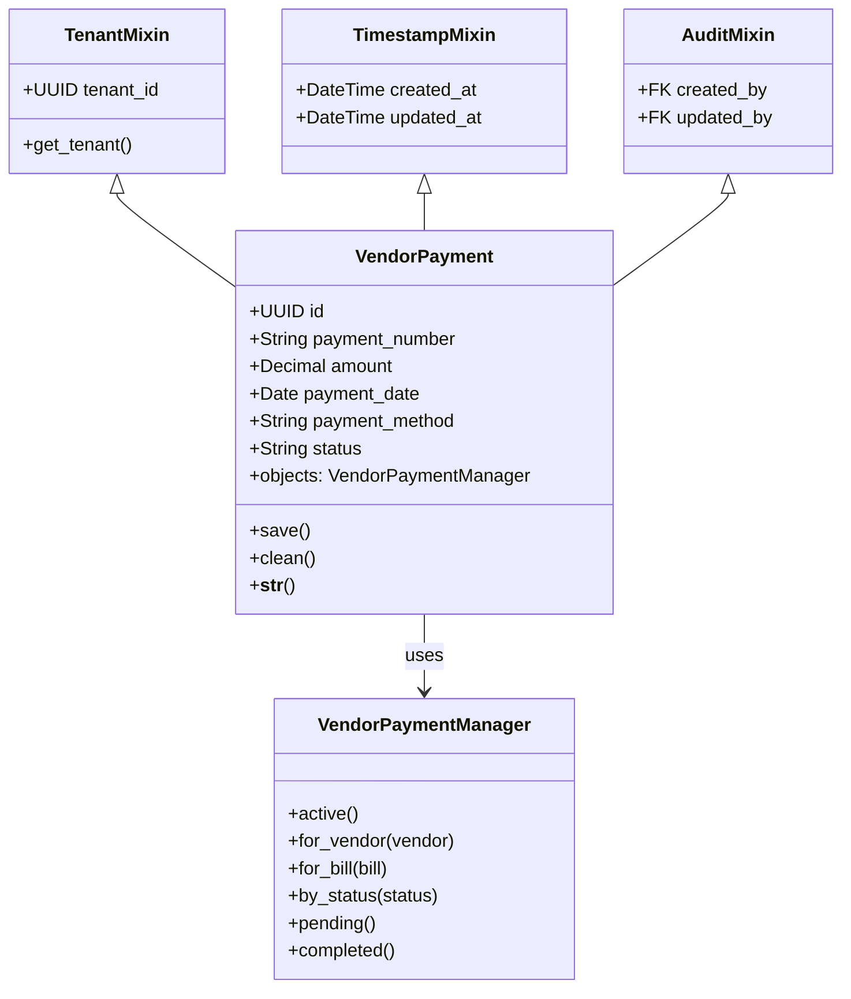
```mermaid
classDiagram
    class TenantMixin {
        +UUID tenant_id
        +get_tenant()
    }
    
    class TimestampMixin {
        +DateTime created_at
        +DateTime updated_at
    }
    
    class AuditMixin {
        +FK created_by
        +FK updated_by
    }
    
    class VendorPaymentManager {
        +active()
        +for_vendor(vendor)
        +for_bill(bill)
        +by_status(status)
        +pending()
        +completed()
    }
    
    class VendorPayment {
        +UUID id
        +String payment_number
        +Decimal amount
        +Date payment_date
        +String payment_method
        +String status
        +objects: VendorPaymentManager
        +save()
        +clean()
        +__str__()
    }
    
    TenantMixin <|-- VendorPayment
    TimestampMixin <|-- VendorPayment
    AuditMixin <|-- VendorPayment
    VendorPayment --> VendorPaymentManager : uses
```

### Data Model Context

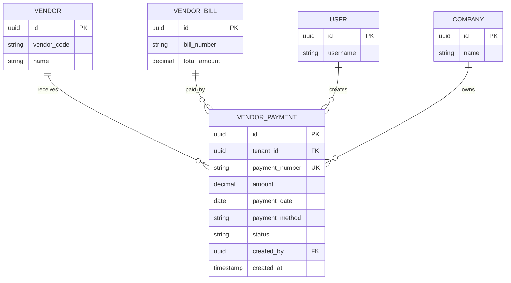
```mermaid
erDiagram
    VENDOR ||--o{ VENDOR_PAYMENT : receives
    VENDOR_BILL ||--o{ VENDOR_PAYMENT : paid_by
    USER ||--o{ VENDOR_PAYMENT : creates
    COMPANY ||--o{ VENDOR_PAYMENT : owns
    
    VENDOR_PAYMENT {
        uuid id PK
        uuid tenant_id FK
        string payment_number UK
        decimal amount
        date payment_date
        string payment_method
        string status
        uuid created_by FK
        timestamp created_at
    }
    
    VENDOR {
        uuid id PK
        string vendor_code
        string name
    }
    
    VENDOR_BILL {
        uuid id PK
        string bill_number
        decimal total_amount
    }
    
    USER {
        uuid id PK
        string username
    }
    
    COMPANY {
        uuid id PK
        string name
    }
```

### Expected Outcome

**Deliverables:**
1. ✅ VendorPayment model file created
2. ✅ Model inherits from required mixins
3. ✅ Model manager configured with custom methods
4. ✅ Meta class configured with appropriate settings
5. ✅ Permissions defined for payment operations
6. ✅ Model registered in package __init__.py
7. ✅ Documentation strings added to model and manager

**Quality Indicators:**
- Model follows Django best practices
- Naming conventions consistent with project standards
- Multi-tenancy properly configured
- Manager provides intuitive query interface
- Permissions align with business requirements

### Verification Checklist

- [ ] Model file created at correct location
- [ ] All required mixins inherited
- [ ] TenantMixin properly configured
- [ ] TimestampMixin properly configured
- [ ] AuditMixin properly configured
- [ ] Custom manager class defined
- [ ] Manager methods implemented
- [ ] Meta class configured completely
- [ ] db_table explicitly set
- [ ] verbose_name and verbose_name_plural set
- [ ] ordering configuration appropriate
- [ ] Standard permissions available
- [ ] Custom permissions defined
- [ ] Model imported in __init__.py
- [ ] Docstrings added to model class
- [ ] Docstrings added to manager class
- [ ] No syntax errors in model file
- [ ] Model can be imported successfully
- [ ] Model appears in Django admin (if registered)

---

## Task 50: Core Payment Fields

### Overview

Implement the essential core fields that define a vendor payment: payment_number, amount, and payment_date. These fields capture the fundamental information required for every payment transaction and serve as the basis for financial reporting and reconciliation.

**Key Deliverables:**
- payment_number field with unique constraint
- amount field with decimal precision
- payment_date field with validation
- Field-level validation logic
- Database constraints
- Field metadata and help text

### Dependencies

**Required Prior Completion:**
- ✅ Task 49: VendorPayment model foundation
- ✅ Base model mixins available
- ✅ Company model with fiscal year settings

**Technical Prerequisites:**
- Django decimal field configuration
- Understanding of financial decimal precision
- Date validation utilities
- Unique constraint implementation

### Instructions

#### Step 1: Implement payment_number Field

**Field Configuration:**

The payment_number field uniquely identifies each payment transaction.

**Requirements:**
- Field type: CharField
- Max length: 20 characters
- Format: PAY-{YEAR}-{SEQUENCE} (e.g., PAY-2026-00001)
- Unique per tenant
- Auto-generated on save
- Read-only after creation
- Indexed for fast lookups

**Constraints:**
- NOT NULL
- UNIQUE (composite with tenant_id)
- No manual editing allowed

**Validation Rules:**
- Must follow format pattern
- Year must be current fiscal year
- Sequence must be positive integer
- Cannot be changed after initial save

#### Step 2: Implement amount Field

**Field Configuration:**

The amount field stores the payment amount with appropriate decimal precision.

**Requirements:**
- Field type: DecimalField
- Max digits: 15 (supports up to 999,999,999,999.99)
- Decimal places: 2
- Positive values only (use MinValueValidator)
- Required field (NOT NULL)
- Default: None (must be explicitly set)

**Business Rules:**
- Amount must be positive (> 0)
- Amount cannot exceed bill's remaining balance
- Amount precision: 2 decimal places (cents)
- Support for large payment amounts
- No negative payments (use reversals instead)

**Validation:**
- Minimum value: 0.01
- Maximum value: 999,999,999,999.99
- Must match currency decimal precision
- Validate against bill balance on save

#### Step 3: Implement payment_date Field

**Field Configuration:**

The payment_date field records when the payment was made or scheduled.

**Requirements:**
- Field type: DateField
- Required field (NOT NULL)
- Default: None (must be explicitly set)
- Indexed for date range queries
- Supports filtering and grouping

**Business Rules:**
- Cannot be in the far future (max 1 year ahead)
- Should not predate bill date significantly
- Must fall within an open fiscal period
- Can be backdated within limits (e.g., 90 days)
- Used for financial period reporting

**Validation:**
- Must be valid date format
- Cannot be earlier than bill date minus 90 days
- Cannot be more than 365 days in future
- Must fall in open or current fiscal period
- Check against company's fiscal calendar

#### Step 4: Add Field-Level Validators

**Custom Validators:**

1. **Amount Validator:**
   - Validates positive decimal values
   - Checks decimal precision
   - Ensures reasonable maximum limits

2. **Date Validator:**
   - Validates date is not too far in past
   - Validates date is not too far in future
   - Checks fiscal period status

3. **Payment Number Validator:**
   - Validates format pattern
   - Ensures year consistency
   - Validates sequence number

#### Step 5: Configure Field Metadata

**Help Text:**
Add descriptive help text for each field to guide users:
- payment_number: "Unique payment identifier (auto-generated)"
- amount: "Payment amount in base currency (positive values only)"
- payment_date: "Date when payment was made or scheduled"

**Verbose Names:**
- payment_number: "Payment Number"
- amount: "Payment Amount"
- payment_date: "Payment Date"

### Field Structure Diagram

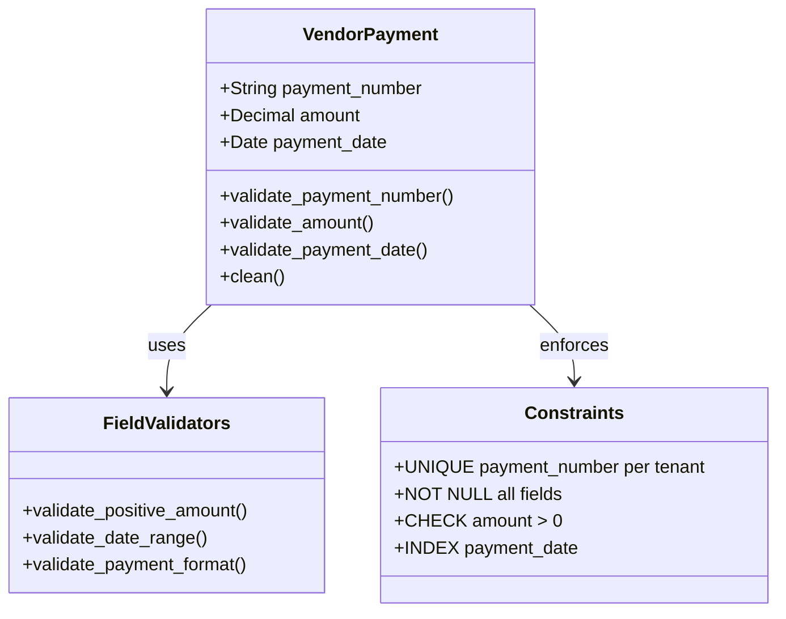
```mermaid
classDiagram
    class VendorPayment {
        +String payment_number
        +Decimal amount
        +Date payment_date
        +validate_payment_number()
        +validate_amount()
        +validate_payment_date()
        +clean()
    }
    
    class FieldValidators {
        +validate_positive_amount()
        +validate_date_range()
        +validate_payment_format()
    }
    
    class Constraints {
        +UNIQUE payment_number per tenant
        +NOT NULL all fields
        +CHECK amount > 0
        +INDEX payment_date
    }
    
    VendorPayment --> FieldValidators : uses
    VendorPayment --> Constraints : enforces
```

### Validation Flow

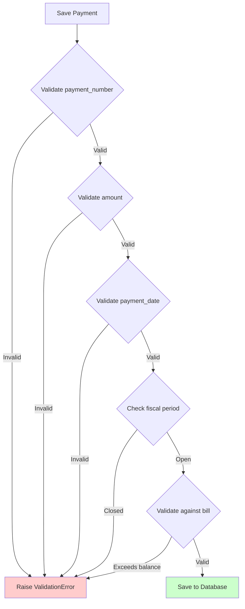
```mermaid
flowchart TD
    A[Save Payment] --> B{Validate payment_number}
    B -->|Invalid| C[Raise ValidationError]
    B -->|Valid| D{Validate amount}
    D -->|Invalid| C
    D -->|Valid| E{Validate payment_date}
    E -->|Invalid| C
    E -->|Valid| F{Check fiscal period}
    F -->|Closed| C
    F -->|Open| G{Validate against bill}
    G -->|Exceeds balance| C
    G -->|Valid| H[Save to Database]
    
    style C fill:#ffcccc
    style H fill:#ccffcc
```

### Expected Outcome

**Deliverables:**
1. ✅ payment_number field implemented with constraints
2. ✅ amount field with decimal precision
3. ✅ payment_date field with validation
4. ✅ Custom validators for each field
5. ✅ Database constraints configured
6. ✅ Help text and verbose names added
7. ✅ Field-level validation in clean() method

**Quality Indicators:**
- Fields accept valid data without errors
- Invalid data triggers appropriate validation errors
- Database constraints prevent invalid data
- Field metadata guides user input
- Validation messages are clear and actionable

### Verification Checklist

- [ ] payment_number field defined
- [ ] payment_number unique constraint added
- [ ] payment_number max_length = 20
- [ ] payment_number indexed
- [ ] amount field defined as DecimalField
- [ ] amount max_digits = 15
- [ ] amount decimal_places = 2
- [ ] amount MinValueValidator(0.01) added
- [ ] amount cannot be negative
- [ ] payment_date field defined as DateField
- [ ] payment_date indexed
- [ ] payment_date validation logic implemented
- [ ] Custom validators created
- [ ] Validators attached to fields
- [ ] Help text added to all fields
- [ ] Verbose names configured
- [ ] Field validation in clean() method
- [ ] Database constraints enforced
- [ ] Test with valid data succeeds
- [ ] Test with invalid data raises errors

---

## Task 51: Payment Method Configuration

### Overview

Implement the payment_method field with an enumeration of supported payment types: BANK_TRANSFER, CHECK, CASH, and ONLINE. This field categorizes how payments are executed and drives different validation rules and workflows based on the payment method selected.

**Key Deliverables:**
- Payment method enumeration (TextChoices)
- payment_method field with choices
- Method-specific validation logic
- Display methods for user-friendly labels
- Payment method statistics helpers

### Dependencies

**Required Prior Completion:**
- ✅ Task 50: Core payment fields
- ✅ Django TextChoices usage understanding
- ✅ Company payment method configuration

**Related Configuration:**
- Company settings for allowed payment methods
- Bank account configuration (for BANK_TRANSFER)
- Check numbering system (for CHECK)
- Cash handling policies (for CASH)
- Payment gateway integration (for ONLINE)

### Instructions

#### Step 1: Define Payment Method Enumeration

**TextChoices Class:**

Create a nested class within VendorPayment model to define payment method choices.

**Enumeration Values:**

| Value | Label | Description |
|-------|-------|-------------|
| BANK_TRANSFER | Bank Transfer | Electronic fund transfer between banks |
| CHECK | Check/Cheque | Payment via paper or electronic check |
| CASH | Cash | Physical currency payment |
| ONLINE | Online Payment | Payment via online gateway/portal |

**Additional Metadata:**
- Consider adding icons/colors for UI display
- Define ordering for display in forms
- Add method-specific requirements

#### Step 2: Implement payment_method Field

**Field Configuration:**

**Requirements:**
- Field type: CharField
- Max length: 20 characters
- Choices: PaymentMethod.choices
- Required field (NOT NULL)
- Default: BANK_TRANSFER (most common)
- Indexed for filtering and grouping

**Business Rules:**
- Only allowed payment methods can be used
- Company can restrict available methods
- Some methods require additional fields
- Method affects approval workflow
- Method determines reconciliation process

#### Step 3: Add Method-Specific Validation

**Validation Rules by Method:**

**BANK_TRANSFER:**
- Requires bank_account field
- Requires bank_reference field
- Must have bank transaction date
- Validate bank account is active
- Check bank account belongs to correct company

**CHECK:**
- Requires check_number field
- Requires check_date field
- Optional bank_account (issuing bank)
- Validate check number is unique
- Check date must match or precede payment_date

**CASH:**
- Requires cash_account field
- May require receipt_number
- Additional approval may be needed
- Amount limits may apply
- Petty cash validation

**ONLINE:**
- Requires transaction_id field
- Requires payment_gateway field
- Requires gateway_response data
- Validate transaction ID format
- Store gateway confirmation

#### Step 4: Create Display Helper Methods

**Method: get_payment_method_display()**

Django automatically provides this method, but consider adding:
- Custom display format with icons
- Localized method names
- Method-specific additional info

**Method: get_payment_method_icon()**

Return appropriate icon class or emoji for UI display.

**Method: get_payment_method_color()**

Return color code for visual categorization.

#### Step 5: Implement Method-Based Conditional Logic

**Method: requires_bank_account()**

Returns True if payment method requires bank account details.

**Method: requires_check_details()**

Returns True if payment method is CHECK.

**Method: supports_online_reversal()**

Returns True if method supports automatic reversal.

**Method: requires_additional_approval()**

Returns True if method needs extra approval level.

### Payment Method Architecture

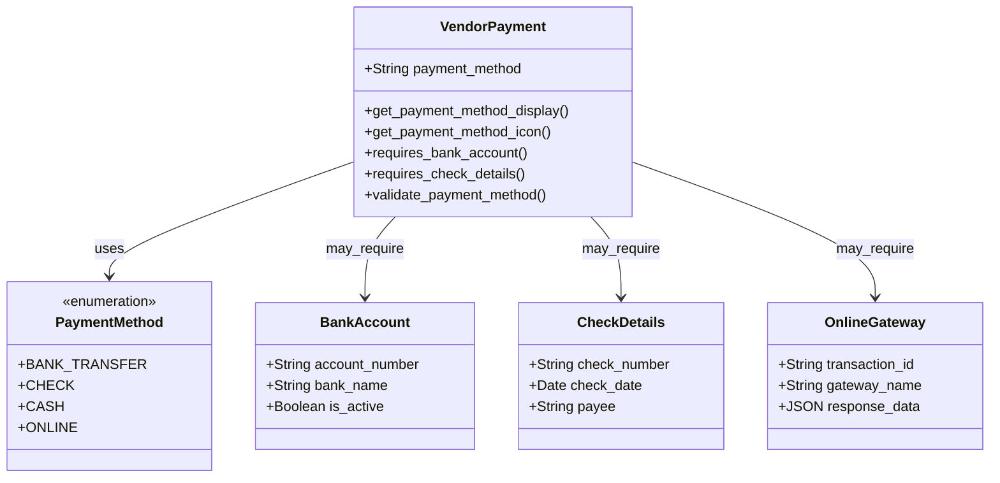
```mermaid
classDiagram
    class PaymentMethod {
        <<enumeration>>
        +BANK_TRANSFER
        +CHECK
        +CASH
        +ONLINE
    }
    
    class VendorPayment {
        +String payment_method
        +get_payment_method_display()
        +get_payment_method_icon()
        +requires_bank_account()
        +requires_check_details()
        +validate_payment_method()
    }
    
    class BankAccount {
        +String account_number
        +String bank_name
        +Boolean is_active
    }
    
    class CheckDetails {
        +String check_number
        +Date check_date
        +String payee
    }
    
    class OnlineGateway {
        +String transaction_id
        +String gateway_name
        +JSON response_data
    }
    
    VendorPayment --> PaymentMethod : uses
    VendorPayment --> BankAccount : may_require
    VendorPayment --> CheckDetails : may_require
    VendorPayment --> OnlineGateway : may_require
```

### Method Selection Flow

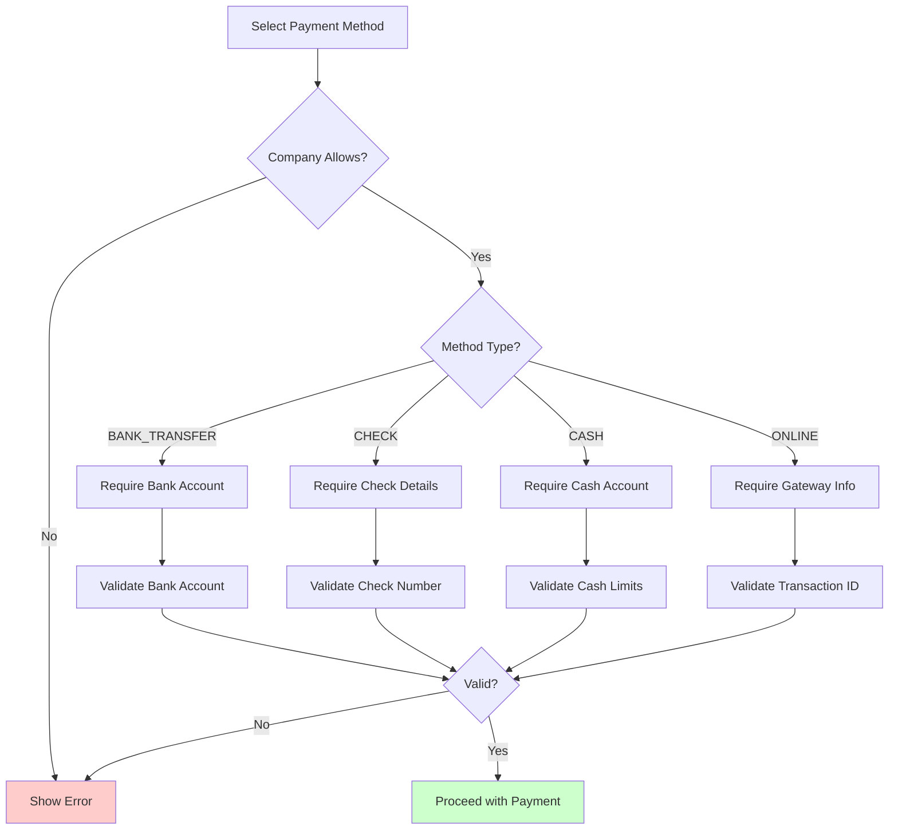
```mermaid
flowchart TD
    A[Select Payment Method] --> B{Company Allows?}
    B -->|No| C[Show Error]
    B -->|Yes| D{Method Type?}
    
    D -->|BANK_TRANSFER| E[Require Bank Account]
    D -->|CHECK| F[Require Check Details]
    D -->|CASH| G[Require Cash Account]
    D -->|ONLINE| H[Require Gateway Info]
    
    E --> I[Validate Bank Account]
    F --> J[Validate Check Number]
    G --> K[Validate Cash Limits]
    H --> L[Validate Transaction ID]
    
    I --> M{Valid?}
    J --> M
    K --> M
    L --> M
    
    M -->|Yes| N[Proceed with Payment]
    M -->|No| C
    
    style C fill:#ffcccc
    style N fill:#ccffcc
```

### Expected Outcome

**Deliverables:**
1. ✅ PaymentMethod enumeration class
2. ✅ payment_method field with choices
3. ✅ Method-specific validation rules
4. ✅ Display helper methods
5. ✅ Conditional logic based on method
6. ✅ Documentation of method requirements
7. ✅ UI-friendly method representation

**Quality Indicators:**
- All four payment methods supported
- Method selection validated
- Required fields enforced per method
- Clear error messages for invalid combinations
- User-friendly method display
- Efficient method-based filtering

### Verification Checklist

- [ ] PaymentMethod TextChoices class created
- [ ] All four methods defined (BANK_TRANSFER, CHECK, CASH, ONLINE)
- [ ] payment_method field added to model
- [ ] Field uses PaymentMethod.choices
- [ ] Default value set to BANK_TRANSFER
- [ ] Field indexed for filtering
- [ ] Method-specific validation implemented
- [ ] BANK_TRANSFER validation rules added
- [ ] CHECK validation rules added
- [ ] CASH validation rules added
- [ ] ONLINE validation rules added
- [ ] get_payment_method_display() works
- [ ] get_payment_method_icon() implemented
- [ ] requires_bank_account() method added
- [ ] requires_check_details() method added
- [ ] Company restrictions checked
- [ ] Help text describes each method
- [ ] Test each method selection
- [ ] Validation errors clear and actionable

---

## Task 52: Reference and Tracking Fields

### Overview

Implement reference and tracking fields that provide additional context and traceability for payment transactions. These fields include internal notes, external reference numbers, transaction IDs, and descriptive information that helps with reconciliation, auditing, and cross-system integration.

**Key Deliverables:**
- reference_number field for external references
- transaction_id field for bank/gateway transactions
- notes field for internal documentation
- description field for payment purpose
- attachment support references
- Integration hooks for external systems

### Dependencies

**Required Prior Completion:**
- ✅ Task 50: Core payment fields
- ✅ Task 51: Payment method configuration
- ✅ File storage configuration (Phase 03)

**Related Systems:**
- Bank integration modules
- Payment gateway APIs
- Document management system
- Audit logging system

### Instructions

#### Step 1: Implement reference_number Field

**Field Configuration:**

The reference_number stores external reference identifiers from vendors, banks, or other systems.

**Requirements:**
- Field type: CharField
- Max length: 50 characters
- Optional field (NULL allowed)
- Indexed for searching
- Not required to be unique

**Use Cases:**
- Vendor invoice reference
- Purchase order number
- External payment reference
- Customer reference number
- Cross-system tracking ID

**Validation:**
- Alphanumeric characters allowed
- Special characters: hyphen, underscore, forward slash
- No leading/trailing spaces
- Maximum 50 characters

#### Step 2: Implement transaction_id Field

**Field Configuration:**

The transaction_id stores the unique identifier from the payment processor (bank or payment gateway).

**Requirements:**
- Field type: CharField
- Max length: 100 characters
- Optional field (NULL allowed)
- Should be unique when provided
- Indexed for fast lookup

**Method-Specific Usage:**
- BANK_TRANSFER: Bank transaction reference
- CHECK: Bank clearing reference (when cleared)
- ONLINE: Payment gateway transaction ID
- CASH: Cash receipt number

**Validation:**
- Required for ONLINE payment method
- Optional for other methods
- Unique constraint when not NULL
- Store exactly as provided by external system
- No modification after initial save

#### Step 3: Implement notes Field

**Field Configuration:**

The notes field stores internal notes and comments about the payment.

**Requirements:**
- Field type: TextField
- Optional field (NULL allowed)
- Not indexed (full-text search if needed)
- Support markdown formatting (optional)
- No length limit

**Use Cases:**
- Special instructions for accounting
- Reasons for payment delays
- Reconciliation notes
- Issue documentation
- Approval notes and conditions

**Best Practices:**
- Timestamp and user attribution in notes
- Append-only format (don't overwrite)
- Use structured format for parsing
- Consider separate comment model for complex scenarios

#### Step 4: Implement description Field

**Field Configuration:**

The description field provides a human-readable purpose or description of the payment.

**Requirements:**
- Field type: CharField
- Max length: 255 characters
- Optional but recommended
- Indexed for searching
- Displayed in payment lists

**Auto-Generation:**
- Default format: "Payment for Bill #{bill_number}"
- Can be customized by user
- Include vendor name for clarity
- Include date range for multi-bill payments

**Examples:**
- "Payment for Bill #BILL-2026-00123"
- "Partial payment for January supplies"
- "Final settlement for Q4 2025 invoices"
- "Advance payment for future order"

#### Step 5: Implement Attachment References

**Field Configuration:**

While full attachment handling is in separate system, add fields to reference attachments.

**Requirements:**
- Field type: JSONField or separate relation
- Store attachment metadata
- Reference to file storage paths
- Support multiple attachments

**Attachment Types:**
- Payment receipt/confirmation
- Bank transfer proof
- Check image (front/back)
- Email correspondence
- Authorization documents

#### Step 6: Add Tracking Metadata Fields

**Additional Fields:**

**reconciled_at:**
- Type: DateTimeField
- Nullable: True
- Purpose: Track when payment was reconciled with bank statement

**reconciled_by:**
- Type: ForeignKey to User
- Nullable: True
- Purpose: Track who performed reconciliation

**reversal_reason:**
- Type: TextField
- Nullable: True
- Purpose: Document why payment was reversed

**external_system_id:**
- Type: CharField
- Nullable: True
- Purpose: Integration with external accounting systems

### Reference Fields Architecture

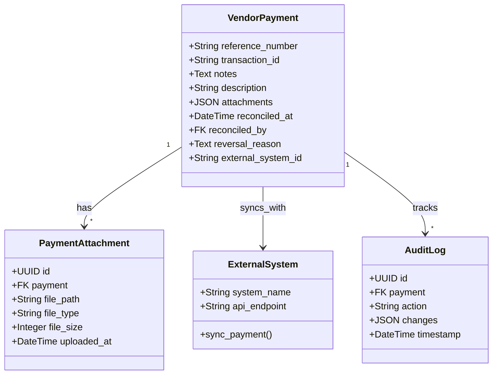
```mermaid
classDiagram
    class VendorPayment {
        +String reference_number
        +String transaction_id
        +Text notes
        +String description
        +JSON attachments
        +DateTime reconciled_at
        +FK reconciled_by
        +Text reversal_reason
        +String external_system_id
    }
    
    class PaymentAttachment {
        +UUID id
        +FK payment
        +String file_path
        +String file_type
        +Integer file_size
        +DateTime uploaded_at
    }
    
    class ExternalSystem {
        +String system_name
        +String api_endpoint
        +sync_payment()
    }
    
    class AuditLog {
        +UUID id
        +FK payment
        +String action
        +JSON changes
        +DateTime timestamp
    }
    
    VendorPayment "1" --> "*" PaymentAttachment : has
    VendorPayment --> ExternalSystem : syncs_with
    VendorPayment "1" --> "*" AuditLog : tracks
```

### Information Flow

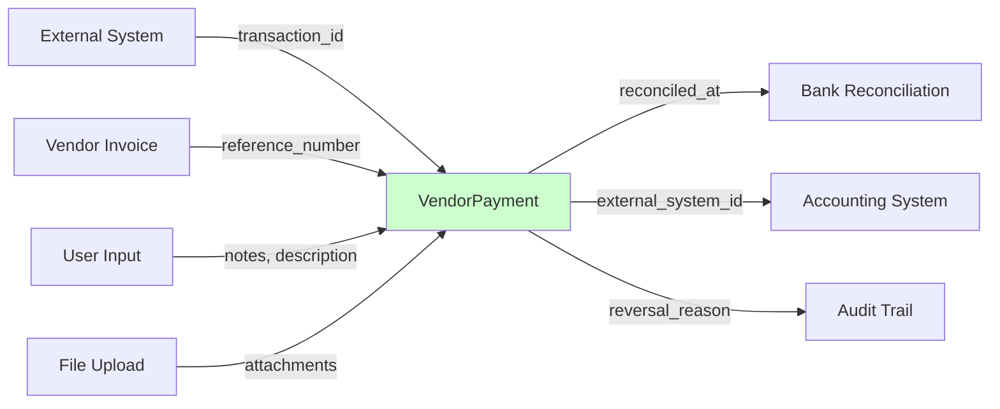
```mermaid
flowchart LR
    A[External System] -->|transaction_id| B[VendorPayment]
    C[Vendor Invoice] -->|reference_number| B
    D[User Input] -->|notes, description| B
    E[File Upload] -->|attachments| B
    
    B -->|reconciled_at| F[Bank Reconciliation]
    B -->|external_system_id| G[Accounting System]
    B -->|reversal_reason| H[Audit Trail]
    
    style B fill:#ccffcc
```

### Expected Outcome

**Deliverables:**
1. ✅ reference_number field implemented
2. ✅ transaction_id field with uniqueness
3. ✅ notes field for internal documentation
4. ✅ description field with auto-generation
5. ✅ Attachment reference structure
6. ✅ Tracking metadata fields
7. ✅ Validation for all reference fields

**Quality Indicators:**
- All reference fields properly validated
- Unique constraints enforced where needed
- Fields support search and filtering
- Auto-generation works as expected
- Attachment references functional
- Integration hooks available

### Verification Checklist

- [ ] reference_number field added
- [ ] reference_number max_length = 50
- [ ] reference_number indexed
- [ ] transaction_id field added
- [ ] transaction_id max_length = 100
- [ ] transaction_id unique when not NULL
- [ ] transaction_id indexed
- [ ] notes field added as TextField
- [ ] notes allows NULL
- [ ] description field added
- [ ] description max_length = 255
- [ ] description auto-generation implemented
- [ ] reconciled_at field added
- [ ] reconciled_by field added
- [ ] reversal_reason field added
- [ ] external_system_id field added
- [ ] Attachment reference structure defined
- [ ] Field validation implemented
- [ ] Help text added to all fields
- [ ] Test reference field population

---

## Task 53: Bill and Vendor Relationships

### Overview

Establish the critical foreign key relationships between VendorPayment and the related models: Vendor and VendorBill. These relationships enable tracking which vendor receives the payment and which bill(s) the payment settles. The relationships support both single-bill payments and complex allocation scenarios.

**Key Deliverables:**
- Vendor foreign key relationship
- VendorBill foreign key relationship
- Relationship constraints and cascades
- Relationship validation logic
- Query optimization with select_related
- Relationship helper methods

### Dependencies

**Required Prior Completion:**
- ✅ Task 49-52: VendorPayment core fields
- ✅ SubPhase 12, Group A: Vendor model
- ✅ SubPhase 12, Group B: VendorBill model
- ✅ Understanding of Django ForeignKey relationships

**Related Models:**
- `Vendor` - The payee receiving the payment
- `VendorBill` - The bill being paid
- `Company` - Tenant context

### Instructions

#### Step 1: Implement Vendor Foreign Key

**Field Configuration:**

**Requirements:**
- Field type: ForeignKey
- Related model: Vendor
- Related name: 'payments'
- On delete: PROTECT (prevent deletion of vendor with payments)
- Required field (NOT NULL)
- Indexed automatically

**Business Rules:**
- Vendor must belong to same tenant
- Vendor must be active at payment time
- Vendor cannot be deleted if payments exist
- All payments to same vendor can be queried via vendor.payments

**Validation:**
- Vendor exists and is active
- Vendor belongs to current tenant
- Vendor matches bill's vendor (if bill provided)
- Vendor has valid banking details (for bank transfers)

#### Step 2: Implement VendorBill Foreign Key

**Field Configuration:**

**Requirements:**
- Field type: ForeignKey
- Related model: VendorBill
- Related name: 'payments'
- On delete: PROTECT (prevent deletion of bill with payments)
- Optional field (NULL allowed for advance payments)
- Indexed automatically

**Business Rules:**
- Bill must belong to same vendor as payment
- Bill must belong to same tenant
- Payment amount cannot exceed bill's remaining balance
- Multiple payments can reference same bill (partial payments)
- Bill status updates when fully paid

**Validation:**
- Bill exists and is approved (if provided)
- Bill vendor matches payment vendor
- Bill belongs to current tenant
- Payment amount valid for bill balance
- Bill is not fully paid already (unless overpayment allowed)

#### Step 3: Configure Relationship Constraints

**Database Level:**

**Foreign Key Constraints:**
- vendor_id: FOREIGN KEY REFERENCES vendors(id)
- vendor_bill_id: FOREIGN KEY REFERENCES vendor_bills(id)
- Both with ON DELETE PROTECT

**Composite Indexes:**
Create composite indexes for common queries:
- (vendor_id, payment_date)
- (vendor_bill_id, status)
- (tenant_id, vendor_id, payment_date)

**Check Constraints:**
- Payment vendor must match bill vendor (when bill provided)
- Payment amount must be positive
- Payment date must not predate bill date significantly

#### Step 4: Implement Relationship Validation

**Model Level Validation:**

**clean() Method Logic:**

1. Validate vendor and bill consistency
2. Verify tenant matching across all relations
3. Check bill balance vs payment amount
4. Validate payment date vs bill date
5. Ensure vendor is active

**Cross-Model Validation:**

When saving payment:
- Lock bill record for update
- Calculate current bill balance
- Validate payment amount against balance
- Update bill paid_amount and status
- Update vendor balance/statistics

#### Step 5: Add Relationship Helper Methods

**Query Helper Methods:**

**get_related_bills():**
Returns all bills related to this payment (including via allocations).

**get_vendor_display():**
Returns formatted vendor information for display.

**get_bill_display():**
Returns formatted bill information for display.

**is_vendor_payment_valid():**
Validates vendor relationship rules.

**is_bill_payment_valid():**
Validates bill relationship and balance rules.

#### Step 6: Optimize Relationship Queries

**Select Related:**

Configure model manager to automatically use select_related for common queries:
- Always include vendor when querying payments
- Include bill when bill_id is not NULL
- Include related user models (created_by, updated_by)

**Prefetch Related:**

For list views, prefetch:
- Vendor contacts
- Bill line items (if needed)
- Payment allocations (future feature)

### Relationship Architecture

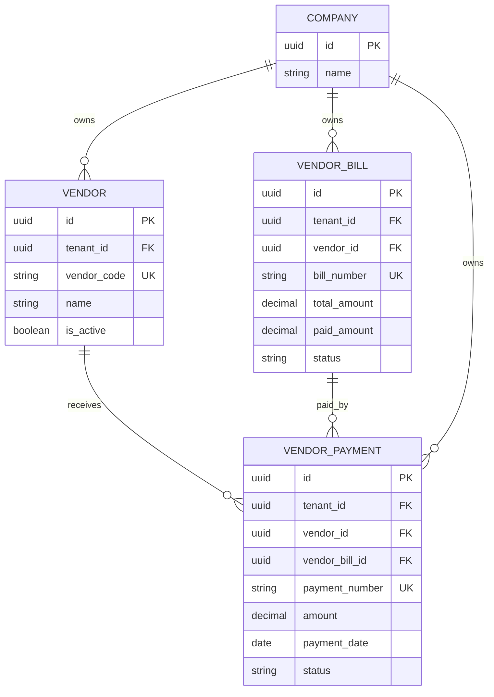
```mermaid
erDiagram
    VENDOR ||--o{ VENDOR_PAYMENT : receives
    VENDOR_BILL ||--o{ VENDOR_PAYMENT : paid_by
    COMPANY ||--o{ VENDOR_PAYMENT : owns
    COMPANY ||--o{ VENDOR : owns
    COMPANY ||--o{ VENDOR_BILL : owns
    
    VENDOR {
        uuid id PK
        uuid tenant_id FK
        string vendor_code UK
        string name
        boolean is_active
    }
    
    VENDOR_BILL {
        uuid id PK
        uuid tenant_id FK
        uuid vendor_id FK
        string bill_number UK
        decimal total_amount
        decimal paid_amount
        string status
    }
    
    VENDOR_PAYMENT {
        uuid id PK
        uuid tenant_id FK
        uuid vendor_id FK
        uuid vendor_bill_id FK
        string payment_number UK
        decimal amount
        date payment_date
        string status
    }
    
    COMPANY {
        uuid id PK
        string name
    }
```

### Validation Flow

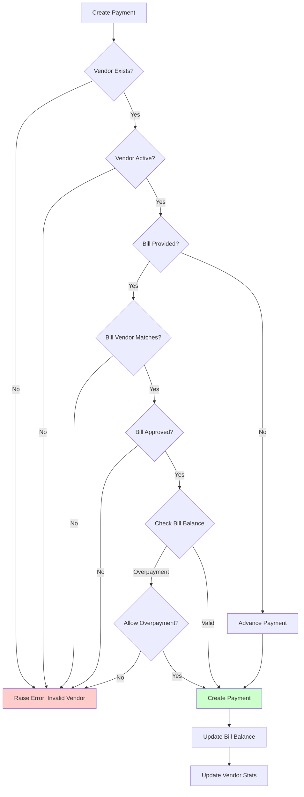
```mermaid
flowchart TD
    A[Create Payment] --> B{Vendor Exists?}
    B -->|No| C[Raise Error: Invalid Vendor]
    B -->|Yes| D{Vendor Active?}
    D -->|No| C
    D -->|Yes| E{Bill Provided?}
    
    E -->|No| F[Advance Payment]
    E -->|Yes| G{Bill Vendor Matches?}
    
    G -->|No| C
    G -->|Yes| H{Bill Approved?}
    H -->|No| C
    H -->|Yes| I{Check Bill Balance}
    
    I -->|Overpayment| J{Allow Overpayment?}
    J -->|No| C
    J -->|Yes| K[Create Payment]
    
    I -->|Valid| K
    F --> K
    
    K --> L[Update Bill Balance]
    L --> M[Update Vendor Stats]
    
    style C fill:#ffcccc
    style K fill:#ccffcc
```

### Expected Outcome

**Deliverables:**
1. ✅ Vendor foreign key implemented
2. ✅ VendorBill foreign key implemented
3. ✅ Cascade behaviors configured
4. ✅ Relationship validation in clean()
5. ✅ Database constraints added
6. ✅ Composite indexes created
7. ✅ Query optimization configured
8. ✅ Helper methods for relationships

**Quality Indicators:**
- Relationships prevent orphaned records
- Validation catches invalid combinations
- Queries efficiently fetch related data
- Cross-tenant payments prevented
- Bill balance correctly updated
- Vendor statistics maintained

### Verification Checklist

- [ ] vendor field added as ForeignKey
- [ ] vendor related_name = 'payments'
- [ ] vendor on_delete = PROTECT
- [ ] vendor_bill field added as ForeignKey
- [ ] vendor_bill related_name = 'payments'
- [ ] vendor_bill on_delete = PROTECT
- [ ] vendor_bill allows NULL
- [ ] Tenant validation in clean()
- [ ] Vendor-bill consistency validation
- [ ] Bill balance validation
- [ ] Vendor active status check
- [ ] Composite indexes created
- [ ] Check constraints added
- [ ] select_related configured
- [ ] prefetch_related configured
- [ ] Helper methods implemented
- [ ] Test vendor assignment
- [ ] Test bill assignment
- [ ] Test validation errors
- [ ] Test cascade protection

---

## Task 54: Bank and Financial Fields

### Overview

Implement fields related to banking and financial processing, including bank account details, check information, and financial institution references. These fields are essential for bank transfers, check payments, and reconciliation with banking systems.

**Key Deliverables:**
- Bank account foreign key (for company bank accounts)
- Bank reference/transaction fields
- Check-specific fields (number, date, payee)
- Clearing status fields
- Bank reconciliation support
- Gateway integration fields

### Dependencies

**Required Prior Completion:**
- ✅ Task 51: Payment method configuration
- ✅ Task 52: Reference fields
- ✅ Company bank account model (Phase 03 or 04)
- ✅ Banking module configuration

**Related Models:**
- `BankAccount` - Company bank accounts
- `Bank` - Financial institution master data
- `PaymentGateway` - Online payment gateway config

### Instructions

#### Step 1: Implement Bank Account Foreign Key

**Field Configuration:**

**Requirements:**
- Field type: ForeignKey
- Related model: BankAccount (or Company.bank_accounts)
- Related name: 'vendor_payments'
- On delete: PROTECT
- Optional field (NULL allowed)
- Required when payment_method = BANK_TRANSFER

**Business Rules:**
- Bank account must belong to payment's company/tenant
- Bank account must be active
- Bank account must support outgoing transfers
- Used for company's bank account (paying from)
- Different from vendor's bank account (paying to)

**Validation:**
- Required if payment_method = BANK_TRANSFER
- Optional for CHECK (check issuing bank)
- Not used for CASH or ONLINE
- Bank account must be active
- Bank account must belong to tenant

#### Step 2: Implement Bank Reference Fields

**bank_reference Field:**

**Requirements:**
- Field type: CharField
- Max length: 50 characters
- Optional field (NULL allowed)
- Indexed for searching
- Stores bank's internal transaction reference

**Use Cases:**
- Bank transfer reference number
- Wire transfer confirmation code
- SWIFT/IBAN transaction reference
- Bank batch number
- ACH transaction ID

**bank_transaction_date Field:**

**Requirements:**
- Field type: DateField
- Optional field (NULL allowed)
- Indexed for date queries
- Date when bank processed transaction
- May differ from payment_date

**Validation:**
- Should be same or after payment_date
- Within reasonable range (not months apart)
- Used for bank reconciliation

#### Step 3: Implement Check-Specific Fields

**check_number Field:**

**Requirements:**
- Field type: CharField
- Max length: 20 characters
- Optional field (NULL allowed)
- Required when payment_method = CHECK
- Should be unique per bank account

**Validation:**
- Required if payment_method = CHECK
- Numeric or alphanumeric format
- Unique per bank account
- Sequential validation (optional)

**check_date Field:**

**Requirements:**
- Field type: DateField
- Optional field (NULL allowed)
- Required when payment_method = CHECK
- Date printed on check

**Validation:**
- Required if payment_method = CHECK
- Should match or precede payment_date
- Within valid check validity period

**check_payee Field:**

**Requirements:**
- Field type: CharField
- Max length: 255 characters
- Optional field (NULL allowed)
- Name of payee on check

**Default:**
- Auto-populate from vendor name
- Can be overridden for legal entity name

#### Step 4: Implement Clearing Status Fields

**clearing_status Field:**

**Requirements:**
- Field type: CharField with choices
- Max length: 20
- Optional field
- Tracks check clearing status

**Status Values:**
- NOT_APPLICABLE (for non-check payments)
- ISSUED (check printed/issued)
- PRESENTED (check presented to bank)
- CLEARED (check cleared)
- BOUNCED (check returned/bounced)
- CANCELLED (check cancelled)

**cleared_date Field:**

**Requirements:**
- Field type: DateField
- Optional field (NULL allowed)
- Date when check cleared or transaction confirmed

#### Step 5: Implement Payment Gateway Fields

**payment_gateway Field:**

**Requirements:**
- Field type: CharField or ForeignKey
- Optional field
- Required when payment_method = ONLINE
- References payment gateway configuration

**gateway_response Field:**

**Requirements:**
- Field type: JSONField
- Optional field (NULL allowed)
- Stores complete gateway response
- Used for troubleshooting and audit

**gateway_status Field:**

**Requirements:**
- Field type: CharField
- Optional field
- Stores gateway-specific status code

### Banking Fields Architecture

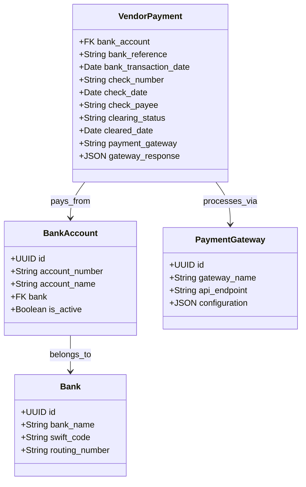
```mermaid
classDiagram
    class VendorPayment {
        +FK bank_account
        +String bank_reference
        +Date bank_transaction_date
        +String check_number
        +Date check_date
        +String check_payee
        +String clearing_status
        +Date cleared_date
        +String payment_gateway
        +JSON gateway_response
    }
    
    class BankAccount {
        +UUID id
        +String account_number
        +String account_name
        +FK bank
        +Boolean is_active
    }
    
    class Bank {
        +UUID id
        +String bank_name
        +String swift_code
        +String routing_number
    }
    
    class PaymentGateway {
        +UUID id
        +String gateway_name
        +String api_endpoint
        +JSON configuration
    }
    
    VendorPayment --> BankAccount : pays_from
    BankAccount --> Bank : belongs_to
    VendorPayment --> PaymentGateway : processes_via
```

### Payment Method Field Requirements

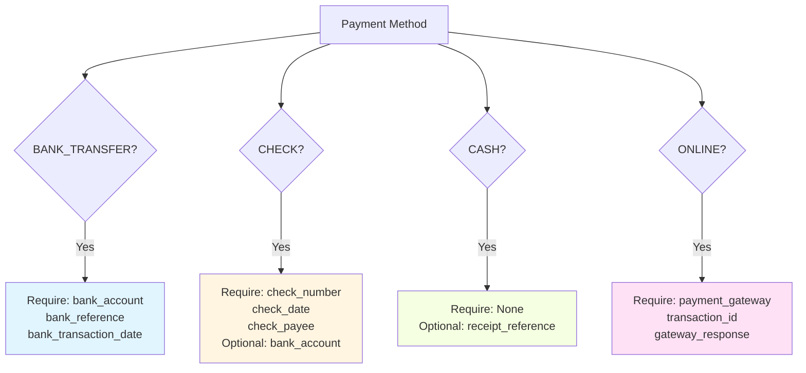
```mermaid
flowchart TD
    A[Payment Method] --> B{BANK_TRANSFER?}
    A --> C{CHECK?}
    A --> D{CASH?}
    A --> E{ONLINE?}
    
    B -->|Yes| F[Require: bank_account<br/>bank_reference<br/>bank_transaction_date]
    
    C -->|Yes| G[Require: check_number<br/>check_date<br/>check_payee<br/>Optional: bank_account]
    
    D -->|Yes| H[Require: None<br/>Optional: receipt_reference]
    
    E -->|Yes| I[Require: payment_gateway<br/>transaction_id<br/>gateway_response]
    
    style F fill:#e1f5ff
    style G fill:#fff5e1
    style H fill:#f5ffe1
    style I fill:#ffe1f5
```

### Expected Outcome

**Deliverables:**
1. ✅ bank_account foreign key implemented
2. ✅ bank_reference and bank_transaction_date fields
3. ✅ Check-specific fields (number, date, payee)
4. ✅ Clearing status tracking fields
5. ✅ Payment gateway integration fields
6. ✅ Method-specific field validation
7. ✅ Database indexes for reconciliation queries

**Quality Indicators:**
- Bank fields populated for bank transfers
- Check fields required for check payments
- Gateway fields capture all online payment data
- Clearing status accurately tracked
- Fields support bank reconciliation
- Validation prevents incomplete data

### Verification Checklist

- [ ] bank_account field added
- [ ] bank_account ForeignKey to BankAccount
- [ ] bank_account on_delete = PROTECT
- [ ] bank_reference field added (max 50)
- [ ] bank_transaction_date field added
- [ ] check_number field added (max 20)
- [ ] check_date field added
- [ ] check_payee field added (max 255)
- [ ] clearing_status field with choices
- [ ] cleared_date field added
- [ ] payment_gateway field added
- [ ] gateway_response JSONField added
- [ ] gateway_status field added
- [ ] Bank transfer validation implemented
- [ ] Check payment validation implemented
- [ ] Online payment validation implemented
- [ ] Indexes created for reconciliation
- [ ] Help text added to all fields
- [ ] Test bank transfer payment
- [ ] Test check payment with all fields

---

## Task 55: Payment Status Management

### Overview

Implement the status field with its complete lifecycle workflow: PENDING → COMPLETED / FAILED / REVERSED. The status field tracks the payment's current state and drives business logic, approval workflows, and accounting updates. Proper status management ensures accurate financial reporting and prevents duplicate or invalid transactions.

**Key Deliverables:**
- Status enumeration with all states
- status field implementation
- Status transition validation
- Status-based business logic
- Status history tracking
- Status display and reporting

### Dependencies

**Required Prior Completion:**
- ✅ Task 49-54: All core payment fields
- ✅ Understanding of state machine patterns
- ✅ Audit logging infrastructure

**Related Concepts:**
- Bill status synchronization
- Vendor balance updates
- Accounting entry creation
- Approval workflows
- Reversal procedures

### Instructions

#### Step 1: Define Payment Status Enumeration

**TextChoices Class:**

Create PaymentStatus enumeration with all possible states.

**Status Definitions:**

| Status | Label | Description |
|--------|-------|-------------|
| DRAFT | Draft | Payment being prepared (optional state) |
| PENDING | Pending | Payment approved but not yet processed |
| PROCESSING | Processing | Payment being processed by bank/gateway |
| COMPLETED | Completed | Payment successfully completed |
| FAILED | Failed | Payment processing failed |
| REVERSED | Reversed | Payment was reversed/cancelled |
| RECONCILED | Reconciled | Payment reconciled with bank statement |

**Status Properties:**

For each status, define:
- Is terminal (no further transitions allowed)
- Affects bill balance (should update bill paid amount)
- Affects vendor balance (should update vendor balance)
- Requires approval (needs additional authorization)
- Can be edited (allows field modifications)
- Can be deleted (allows soft/hard delete)

#### Step 2: Implement Status Field

**Field Configuration:**

**Requirements:**
- Field type: CharField
- Max length: 20 characters
- Choices: PaymentStatus.choices
- Required field (NOT NULL)
- Default: PENDING
- Indexed for filtering

**Business Rules:**
- Status transitions must follow valid flow
- Only certain statuses can be edited
- Terminal statuses cannot transition further
- Status changes trigger side effects
- Status changes must be logged

#### Step 3: Define Valid Status Transitions

**Transition Matrix:**

| From \ To | DRAFT | PENDING | PROCESSING | COMPLETED | FAILED | REVERSED | RECONCILED |
|-----------|-------|---------|------------|-----------|--------|----------|------------|
| DRAFT | ✓ | ✓ | ✗ | ✗ | ✗ | ✓ | ✗ |
| PENDING | ✗ | ✓ | ✓ | ✓ | ✓ | ✓ | ✗ |
| PROCESSING | ✗ | ✗ | ✓ | ✓ | ✓ | ✗ | ✗ |
| COMPLETED | ✗ | ✗ | ✗ | ✓ | ✗ | ✓ | ✓ |
| FAILED | ✗ | ✓ | ✗ | ✗ | ✓ | ✗ | ✗ |
| REVERSED | ✗ | ✗ | ✗ | ✗ | ✗ | ✓ | ✗ |
| RECONCILED | ✗ | ✗ | ✗ | ✗ | ✗ | ✓ | ✓ |

**Implementation:**

Create a method to validate status transitions:
- `can_transition_to(new_status)` - returns Boolean
- `transition_to(new_status, reason=None)` - performs transition with validation
- Raise exception for invalid transitions
- Log all transitions for audit trail

#### Step 4: Implement Status Change Side Effects

**PENDING → COMPLETED:**
- Update bill paid_amount
- Update bill status if fully paid
- Update vendor balance
- Create accounting entries
- Send payment confirmation
- Update cash flow records

**PENDING → FAILED:**
- Log failure reason
- Send failure notification
- Do not update bill balance
- Allow retry with new payment

**COMPLETED → REVERSED:**
- Reverse bill paid_amount
- Reverse vendor balance
- Create reversal accounting entries
- Require reversal reason
- Send reversal notification
- Cannot be reversed again

**COMPLETED → RECONCILED:**
- Mark as reconciled with bank
- Record reconciliation date
- Lock from further modifications
- Update reconciliation reports

#### Step 5: Add Status Helper Methods

**Status Check Methods:**

**is_pending():**
Returns True if status is PENDING.

**is_completed():**
Returns True if status is COMPLETED.

**is_failed():**
Returns True if status is FAILED.

**is_reversed():**
Returns True if status is REVERSED.

**is_terminal():**
Returns True if status is terminal (COMPLETED, FAILED, REVERSED, RECONCILED).

**can_be_edited():**
Returns True if payment can be modified (only DRAFT or PENDING).

**can_be_reversed():**
Returns True if payment can be reversed (only COMPLETED).

#### Step 6: Implement Status History Tracking

**Status History Model (Optional):**

Consider creating a separate PaymentStatusHistory model to track all status changes with:
- Timestamp
- Old status
- New status
- Changed by (user)
- Reason/notes
- Additional context

**Alternative:**
Store status history in JSONField or rely on audit logging system.

### Status Lifecycle Diagram

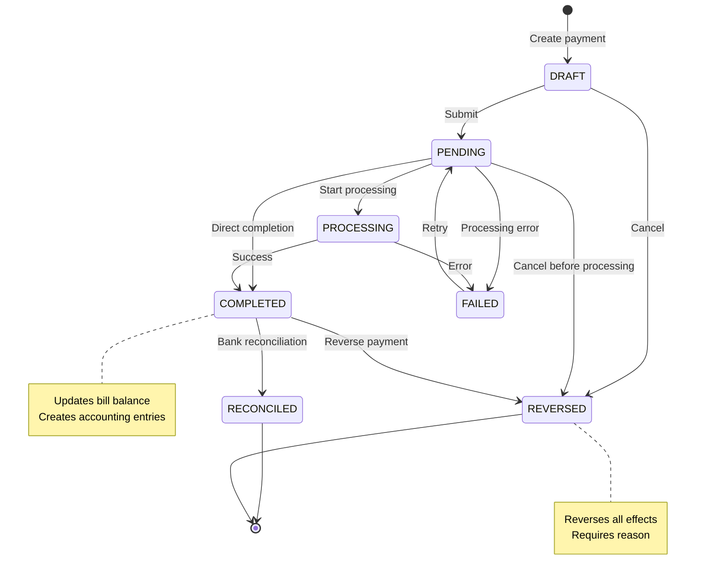
```mermaid
stateDiagram-v2
    [*] --> DRAFT: Create payment
    DRAFT --> PENDING: Submit
    DRAFT --> REVERSED: Cancel
    
    PENDING --> PROCESSING: Start processing
    PENDING --> COMPLETED: Direct completion
    PENDING --> FAILED: Processing error
    PENDING --> REVERSED: Cancel before processing
    
    PROCESSING --> COMPLETED: Success
    PROCESSING --> FAILED: Error
    
    COMPLETED --> REVERSED: Reverse payment
    COMPLETED --> RECONCILED: Bank reconciliation
    
    FAILED --> PENDING: Retry
    
    RECONCILED --> [*]
    REVERSED --> [*]
    
    note right of COMPLETED
        Updates bill balance
        Creates accounting entries
    end note
    
    note right of REVERSED
        Reverses all effects
        Requires reason
    end note
```

### Status Transition Logic

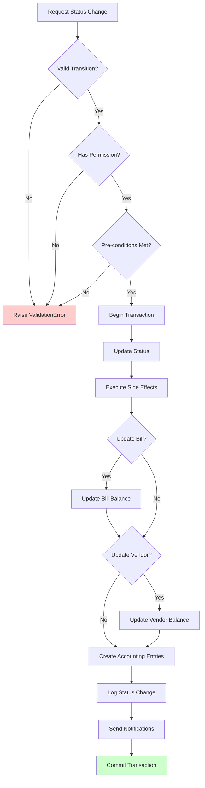
```mermaid
flowchart TD
    A[Request Status Change] --> B{Valid Transition?}
    B -->|No| C[Raise ValidationError]
    B -->|Yes| D{Has Permission?}
    D -->|No| C
    D -->|Yes| E{Pre-conditions Met?}
    E -->|No| C
    E -->|Yes| F[Begin Transaction]
    
    F --> G[Update Status]
    G --> H[Execute Side Effects]
    H --> I{Update Bill?}
    I -->|Yes| J[Update Bill Balance]
    J --> K{Update Vendor?}
    I -->|No| K
    K -->|Yes| L[Update Vendor Balance]
    K -->|No| M[Create Accounting Entries]
    L --> M
    M --> N[Log Status Change]
    N --> O[Send Notifications]
    O --> P[Commit Transaction]
    
    style C fill:#ffcccc
    style P fill:#ccffcc
```

### Expected Outcome

**Deliverables:**
1. ✅ PaymentStatus enumeration defined
2. ✅ status field implemented
3. ✅ Status transition validation
4. ✅ Status change side effects
5. ✅ Status helper methods
6. ✅ Status history tracking
7. ✅ Status-based business logic

**Quality Indicators:**
- Only valid transitions allowed
- Side effects execute correctly
- Status history maintained
- Notifications sent appropriately
- Business rules enforced by status
- Terminal statuses cannot change

### Verification Checklist

- [ ] PaymentStatus enumeration created
- [ ] All status values defined
- [ ] status field added to model
- [ ] Default status = PENDING
- [ ] Status field indexed
- [ ] Transition validation implemented
- [ ] can_transition_to() method added
- [ ] transition_to() method added
- [ ] Invalid transitions raise errors
- [ ] PENDING → COMPLETED updates bill
- [ ] COMPLETED → REVERSED reverses effects
- [ ] is_pending() method added
- [ ] is_completed() method added
- [ ] is_terminal() method added
- [ ] can_be_edited() method added
- [ ] can_be_reversed() method added
- [ ] Status history tracking implemented
- [ ] Notifications sent on status change
- [ ] Test all valid transitions
- [ ] Test invalid transitions blocked

---

## Task 56: Payment Number Generator

### Overview

Implement the automatic payment number generation system following the format PAY-{YEAR}-{SEQUENCE}. The generator must ensure unique, sequential payment numbers within each fiscal year, handle concurrent requests safely, and support customization per company/tenant.

**Key Deliverables:**
- Payment number generation logic
- Sequential numbering per year
- Tenant-specific sequences
- Concurrency handling (race condition prevention)
- Number format customization
- Gap detection and handling
- Number regeneration support

### Dependencies

**Required Prior Completion:**
- ✅ Task 49: VendorPayment model foundation
- ✅ Task 50: payment_number field
- ✅ Company fiscal year configuration
- ✅ Transaction handling understanding

**Related Components:**
- Sequence management utility
- Company settings model
- Database transaction support
- Atomic operations

### Instructions

#### Step 1: Design Number Format Structure

**Standard Format: PAY-{YEAR}-{SEQUENCE}**

**Components:**
- **Prefix:** "PAY" (configurable per company)
- **Year:** 4-digit fiscal year (e.g., 2026)
- **Sequence:** 5-digit zero-padded number (00001-99999)

**Examples:**
- PAY-2026-00001
- PAY-2026-00002
- PAY-2026-12345

**Configuration Options:**
- Custom prefix (per company/tenant)
- Sequence padding (4, 5, or 6 digits)
- Use calendar year vs fiscal year
- Include month in format (optional)
- Include location/branch code (optional)

**Alternative Formats:**
- PAY-2026-01-00001 (with month)
- PAY-BKK-2026-00001 (with location)
- PMT-2026-00001 (custom prefix)

#### Step 2: Implement Sequence Generator

**SequenceGenerator Utility:**

Create a reusable sequence generator that:
- Maintains separate sequences per year per tenant
- Handles concurrent access safely
- Supports database-level locking
- Provides gap detection

**Core Methods:**

**get_next_sequence(prefix, year, tenant_id):**
- Acquires next sequence number
- Uses database row locking (SELECT FOR UPDATE)
- Creates new sequence if year changes
- Returns integer sequence number

**get_next_payment_number(tenant_id):**
- Determines current fiscal year
- Gets company-specific prefix
- Calls get_next_sequence()
- Formats complete payment number
- Returns formatted string

#### Step 3: Implement Concurrency Safety

**Database-Level Locking:**

Use SELECT FOR UPDATE to prevent race conditions:

**Transaction Requirements:**
- Wrap sequence generation in database transaction
- Use SERIALIZABLE or REPEATABLE READ isolation level
- Retry on deadlock (with exponential backoff)
- Handle transaction failures gracefully

**Sequence Storage:**

Create a Sequence model or use PostgreSQL sequences:

**Option A: Django Model (Sequence)**
- Fields: tenant_id, sequence_type, year, last_number
- Unique constraint: (tenant_id, sequence_type, year)
- Lock row during generation

**Option B: PostgreSQL Sequence**
- Create sequence per tenant per year
- Use CREATE SEQUENCE statement
- Call nextval() for next number
- Automatically handles concurrency

#### Step 4: Handle Year Transitions

**Year Change Logic:**

When fiscal year changes:
- Detect year transition (compare with last payment year)
- Reset sequence to 1 for new year
- Maintain sequence history for old year
- Handle payments created near year boundary

**Edge Cases:**
- Payment created on last day of year
- Payment created on first day of year
- Backdated payments (previous year)
- Future-dated payments (next year)

**Business Rules:**
- Use payment_date year (not creation date)
- Allow backdating within limits
- Prevent future-dating beyond reasonable range
- Maintain year-based sequences strictly

#### Step 5: Implement Custom Prefix Configuration

**Company Settings:**

Add configuration to Company model or settings:
- payment_number_prefix (default: "PAY")
- payment_number_format (template string)
- payment_sequence_padding (default: 5)
- payment_use_fiscal_year (default: True)

**Format Templates:**

Support template variables:
- {PREFIX} - Company-specific prefix
- {YEAR} - Four-digit year
- {MONTH} - Two-digit month
- {SEQUENCE} - Padded sequence number
- {LOCATION} - Branch/location code

**Example Template:**
"{PREFIX}-{YEAR}-{SEQUENCE:05d}" → PAY-2026-00001

#### Step 6: Add Generation Method to Model

**Override save() Method:**

In VendorPayment model, override save() to auto-generate payment_number:

**Logic:**
- Check if payment_number is None or empty
- If so, generate new number
- If not, validate existing number
- Prevent modification of existing number
- Wrap in transaction

**Error Handling:**
- Retry on sequence generation failure
- Raise clear error if generation fails
- Log sequence generation issues
- Provide fallback mechanism

### Number Generation Architecture

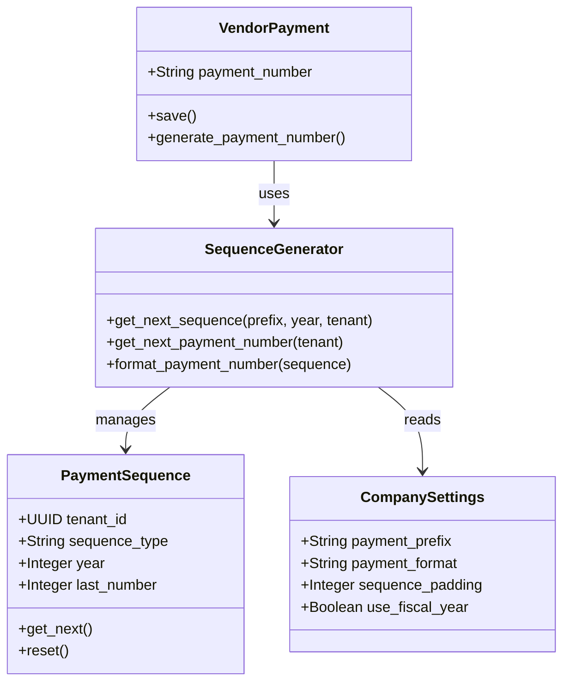
```mermaid
classDiagram
    class VendorPayment {
        +String payment_number
        +save()
        +generate_payment_number()
    }
    
    class SequenceGenerator {
        +get_next_sequence(prefix, year, tenant)
        +get_next_payment_number(tenant)
        +format_payment_number(sequence)
    }
    
    class PaymentSequence {
        +UUID tenant_id
        +String sequence_type
        +Integer year
        +Integer last_number
        +get_next()
        +reset()
    }
    
    class CompanySettings {
        +String payment_prefix
        +String payment_format
        +Integer sequence_padding
        +Boolean use_fiscal_year
    }
    
    VendorPayment --> SequenceGenerator : uses
    SequenceGenerator --> PaymentSequence : manages
    SequenceGenerator --> CompanySettings : reads
```

### Sequence Generation Flow

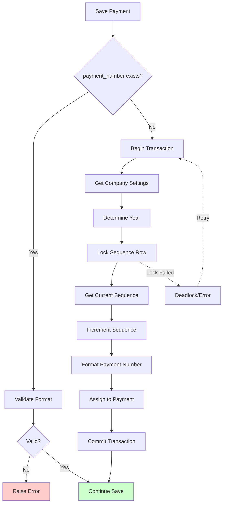
```mermaid
flowchart TD
    A[Save Payment] --> B{payment_number exists?}
    B -->|Yes| C[Validate Format]
    B -->|No| D[Begin Transaction]
    
    D --> E[Get Company Settings]
    E --> F[Determine Year]
    F --> G[Lock Sequence Row]
    G --> H[Get Current Sequence]
    H --> I[Increment Sequence]
    I --> J[Format Payment Number]
    J --> K[Assign to Payment]
    K --> L[Commit Transaction]
    
    C --> M{Valid?}
    M -->|No| N[Raise Error]
    M -->|Yes| O[Continue Save]
    
    L --> O
    
    P[Deadlock/Error] -.->|Retry| D
    G -.->|Lock Failed| P
    
    style N fill:#ffcccc
    style O fill:#ccffcc
```

### Expected Outcome

**Deliverables:**
1. ✅ Payment number format defined
2. ✅ Sequence generator implemented
3. ✅ Concurrency safety ensured
4. ✅ Year transition handling
5. ✅ Custom prefix support
6. ✅ Auto-generation on save
7. ✅ Gap detection (optional)

**Quality Indicators:**
- Numbers are unique per tenant
- Sequential within each year
- No race conditions
- Format follows standard
- Year transitions work correctly
- Custom prefixes supported
- Performance acceptable (< 100ms)

### Verification Checklist

- [ ] Payment number format defined
- [ ] Sequence generator class created
- [ ] get_next_sequence() implemented
- [ ] get_next_payment_number() implemented
- [ ] Database locking (SELECT FOR UPDATE) used
- [ ] PaymentSequence model created (if used)
- [ ] Unique constraint on sequence
- [ ] Year transition logic implemented
- [ ] Sequence resets at year change
- [ ] Company settings for prefix added
- [ ] Format template support added
- [ ] save() override implemented
- [ ] Auto-generation on create
- [ ] Prevent number modification
- [ ] Transaction wrapping correct
- [ ] Error handling implemented
- [ ] Retry logic for deadlocks
- [ ] Test concurrent creation
- [ ] Test year transitions
- [ ] Test custom prefixes

---

## Task 57: Model Methods and Properties

### Overview

Implement essential model methods, properties, and utility functions that provide business logic, data presentation, and calculation capabilities. These methods encapsulate payment-related operations and make the model more intuitive to use throughout the application.

**Key Deliverables:**
- String representation (__str__)
- Business logic methods
- Calculated properties
- Validation methods
- Helper methods
- Query optimization methods

### Dependencies

**Required Prior Completion:**
- ✅ Tasks 49-56: All model fields implemented
- ✅ Understanding of Django model methods
- ✅ Property decorators and cached properties

### Instructions

#### Step 1: Implement Core Magic Methods

**__str__() Method:**

Return human-readable representation of payment:

**Format:** "{payment_number} - {vendor_name} - ${amount}"

**Example:** "PAY-2026-00001 - ABC Suppliers - $1,500.00"

**__repr__() Method:**

Return developer-friendly representation:

**Format:** "VendorPayment(payment_number='{number}', amount={amount}, status='{status}')"

#### Step 2: Implement Business Logic Methods

**can_be_edited():**
- Returns True if payment is in editable state
- Checks status is DRAFT or PENDING
- Checks user permissions
- Checks approval status

**can_be_deleted():**
- Returns True if payment can be soft deleted
- Only DRAFT or PENDING payments
- Checks if payment has been reconciled
- Checks dependent records

**can_be_reversed():**
- Returns True if payment can be reversed
- Only COMPLETED payments
- Within reversal time window
- Not already reconciled
- User has reversal permission

**process_payment():**
- Execute payment processing logic
- Transition status from PENDING to PROCESSING
- Call payment gateway or bank API
- Handle response and update status
- Return success/failure

**reverse_payment(reason):**
- Reverse a completed payment
- Require reversal reason
- Create reversal entries
- Update bill and vendor balances
- Change status to REVERSED

#### Step 3: Implement Calculated Properties

**@property remaining_amount:**
- Calculate unallocated amount if partially allocated
- Returns: amount - allocated_amount
- Useful for partial payments

**@property is_fully_allocated:**
- Returns True if entire payment amount is allocated to bills
- Returns: allocated_amount >= amount

**@property days_since_payment:**
- Calculate days since payment_date
- Returns: (today - payment_date).days
- Useful for aging analysis

**@property is_overdue:**
- Check if payment is overdue (for scheduled payments)
- Compare payment_date with current date
- Only relevant for PENDING status

**@property formatted_amount:**
- Return formatted amount with currency symbol
- Example: "$1,500.00"
- Use company's currency settings

**@property vendor_name:**
- Shortcut to vendor.name
- Useful for display without additional query
- Use select_related to optimize

**@property bill_number:**
- Shortcut to vendor_bill.bill_number
- Handle case where bill is None
- Use select_related to optimize

#### Step 4: Implement Validation Methods

**clean():**
Comprehensive model validation:

**Validations:**
- Vendor and bill belong to same tenant
- Payment amount doesn't exceed bill balance
- Payment date within allowed range
- Payment method required fields populated
- Bank account matches tenant
- Check number unique for bank account
- Transaction ID unique for gateway
- Status transitions are valid

**validate_payment_method_fields():**
- Check method-specific required fields
- BANK_TRANSFER: requires bank_account
- CHECK: requires check_number, check_date
- ONLINE: requires transaction_id, payment_gateway

**validate_amount_against_bill():**
- Check payment amount vs bill remaining balance
- Allow or prevent overpayment based on settings
- Consider existing allocations

**validate_date_constraints():**
- Check payment_date is not too far in past/future
- Validate against fiscal period
- Check against bill date

#### Step 5: Implement Query Helper Methods

**get_absolute_url():**
- Return URL for payment detail view
- Used in templates and redirects
- Format: /payments/{id}/ or /payments/{payment_number}/

**get_edit_url():**
- Return URL for payment edit view
- Check if editable before returning

**get_delete_url():**
- Return URL for payment deletion
- Check if deletable before returning

**get_related_documents():**
- Return all related documents (bills, receipts, attachments)
- Useful for document management integration

#### Step 6: Implement Display Methods

**get_status_badge():**
- Return HTML-safe status badge markup
- Include appropriate CSS classes
- Color-coded by status

**get_payment_method_icon():**
- Return icon class or Unicode symbol
- Match payment method type
- Used in UI rendering

**get_summary_dict():**
- Return dictionary with key payment information
- Useful for API responses
- Include all essential fields

**to_json():**
- Serialize payment to JSON
- Include related objects (vendor, bill)
- Handle date/decimal serialization

### Methods Architecture

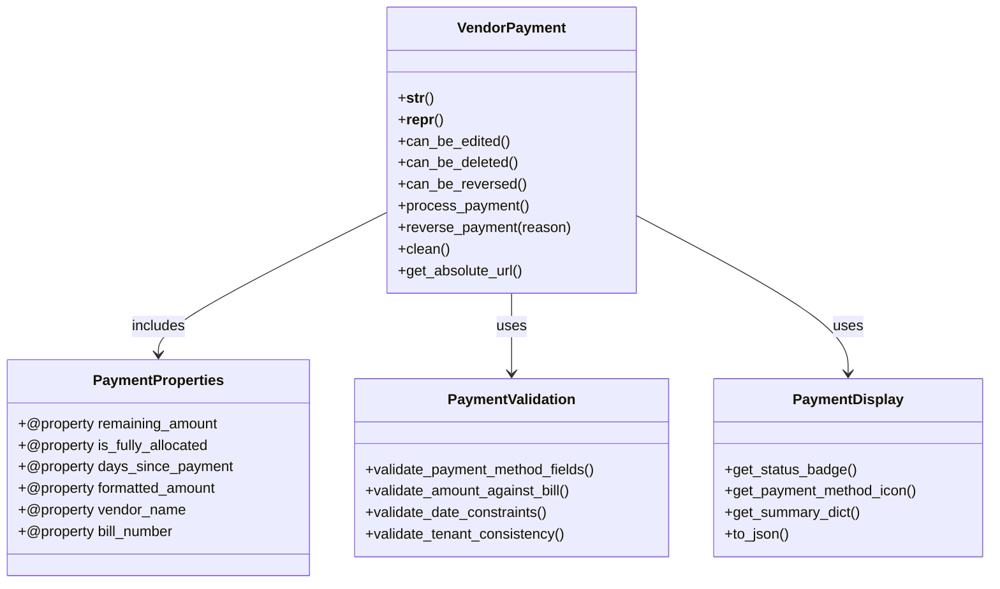
```mermaid
classDiagram
    class VendorPayment {
        +__str__()
        +__repr__()
        +can_be_edited()
        +can_be_deleted()
        +can_be_reversed()
        +process_payment()
        +reverse_payment(reason)
        +clean()
        +get_absolute_url()
    }
    
    class PaymentProperties {
        +@property remaining_amount
        +@property is_fully_allocated
        +@property days_since_payment
        +@property formatted_amount
        +@property vendor_name
        +@property bill_number
    }
    
    class PaymentValidation {
        +validate_payment_method_fields()
        +validate_amount_against_bill()
        +validate_date_constraints()
        +validate_tenant_consistency()
    }
    
    class PaymentDisplay {
        +get_status_badge()
        +get_payment_method_icon()
        +get_summary_dict()
        +to_json()
    }
    
    VendorPayment --> PaymentProperties : includes
    VendorPayment --> PaymentValidation : uses
    VendorPayment --> PaymentDisplay : uses
```

### Method Call Flow

```mermaid
flowchart TD
    A[Create/Update Payment] --> B[Model.save()]
    B --> C[clean()]
    C --> D[validate_payment_method_fields()]
    C --> E[validate_amount_against_bill()]
    C --> F[validate_date_constraints()]
    
    D --> G{Valid?}
    E --> G
    F --> G
    
    G -->|No| H[Raise ValidationError]
    G -->|Yes| I{payment_number empty?}
    
    I -->|Yes| J[generate_payment_number()]
    I -->|No| K[super.save()]
    J --> K
    
    K --> L[Signal: post_save]
    L --> M[Update Bill Balance]
    L --> N[Update Vendor Stats]
    
    style H fill:#ffcccc
    style K fill:#ccffcc
```

### Expected Outcome

**Deliverables:**
1. ✅ __str__() and __repr__() methods
2. ✅ Business logic methods (edit, delete, reverse)
3. ✅ Calculated properties (@property)
4. ✅ Validation methods (clean, validate_*)
5. ✅ Query helper methods (get URLs)
6. ✅ Display methods (badges, icons, JSON)
7. ✅ Method documentation (docstrings)

**Quality Indicators:**
- Methods follow single responsibility principle
- Properties cached when expensive
- Validation comprehensive and clear
- Display methods template-friendly
- URL methods use reverse()
- All methods have docstrings
- Methods tested with unit tests

### Verification Checklist

- [ ] __str__() returns readable string
- [ ] __repr__() returns developer string
- [ ] can_be_edited() implemented
- [ ] can_be_deleted() implemented
- [ ] can_be_reversed() implemented
- [ ] process_payment() implemented
- [ ] reverse_payment() implemented
- [ ] remaining_amount property added
- [ ] is_fully_allocated property added
- [ ] days_since_payment property added
- [ ] formatted_amount property added
- [ ] vendor_name property added
- [ ] clean() method comprehensive
- [ ] validate_payment_method_fields() added
- [ ] validate_amount_against_bill() added
- [ ] validate_date_constraints() added
- [ ] get_absolute_url() implemented
- [ ] get_status_badge() implemented
- [ ] get_summary_dict() implemented
- [ ] All methods have docstrings
- [ ] Test each method individually
- [ ] Test property calculations
- [ ] Test validation catches errors

---

## Task 58: Database Migrations

### Overview

Create and execute Django migrations for the VendorPayment model, ensuring proper database schema creation, constraints, indexes, and data integrity. This task includes planning the migration strategy, handling dependencies, and implementing custom migrations if needed.

**Key Deliverables:**
- Initial model migration
- Index migrations
- Constraint migrations
- Data migrations (if needed)
- Migration testing
- Rollback procedures

### Dependencies

**Required Prior Completion:**
- ✅ Tasks 49-57: Complete VendorPayment model
- ✅ Related models (Vendor, VendorBill) migrated
- ✅ Database access configured
- ✅ Django migrations system understanding

**Database Requirements:**
- PostgreSQL 12+ for advanced features
- Write access to database
- Backup before running migrations

### Instructions

#### Step 1: Create Initial Model Migration

**Generate Migration:**

Run Django's makemigrations command:

**Command:** `python manage.py makemigrations vendor_management`

**Expected Output:**
- Migration file: 00XX_create_vendorpayment.py
- Creates vendor_payments table
- Adds all field definitions
- Creates foreign key constraints

**Review Migration:**
- Check all fields present
- Verify field types correct
- Confirm foreign keys correct
- Check default values

#### Step 2: Add Custom Indexes

**Index Strategy:**

Create indexes for common query patterns:

**Single-Column Indexes:**
- payment_number (unique, already created)
- payment_date (for date range queries)
- status (for status filtering)
- vendor_id (foreign key, auto-indexed)
- vendor_bill_id (foreign key, auto-indexed)

**Composite Indexes:**
- (tenant_id, payment_date DESC) - tenant payments by date
- (vendor_id, payment_date DESC) - vendor payments by date
- (vendor_bill_id, status) - bill payments by status
- (status, payment_date) - status-filtered date queries
- (tenant_id, payment_method, payment_date) - method analysis

**Create Index Migration:**

Generate a new empty migration:

**Command:** `python manage.py makemigrations --empty vendor_management -n add_payment_indexes`

Add custom index operations in the migration.

#### Step 3: Add Database Constraints

**Constraint Strategy:**

Beyond foreign keys, add business logic constraints:

**Check Constraints:**
- amount > 0 (positive payment amounts)
- payment_date not in far future
- Payment method and required fields consistency

**Unique Constraints:**
- payment_number unique per tenant (composite)
- transaction_id unique when not NULL
- check_number unique per bank_account when not NULL

**Partial Unique Indexes (PostgreSQL):**
- Create unique indexes with WHERE conditions
- Example: unique check_number per bank_account (excluding NULLs)

#### Step 4: Create Data Migration (If Needed)

**Data Migration Scenarios:**

**Initial Data:**
- Payment method choices
- Default payment settings
- Sequence initialization

**Data Transformation:**
- If migrating from existing system
- Convert legacy payment numbers
- Populate generated fields
- Set default statuses

**Migration Template:**

Create custom data migration with:
- `def forwards_func(apps, schema_editor):`
- `def backwards_func(apps, schema_editor):`
- Use apps.get_model() for model access
- Avoid importing models directly

#### Step 5: Test Migrations

**Testing Strategy:**

**Fresh Database Test:**
1. Create new test database
2. Run all migrations from scratch
3. Verify schema correctness
4. Check constraints enforced
5. Test data insertion

**Migration Rollback Test:**
1. Apply migration
2. Test rollback (python manage.py migrate vendor_management <previous>)
3. Verify schema reverted
4. Check no data loss

**Upgrade Path Test:**
1. Simulate production database state
2. Apply new migration
3. Verify no breaking changes
4. Test with existing data

#### Step 6: Document Migration Strategy

**Migration Documentation:**

Create migration guide covering:
- Migration dependencies
- Order of execution
- Expected downtime
- Rollback procedure
- Data backup requirements
- Post-migration verification

**Deployment Checklist:**
- Backup database before migration
- Test on staging environment
- Schedule maintenance window if needed
- Run migration during low-traffic period
- Verify data integrity after migration
- Monitor application after deployment

### Migration Architecture

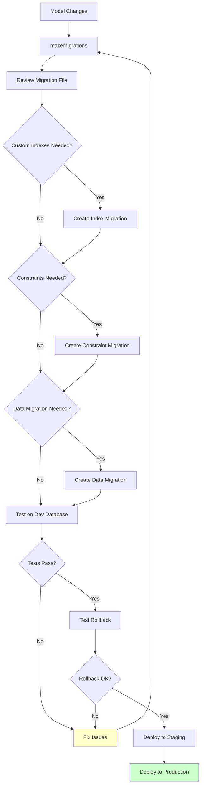
```mermaid
flowchart TD
    A[Model Changes] --> B[makemigrations]
    B --> C[Review Migration File]
    C --> D{Custom Indexes Needed?}
    D -->|Yes| E[Create Index Migration]
    D -->|No| F{Constraints Needed?}
    E --> F
    F -->|Yes| G[Create Constraint Migration]
    F -->|No| H{Data Migration Needed?}
    G --> H
    H -->|Yes| I[Create Data Migration]
    H -->|No| J[Test on Dev Database]
    I --> J
    
    J --> K{Tests Pass?}
    K -->|No| L[Fix Issues]
    L --> B
    K -->|Yes| M[Test Rollback]
    M --> N{Rollback OK?}
    N -->|No| L
    N -->|Yes| O[Deploy to Staging]
    O --> P[Deploy to Production]
    
    style L fill:#ffffcc
    style P fill:#ccffcc
```

### Migration Dependencies

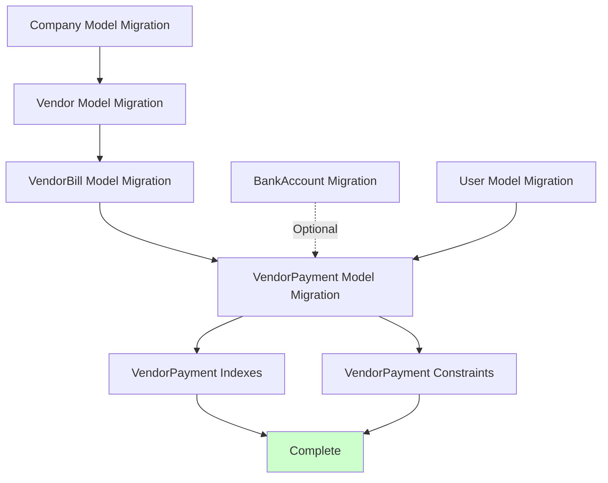
```mermaid
graph TD
    A[Company Model Migration] --> B[Vendor Model Migration]
    B --> C[VendorBill Model Migration]
    C --> D[VendorPayment Model Migration]
    D --> E[VendorPayment Indexes]
    D --> F[VendorPayment Constraints]
    E --> G[Complete]
    F --> G
    
    H[BankAccount Migration] -.->|Optional| D
    I[User Model Migration] --> D
    
    style G fill:#ccffcc
```

### Expected Outcome

**Deliverables:**
1. ✅ Initial model migration created
2. ✅ Index migration created
3. ✅ Constraint migration created
4. ✅ Data migration (if needed)
5. ✅ Migration tested on dev database
6. ✅ Rollback procedure tested
7. ✅ Migration documentation

**Quality Indicators:**
- All fields created correctly
- Foreign keys enforce relationships
- Indexes improve query performance
- Constraints prevent invalid data
- Migrations are reversible
- No data loss on rollback
- Clear migration documentation

### Verification Checklist

- [ ] makemigrations executed successfully
- [ ] Migration file generated
- [ ] All fields present in migration
- [ ] Foreign keys configured correctly
- [ ] Default values set appropriately
- [ ] Unique constraints added
- [ ] Index migration created
- [ ] Composite indexes added
- [ ] Check constraints added
- [ ] Data migration created (if needed)
- [ ] Test migration on empty database
- [ ] Test migration with existing data
- [ ] Test migration rollback
- [ ] Verify schema with inspectdb
- [ ] Check constraint enforcement
- [ ] Test foreign key cascades
- [ ] Document migration dependencies
- [ ] Create deployment checklist
- [ ] Backup procedure documented
- [ ] Post-migration verification steps defined

---

## Integration Overview

### Cross-Model Integration

The VendorPayment model integrates with multiple components of the ERP system:

**Vendor Management:**
- Links to Vendor for payee information
- Updates vendor payment history
- Affects vendor balance and creditworthiness
- Supports vendor-specific payment terms

**Bill Management:**
- Links to VendorBill for payment allocation
- Updates bill paid_amount and status
- Supports partial payment tracking
- Enables bill-to-payment reconciliation

**Accounting Integration:**
- Creates accounting journal entries
- Posts to accounts payable
- Updates cash/bank accounts
- Generates financial reports

**Banking Integration:**
- Interfaces with bank APIs for transfers
- Supports bank reconciliation
- Processes payment confirmations
- Handles failed transaction notifications

**Approval Workflows:**
- Integrates with approval system
- Requires authorization for large payments
- Supports multi-level approval
- Tracks approval history

### System Integration Diagram

```mermaid
graph TD
    VP[VendorPayment Model]
    
    VP --> V[Vendor Model]
    VP --> VB[VendorBill Model]
    VP --> BA[BankAccount Model]
    VP --> AE[Accounting Entries]
    VP --> AW[Approval Workflow]
    VP --> BK[Banking APIs]
    VP --> PG[Payment Gateways]
    VP --> NF[Notification System]
    VP --> RP[Reporting System]
    VP --> AU[Audit Logs]
    
    V --> VS[Vendor Statistics]
    VB --> BS[Bill Status Updates]
    BA --> BR[Bank Reconciliation]
    AE --> GL[General Ledger]
    AW --> AP[Approval Process]
    BK --> BT[Bank Transactions]
    PG --> OT[Online Transactions]
    
    style VP fill:#ccffcc
```

### Data Flow

```mermaid
sequenceDiagram
    participant User
    participant Payment
    participant Bill
    participant Vendor
    participant Bank
    participant Accounting
    
    User->>Payment: Create Payment
    Payment->>Bill: Validate Amount
    Bill-->>Payment: Remaining Balance
    Payment->>Vendor: Verify Active
    Vendor-->>Payment: Confirmed
    
    User->>Payment: Submit for Processing
    Payment->>Payment: Change Status to PROCESSING
    Payment->>Bank: Execute Transfer
    Bank-->>Payment: Transaction ID
    
    Payment->>Payment: Change Status to COMPLETED
    Payment->>Bill: Update Paid Amount
    Bill->>Bill: Update Status (if fully paid)
    Payment->>Vendor: Update Balance
    Payment->>Accounting: Create Journal Entry
    
    Accounting->>Accounting: Post to AP
    Accounting->>Accounting: Post to Bank
    
    Payment->>User: Send Confirmation
```

---

## Testing Strategy

### Unit Testing

**Model Field Tests:**
- Test field validation rules
- Test default values
- Test field constraints
- Test null/blank handling

**Model Method Tests:**
- Test __str__() representation
- Test business logic methods
- Test calculated properties
- Test validation methods

**Payment Number Generation Tests:**
- Test sequential numbering
- Test year transitions
- Test concurrent generation
- Test custom prefixes

**Status Transition Tests:**
- Test valid transitions
- Test invalid transitions
- Test transition side effects
- Test status rollback

### Integration Testing

**Vendor-Payment Integration:**
- Test payment to vendor assignment
- Test vendor balance updates
- Test vendor payment history

**Bill-Payment Integration:**
- Test payment to bill allocation
- Test bill balance updates
- Test bill status transitions
- Test partial payments

**Banking Integration:**
- Test bank transfer processing
- Test check processing
- Test online payment processing
- Test transaction ID recording

### Test Scenarios

**Scenario 1: Simple Payment Creation**
```
Given: Approved vendor bill for $1,000
When: Create payment for $1,000
Then: Payment created with PENDING status
And: Payment number generated (PAY-2026-00001)
And: Bill status remains APPROVED
```

**Scenario 2: Payment Processing**
```
Given: Payment in PENDING status
When: Process payment (change to COMPLETED)
Then: Bill paid_amount updated
And: Bill status changes to PAID (if fully paid)
And: Vendor balance updated
And: Accounting entries created
```

**Scenario 3: Payment Reversal**
```
Given: Payment in COMPLETED status
When: Reverse payment with reason
Then: Payment status changes to REVERSED
And: Bill paid_amount reduced
And: Bill status reverts if necessary
And: Reversal accounting entries created
```

**Scenario 4: Concurrent Payment Creation**
```
Given: Two users create payments simultaneously
When: Both payments save at same time
Then: Both receive unique sequential numbers
And: No duplicate payment numbers
And: No race condition errors
```

### Test Coverage Goals

- Unit test coverage: > 90%
- Integration test coverage: > 80%
- Critical path coverage: 100%
- Edge case coverage: > 75%

---

## Appendices

### Appendix A: Field Reference

| Field Name | Type | Required | Default | Purpose |
|------------|------|----------|---------|---------|
| id | UUID | Yes | Auto | Primary key |
| tenant_id | UUID FK | Yes | Current | Multi-tenancy |
| payment_number | CharField(20) | Yes | Auto | Unique identifier |
| amount | Decimal(15,2) | Yes | None | Payment amount |
| payment_date | DateField | Yes | None | Payment date |
| payment_method | CharField(20) | Yes | BANK_TRANSFER | Method choice |
| vendor | ForeignKey | Yes | None | Vendor receiving payment |
| vendor_bill | ForeignKey | No | None | Bill being paid |
| bank_account | ForeignKey | No | None | Company bank account |
| bank_reference | CharField(50) | No | None | Bank transaction ref |
| bank_transaction_date | DateField | No | None | Bank process date |
| check_number | CharField(20) | No | None | Check number |
| check_date | DateField | No | None | Check date |
| check_payee | CharField(255) | No | Vendor name | Payee on check |
| clearing_status | CharField(20) | No | None | Check clearing status |
| cleared_date | DateField | No | None | Date cleared/confirmed |
| reference_number | CharField(50) | No | None | External reference |
| transaction_id | CharField(100) | No | None | Payment processor ID |
| payment_gateway | CharField(50) | No | None | Online gateway name |
| gateway_response | JSONField | No | None | Gateway response data |
| notes | TextField | No | None | Internal notes |
| description | CharField(255) | No | Auto | Payment description |
| status | CharField(20) | Yes | PENDING | Payment status |
| reconciled_at | DateTimeField | No | None | Reconciliation timestamp |
| reconciled_by | ForeignKey | No | None | User who reconciled |
| reversal_reason | TextField | No | None | Reason for reversal |
| external_system_id | CharField(50) | No | None | External system ID |
| created_at | DateTimeField | Yes | Auto | Creation timestamp |
| updated_at | DateTimeField | Yes | Auto | Last update timestamp |
| created_by | ForeignKey | Yes | Current | User who created |
| updated_by | ForeignKey | Yes | Current | User who last updated |

### Appendix B: Status Definitions

| Status | Description | Can Edit | Can Delete | Can Reverse | Affects Balance |
|--------|-------------|----------|------------|-------------|-----------------|
| DRAFT | Being prepared | Yes | Yes | No | No |
| PENDING | Approved, awaiting processing | Yes | Yes | Yes | No |
| PROCESSING | Currently being processed | No | No | No | No |
| COMPLETED | Successfully completed | No | No | Yes | Yes |
| FAILED | Processing failed | No | Yes | No | No |
| REVERSED | Payment reversed | No | No | No | Yes (negative) |
| RECONCILED | Reconciled with bank | No | No | No | Yes |

### Appendix C: Payment Method Requirements

| Method | Required Fields | Optional Fields | Notes |
|--------|----------------|-----------------|-------|
| BANK_TRANSFER | bank_account, bank_reference | bank_transaction_date | Most common method |
| CHECK | check_number, check_date, check_payee | bank_account, clearing_status | Requires check management |
| CASH | - | reference_number | May have amount limits |
| ONLINE | transaction_id, payment_gateway | gateway_response | Requires gateway integration |

### Appendix D: Validation Rules Summary

**Amount Validation:**
- Must be positive (> 0)
- Maximum: 999,999,999,999.99
- Decimal precision: 2 places
- Cannot exceed bill remaining balance (unless allowed)

**Date Validation:**
- payment_date not more than 90 days in past
- payment_date not more than 365 days in future
- Must fall in open fiscal period
- Should not significantly predate bill date

**Relationship Validation:**
- Vendor must belong to same tenant
- Bill must belong to same tenant
- Bill vendor must match payment vendor
- Vendor must be active
- Bill must be approved (if provided)

**Method-Specific Validation:**
- BANK_TRANSFER: requires bank_account
- CHECK: requires check_number, check_date, check_payee
- ONLINE: requires transaction_id, payment_gateway

**Status Transition Validation:**
- Only allowed transitions per transition matrix
- Terminal statuses cannot change
- Status changes must have business justification

### Appendix E: Index Strategy

**Purpose: Optimize Common Queries**

**Query Pattern 1: List payments by date**
- Index: (tenant_id, payment_date DESC)
- Supports: "SELECT * FROM payments WHERE tenant_id = X ORDER BY payment_date DESC"

**Query Pattern 2: Vendor payment history**
- Index: (vendor_id, payment_date DESC)
- Supports: "SELECT * FROM payments WHERE vendor_id = X ORDER BY payment_date DESC"

**Query Pattern 3: Bill payments**
- Index: (vendor_bill_id, status)
- Supports: "SELECT * FROM payments WHERE vendor_bill_id = X AND status = 'COMPLETED'"

**Query Pattern 4: Pending payments**
- Index: (status, payment_date)
- Supports: "SELECT * FROM payments WHERE status = 'PENDING' ORDER BY payment_date"

**Query Pattern 5: Payment method analysis**
- Index: (tenant_id, payment_method, payment_date)
- Supports: "SELECT * FROM payments WHERE tenant_id = X AND payment_method = Y GROUP BY payment_date"

### Appendix F: Example Payment Scenarios

**Example 1: Full Bill Payment via Bank Transfer**
```
Vendor: ABC Suppliers
Bill: BILL-2026-00123 ($5,000.00)
Payment Amount: $5,000.00
Payment Method: BANK_TRANSFER
Bank Account: Main Operating Account
Result: Bill status → PAID, Vendor balance reduced
```

**Example 2: Partial Payment via Check**
```
Vendor: XYZ Traders
Bill: BILL-2026-00124 ($10,000.00)
Payment Amount: $4,000.00 (first installment)
Payment Method: CHECK
Check Number: 001234
Result: Bill status → PARTIALLY_PAID ($6,000 remaining)
```

**Example 3: Advance Payment (No Bill)**
```
Vendor: DEF Manufacturers
Bill: None (advance for future order)
Payment Amount: $2,000.00
Payment Method: BANK_TRANSFER
Result: Creates vendor credit for future bills
```

**Example 4: Online Payment via Gateway**
```
Vendor: GHI Services
Bill: BILL-2026-00125 ($1,500.00)
Payment Amount: $1,500.00
Payment Method: ONLINE
Gateway: Stripe
Transaction ID: pi_1234567890
Result: Immediate confirmation, Bill status → PAID
```

### Appendix G: Common Errors and Solutions

**Error 1: Payment Number Already Exists**
- Cause: Race condition in number generation
- Solution: Use SELECT FOR UPDATE in sequence generator
- Prevention: Proper transaction isolation

**Error 2: Payment Exceeds Bill Balance**
- Cause: Bill balance changed after payment initiated
- Solution: Lock bill row during payment creation
- Prevention: Real-time balance validation

**Error 3: Invalid Status Transition**
- Cause: Attempting to change from terminal status
- Solution: Check can_transition_to() before changing
- Prevention: UI should disable invalid actions

**Error 4: Bank Account Not Found**
- Cause: Required bank account for bank transfer not set
- Solution: Validate bank account before method selection
- Prevention: Method-specific field validation

**Error 5: Vendor-Bill Mismatch**
- Cause: Selected bill doesn't belong to selected vendor
- Solution: Filter bills by vendor when selecting
- Prevention: Cross-model validation in clean()

### Appendix H: Performance Considerations

**Database Query Optimization:**
- Always use select_related for vendor, bill, bank_account
- Use prefetch_related for related lists
- Implement composite indexes for common queries
- Use database-level aggregation for reports

**Concurrent Access:**
- Use SELECT FOR UPDATE for sequence generation
- Implement optimistic locking for payment updates
- Queue heavy operations (accounting entries) for async processing
- Cache computed values (vendor balances)

**Scalability:**
- Partition payments table by year (future)
- Archive old payments to separate table
- Implement read replicas for reporting
- Use materialized views for complex aggregations

**Caching Strategy:**
- Cache vendor payment counts
- Cache payment statistics by period
- Cache payment method distribution
- Invalidate cache on payment status change

---

**Document End**

**Next Steps:**
1. Review and approve this document
2. Proceed to [02_Tasks-59-68_Payment-Processing.md](./02_Tasks-59-68_Payment-Processing.md)
3. Begin implementation following task sequence
4. Set up automated tests for each task
5. Conduct code review after each task completion

**Questions or Clarifications:**
- Contact Backend Team Lead
- Reference parent [00_GROUP_OVERVIEW.md](./00_GROUP_OVERVIEW.md)
- Consult Phase-05 documentation for context

---

*This document is part of the ERP Core Modules Part 2 (Phase 05) documentation series. For related documents, see the SubPhase-12 Vendor Bills & Payments module.*
