# Tasks 59-66: Payment Service & Schedule Implementation

## Navigation
- **Parent**: [Group D Overview](00_GROUP_OVERVIEW.md)
- **Previous**: [Tasks 51-58: Payment Model & Methods](01_Tasks-51-58_Payment-Model-Methods.md)
- **Next**: [Group E: Payment Allocation & Reconciliation](../Group-E_Payment-Allocation-Reconciliation/00_GROUP_OVERVIEW.md)

---

## Document Overview

This document provides detailed guidance for implementing the PaymentService class and PaymentSchedule model for the Vendor Bills & Payments module. These tasks establish the business logic layer for payment processing, including full and partial payments, batch payment processing, advance payments, and scheduled payment reminders.

**Tasks Covered**: 59-66
**Estimated Effort**: 14-18 hours
**Prerequisites**: Tasks 51-58 (Payment Model & Methods)

---

## Table of Contents

1. [Task 59: PaymentService Class Structure](#task-59-paymentservice-class-structure)
2. [Task 60: record_full_payment() Method](#task-60-record_full_payment-method)
3. [Task 61: record_partial_payment() Method](#task-61-record_partial_payment-method)
4. [Task 62: pay_multiple_bills() Batch Method](#task-62-pay_multiple_bills-batch-method)
5. [Task 63: record_advance_payment() Method](#task-63-record_advance_payment-method)
6. [Task 64: PaymentSchedule Model](#task-64-paymentschedule-model)
7. [Task 65: payment_reminder Celery Task](#task-65-payment_reminder-celery-task)
8. [Task 66: Database Migrations](#task-66-database-migrations)

---

## Task 59: PaymentService Class Structure

### Overview

Create the PaymentService class as the central business logic layer for all payment operations. This service class encapsulates payment processing logic, transaction handling, validation, and integration with other modules. It provides a clean API for recording, modifying, and managing vendor bill payments.

**Purpose**: Centralize payment business logic and provide reusable payment operations
**Module**: `backend/apps/vendor_bills/services/payment_service.py`
**Complexity**: High

### Dependencies

**Required Models**:
- VendorBill (Tasks 1-10)
- Payment (Tasks 51-58)
- VendorAccount (from Vendor module)
- ChartOfAccounts (from Accounting module)

**Required Services**:
- AccountingService (for journal entries)
- NotificationService (for payment notifications)

**Supporting Components**:
- Django transaction management
- Django signals
- Celery for async tasks

### Detailed Instructions

#### Step 1: Service Class Foundation

Create the service class file with proper imports and class structure:

**File Structure**:
```
backend/apps/vendor_bills/services/
├── __init__.py
├── payment_service.py
├── bill_service.py
└── exceptions.py
```

**Class Architecture**:

```
PaymentService
├── Initialization
│   ├── __init__(user, tenant)
│   ├── _validate_permissions()
│   └── _initialize_services()
│
├── Core Payment Methods
│   ├── record_full_payment()
│   ├── record_partial_payment()
│   ├── pay_multiple_bills()
│   └── record_advance_payment()
│
├── Payment Modification
│   ├── void_payment()
│   ├── reverse_payment()
│   └── adjust_payment()
│
├── Validation Methods
│   ├── _validate_payment_amount()
│   ├── _validate_payment_account()
│   ├── _validate_bill_status()
│   └── _validate_currency_match()
│
└── Helper Methods
    ├── _create_journal_entry()
    ├── _update_bill_status()
    ├── _send_payment_notification()
    └── _log_payment_activity()
```

#### Step 2: Initialize Service Context

**Service Initialization Components**:

1. **User Context**:
   - Store current user for audit trails
   - Validate payment permissions
   - Track created_by/modified_by

2. **Tenant Context**:
   - Store tenant for multi-tenancy
   - Access tenant-specific settings
   - Validate payment configurations

3. **Service Dependencies**:
   - Initialize AccountingService
   - Initialize NotificationService
   - Setup transaction handlers

#### Step 3: Implement Permission System

**Permission Checks**:

1. **Payment Creation**:
   - `can_create_payment`
   - `can_record_full_payment`
   - `can_record_partial_payment`

2. **Payment Modification**:
   - `can_void_payment`
   - `can_reverse_payment`
   - `can_adjust_payment`

3. **Batch Operations**:
   - `can_batch_pay_bills`
   - `can_record_advance_payment`

#### Step 4: Setup Transaction Management

**Transaction Patterns**:

1. **Atomic Transactions**:
   - Use `transaction.atomic()` for all payment operations
   - Ensure rollback on any failure
   - Maintain data consistency

2. **Savepoints**:
   - Create savepoints for nested operations
   - Rollback specific operations on error
   - Preserve partial work when needed

3. **Transaction Hooks**:
   - `on_commit` for notifications
   - `on_commit` for async tasks
   - Ensure external services called after commit

#### Step 5: Implement Validation Framework

**Validation Categories**:

1. **Amount Validation**:
   - Positive amounts
   - Not exceeding remaining balance
   - Currency precision rules

2. **Status Validation**:
   - Bill in valid status for payment
   - Bill not already paid
   - Bill not cancelled

3. **Account Validation**:
   - Payment account exists and active
   - Account type appropriate for payments
   - Sufficient balance (if applicable)

4. **Business Rules**:
   - Payment date not in future
   - Payment date after bill date
   - Tenant-specific payment rules

### Architecture Diagrams

#### Service Class Architecture

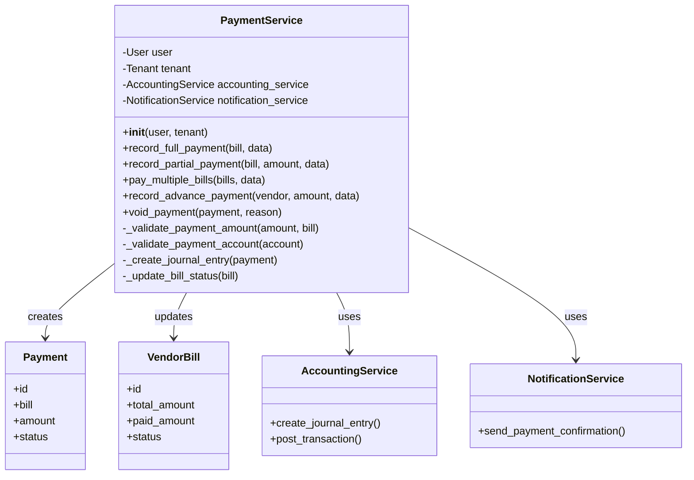

#### Payment Processing Flow

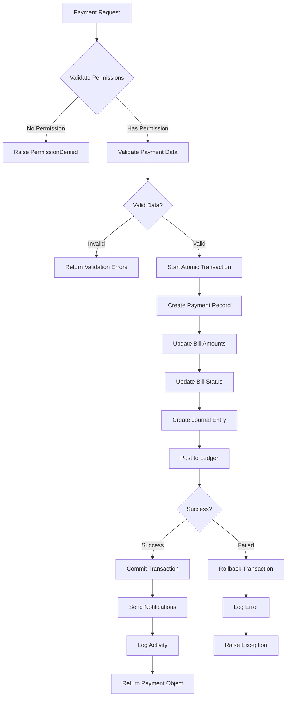

#### Transaction Management Pattern

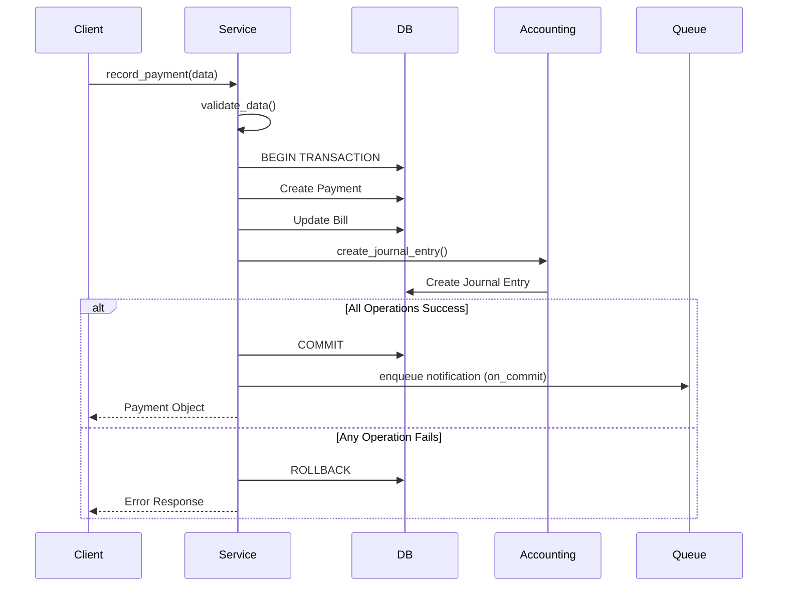

### Expected Outcome

**Deliverables**:

1. **PaymentService Class**:
   - Clean, well-documented service class
   - Proper initialization with user/tenant context
   - Permission validation system
   - Transaction management framework

2. **Validation Framework**:
   - Comprehensive validation methods
   - Clear error messages
   - Business rule enforcement

3. **Integration Points**:
   - AccountingService integration
   - NotificationService integration
   - Signal emission setup

4. **Service Module**:
   - `__init__.py` with service exports
   - `exceptions.py` with custom exceptions
   - Proper error handling

**Success Criteria**:
- Service instantiates with user/tenant context
- Permission checks work correctly
- Validation methods catch invalid scenarios
- Transaction management ensures data consistency
- Integration points ready for implementation

### Verification Checklist

**Code Quality**:
- [ ] Service class properly structured
- [ ] Type hints on all methods
- [ ] Comprehensive docstrings
- [ ] Custom exceptions defined
- [ ] Import statements organized

**Functionality**:
- [ ] Service initializes with context
- [ ] Permission system validates access
- [ ] Validation methods work correctly
- [ ] Transaction decorators in place
- [ ] Error handling comprehensive

**Integration**:
- [ ] AccountingService injectable
- [ ] NotificationService injectable
- [ ] Database transaction management working
- [ ] Signal framework ready

**Documentation**:
- [ ] Class docstring complete
- [ ] Method docstrings detailed
- [ ] Parameter descriptions clear
- [ ] Return value documentation
- [ ] Exception documentation

**Testing Readiness**:
- [ ] Service can be instantiated in tests
- [ ] Methods mockable for testing
- [ ] Validation methods testable in isolation
- [ ] Transaction rollback testable

---

## Task 60: record_full_payment() Method

### Overview

Implement the `record_full_payment()` method to process complete bill payments in a single transaction. This method handles the most common payment scenario where a vendor bill is paid in full, including validation, payment recording, bill status updates, and accounting integration.

**Purpose**: Process full payment of vendor bills with complete transaction handling
**Method Signature**: `record_full_payment(bill: VendorBill, payment_data: dict) -> Payment`
**Complexity**: High

### Dependencies

**Required Components**:
- PaymentService class structure (Task 59)
- Payment model (Tasks 51-58)
- VendorBill model (Tasks 1-10)
- AccountingService integration

**Related Functionality**:
- Journal entry creation
- Bill status management
- Payment notifications
- Activity logging

### Detailed Instructions

#### Step 1: Method Signature and Parameters

**Input Parameters**:

```
payment_data = {
    'payment_date': date,           # Required
    'payment_method': str,          # Required (BANK, CASH, CHECK, etc.)
    'payment_account_id': UUID,     # Required (account to pay from)
    'reference': str,               # Optional
    'notes': str,                   # Optional
    'check_number': str,            # Required if CHECK
    'check_date': date,             # Required if CHECK
    'bank_account_id': UUID,        # Required if BANK
    'transaction_id': str,          # Optional
    'notify_vendor': bool,          # Default False
    'attachments': List[File],      # Optional
}
```

**Return Value**:
- Payment object with all relationships loaded
- Refreshed bill object with updated amounts
- Journal entry reference

#### Step 2: Validation Logic

**Pre-Payment Validations**:

1. **Bill Validation**:
   - Bill exists and not deleted
   - Bill status is 'approved' or 'partially_paid'
   - Bill not already fully paid
   - Bill not cancelled

2. **Amount Validation**:
   - Calculate remaining amount
   - Verify payment equals remaining amount
   - Check for rounding differences (tolerance)

3. **Date Validation**:
   - Payment date not in future
   - Payment date >= bill date
   - Payment date >= bill due date (warning)

4. **Account Validation**:
   - Payment account exists
   - Account type valid for payments
   - Account currency matches bill currency
   - Account active and not restricted

5. **Method-Specific Validation**:
   - CHECK: requires check_number, check_date
   - BANK: requires bank_account_id
   - CARD: requires transaction_id
   - Validate method against tenant settings

#### Step 3: Payment Processing Workflow

**Transaction Steps**:

1. **Initialize Transaction**:
   - Start atomic database transaction
   - Create transaction savepoint
   - Lock bill record for update

2. **Create Payment Record**:
   - Calculate payment amount (remaining balance)
   - Set payment type to 'FULL'
   - Store all payment details
   - Set initial status to 'PENDING'

3. **Update Bill Record**:
   - Add payment amount to paid_amount
   - Verify paid_amount equals total_amount
   - Update status to 'PAID'
   - Set paid_date to payment_date

4. **Create Accounting Entry**:
   - Debit: Accounts Payable (vendor liability)
   - Credit: Payment Account (bank/cash)
   - Include bill reference
   - Set transaction date

5. **Finalize Payment**:
   - Update payment status to 'COMPLETED'
   - Set completion timestamp
   - Release bill lock

6. **Commit Transaction**:
   - Commit all database changes
   - Schedule on_commit hooks

#### Step 4: Post-Payment Operations

**After Commit Actions**:

1. **Send Notifications**:
   - Notify payment creator
   - Notify vendor (if requested)
   - Notify approvers (if configured)

2. **Trigger Events**:
   - Emit payment_completed signal
   - Emit bill_paid signal
   - Update vendor statistics

3. **Schedule Tasks**:
   - Update vendor balance cache
   - Generate payment receipt
   - Archive payment documents

4. **Logging**:
   - Log payment activity
   - Record user action
   - Update audit trail

#### Step 5: Error Handling

**Error Scenarios**:

1. **Validation Errors**:
   - Return clear validation messages
   - No database changes
   - HTTP 400 response

2. **Transaction Errors**:
   - Automatic rollback
   - Log error details
   - Return error with context
   - HTTP 500 response

3. **Accounting Errors**:
   - Rollback payment
   - Log accounting failure
   - Alert administrators
   - Retry mechanism available

4. **Notification Errors**:
   - Payment still completes
   - Log notification failure
   - Queue retry attempt
   - Don't block payment success

### Architecture Diagrams

#### Full Payment Processing Flow

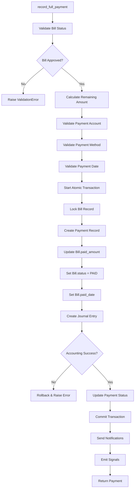

#### Payment Record Creation Detail

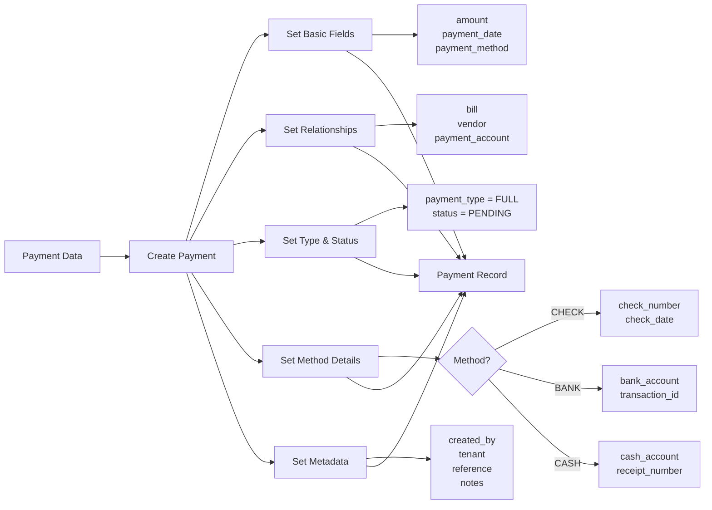

#### Bill Status Update Logic

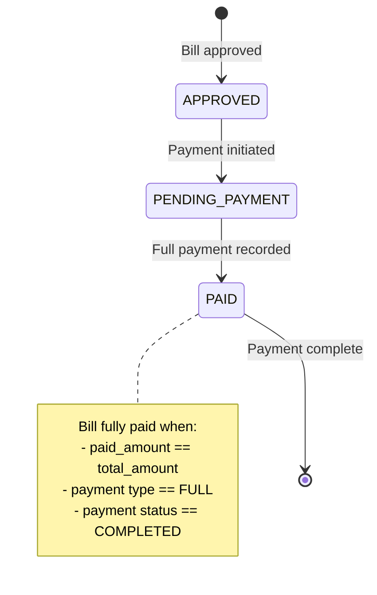

### Expected Outcome

**Deliverables**:

1. **record_full_payment() Method**:
   - Complete implementation with validation
   - Transaction handling
   - Error management
   - Comprehensive documentation

2. **Bill Updates**:
   - Paid amount correctly updated
   - Status changed to PAID
   - Paid date recorded
   - Audit trail maintained

3. **Accounting Integration**:
   - Journal entry created
   - Accounts correctly debited/credited
   - Transaction posted to ledger

4. **Notifications**:
   - Payment confirmation sent
   - Vendor notified (optional)
   - Activity logged

**Success Criteria**:
- Payment recorded with correct amount
- Bill status updated to PAID
- Accounting entry created correctly
- Transaction atomic and consistent
- Notifications sent successfully
- Error cases handled gracefully

### Verification Checklist

**Validation**:
- [ ] Bill status validation works
- [ ] Amount calculation correct
- [ ] Payment account validation complete
- [ ] Date validation enforced
- [ ] Method-specific validation active

**Transaction Handling**:
- [ ] Atomic transaction wraps all operations
- [ ] Bill locked during payment
- [ ] Payment created successfully
- [ ] Bill updated correctly
- [ ] Journal entry created
- [ ] Rollback works on error

**Accounting Integration**:
- [ ] Correct accounts debited/credited
- [ ] Amounts match payment
- [ ] Transaction reference set
- [ ] Posting successful

**Post-Processing**:
- [ ] Notifications queued
- [ ] Signals emitted
- [ ] Activity logged
- [ ] Return value correct

**Error Handling**:
- [ ] Validation errors clear
- [ ] Transaction errors rollback
- [ ] Accounting errors handled
- [ ] Notification failures don't block payment

---

## Task 61: record_partial_payment() Method

### Overview

Implement the `record_partial_payment()` method to handle partial bill payments where a vendor bill is paid in installments. This method supports payment plans, cash flow management, and progressive bill settlement with proper tracking of remaining balances.

**Purpose**: Process partial payments with accurate balance tracking
**Method Signature**: `record_partial_payment(bill: VendorBill, amount: Decimal, payment_data: dict) -> Payment`
**Complexity**: High

### Dependencies

**Required Components**:
- PaymentService class (Task 59)
- record_full_payment() logic (Task 60)
- Payment model with partial payment support
- Balance calculation utilities

**Related Functionality**:
- Payment allocation logic
- Bill status progression
- Multiple payment tracking
- Payment history management

### Detailed Instructions

#### Step 1: Method Parameters and Validation

**Input Parameters**:

```
amount: Decimal                    # Partial payment amount
payment_data: {
    'payment_date': date,
    'payment_method': str,
    'payment_account_id': UUID,
    'reference': str,
    'notes': str,
    'allocation_note': str,       # Explain partial payment
    'is_final_payment': bool,     # Mark as final partial payment
    # ... other payment details
}
```

**Amount Validation Rules**:

1. **Positive Amount**:
   - Amount must be > 0
   - Amount precision matches currency

2. **Not Exceeding Balance**:
   - Amount <= remaining_balance
   - Consider rounding tolerance
   - Check for overpayment

3. **Minimum Payment**:
   - Amount >= tenant minimum payment
   - Exceptions for final payments
   - Warning if below recommended minimum

4. **Multiple Payment Validation**:
   - Check existing partial payments
   - Verify total doesn't exceed bill amount
   - Validate payment sequence

#### Step 2: Balance Calculation Logic

**Remaining Balance Calculation**:

```
remaining_balance = bill.total_amount - bill.paid_amount

Considerations:
- Currency rounding
- Applied credits/discounts
- Previous partial payments
- Payment allocations
- Tax adjustments
```

**Payment Allocation**:

1. **Allocation Strategy**:
   - Apply to oldest charges first (FIFO)
   - Apply to highest interest items
   - Proportional allocation
   - User-specified allocation

2. **Allocation Tracking**:
   - Record which line items paid
   - Track partial line item payments
   - Maintain allocation history

#### Step 3: Status Management

**Bill Status Progression**:

```
Status Transitions:
APPROVED → PARTIALLY_PAID (first partial payment)
PARTIALLY_PAID → PARTIALLY_PAID (subsequent partial payments)
PARTIALLY_PAID → PAID (final payment, balance = 0)

Status Rules:
- First partial payment: APPROVED → PARTIALLY_PAID
- Subsequent payments: remain PARTIALLY_PAID
- Final payment (balance = 0): → PAID
- Mark is_final_payment to force PAID status
```

**Payment Type Determination**:

1. **PARTIAL**: Default for partial payments
2. **FINAL_PARTIAL**: Last payment making balance zero
3. **INSTALLMENT**: Part of payment plan
4. **SETTLEMENT**: Negotiated partial settlement

#### Step 4: Partial Payment Processing

**Transaction Workflow**:

1. **Pre-Payment Checks**:
   - Validate bill status (APPROVED or PARTIALLY_PAID)
   - Calculate current remaining balance
   - Validate partial payment amount
   - Check payment authorization

2. **Create Payment Record**:
   - Set payment_type to 'PARTIAL'
   - Store partial payment amount
   - Store remaining balance snapshot
   - Link to previous payments

3. **Update Bill Amounts**:
   - Add amount to paid_amount
   - Calculate new remaining_balance
   - Update bill status if needed
   - Don't set paid_date (until fully paid)

4. **Create Journal Entry**:
   - Debit: Accounts Payable (partial amount)
   - Credit: Payment Account (partial amount)
   - Note partial payment in description

5. **Handle Final Partial Payment**:
   - Check if remaining_balance = 0
   - Update status to PAID if final
   - Set paid_date on final payment
   - Mark payment as FINAL_PARTIAL type

#### Step 5: Payment Plan Integration

**Payment Plan Support**:

1. **Plan Validation**:
   - Check if bill has payment plan
   - Verify payment matches schedule
   - Update plan progress

2. **Scheduled Payment**:
   - Link to payment schedule entry
   - Mark schedule item as paid
   - Update next payment date

3. **Plan Completion**:
   - Detect plan completion
   - Close payment plan
   - Send completion notification

### Architecture Diagrams

#### Partial Payment Decision Tree

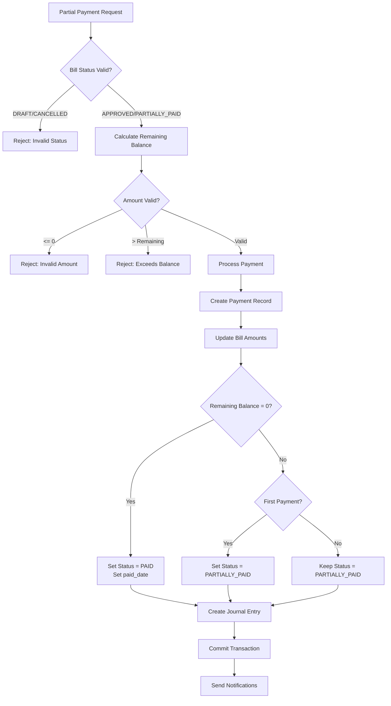

#### Payment Balance Tracking

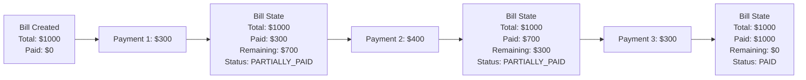

#### Status Transition Diagram

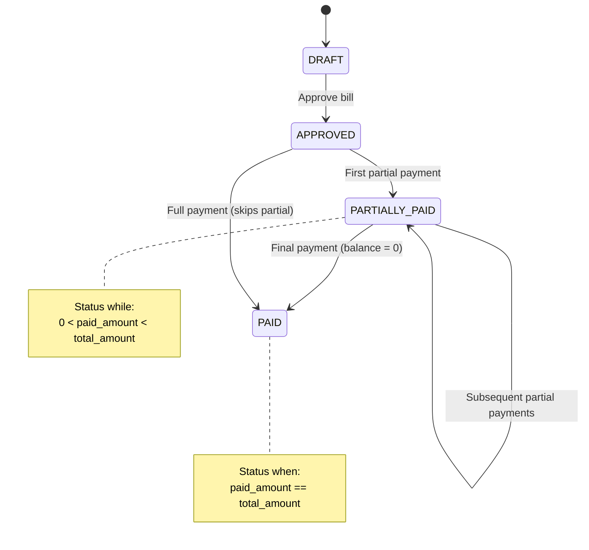

### Expected Outcome

**Deliverables**:

1. **record_partial_payment() Method**:
   - Full implementation with validation
   - Balance calculation logic
   - Status management
   - Transaction handling

2. **Balance Tracking**:
   - Accurate remaining balance calculation
   - Payment history maintained
   - Allocation tracking (if applicable)

3. **Status Management**:
   - Correct status transitions
   - First payment detection
   - Final payment detection
   - Paid date handling

4. **Integration**:
   - Journal entries for partial amounts
   - Notification for partial payments
   - Payment plan integration (if exists)

**Success Criteria**:
- Partial payments recorded correctly
- Balances calculated accurately
- Status transitions work properly
- Multiple partial payments supported
- Final payment detected and handled
- Accounting entries correct

### Verification Checklist

**Amount Validation**:
- [ ] Positive amount required
- [ ] Not exceeding remaining balance
- [ ] Minimum payment enforced
- [ ] Rounding handled correctly

**Balance Calculation**:
- [ ] Remaining balance accurate
- [ ] Paid amount updated correctly
- [ ] Total validation working
- [ ] Currency precision maintained

**Status Management**:
- [ ] First payment → PARTIALLY_PAID
- [ ] Subsequent payments stay PARTIALLY_PAID
- [ ] Final payment → PAID
- [ ] paid_date set only when fully paid

**Transaction Processing**:
- [ ] Payment record created
- [ ] Bill amounts updated
- [ ] Journal entry correct
- [ ] Atomic transaction maintained

**Edge Cases**:
- [ ] Multiple partial payments work
- [ ] Final partial payment handled
- [ ] Overpayment prevented
- [ ] Zero balance detection accurate

**Integration**:
- [ ] Payment plan linked (if exists)
- [ ] Notifications sent
- [ ] Signals emitted
- [ ] Activity logged

---

## Task 62: pay_multiple_bills() Batch Method

### Overview

Implement the `pay_multiple_bills()` method to process batch payments for multiple vendor bills in a single transaction. This method supports efficient payment processing for scenarios like paying all bills from a vendor, processing payment runs, or clearing multiple outstanding bills.

**Purpose**: Enable batch payment processing with transaction consistency
**Method Signature**: `pay_multiple_bills(bills: List[VendorBill], payment_data: dict) -> List[Payment]`
**Complexity**: Very High

### Dependencies

**Required Components**:
- PaymentService class (Task 59)
- record_full_payment() method (Task 60)
- record_partial_payment() method (Task 61)
- Transaction management utilities

**Related Functionality**:
- Bulk validation
- Batch accounting entries
- Payment allocation algorithms
- Error handling and rollback

### Detailed Instructions

#### Step 1: Method Design and Parameters

**Input Parameters**:

```
bills: List[VendorBill]           # Bills to pay (can be mixed vendors)
payment_data: {
    'payment_date': date,         # Single date for all payments
    'payment_method': str,        # Single method for all
    'payment_account_id': UUID,   # Single payment account
    'total_amount': Decimal,      # Total amount to distribute
    'allocation_strategy': str,   # How to allocate amount
    'reference': str,             # Batch reference
    'notes': str,                 # Batch notes
    'individual_references': dict, # Per-bill references (optional)
    'stop_on_error': bool,        # Default True
    'create_individual_payments': bool,  # vs single batch payment
}
```

**Allocation Strategies**:

1. **FULL**: Pay each bill in full (require sufficient total_amount)
2. **PROPORTIONAL**: Distribute amount proportionally by bill amount
3. **PRIORITY**: Pay highest priority bills first
4. **OLDEST_FIRST**: Pay oldest bills first
5. **MANUAL**: Use provided allocation map

#### Step 2: Batch Validation

**Pre-Processing Validations**:

1. **Bill Collection Validation**:
   - All bills exist and accessible
   - No duplicate bills in list
   - All bills in valid status
   - Bills not already paid

2. **Amount Validation**:
   - Total amount positive
   - Total amount sufficient for strategy
   - Amount doesn't exceed total bills
   - Currency consistency check

3. **Payment Account Validation**:
   - Account exists and active
   - Sufficient balance (if applicable)
   - Account type appropriate
   - Currency compatibility

4. **Business Rule Validation**:
   - Payment authorization limits
   - Batch size limits
   - Vendor restrictions
   - Approval requirements

**Validation Response**:
```
validation_result = {
    'valid': bool,
    'errors': [],           # Critical errors preventing payment
    'warnings': [],         # Issues to be aware of
    'bill_issues': {        # Per-bill validation results
        bill_id: {
            'valid': bool,
            'errors': [],
            'warnings': []
        }
    }
}
```

#### Step 3: Payment Allocation Logic

**Allocation Algorithm**:

1. **FULL Strategy**:
   ```
   For each bill:
       allocated_amount = bill.remaining_balance
       
   Validate: sum(allocated_amounts) <= total_amount
   ```

2. **PROPORTIONAL Strategy**:
   ```
   total_due = sum(bill.remaining_balance for bill in bills)
   
   For each bill:
       ratio = bill.remaining_balance / total_due
       allocated_amount = total_amount * ratio
       
   Handle rounding: distribute remainder to largest bills
   ```

3. **PRIORITY Strategy**:
   ```
   Sort bills by priority (due date, amount, vendor priority)
   
   remaining_amount = total_amount
   For each bill in sorted order:
       if remaining_amount >= bill.remaining_balance:
           allocated_amount = bill.remaining_balance
       else:
           allocated_amount = remaining_amount
       remaining_amount -= allocated_amount
       if remaining_amount == 0:
           break
   ```

4. **OLDEST_FIRST Strategy**:
   ```
   Sort bills by date (oldest first)
   
   remaining_amount = total_amount
   For each bill in date order:
       allocated_amount = min(bill.remaining_balance, remaining_amount)
       remaining_amount -= allocated_amount
       if remaining_amount == 0:
           break
   ```

#### Step 4: Batch Transaction Processing

**Transaction Strategy**:

```
Transaction Approach:
1. Single atomic transaction for all payments
2. Process bills in sequence within transaction
3. Rollback all on any failure (if stop_on_error)
4. Or mark failed bills and continue (if not stop_on_error)
```

**Processing Steps**:

1. **Initialize Batch**:
   - Start atomic transaction
   - Lock all bills for update
   - Initialize payment tracking
   - Create batch payment record (optional)

2. **Process Each Bill**:
   ```
   For each (bill, allocation) in allocations:
       Try:
           if allocation == bill.remaining_balance:
               payment = record_full_payment(bill, payment_data)
           else:
               payment = record_partial_payment(bill, allocation, payment_data)
           
           payments.append(payment)
           successes.append(bill.id)
           
       Except Exception as e:
           if stop_on_error:
               raise  # Rollback entire transaction
           else:
               failures.append({bill.id: str(e)})
               continue  # Continue with next bill
   ```

3. **Create Batch Entry**:
   - Create single journal entry for batch
   - Or create individual entries per payment
   - Link all entries to batch reference

4. **Finalize Batch**:
   - Update all payment statuses
   - Commit transaction
   - Return results

#### Step 5: Error Handling and Reporting

**Error Handling Modes**:

1. **stop_on_error = True** (Default):
   - First error rolls back entire transaction
   - No payments recorded
   - Return error with failing bill details
   - Safest option, ensures consistency

2. **stop_on_error = False**:
   - Continue processing after errors
   - Record successful payments
   - Track failed bills
   - Return mixed results
   - Use for best-effort payment runs

**Result Structure**:

```
batch_result = {
    'success': bool,              # Overall success
    'total_bills': int,           # Total bills processed
    'successful_payments': int,   # Number successful
    'failed_payments': int,       # Number failed
    'payments': [Payment],        # List of created payments
    'failures': [                 # Details of failures
        {
            'bill_id': UUID,
            'bill_number': str,
            'error': str,
            'error_type': str
        }
    ],
    'total_amount_paid': Decimal,
    'batch_reference': str,
    'execution_time': float
}
```

### Architecture Diagrams

#### Batch Payment Processing Flow

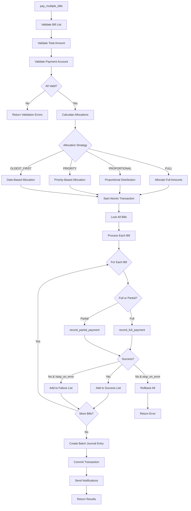

#### Allocation Strategy Comparison

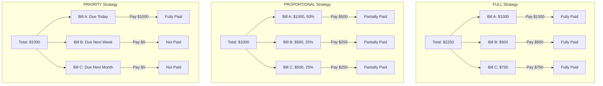

#### Batch Transaction Timeline

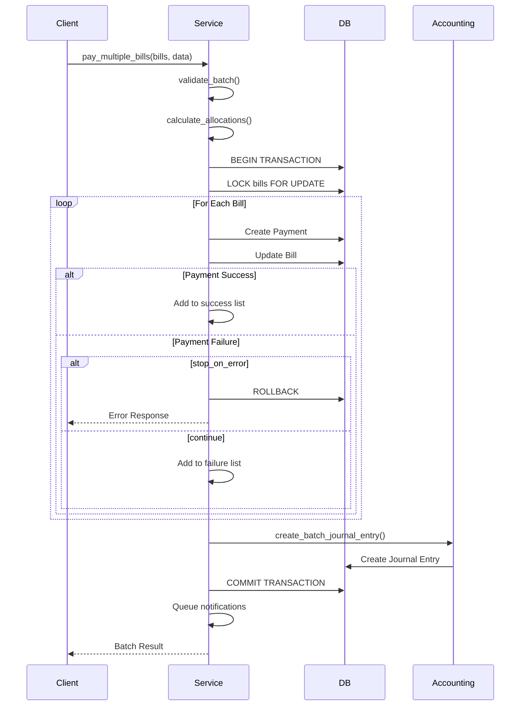

### Expected Outcome

**Deliverables**:

1. **pay_multiple_bills() Method**:
   - Complete batch payment implementation
   - Multiple allocation strategies
   - Robust error handling
   - Transaction consistency

2. **Allocation Engine**:
   - FULL strategy implementation
   - PROPORTIONAL distribution logic
   - PRIORITY-based allocation
   - OLDEST_FIRST algorithm

3. **Batch Management**:
   - Single transaction for all payments
   - Batch reference tracking
   - Result aggregation
   - Performance optimization

4. **Error Handling**:
   - stop_on_error mode
   - Continue-on-error mode
   - Detailed failure reporting
   - Partial success handling

**Success Criteria**:
- Multiple bills paid in single transaction
- Allocation strategies work correctly
- Transaction rolls back on error (if configured)
- Partial success handled appropriately
- Performance acceptable for large batches
- Clear result reporting

### Verification Checklist

**Validation**:
- [ ] Bill list validation complete
- [ ] Amount validation working
- [ ] Account validation enforced
- [ ] Business rule checks active

**Allocation**:
- [ ] FULL strategy correct
- [ ] PROPORTIONAL distribution accurate
- [ ] PRIORITY ordering works
- [ ] OLDEST_FIRST sorting correct
- [ ] Rounding handled properly

**Transaction Processing**:
- [ ] Atomic transaction wraps all payments
- [ ] All bills locked
- [ ] Individual payments created
- [ ] Journal entries correct
- [ ] Commit successful

**Error Handling**:
- [ ] stop_on_error mode works
- [ ] Continue mode works
- [ ] Failures tracked correctly
- [ ] Rollback successful
- [ ] Error messages clear

**Performance**:
- [ ] Acceptable for 10 bills
- [ ] Acceptable for 50 bills
- [ ] Acceptable for 100 bills
- [ ] Memory usage reasonable
- [ ] Database locks minimal

**Results**:
- [ ] Success count accurate
- [ ] Failure details complete
- [ ] Payment list returned
- [ ] Batch reference set
- [ ] Execution time tracked

---

## Task 63: record_advance_payment() Method

### Overview

Implement the `record_advance_payment()` method to handle vendor advance payments - payments made before receiving bills. These payments are later applied to vendor bills, supporting prepayment scenarios, deposits, retainers, and vendor credit management.

**Purpose**: Record and manage advance payments to vendors
**Method Signature**: `record_advance_payment(vendor: Vendor, amount: Decimal, payment_data: dict) -> Payment`
**Complexity**: High

### Dependencies

**Required Components**:
- PaymentService class (Task 59)
- Payment model with advance payment support
- VendorCredit model (for tracking advances)
- Payment application logic

**Related Functionality**:
- Credit management
- Payment application to bills
- Advance payment tracking
- Vendor balance management

### Detailed Instructions

#### Step 1: Advance Payment Concept

**What is an Advance Payment**:

```
Advance Payment:
- Payment made to vendor before receiving goods/services
- No associated bill at time of payment
- Creates vendor credit/prepayment balance
- Applied to future bills when received
- Common in: retainers, deposits, prepaid services
```

**Use Cases**:

1. **Retainer Payments**:
   - Monthly retainer to service provider
   - Applied to monthly invoices

2. **Deposits**:
   - Deposit for large order
   - Applied when goods received

3. **Prepaid Services**:
   - Prepay for annual service
   - Applied to service bills

4. **Vendor Credits**:
   - Overpayment creates credit
   - Used for future purchases

#### Step 2: Method Parameters and Validation

**Input Parameters**:

```
vendor: Vendor                    # Vendor receiving advance
amount: Decimal                   # Advance amount
payment_data: {
    'payment_date': date,
    'payment_method': str,
    'payment_account_id': UUID,
    'reference': str,
    'purpose': str,              # Purpose of advance
    'expiry_date': date,         # Optional expiry
    'advance_type': str,         # RETAINER, DEPOSIT, PREPAID, CREDIT
    'terms': str,                # Terms of advance
    'auto_apply': bool,          # Auto-apply to bills
    'notify_vendor': bool,
}
```

**Validation Rules**:

1. **Vendor Validation**:
   - Vendor exists and active
   - Vendor accepts advance payments
   - Vendor credit limit not exceeded
   - Vendor account in good standing

2. **Amount Validation**:
   - Positive amount
   - Within advance payment limits
   - Matches vendor currency
   - Proper decimal precision

3. **Purpose Validation**:
   - Valid advance type
   - Purpose documented
   - Terms specified (if required)
   - Expiry date valid (if provided)

4. **Account Validation**:
   - Payment account has sufficient balance
   - Account type valid for advances
   - Currency matches

#### Step 3: Advance Payment Processing

**Transaction Workflow**:

1. **Create Payment Record**:
   ```
   Payment fields for advance:
   - vendor: vendor (not bill)
   - bill: NULL (no associated bill)
   - amount: advance amount
   - payment_type: 'ADVANCE'
   - advance_type: specific type
   - status: 'COMPLETED'
   - applied_amount: 0 (not yet applied)
   - remaining_amount: full amount
   ```

2. **Create Vendor Credit**:
   ```
   VendorCredit record:
   - vendor: vendor
   - payment: advance payment
   - credit_type: 'ADVANCE_PAYMENT'
   - amount: advance amount
   - balance: amount (not yet used)
   - status: 'AVAILABLE'
   - expiry_date: if provided
   - auto_apply: flag
   ```

3. **Create Accounting Entry**:
   ```
   Journal Entry:
   Debit:  Vendor Advance Account (asset)
   Credit: Payment Account (bank/cash)
   Amount: advance amount
   Ref: Advance payment to [vendor]
   ```

4. **Update Vendor Balance**:
   ```
   Update vendor.advance_balance += amount
   Track in vendor statistics
   ```

#### Step 4: Advance Application Logic

**Applying Advances to Bills**:

1. **Manual Application**:
   ```
   apply_advance_to_bill(payment, bill, amount):
       - Validate advance available
       - Validate bill unpaid
       - Create payment application record
       - Update payment.applied_amount
       - Update payment.remaining_amount
       - Update bill.paid_amount
       - Create journal entry adjustment
   ```

2. **Automatic Application**:
   ```
   On new bill creation/approval:
       if vendor has advances with auto_apply:
           available_advances = get_available_advances(vendor)
           for advance in available_advances:
               if bill has remaining balance:
                   apply_amount = min(
                       advance.remaining_amount,
                       bill.remaining_balance
                   )
                   apply_advance_to_bill(advance, bill, apply_amount)
   ```

3. **Application Rules**:
   - Apply oldest advances first (FIFO)
   - Respect advance expiry dates
   - Check advance type compatibility
   - Honor auto_apply settings

#### Step 5: Advance Management

**Advance Lifecycle**:

```
States:
1. AVAILABLE: Full balance available
2. PARTIALLY_APPLIED: Some amount applied
3. FULLY_APPLIED: All amount applied
4. EXPIRED: Past expiry date
5. REFUNDED: Advance refunded to vendor
```

**Management Operations**:

1. **Query Available Advances**:
   ```
   get_vendor_advances(vendor, available_only=True)
   Returns advances with remaining balance
   ```

2. **Refund Advance**:
   ```
   refund_advance(payment, reason):
       - Create refund payment
       - Mark advance as REFUNDED
       - Update vendor balance
       - Reverse accounting entry
   ```

3. **Expire Advances**:
   ```
   Celery task: check_advance_expiry()
   - Find advances past expiry_date
   - Mark as EXPIRED
   - Notify about expired advances
   - Option to auto-refund or convert to credit
   ```

### Architecture Diagrams

#### Advance Payment Flow

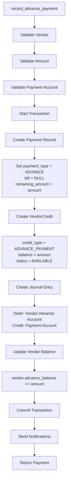

#### Advance Application to Bill

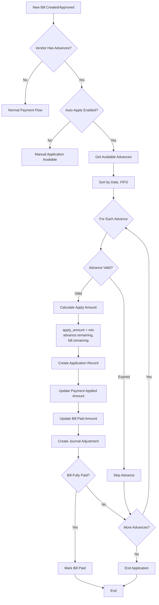

#### Advance Payment States

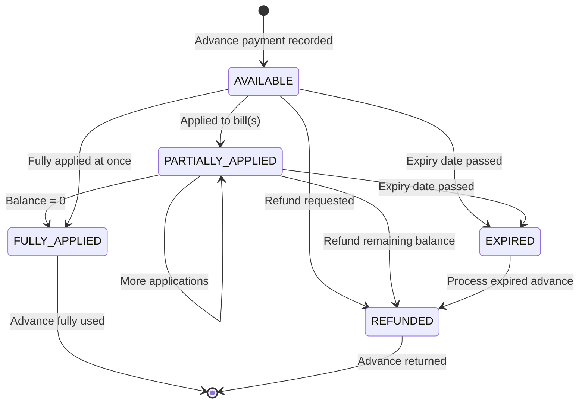

#### Accounting Treatment

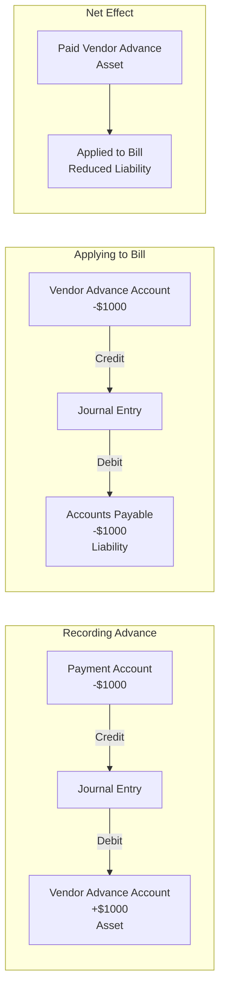

### Expected Outcome

**Deliverables**:

1. **record_advance_payment() Method**:
   - Complete implementation
   - Vendor credit creation
   - Accounting entry handling
   - Validation logic

2. **VendorCredit Management**:
   - Credit record creation
   - Balance tracking
   - Status management
   - Expiry handling

3. **Application System**:
   - Manual application method
   - Automatic application logic
   - FIFO application ordering
   - Application tracking

4. **Advance Queries**:
   - Get available advances
   - Get advance balance
   - Get application history
   - Expiry monitoring

**Success Criteria**:
- Advance payments recorded without bills
- Vendor credits created and tracked
- Accounting entries correct (asset account)
- Advances can be applied to bills
- Auto-apply works correctly
- Balance tracking accurate
- Expiry handling functional

### Verification Checklist

**Payment Recording**:
- [ ] Payment created without bill
- [ ] payment_type set to ADVANCE
- [ ] Amount validated and stored
- [ ] remaining_amount initialized

**Vendor Credit**:
- [ ] VendorCredit record created
- [ ] Credit balance accurate
- [ ] Status set to AVAILABLE
- [ ] Expiry date stored (if provided)
- [ ] auto_apply flag set

**Accounting**:
- [ ] Vendor Advance account debited
- [ ] Payment account credited
- [ ] Amount matches payment
- [ ] Entry posted successfully

**Vendor Balance**:
- [ ] vendor.advance_balance updated
- [ ] Statistics updated
- [ ] Balance query accurate

**Application**:
- [ ] Manual application works
- [ ] Auto-apply triggers correctly
- [ ] FIFO ordering maintained
- [ ] Application tracking accurate
- [ ] Bill amounts updated correctly

**Management**:
- [ ] Available advances queryable
- [ ] Refund functionality works
- [ ] Expiry detection functional
- [ ] Status transitions correct

---

## Task 64: PaymentSchedule Model

### Overview

Create the PaymentSchedule model to manage scheduled and recurring vendor bill payments. This model supports payment plans, installment agreements, recurring payments, and automated payment reminders, enabling better cash flow management and vendor relationship management.

**Purpose**: Enable scheduled payment functionality and payment plans
**Model**: `backend/apps/vendor_bills/models/payment_schedule.py`
**Complexity**: Medium-High

### Dependencies

**Required Models**:
- VendorBill model (Tasks 1-10)
- Payment model (Tasks 51-58)
- Vendor model (from Vendor module)

**Related Functionality**:
- Celery for scheduled tasks
- Payment processing service
- Notification system
- Calendar integration

### Detailed Instructions

#### Step 1: Model Structure and Fields

**Core Fields**:

```
PaymentSchedule Model Fields:

Identity:
- id: UUID (primary key)
- schedule_number: CharField (unique, auto-generated)

Relationships:
- bill: ForeignKey to VendorBill (can be null for recurring)
- vendor: ForeignKey to Vendor
- payment: ForeignKey to Payment (null until paid)
- created_by: ForeignKey to User
- tenant: ForeignKey to Tenant

Schedule Details:
- schedule_type: CharField (choices: ONE_TIME, INSTALLMENT, RECURRING)
- scheduled_amount: DecimalField
- scheduled_date: DateField
- due_date: DateField (for grace period)

Installment Plan Fields:
- total_amount: DecimalField (total plan amount)
- installment_number: IntegerField (1, 2, 3...)
- total_installments: IntegerField
- parent_schedule: ForeignKey (self, for installment series)

Recurring Payment Fields:
- recurrence_pattern: CharField (DAILY, WEEKLY, MONTHLY, YEARLY)
- recurrence_interval: IntegerField (every N periods)
- recurrence_start_date: DateField
- recurrence_end_date: DateField (optional)
- max_occurrences: IntegerField (optional)
- occurrence_count: IntegerField (current count)

Status Fields:
- status: CharField (PENDING, DUE, OVERDUE, PAID, CANCELLED, SKIPPED)
- payment_status: CharField (NOT_PAID, PROCESSING, PAID, FAILED)
- is_auto_pay: BooleanField (default False)

Execution Fields:
- processed_date: DateTimeField (null)
- payment_method: CharField (method to use)
- payment_account: ForeignKey to ChartOfAccounts

Notifications:
- reminder_sent: BooleanField (default False)
- reminder_sent_date: DateTimeField (null)
- notification_days_before: IntegerField (default 3)

Metadata:
- notes: TextField
- reference: CharField
- created_at: DateTimeField
- updated_at: DateTimeField
```

#### Step 2: Schedule Types

**ONE_TIME Schedule**:

```
Single scheduled payment:
- Associated with specific bill
- One-time payment on scheduled_date
- Used for: payment reminders, deferred payments
- Status: PENDING → DUE → PAID/OVERDUE

Example:
Pay Bill #1234 on 2026-02-15 for $1,000
```

**INSTALLMENT Schedule**:

```
Payment plan with multiple installments:
- Associated with specific bill
- Multiple related schedules (parent/child)
- Each installment is a separate schedule entry
- Used for: breaking large bills into payments

Example:
Bill #1234 for $10,000
- Installment 1: $2,500 on 2026-02-01
- Installment 2: $2,500 on 2026-03-01
- Installment 3: $2,500 on 2026-04-01
- Installment 4: $2,500 on 2026-05-01
```

**RECURRING Schedule**:

```
Repeating scheduled payments:
- May or may not have associated bill
- Creates new occurrences automatically
- Used for: subscriptions, retainers, recurring services

Example:
Pay Vendor XYZ $5,000 monthly
- Starts: 2026-01-01
- Ends: Never (or specified date)
- Recurrence: MONTHLY, interval 1
```

#### Step 3: Model Methods

**Status Management**:

```
Methods for status:

def update_status():
    """Update status based on dates"""
    - PENDING if scheduled_date in future
    - DUE if scheduled_date is today
    - OVERDUE if scheduled_date in past and not paid
    - PAID if payment_status = PAID
    - Return updated status

def mark_as_paid(payment):
    """Mark schedule as paid"""
    - Set payment = payment
    - Set payment_status = PAID
    - Set status = PAID
    - Set processed_date = now
    - Update bill if associated

def mark_as_skipped(reason):
    """Skip this payment"""
    - Set status = SKIPPED
    - Store reason
    - Don't affect bill status

def mark_as_cancelled(reason):
    """Cancel this schedule"""
    - Set status = CANCELLED
    - Cancel future occurrences if recurring
    - Store reason
```

**Installment Methods**:

```
def get_installment_plan():
    """Get all installments in plan"""
    if self.parent_schedule:
        return parent_schedule.child_schedules
    else:
        return self.child_schedules

def is_final_installment():
    """Check if last installment"""
    return self.installment_number == self.total_installments

def get_next_installment():
    """Get next installment in series"""
    return PaymentSchedule.objects.filter(
        parent_schedule=self.parent_schedule or self,
        installment_number=self.installment_number + 1
    ).first()

def calculate_progress():
    """Calculate payment plan progress"""
    plan = self.get_installment_plan()
    paid = plan.filter(status='PAID').count()
    total = plan.count()
    return (paid / total) * 100
```

**Recurring Methods**:

```
def create_next_occurrence():
    """Create next recurring payment"""
    - Calculate next_date based on pattern
    - Check if within end_date
    - Check if under max_occurrences
    - Create new PaymentSchedule
    - Increment occurrence_count
    - Return new schedule

def get_all_occurrences():
    """Get all occurrences of recurring schedule"""
    return PaymentSchedule.objects.filter(
        parent_schedule=self
    ).order_by('scheduled_date')

def should_create_next():
    """Check if should create next occurrence"""
    - Check occurrence_count < max_occurrences
    - Check current_date < recurrence_end_date
    - Check last occurrence created
    - Return boolean
```

#### Step 4: Querysets and Managers

**Custom Manager**:

```
PaymentScheduleManager:

def due_today():
    """Get schedules due today"""
    return self.filter(
        scheduled_date=today,
        status='DUE',
        payment_status='NOT_PAID'
    )

def overdue():
    """Get overdue schedules"""
    return self.filter(
        scheduled_date__lt=today,
        status='OVERDUE',
        payment_status='NOT_PAID'
    )

def upcoming(days=7):
    """Get schedules due in next N days"""
    return self.filter(
        scheduled_date__range=(today, today + timedelta(days=days)),
        status='PENDING'
    )

def auto_pay_ready():
    """Get schedules ready for auto-payment"""
    return self.filter(
        scheduled_date__lte=today,
        is_auto_pay=True,
        payment_status='NOT_PAID',
        status__in=['DUE', 'OVERDUE']
    )

def needs_reminder():
    """Get schedules needing reminder"""
    reminder_date = today + timedelta(days=notification_days_before)
    return self.filter(
        scheduled_date=reminder_date,
        reminder_sent=False,
        status='PENDING'
    )
```

#### Step 5: Model Properties and Computed Fields

**Computed Properties**:

```
@property
def is_overdue():
    """Check if schedule is overdue"""
    return (
        self.scheduled_date < date.today() and
        self.payment_status != 'PAID'
    )

@property
def days_until_due():
    """Days until scheduled date"""
    delta = self.scheduled_date - date.today()
    return delta.days

@property
def days_overdue():
    """Days past scheduled date"""
    if not self.is_overdue:
        return 0
    delta = date.today() - self.scheduled_date
    return delta.days

@property
def remaining_amount():
    """Amount still to be paid"""
    if self.payment_status == 'PAID':
        return Decimal('0.00')
    return self.scheduled_amount

@property
def can_auto_pay():
    """Check if eligible for auto-payment"""
    return (
        self.is_auto_pay and
        self.payment_account is not None and
        self.payment_method is not None and
        self.status in ['DUE', 'OVERDUE']
    )
```

### Architecture Diagrams

#### PaymentSchedule Model Relationships

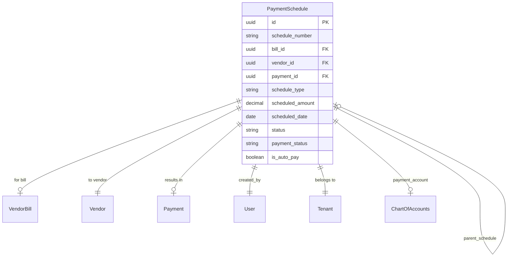

#### Schedule Type Patterns

```mermaid
graph TD
    subgraph ONE_TIME
        O1[Schedule Created] --> O2[Status: PENDING]
        O2 --> O3[Scheduled Date Arrives]
        O3 --> O4[Status: DUE]
        O4 --> O5[Payment Processed]
        O5 --> O6[Status: PAID]
    end
    
    subgraph INSTALLMENT
        I1[Create Parent Schedule] --> I2[Generate Installments]
        I2 --> I3[Installment 1<br/>Due: Month 1]
        I2 --> I4[Installment 2<br/>Due: Month 2]
        I2 --> I5[Installment 3<br/>Due: Month 3]
        I3 --> I6[Each Processed<br/>Independently]
        I4 --> I6
        I5 --> I6
    end
    
    subgraph RECURRING
        R1[Create Recurring Schedule] --> R2[Occurrence 1<br/>January]
        R2 --> R3[Process & Pay]
        R3 --> R4[Create Occurrence 2<br/>February]
        R4 --> R5[Process & Pay]
        R5 --> R6[Create Occurrence 3<br/>March]
        R6 --> R7[Continue Until<br/>End Date]
    end
```

#### Status State Machine

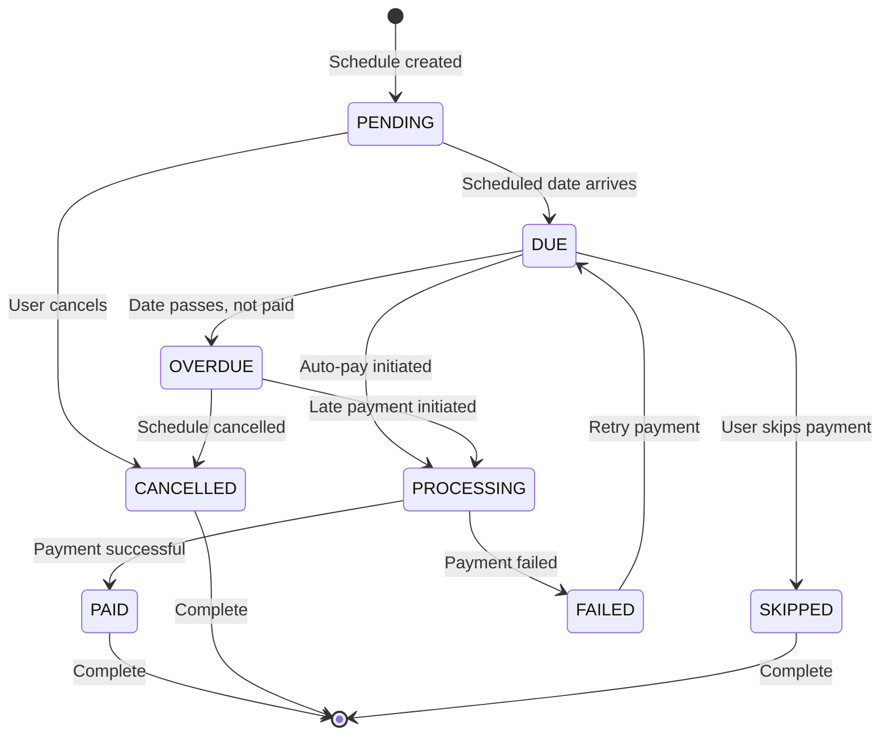

### Expected Outcome

**Deliverables**:

1. **PaymentSchedule Model**:
   - Complete model with all fields
   - Three schedule types supported
   - Status management
   - Comprehensive methods

2. **Installment Support**:
   - Parent-child relationship
   - Installment tracking
   - Progress calculation
   - Plan queries

3. **Recurring Support**:
   - Pattern configuration
   - Occurrence generation
   - Recurrence limits
   - Series management

4. **Query Interface**:
   - Custom manager methods
   - Status queries
   - Due date queries
   - Auto-pay queries

5. **Model Properties**:
   - Computed fields
   - Status checks
   - Date calculations
   - Eligibility checks

**Success Criteria**:
- Model creates and saves correctly
- All schedule types functional
- Status transitions work properly
- Installment plans manageable
- Recurring schedules generate
- Queries return correct results
- Properties compute accurately

### Verification Checklist

**Model Definition**:
- [ ] All fields defined with correct types
- [ ] Relationships configured properly
- [ ] Choices defined for status fields
- [ ] Indexes on query fields
- [ ] Meta options set correctly

**Schedule Types**:
- [ ] ONE_TIME schedules work
- [ ] INSTALLMENT plans create correctly
- [ ] RECURRING schedules generate occurrences
- [ ] Type-specific validation

**Status Management**:
- [ ] Status updates automatically
- [ ] mark_as_paid() works
- [ ] mark_as_skipped() works
- [ ] mark_as_cancelled() works
- [ ] Status transitions valid

**Installments**:
- [ ] Parent-child linking works
- [ ] Installment numbering correct
- [ ] get_installment_plan() accurate
- [ ] Progress calculation correct
- [ ] Final installment detection

**Recurring**:
- [ ] create_next_occurrence() works
- [ ] Pattern calculation correct
- [ ] End date respected
- [ ] Max occurrences enforced
- [ ] Occurrence count tracked

**Queries**:
- [ ] due_today() returns correct schedules
- [ ] overdue() accurate
- [ ] upcoming() works with days parameter
- [ ] auto_pay_ready() filters correctly
- [ ] needs_reminder() accurate

**Properties**:
- [ ] is_overdue computed correctly
- [ ] days_until_due accurate
- [ ] days_overdue accurate
- [ ] remaining_amount correct
- [ ] can_auto_pay validates properly

---

## Task 65: payment_reminder Celery Task

### Overview

Implement the `payment_reminder` Celery task to automatically send payment reminders for upcoming and overdue scheduled payments. This task runs periodically to check payment schedules, send notifications to appropriate users, and update reminder status.

**Purpose**: Automate payment reminder notifications
**Module**: `backend/apps/vendor_bills/tasks.py`
**Complexity**: Medium

### Dependencies

**Required Components**:
- PaymentSchedule model (Task 64)
- Celery task infrastructure
- NotificationService
- Email/notification system

**Related Functionality**:
- Celery beat scheduler
- Notification templates
- User preferences
- Vendor contact management

### Detailed Instructions

#### Step 1: Task Configuration

**Task Setup**:

```
Task Configuration:

Name: payment_reminder
Queue: default (or notifications queue)
Rate Limit: 10/minute (avoid overwhelming email)
Time Limit: 300 seconds
Soft Time Limit: 240 seconds
Auto Retry: True
Max Retries: 3
Retry Backoff: True
```

**Celery Beat Schedule**:

```
Schedule Options:

1. Daily Morning Run:
   - Time: 9:00 AM (tenant timezone)
   - For upcoming payments in next 3-7 days
   - For newly overdue payments

2. Hourly Critical Check:
   - Every hour for same-day due payments
   - For severely overdue (>7 days)
   - For auto-pay eligible schedules

3. Weekly Digest:
   - Every Monday for week ahead
   - Summary of all scheduled payments
   - Payment plan progress updates
```

#### Step 2: Reminder Logic

**Schedule Selection**:

```
Schedules to Remind About:

1. Upcoming Payments:
   - scheduled_date in next N days
   - N = notification_days_before (default 3)
   - Status: PENDING
   - reminder_sent: False

2. Due Today:
   - scheduled_date = today
   - Status: DUE
   - Not yet paid
   - Reminder every few hours

3. Overdue Payments:
   - scheduled_date < today
   - Status: OVERDUE
   - Not yet paid
   - Escalating reminders

4. Auto-Pay Warnings:
   - is_auto_pay = True
   - scheduled_date = tomorrow
   - Notify about pending auto-payment
```

**Reminder Frequency Rules**:

```
Frequency by Status:

UPCOMING (3+ days out):
- One reminder N days before
- One reminder day before

DUE TODAY:
- Morning reminder
- Afternoon reminder (if still unpaid)

OVERDUE:
- Day 1: Daily reminder
- Day 3: Daily reminder + escalation
- Day 7: Daily reminder + urgent escalation
- Day 14+: Weekly reminder + alert to management

AUTO-PAY:
- 1 day before: Confirmation reminder
- 2 hours before: Final warning
- After execution: Confirmation/failure notice
```

#### Step 3: Notification Content

**Reminder Types**:

1. **Upcoming Payment Reminder**:
   ```
   Subject: Payment Reminder: Bill #[number] due on [date]
   
   Content:
   - Bill details (number, vendor, amount)
   - Scheduled payment date
   - Days until due
   - Payment method (if configured)
   - Link to view/pay bill
   - Link to modify schedule
   ```

2. **Due Today Reminder**:
   ```
   Subject: Payment Due Today: Bill #[number]
   
   Content:
   - Urgent indicator
   - Bill details
   - Payment amount
   - Payment instructions
   - Quick pay link
   - Contact for issues
   ```

3. **Overdue Notice**:
   ```
   Subject: Overdue Payment: Bill #[number] - [X] days overdue
   
   Content:
   - Overdue indicator
   - Days overdue
   - Original due date
   - Late fees (if applicable)
   - Payment urgency
   - Escalation notice
   - Quick pay link
   ```

4. **Auto-Pay Confirmation**:
   ```
   Subject: Auto-Payment Scheduled: Bill #[number] tomorrow
   
   Content:
   - Auto-payment notification
   - Execution date/time
   - Payment amount
   - Payment account
   - Link to cancel/modify
   - Confirmation of sufficient funds
   ```

#### Step 4: Recipient Determination

**Who Gets Reminders**:

```
Recipient Rules:

1. Primary Recipients:
   - Schedule creator
   - Bill approver
   - Finance team members
   - Users with 'receive_payment_reminders' permission

2. Secondary Recipients (CC):
   - Department manager (if configured)
   - Vendor contact (optional)
   - Accounting team

3. Escalation Recipients (Overdue):
   - Finance director
   - CFO (for large amounts)
   - Executive team (for critical vendors)

4. Respect User Preferences:
   - Check notification_preferences
   - Respect do_not_disturb settings
   - Honor unsubscribe requests
   - Respect notification channels (email, SMS, push)
```

#### Step 5: Task Implementation

**Task Structure**:

```
@shared_task(
    name='vendor_bills.payment_reminder',
    bind=True,
    max_retries=3,
    default_retry_delay=300
)
def payment_reminder(self):
    """
    Send payment reminders for scheduled payments
    """
    
    Process:
    1. Get current date/time with timezone
    2. Query schedules needing reminders
    3. Group by reminder type
    4. For each schedule:
        a. Determine recipients
        b. Generate notification content
        c. Send notification
        d. Mark reminder_sent = True
        e. Log reminder activity
    5. Handle errors and retries
    6. Return summary statistics
    
    Returns:
    {
        'total_schedules': int,
        'reminders_sent': int,
        'failed': int,
        'skipped': int,
        'by_type': {
            'upcoming': int,
            'due_today': int,
            'overdue': int,
            'auto_pay': int
        }
    }
```

**Error Handling**:

```
Error Scenarios:

1. Database Errors:
   - Retry task
   - Log error
   - Continue with next schedule

2. Email Send Failures:
   - Queue for retry
   - Try alternative channels
   - Don't mark reminder_sent if failed

3. Invalid Schedule Data:
   - Log warning
   - Skip schedule
   - Alert administrator

4. Recipient Not Found:
   - Use fallback recipients
   - Log warning
   - Continue execution
```

### Architecture Diagrams

#### Task Execution Flow

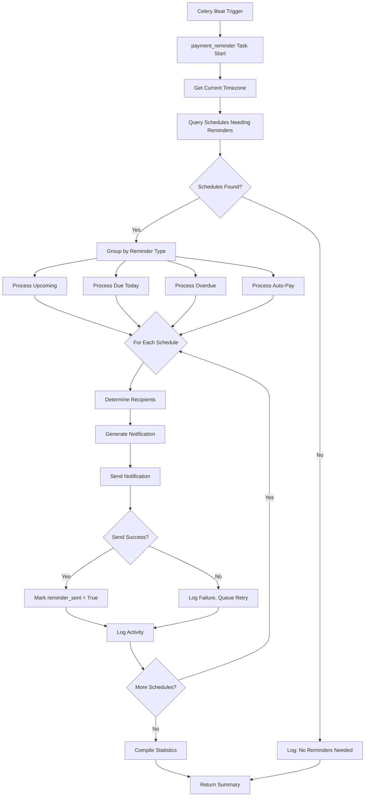

#### Reminder Type Decision Tree

```mermaid
flowchart TD
    A[Payment Schedule] --> B{scheduled_date}
    
    B -->|In 3-7 Days| C{reminder_sent?}
    C -->|No| D[Send Upcoming Reminder]
    C -->|Yes| E[Skip]
    
    B -->|Today| F{Current Time}
    F -->|Morning| G[Send Due Today Morning]
    F -->|Afternoon & Unpaid| H[Send Due Today Afternoon]
    
    B -->|Past & Unpaid| I{Days Overdue}
    I -->|1-2 Days| J[Send Overdue - Standard]
    I -->|3-6 Days| K[Send Overdue - Escalated]
    I -->|7-13 Days| L[Send Overdue - Urgent]
    I -->|14+ Days| M[Send Overdue - Critical + Alert]
    
    B -->|Tomorrow & Auto-Pay| N[Send Auto-Pay Confirmation]
```

#### Notification Dispatch Sequence

```mermaid
sequenceDiagram
    participant Celery
    participant Task
    participant DB
    participant Notification
    participant Email
    participant User

    Celery->>Task: Trigger payment_reminder
    Task->>DB: Query schedules needing reminders
    DB-->>Task: Return schedules list
    
    loop For Each Schedule
        Task->>DB: Get recipients
        DB-->>Task: Return user list
        
        Task->>Notification: Generate reminder content
        Notification-->>Task: Return formatted notification
        
        Task->>Email: Send email
        
        alt Send Success
            Email-->>Task: Success
            Task->>DB: Mark reminder_sent = True
            Task->>DB: Log activity
        else Send Failure
            Email-->>Task: Failure
            Task->>Task: Queue for retry
            Task->>DB: Log error
        end
        
        Task->>User: Notification delivered
    end
    
    Task-->>Celery: Return summary statistics
```

### Expected Outcome

**Deliverables**:

1. **payment_reminder Celery Task**:
   - Complete task implementation
   - Query logic for schedules
   - Reminder type handling
   - Notification generation

2. **Celery Beat Configuration**:
   - Scheduled task entries
   - Multiple run frequencies
   - Timezone handling

3. **Notification Templates**:
   - Upcoming payment template
   - Due today template
   - Overdue template
   - Auto-pay confirmation template

4. **Logging and Monitoring**:
   - Activity logging
   - Error tracking
   - Statistics reporting
   - Performance monitoring

**Success Criteria**:
- Task runs on schedule
- Correct schedules identified
- Notifications sent to right recipients
- reminder_sent flag updated
- Errors handled gracefully
- Statistics accurate
- Performance acceptable

### Verification Checklist

**Task Configuration**:
- [ ] Task registered with Celery
- [ ] Beat schedule configured
- [ ] Retry logic in place
- [ ] Time limits set
- [ ] Queue assignment correct

**Schedule Selection**:
- [ ] Upcoming schedules queried correctly
- [ ] Due today schedules identified
- [ ] Overdue schedules detected
- [ ] Auto-pay schedules found
- [ ] reminder_sent filter works

**Notification Logic**:
- [ ] Templates render correctly
- [ ] Content accurate and complete
- [ ] Links functional
- [ ] Formatting proper
- [ ] Personalization works

**Recipient Handling**:
- [ ] Primary recipients identified
- [ ] Escalation recipients added (overdue)
- [ ] User preferences respected
- [ ] Fallback recipients work
- [ ] Unsubscribe honored

**Execution**:
- [ ] Task completes successfully
- [ ] Notifications sent
- [ ] Database updated
- [ ] Activity logged
- [ ] Statistics returned

**Error Handling**:
- [ ] Database errors handled
- [ ] Email failures handled
- [ ] Invalid data skipped
- [ ] Retries work correctly
- [ ] Errors logged

**Performance**:
- [ ] Acceptable for 100 schedules
- [ ] No timeout issues
- [ ] Rate limiting respected
- [ ] Memory usage reasonable

---

## Task 66: Database Migrations

### Overview

Create Django database migrations for the PaymentSchedule model and related changes. Ensure migrations handle data integrity, support rollback, and work correctly in multi-tenant environments.

**Purpose**: Generate and test database migrations for payment scheduling
**Module**: `backend/apps/vendor_bills/migrations/`
**Complexity**: Medium

### Dependencies

**Required Components**:
- PaymentSchedule model complete (Task 64)
- Payment model (Tasks 51-58)
- VendorBill model (Tasks 1-10)
- django-tenants support

### Detailed Instructions

#### Step 1: Migration File Generation

**Generate Migration Command**:

```
Command:
python manage.py makemigrations vendor_bills

Expected Output:
- New migration file created
- All model fields included
- Relationships properly defined
- Indexes created
```

**Migration File Structure**:

```
Migration File: 00XX_paymentschedule.py

Contents:
- PaymentSchedule model creation
- All fields with proper types
- Foreign key constraints
- Indexes for performance
- Choices for status fields
- Default values
```

#### Step 2: Migration Content Review

**Fields to Verify**:

```
Check Migration Includes:

Identity Fields:
✓ id: UUIDField(primary_key=True, default=uuid.uuid4)
✓ schedule_number: CharField(max_length=20, unique=True)

Relationships:
✓ bill: ForeignKey(VendorBill, null=True, blank=True)
✓ vendor: ForeignKey(Vendor, on_delete=CASCADE)
✓ payment: ForeignKey(Payment, null=True, blank=True)
✓ parent_schedule: ForeignKey(self, null=True, blank=True)
✓ created_by: ForeignKey(User)
✓ tenant: ForeignKey(Tenant)
✓ payment_account: ForeignKey(ChartOfAccounts, null=True)

Schedule Fields:
✓ schedule_type: CharField(max_length=20, choices=...)
✓ scheduled_amount: DecimalField(max_digits=15, decimal_places=2)
✓ scheduled_date: DateField()
✓ due_date: DateField(null=True)

Installment Fields:
✓ total_amount: DecimalField(null=True)
✓ installment_number: IntegerField(null=True)
✓ total_installments: IntegerField(null=True)

Recurring Fields:
✓ recurrence_pattern: CharField(null=True)
✓ recurrence_interval: IntegerField(null=True)
✓ recurrence_start_date: DateField(null=True)
✓ recurrence_end_date: DateField(null=True)
✓ max_occurrences: IntegerField(null=True)
✓ occurrence_count: IntegerField(default=0)

Status Fields:
✓ status: CharField(max_length=20, default='PENDING')
✓ payment_status: CharField(max_length=20, default='NOT_PAID')
✓ is_auto_pay: BooleanField(default=False)

Execution Fields:
✓ processed_date: DateTimeField(null=True)
✓ payment_method: CharField(null=True)

Notification Fields:
✓ reminder_sent: BooleanField(default=False)
✓ reminder_sent_date: DateTimeField(null=True)
✓ notification_days_before: IntegerField(default=3)

Metadata:
✓ notes: TextField(blank=True)
✓ reference: CharField(max_length=100, blank=True)
✓ created_at: DateTimeField(auto_now_add=True)
✓ updated_at: DateTimeField(auto_now=True)
```

**Indexes to Verify**:

```
Required Indexes:

1. Status Queries:
   - (status, scheduled_date)
   - (payment_status, scheduled_date)

2. Date Queries:
   - (scheduled_date)
   - (due_date)

3. Relationships:
   - (bill_id, status)
   - (vendor_id, scheduled_date)
   - (parent_schedule_id)

4. Auto-Pay:
   - (is_auto_pay, scheduled_date, payment_status)

5. Reminders:
   - (reminder_sent, scheduled_date)

6. Tenant:
   - (tenant_id, scheduled_date)
```

#### Step 3: Data Migration Considerations

**Data Migration Needs**:

```
Consider Creating Data Migrations For:

1. Schedule Number Generation:
   - If existing data needs schedule numbers
   - Auto-generate unique numbers
   - Follow numbering convention

2. Converting Existing Payment Plans:
   - If bills have existing installment data
   - Migrate to PaymentSchedule records
   - Maintain relationships

3. Default Payment Methods:
   - Set default payment methods from bill/vendor
   - Populate payment accounts

4. Status Initialization:
   - Set proper status based on dates
   - Mark past schedules appropriately
```

**Example Data Migration**:

```
If needed, create separate migration:

def generate_schedule_numbers(apps, schema_editor):
    """
    Generate unique schedule numbers for existing records
    """
    PaymentSchedule = apps.get_model('vendor_bills', 'PaymentSchedule')
    
    for schedule in PaymentSchedule.objects.filter(schedule_number__isnull=True):
        schedule.schedule_number = generate_unique_number('SCH')
        schedule.save()

def migrate_existing_installments(apps, schema_editor):
    """
    Convert existing bill installments to PaymentSchedule
    """
    # Migration logic if needed
    pass
```

#### Step 4: Multi-Tenant Considerations

**Tenant-Specific Migration Steps**:

```
For django-tenants:

1. Public Schema:
   - Shared tables (if any)
   - Global configurations

2. Tenant Schemas:
   - PaymentSchedule table per tenant
   - Run migration on all tenants
   - Verify data isolation

Testing:
- Create test tenant
- Run migration
- Verify schema created
- Check data isolation
- Test rollback
```

#### Step 5: Migration Testing

**Testing Checklist**:

```
Pre-Migration:
1. Backup database
2. Test on development environment
3. Verify all dependencies exist
4. Check for conflicting migrations

Apply Migration:
1. Run makemigrations
2. Review generated SQL (sqlmigrate)
3. Apply to test database
4. Verify schema changes
5. Test model operations

Post-Migration:
1. Create PaymentSchedule records
2. Test all relationships
3. Test queries with indexes
4. Verify constraints
5. Test in multi-tenant setup

Rollback Test:
1. Create test data
2. Roll back migration
3. Verify rollback clean
4. Re-apply migration
5. Verify data preserved
```

**Test Scenarios**:

```
Test Creating:
✓ One-time schedule
✓ Installment plan (with parent-child)
✓ Recurring schedule
✓ All fields populated correctly
✓ Foreign keys work
✓ Defaults applied

Test Querying:
✓ Query by status
✓ Query by date range
✓ Query overdue schedules
✓ Query with indexes (fast)
✓ Multi-tenant isolation

Test Updates:
✓ Update status
✓ Mark as paid
✓ Update amounts
✓ Modify dates
✓ Cancel schedules

Test Relationships:
✓ Bill relationship
✓ Vendor relationship
✓ Payment linking
✓ Parent-child schedules
✓ Tenant isolation
```

### Architecture Diagrams

#### Migration Dependency Graph

```mermaid
graph TD
    A[Base Models] --> B[VendorBill Migration]
    A --> C[Payment Migration]
    A --> D[Vendor Migration]
    
    B --> E[PaymentSchedule Migration]
    C --> E
    D --> E
    
    E --> F[Data Migration<br/>Schedule Numbers]
    F --> G[Index Creation Migration]
```

#### Schema Changes

```mermaid
erDiagram
    PAYMENT_SCHEDULE {
        uuid id PK
        varchar schedule_number UK
        uuid bill_id FK
        uuid vendor_id FK
        uuid payment_id FK
        uuid parent_schedule_id FK
        uuid tenant_id FK
        varchar schedule_type
        decimal scheduled_amount
        date scheduled_date
        varchar status
        varchar payment_status
        boolean is_auto_pay
        int occurrence_count
        datetime created_at
        datetime updated_at
    }
    
    VENDOR_BILL ||--o{ PAYMENT_SCHEDULE : has_schedules
    VENDOR ||--o{ PAYMENT_SCHEDULE : schedules_for
    PAYMENT ||--o| PAYMENT_SCHEDULE : fulfills
    PAYMENT_SCHEDULE ||--o{ PAYMENT_SCHEDULE : parent_of
```

#### Migration Execution Flow

```mermaid
flowchart LR
    A[makemigrations] --> B[Review Migration File]
    B --> C{Correct?}
    C -->|No| D[Adjust Model]
    D --> A
    C -->|Yes| E[showmigrations]
    
    E --> F[sqlmigrate Review]
    F --> G[Test on Dev DB]
    
    G --> H{Success?}
    H -->|No| I[Fix Issues]
    I --> A
    H -->|Yes| J[migrate]
    
    J --> K[Verify Schema]
    K --> L[Test Operations]
    L --> M[Test Rollback]
    M --> N[Production Ready]
```

### Expected Outcome

**Deliverables**:

1. **Migration File**:
   - Complete PaymentSchedule model migration
   - All fields properly defined
   - Relationships configured
   - Indexes created

2. **Data Migrations** (if needed):
   - Schedule number generation
   - Data transformation
   - Default value population

3. **Migration Documentation**:
   - Migration description
   - Dependencies listed
   - Breaking changes noted
   - Rollback instructions

4. **Test Results**:
   - Development testing complete
   - Multi-tenant testing done
   - Rollback tested
   - Performance verified

**Success Criteria**:
- Migration generates without errors
- All model fields included correctly
- Relationships work as expected
- Indexes improve query performance
- Multi-tenant compatibility confirmed
- Rollback works cleanly
- Production-ready

### Verification Checklist

**Migration Generation**:
- [ ] makemigrations runs successfully
- [ ] Migration file created
- [ ] No missing fields
- [ ] No unexpected changes
- [ ] Dependencies correct

**Field Verification**:
- [ ] All fields present
- [ ] Correct field types
- [ ] Proper constraints (null, blank, unique)
- [ ] Default values set
- [ ] Choices defined

**Relationships**:
- [ ] Foreign keys correct
- [ ] on_delete properly set
- [ ] related_name defined
- [ ] Self-referential FK works (parent_schedule)

**Indexes**:
- [ ] Status indexes created
- [ ] Date indexes created
- [ ] Composite indexes created
- [ ] Performance tested

**Multi-Tenant**:
- [ ] Works with django-tenants
- [ ] Tenant FK included
- [ ] Schema isolation verified
- [ ] Migration runs on all tenants

**Testing**:
- [ ] Applied to test database
- [ ] Model operations work
- [ ] Queries fast with indexes
- [ ] Relationships functional
- [ ] Rollback successful

**Documentation**:
- [ ] Migration documented
- [ ] Breaking changes noted
- [ ] Instructions clear
- [ ] SQL reviewed (sqlmigrate)

---

## Summary and Next Steps

### Tasks Completed (59-66)

**Service Layer**:
- ✅ PaymentService class structure and initialization
- ✅ record_full_payment() for complete bill payments
- ✅ record_partial_payment() for installment payments
- ✅ pay_multiple_bills() for batch payment processing
- ✅ record_advance_payment() for prepayments and credits

**Data Model**:
- ✅ PaymentSchedule model for scheduled payments
- ✅ Support for one-time, installment, and recurring schedules
- ✅ Status management and lifecycle tracking

**Automation**:
- ✅ payment_reminder Celery task for notifications
- ✅ Scheduled task configuration
- ✅ Multi-type reminder support

**Database**:
- ✅ Database migrations for PaymentSchedule
- ✅ Indexes for performance
- ✅ Multi-tenant support

### Key Achievements

1. **Comprehensive Payment Service**: Complete business logic layer for all payment operations
2. **Flexible Payment Processing**: Support for full, partial, batch, and advance payments
3. **Scheduling System**: Robust payment scheduling with reminders
4. **Automation**: Celery-based reminder system for payment notifications

### Integration Points

**With Other Modules**:
- Accounting Module: Journal entries for all payments
- Notification System: Payment confirmations and reminders
- Vendor Module: Advance balance tracking
- User Management: Permission-based access

**With External Systems**:
- Email service for reminders
- Payment gateways (future)
- Accounting software (future)

### Next Phase: Group E

**Group E: Payment Allocation & Reconciliation** (Tasks 67-75)
- Payment allocation to line items
- Bill-payment reconciliation
- Payment history tracking
- Payment reversal functionality
- Bank reconciliation integration
- Payment reporting
- Payment analytics

### Best Practices Implemented

**Code Quality**:
- Type hints on all methods
- Comprehensive docstrings
- Proper error handling
- Transaction management

**Business Logic**:
- Permission-based access
- Validation at multiple levels
- Atomic transactions
- Audit trail maintenance

**Performance**:
- Database indexes
- Bulk operations support
- Efficient queries
- Async task processing

**User Experience**:
- Clear error messages
- Detailed notifications
- Progress tracking
- Flexible payment options

---

## Document Maintenance

**Last Updated**: January 24, 2026
**Document Version**: 1.0
**Author**: Documentation Team
**Review Status**: Ready for Implementation

**Change Log**:
- v1.0: Initial creation covering Tasks 59-66
- Comprehensive coverage of payment service and scheduling
- Architecture diagrams and workflows included
- Integration patterns documented

---

**End of Document**
