# Tasks 01-10: Attendance App & Shift Model Setup

**Document Version:** 1.0  
**Last Updated:** January 24, 2026  
**Status:** Draft

---

## Navigation

- **Parent:** [00_GROUP_OVERVIEW.md](00_GROUP_OVERVIEW.md)
- **Previous:** None (First Document)
- **Next:** [02_Tasks-11-20_Group-A-Next.md](02_Tasks-11-20_Group-A-Next.md)

---

## Document Overview

This document covers the foundational setup for the Attendance Management System, including the creation of the Django app structure and the core Shift model that defines work schedules. These tasks establish the base for shift management, time tracking, and attendance policies.

**Tasks Covered:** 01-10  
**Estimated Completion Time:** 4-6 hours  
**Skill Level Required:** Intermediate Django Development

---

## Table of Contents

1. [Task 01: Create Attendance Django App](#task-01-create-attendance-django-app)
2. [Task 02: Register in TENANT_APPS](#task-02-register-in-tenant_apps)
3. [Task 03: Define ShiftType Choices](#task-03-define-shifttype-choices)
4. [Task 04: Create Shift Model Core Fields](#task-04-create-shift-model-core-fields)
5. [Task 05: Add Time Fields](#task-05-add-time-fields)
6. [Task 06: Add Duration Fields (Calculated)](#task-06-add-duration-fields-calculated)
7. [Task 07: Add Grace Period Fields](#task-07-add-grace-period-fields)
8. [Task 08: Add Overtime Rules](#task-08-add-overtime-rules)
9. [Task 09: Add Half-Day Threshold Fields](#task-09-add-half-day-threshold-fields)
10. [Task 10: Generate and Run Migrations](#task-10-generate-and-run-migrations)

---

## Task 01: Create Attendance Django App

### Overview

Create a new Django application named `attendance` within the tenant-specific apps directory. This app will manage all attendance-related functionality including shifts, schedules, check-ins/check-outs, leave requests, and attendance reports.

### Dependencies

**Before Starting:**
- ✅ Django project structure initialized (Phase 01)
- ✅ Multi-tenancy configured (Phase 02)
- ✅ Core backend infrastructure ready (Phase 03)
- ✅ HR module installed (Phase 04) - Employee models required

**Related Systems:**
- HR Module (Employee data)
- Core authentication system
- Multi-tenant database architecture

### Instructions

#### Step 1: Plan App Structure

Determine the app location within the monorepo:

```
backend/
├── apps/
│   ├── tenant_apps/
│   │   ├── hr/
│   │   ├── attendance/          # New app location
│   │   │   ├── __init__.py
│   │   │   ├── models/
│   │   │   ├── views/
│   │   │   ├── serializers/
│   │   │   ├── admin.py
│   │   │   ├── apps.py
│   │   │   └── urls.py
```

#### Step 2: Create App Directory Structure

Execute the Django management command to create the base app:

**Command Context:**
- Navigate to backend project root
- Use Django's startapp command with custom path
- Verify tenant_apps directory exists

**Directory Creation:**
1. Create main app folder: `attendance`
2. Create subdirectories: `models`, `views`, `serializers`, `tests`
3. Initialize `__init__.py` files in each directory

#### Step 3: Configure App Settings

Update the `apps.py` configuration file:

**Configuration Elements:**
- Set `name` to full import path
- Define `verbose_name` for admin display
- Set `default_auto_field` to BigAutoField
- Add app-specific metadata (version, description)

**Label Convention:**
- Use: `apps.tenant_apps.attendance`
- Avoid conflicts with other apps
- Follow project naming standards

#### Step 4: Create Models Package

Convert models.py to a package structure:

**Package Structure:**
```
models/
├── __init__.py              # Import all models
├── base.py                  # Abstract base models
├── shift.py                 # Shift & ShiftSchedule
├── attendance.py            # AttendanceRecord
├── leave.py                 # LeaveRequest, LeaveType
├── overtime.py              # OvertimeRequest
└── report.py                # AttendanceReport
```

**Benefits:**
- Better code organization
- Easier maintenance
- Clear separation of concerns
- Simplified imports

#### Step 5: Set Up Test Structure

Create comprehensive test structure:

**Test Organization:**
```
tests/
├── __init__.py
├── test_models/
│   ├── test_shift.py
│   ├── test_attendance.py
│   └── test_leave.py
├── test_views/
├── test_serializers/
└── fixtures/
    └── attendance_data.json
```

### Architecture Diagram

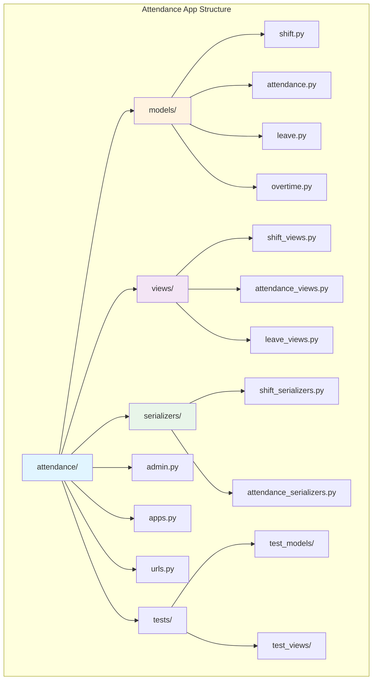

### Expected Outcome

**Deliverables:**
- ✅ `attendance` app created in `tenant_apps` directory
- ✅ Proper package structure for models, views, serializers
- ✅ `apps.py` configured with correct naming
- ✅ Test directory structure established
- ✅ All `__init__.py` files properly set up

**File Checklist:**
```
✓ apps/tenant_apps/attendance/__init__.py
✓ apps/tenant_apps/attendance/apps.py
✓ apps/tenant_apps/attendance/admin.py
✓ apps/tenant_apps/attendance/urls.py
✓ apps/tenant_apps/attendance/models/__init__.py
✓ apps/tenant_apps/attendance/views/__init__.py
✓ apps/tenant_apps/attendance/serializers/__init__.py
✓ apps/tenant_apps/attendance/tests/__init__.py
```

### Verification Checklist

- [ ] App directory created in correct location
- [ ] All subdirectories (models, views, serializers, tests) exist
- [ ] `apps.py` has correct configuration
- [ ] Package structure allows clean imports
- [ ] No syntax errors in any `__init__.py` files
- [ ] App follows project naming conventions
- [ ] Test structure mirrors source structure
- [ ] Ready for model development

---

## Task 02: Register in TENANT_APPS

### Overview

Register the attendance app in Django settings under `TENANT_APPS` to ensure it is isolated per tenant and its models are created in tenant schemas rather than the public schema.

### Dependencies

**Before Starting:**
- ✅ Task 01 completed (Attendance app created)
- ✅ Django-tenants properly configured
- ✅ Understanding of public vs tenant schema distinction

**Configuration Files:**
- `settings/base.py` or `settings/tenant.py`
- Multi-tenant middleware configured
- Database router configured

### Instructions

#### Step 1: Understand Multi-Tenant Architecture

**Schema Separation:**

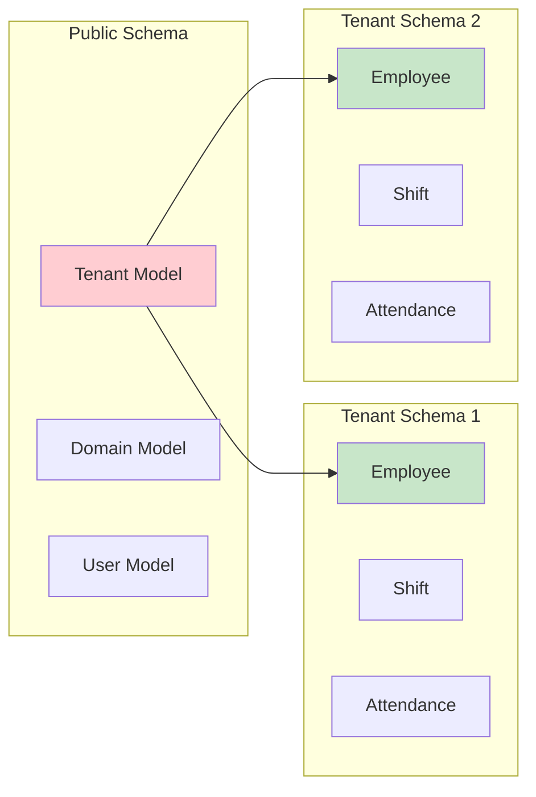

**Key Concepts:**
- **SHARED_APPS**: Models in public schema (Tenant, Domain, User)
- **TENANT_APPS**: Models in each tenant's schema (HR, Attendance, etc.)
- Tenant apps are isolated - data doesn't cross tenants
- Each tenant gets its own tables

#### Step 2: Locate Settings Configuration

**Settings File Structure:**
```
backend/
├── config/
│   ├── settings/
│   │   ├── __init__.py
│   │   ├── base.py              # Common settings
│   │   ├── development.py       # Dev overrides
│   │   ├── production.py        # Prod overrides
│   │   └── tenant.py            # Tenant-specific config
```

**Find TENANT_APPS:**
- Usually in `base.py` or `tenant.py`
- Look for `TENANT_APPS` list
- Should include other tenant apps like `hr`, `inventory`

#### Step 3: Add Attendance to TENANT_APPS

**Registration Order Matters:**

Position the attendance app considering dependencies:

```
TENANT_APPS = [
    # Django core apps
    'django.contrib.contenttypes',
    'django.contrib.auth',
    'django.contrib.sessions',
    
    # Third-party tenant apps
    'rest_framework',
    
    # Project core tenant apps
    'apps.tenant_apps.core',
    
    # HR must come before attendance (Employee model dependency)
    'apps.tenant_apps.hr',
    
    # Attendance app - NEW
    'apps.tenant_apps.attendance',
    
    # Other business apps
    'apps.tenant_apps.inventory',
    'apps.tenant_apps.sales',
    # ... more apps
]
```

**Dependency Order:**
1. Django core apps first
2. Third-party apps
3. Core utility apps
4. HR (provides Employee model)
5. **Attendance** (depends on HR)
6. Other business modules

#### Step 4: Verify SHARED_APPS Configuration

Ensure tenant management apps remain in SHARED_APPS:

**SHARED_APPS Structure:**
```
SHARED_APPS = [
    'django_tenants',              # Tenant system
    'apps.public_apps.tenants',    # Tenant models
    'apps.public_apps.users',      # User authentication
    # ... other shared apps
]
```

**Important:**
- Attendance should NOT be in SHARED_APPS
- Employee model should be in TENANT_APPS
- User model should be in SHARED_APPS

#### Step 5: Update INSTALLED_APPS

Django-tenants typically combines both:

**Combined Configuration:**
```
INSTALLED_APPS = list(SHARED_APPS) + [
    app for app in TENANT_APPS 
    if app not in SHARED_APPS
]
```

**Verification:**
- No duplicate apps between SHARED and TENANT
- Attendance appears only once in final INSTALLED_APPS
- Correct app path used

#### Step 6: Configure Tenant Middleware

Ensure tenant middleware is properly ordered:

**Middleware Stack:**
```
MIDDLEWARE = [
    'django_tenants.middleware.main.TenantMainMiddleware',  # Must be first
    'django.middleware.security.SecurityMiddleware',
    'django.contrib.sessions.middleware.SessionMiddleware',
    # ... other middleware
]
```

### Configuration Diagram

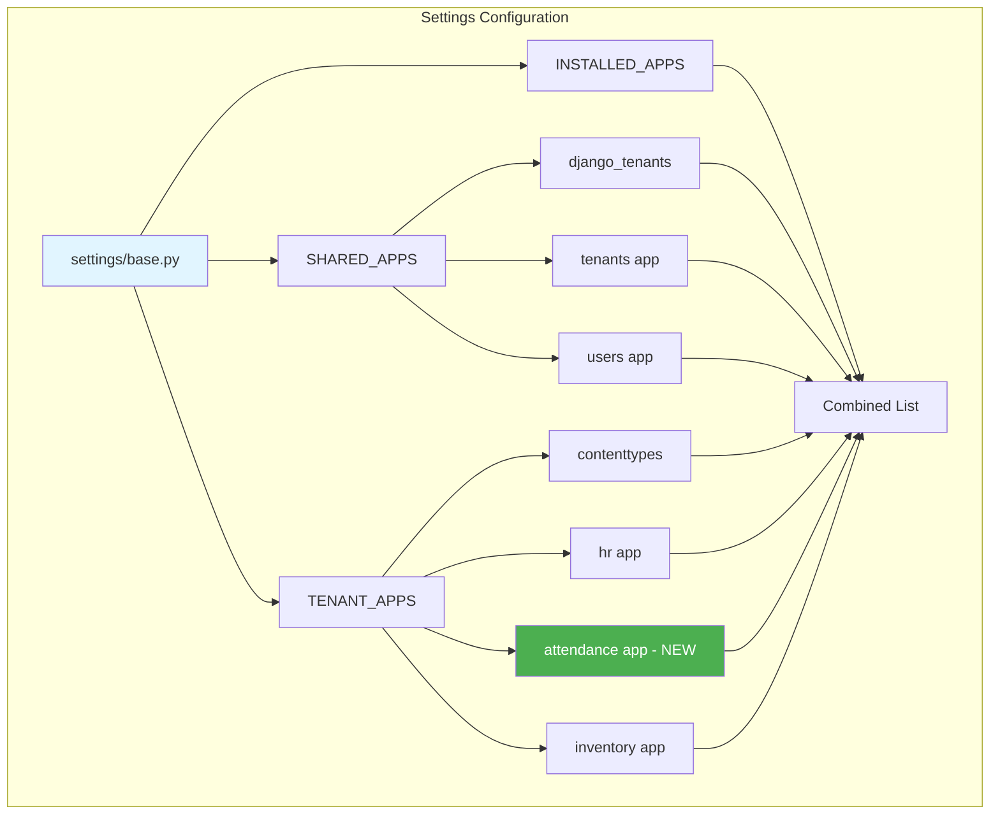

### Expected Outcome

**Configuration Complete:**
- ✅ Attendance app added to TENANT_APPS list
- ✅ Correct position in dependency order (after HR)
- ✅ Not duplicated in SHARED_APPS
- ✅ App path correct: `apps.tenant_apps.attendance`
- ✅ INSTALLED_APPS properly combines both lists

**Behavior Verification:**
- App recognized by Django
- Models will be created in tenant schemas
- Each tenant gets isolated attendance data
- Migrations target tenant databases

### Verification Checklist

- [ ] `TENANT_APPS` contains attendance app
- [ ] App placed after `hr` app (dependency order)
- [ ] Full import path used: `apps.tenant_apps.attendance`
- [ ] Not present in `SHARED_APPS`
- [ ] Django recognizes app (check with `python manage.py showmigrations`)
- [ ] No import errors when loading settings
- [ ] Tenant middleware properly configured
- [ ] Ready to create tenant-specific models

---

## Task 03: Define ShiftType Choices

### Overview

Create an enumeration for shift types that will categorize different work schedules. This classification helps in reporting, policy application, and pay calculations.

### Dependencies

**Before Starting:**
- ✅ Task 01 completed (App structure ready)
- ✅ Task 02 completed (App registered)
- ✅ Understanding of Django model choices

**Knowledge Required:**
- Django TextChoices or IntegerChoices
- Enum patterns in Python 3.8+
- Model field choice patterns

### Instructions

#### Step 1: Understand Shift Type Classifications

**Common Shift Categories:**

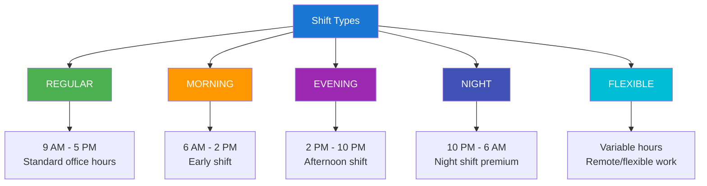

**Business Rules by Type:**

| Shift Type | Typical Hours | Premium Pay | Night Allowance |
|-----------|---------------|-------------|-----------------|
| REGULAR   | 08:00-17:00   | No          | No              |
| MORNING   | 06:00-14:00   | Optional    | No              |
| EVENING   | 14:00-22:00   | 10%         | Optional        |
| NIGHT     | 22:00-06:00   | 25%         | Yes             |
| FLEXIBLE  | Variable      | No          | N/A             |

#### Step 2: Choose Implementation Pattern

**Option A: TextChoices (Recommended)**

Best for human-readable values in database:

**Advantages:**
- Database values are readable (e.g., "REGULAR")
- Easy to debug and query
- Self-documenting in database
- No magic numbers

**Structure:**
```
class ShiftType(models.TextChoices):
    REGULAR = 'REGULAR', 'Regular Shift'
    value = database_value, human_readable_label
```

**Option B: IntegerChoices**

Best for performance-critical systems:

**Advantages:**
- Smaller database footprint
- Faster indexing and queries
- Useful for bitwise operations

**Disadvantages:**
- Less readable in database
- Requires documentation
- Prone to magic number issues

#### Step 3: Create Choices Class

**File Location:**
```
attendance/
├── models/
│   ├── __init__.py
│   ├── choices.py           # NEW - Centralized choices
│   ├── shift.py
│   └── attendance.py
```

**Class Structure:**

Define clear, descriptive choices:

**Elements:**
1. **Value**: Database storage (uppercase, underscored)
2. **Label**: Human-readable display text
3. **Docstring**: Explain usage and business rules

**Naming Convention:**
- Class name: `ShiftType` (singular, descriptive)
- Values: `REGULAR`, `MORNING` (uppercase constants)
- Labels: "Regular Shift", "Morning Shift" (title case)

#### Step 4: Add Helper Methods

Enhance the choices class with utility methods:

**Useful Helpers:**

1. **is_night_shift()**: Check if type qualifies for night premium
2. **get_premium_rate()**: Return applicable premium percentage
3. **get_color_code()**: For UI display consistency
4. **requires_night_allowance()**: Business rule check

**Method Pattern:**
```
@classmethod
def get_premium_types(cls):
    """Return shift types that get premium pay"""
    return [cls.EVENING, cls.NIGHT]

@classmethod
def get_by_time_range(cls, start_hour):
    """Suggest shift type based on start time"""
    # Logic to determine type from hours
```

#### Step 5: Document Business Rules

Add comprehensive documentation:

**Documentation Elements:**

```
class ShiftType(models.TextChoices):
    """
    Shift type classifications for attendance management.
    
    Business Rules:
    - REGULAR: Standard daytime shifts, no premiums
    - MORNING: Early shifts (before 8 AM), optional premium
    - EVENING: Afternoon shifts, 10% premium after 6 PM
    - NIGHT: Overnight shifts, 25% premium + night allowance
    - FLEXIBLE: Variable hours for remote/flexible workers
    
    Usage:
        shift.shift_type = ShiftType.REGULAR
        if shift.shift_type == ShiftType.NIGHT:
            apply_night_premium()
    
    See also:
    - Shift model: shift_type field
    - Payroll calculations: premium rate logic
    - Attendance policy: grace period rules by type
    """
```

#### Step 6: Integration Planning

Plan how ShiftType will be used:

**Model Integration:**
```
Shift model:
    shift_type = models.CharField(
        max_length=20,
        choices=ShiftType.choices,
        default=ShiftType.REGULAR
    )
```

**Query Examples:**
- Get all night shifts: `Shift.objects.filter(shift_type=ShiftType.NIGHT)`
- Count by type: `Shift.objects.values('shift_type').annotate(Count('id'))`
- Premium shifts: `Shift.objects.filter(shift_type__in=ShiftType.get_premium_types())`

### ShiftType Decision Flow

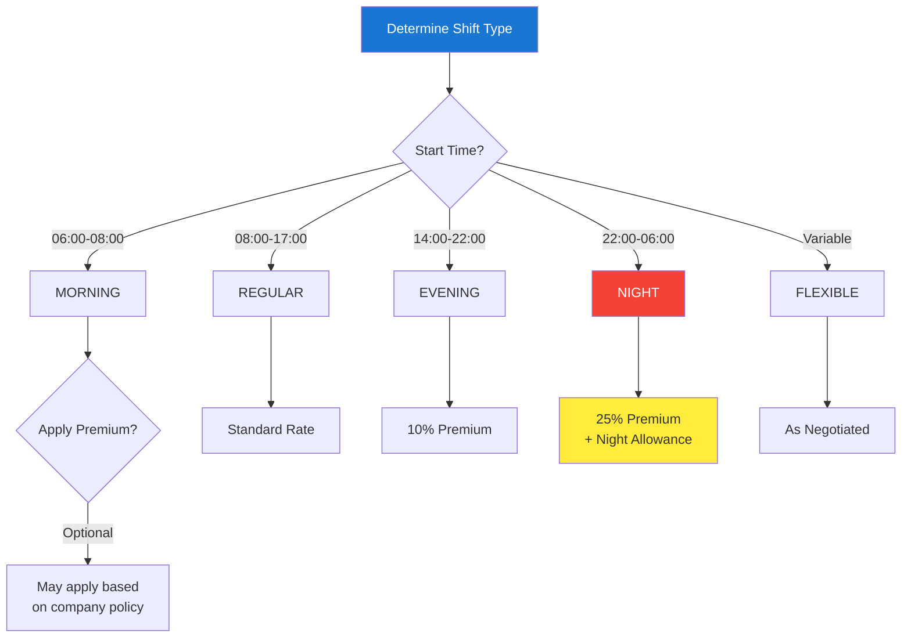

### Expected Outcome

**Deliverables:**
- ✅ `ShiftType` choices class created in `choices.py`
- ✅ Five shift types defined: REGULAR, MORNING, EVENING, NIGHT, FLEXIBLE
- ✅ Clear labels and documentation
- ✅ Helper methods for business logic
- ✅ Ready for use in Shift model

**Code Quality:**
- Type-safe using Django's choices framework
- Well-documented with business rules
- Helper methods for common checks
- Consistent naming conventions

### Verification Checklist

- [ ] `choices.py` file created in models package
- [ ] `ShiftType` class extends `models.TextChoices`
- [ ] All five types defined with correct syntax
- [ ] Labels are human-readable
- [ ] Comprehensive docstring included
- [ ] Helper methods implemented (if applicable)
- [ ] Imported in `models/__init__.py`
- [ ] No syntax errors
- [ ] Ready to use in model field definition

---

## Task 04: Create Shift Model Core Fields

### Overview

Create the Shift model with fundamental identifying fields: name, code, and shift_type. These core fields establish the basic identity and classification of each shift.

### Dependencies

**Before Starting:**
- ✅ Task 03 completed (ShiftType choices defined)
- ✅ Base model mixins available (TimeStampedModel, TenantAwareModel)
- ✅ Understanding of Django model inheritance

**Related Models:**
- Employee model (for future assignments)
- Base abstract models from core

### Instructions

#### Step 1: Plan Model Inheritance

**Inheritance Structure:**

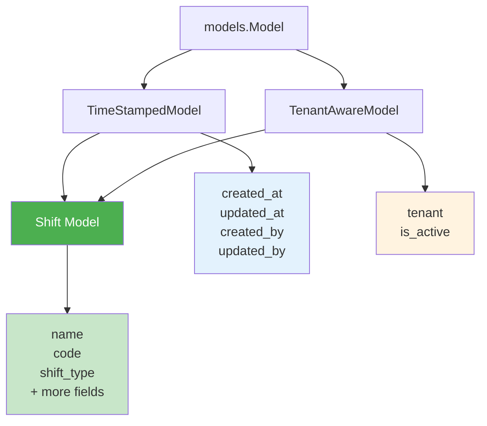

**Base Model Benefits:**
- **TimeStampedModel**: Automatic created_at, updated_at tracking
- **TenantAwareModel**: Automatic tenant association, soft delete
- **Audit fields**: Track who created/modified records

#### Step 2: Create Shift Model File

**File Location:**
```
attendance/models/shift.py
```

**Basic Structure:**

Define the model class with proper inheritance:

**Class Definition Elements:**
1. Import statements (models, base classes, choices)
2. Class docstring (purpose, relationships, usage)
3. Core fields (name, code, shift_type)
4. Meta class (ordering, indexes, constraints)
5. String representation (`__str__` method)
6. Custom methods (if needed)

#### Step 3: Implement Name Field

**Field: name**

**Purpose:** Human-readable shift name for display

**Specifications:**
- **Type:** CharField
- **Max Length:** 100 characters
- **Required:** Yes (blank=False)
- **Unique:** Yes, per tenant
- **Indexed:** Yes (for fast lookups)

**Business Rules:**
- Must be descriptive: "Morning Shift", "Night Shift - Warehouse"
- Used in UI dropdowns and reports
- Employees should recognize shift by name
- No duplicate names within same tenant

**Examples:**
- "Standard Office Hours"
- "Morning Shift - Production"
- "Night Security Shift"
- "Flexible Remote Work"

**Validation Considerations:**
- Minimum length: 3 characters
- Avoid special characters that cause display issues
- Consider multilingual support (CharField stores Unicode)

#### Step 4: Implement Code Field

**Field: code**

**Purpose:** Short unique identifier for programmatic use

**Specifications:**
- **Type:** CharField
- **Max Length:** 20 characters
- **Required:** Yes
- **Unique:** Yes, per tenant
- **Pattern:** Uppercase, alphanumeric with underscores
- **Indexed:** Yes (primary lookup field)

**Business Rules:**
- Used in payroll systems, reports, API endpoints
- Should be memorable but concise
- Follows naming convention: PREFIX_TYPE_NUMBER
- Immutable after creation (avoid changing codes)

**Examples:**
- `REG_DAY_01` - Regular Day Shift 1
- `MRN_PROD_01` - Morning Production Shift
- `NGT_SEC_01` - Night Security Shift
- `FLEX_REM_01` - Flexible Remote Shift

**Code Generation Pattern:**
```
Pattern: {TYPE}_{DEPT}_{SEQ}

TYPE: REG|MRN|EVE|NGT|FLEX
DEPT: 3-4 letter department code
SEQ: 01, 02, 03 (sequential)

Example: NGT_WHSE_01 = Night Warehouse Shift 1
```

#### Step 5: Implement ShiftType Field

**Field: shift_type**

**Purpose:** Categorize shift for policy and premium application

**Specifications:**
- **Type:** CharField
- **Max Length:** 20 characters
- **Choices:** ShiftType.choices
- **Default:** ShiftType.REGULAR
- **Required:** Yes
- **Indexed:** Yes (frequent filtering)

**Business Rules:**
- Determines applicable pay premiums
- Affects grace period policies
- Used in compliance reporting
- May impact leave calculations

**Query Implications:**
```
Common queries:
- All night shifts: filter(shift_type=ShiftType.NIGHT)
- Premium-eligible: filter(shift_type__in=[ShiftType.EVENING, ShiftType.NIGHT])
- Group by type: values('shift_type').annotate(Count('id'))
```

**Integration Points:**
- Payroll system: Premium rate calculation
- Attendance policy: Different grace periods by type
- Reporting: Shift distribution analysis
- Scheduling: Avoid back-to-back night shifts

#### Step 6: Add Meta Configuration

**Meta Class Purpose:**

Configure model behavior and database optimization:

**Key Meta Options:**

1. **db_table**: Explicit table naming
   ```
   db_table = 'attendance_shift'
   ```

2. **ordering**: Default sort order
   ```
   ordering = ['code', 'name']
   ```

3. **verbose_name**: Admin display names
   ```
   verbose_name = 'Shift'
   verbose_name_plural = 'Shifts'
   ```

4. **indexes**: Database performance
   ```
   indexes = [
       models.Index(fields=['code']),
       models.Index(fields=['shift_type']),
       models.Index(fields=['name']),
   ]
   ```

5. **constraints**: Data integrity
   ```
   constraints = [
       models.UniqueConstraint(
           fields=['tenant', 'code'],
           name='unique_shift_code_per_tenant'
       ),
       models.UniqueConstraint(
           fields=['tenant', 'name'],
           name='unique_shift_name_per_tenant'
       ),
   ]
   ```

#### Step 7: Implement String Representation

**__str__ Method:**

Return meaningful string for admin and debugging:

**Good Patterns:**
```
Option 1: "{code} - {name}"
Result: "REG_DAY_01 - Standard Office Hours"

Option 2: "{name} ({shift_type})"
Result: "Morning Shift (MORNING)"

Option 3: "[{code}] {name}"
Result: "[NGT_SEC_01] Night Security Shift"
```

**Best Practice:**
- Keep under 50 characters when possible
- Include most identifying information
- Consistent format across all models
- Avoid including timestamps or IDs

### Core Fields Architecture

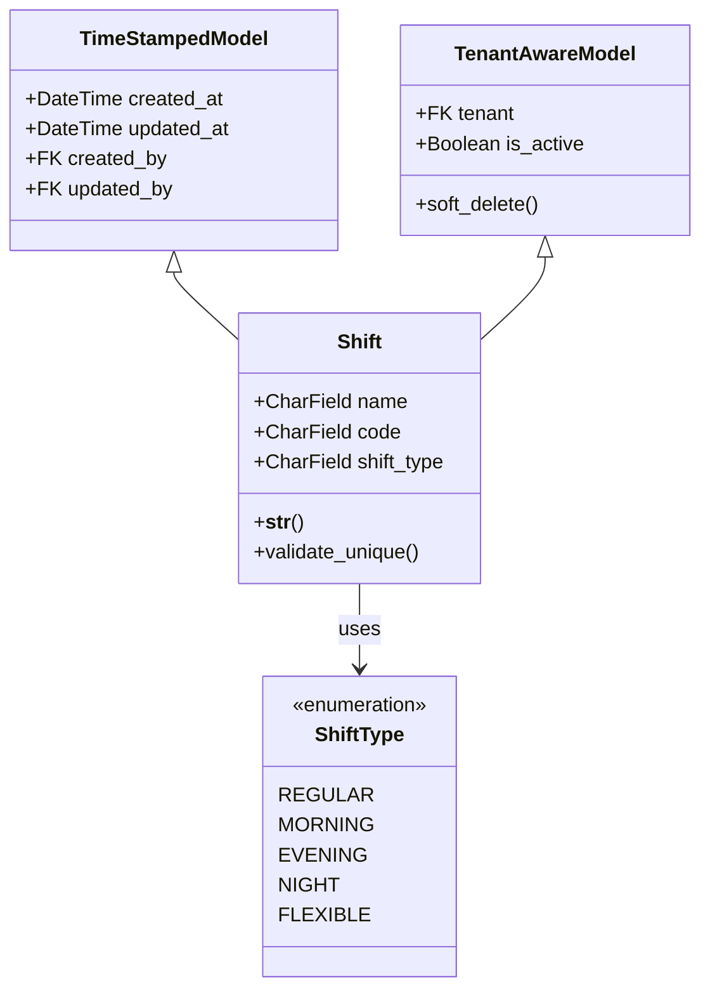

### Expected Outcome

**Deliverables:**
- ✅ Shift model created in `models/shift.py`
- ✅ Inherits from TimeStampedModel and TenantAwareModel
- ✅ Three core fields implemented: name, code, shift_type
- ✅ Meta class configured with ordering and indexes
- ✅ Constraints ensure uniqueness per tenant
- ✅ String representation implemented
- ✅ Model imported in `models/__init__.py`

**Field Summary:**

| Field | Type | Length | Unique | Indexed | Default |
|-------|------|--------|--------|---------|---------|
| name | CharField | 100 | Yes* | Yes | - |
| code | CharField | 20 | Yes* | Yes | - |
| shift_type | CharField | 20 | No | Yes | REGULAR |

*Unique per tenant (tenant + field combination)

### Verification Checklist

- [ ] `shift.py` file created in models directory
- [ ] Model inherits from correct base classes
- [ ] `name` field: CharField, max_length=100, indexed
- [ ] `code` field: CharField, max_length=20, unique per tenant
- [ ] `shift_type` field: Uses ShiftType.choices
- [ ] Meta class defines db_table, ordering, indexes
- [ ] Unique constraints on tenant+code and tenant+name
- [ ] `__str__` method returns meaningful string
- [ ] Model imported in `models/__init__.py`
- [ ] No syntax errors, model is importable
- [ ] Ready for additional fields (next tasks)

---

## Task 05: Add Time Fields

### Overview

Add time-related fields to the Shift model that define the working hours: start_time, end_time, break_start, and break_end. These fields establish when the shift begins, ends, and when breaks occur.

### Dependencies

**Before Starting:**
- ✅ Task 04 completed (Shift model core fields created)
- ✅ Understanding of Django TimeField
- ✅ Knowledge of time handling in Python

**Considerations:**
- Time vs DateTime fields
- Timezone handling
- Validation logic for time ranges

### Instructions

#### Step 1: Understand Time Field Requirements

**Time vs DateTime:**

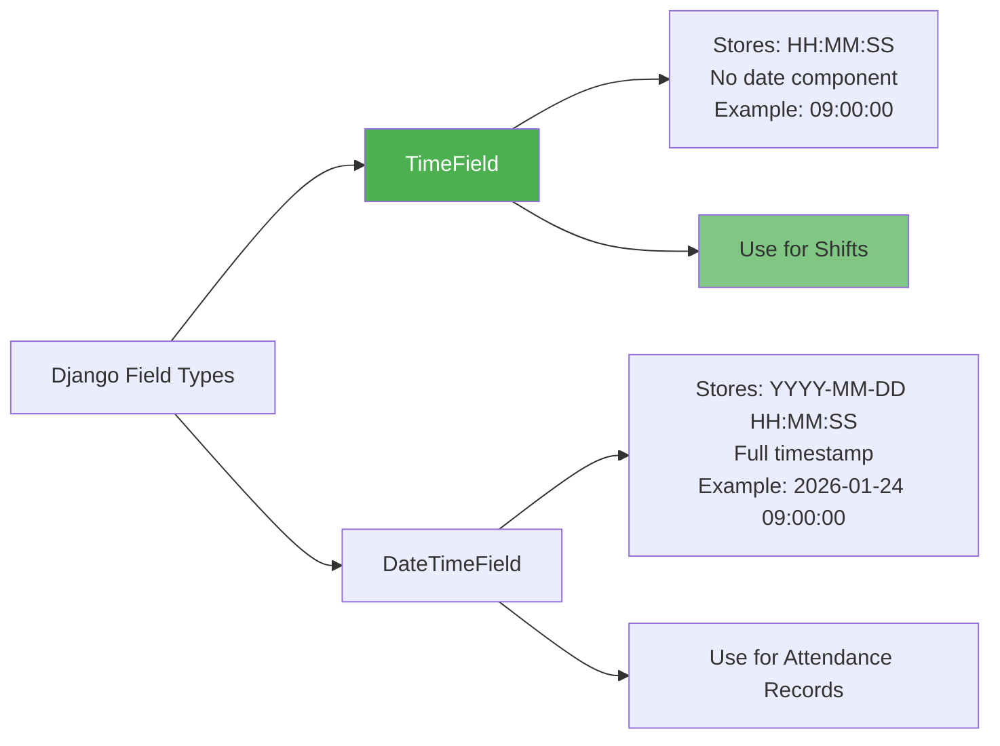

**Why TimeField for Shifts:**
- Shifts repeat daily (pattern, not specific occurrence)
- Don't need date component for template
- Can apply to any date (Monday through Sunday)
- Simpler comparisons and calculations

**Why DateTimeField for Attendance:**
- Records specific check-in/out moments
- Need full timestamp for audit
- Timezone-aware for global operations

#### Step 2: Plan Time Field Structure

**Four Time Fields:**

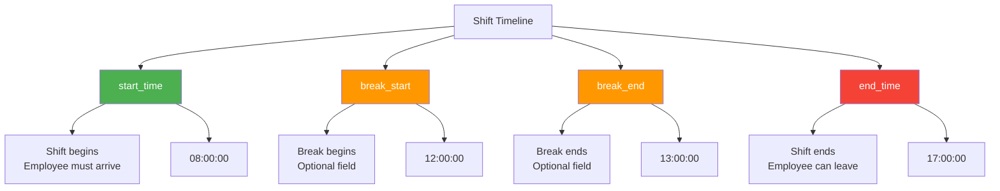

**Time Flow Example:**
```
08:00  ─────────> 12:00  ────────> 13:00  ─────────> 17:00
START            BREAK             RESUME            END
│                START             │                 │
│                                  │                 │
├─── WORKING ────┤   BREAK   ├─────── WORKING ──────┤

Total Shift: 9 hours (8am-5pm)
Break Duration: 1 hour (12pm-1pm)
Working Hours: 8 hours (9-1=8)
```

#### Step 3: Implement start_time Field

**Field: start_time**

**Purpose:** When the shift begins

**Specifications:**
- **Type:** TimeField
- **Required:** Yes (null=False, blank=False)
- **Indexed:** Yes (for schedule queries)
- **Help Text:** "Time when shift starts (HH:MM format)"

**Business Rules:**
- Must be before end_time
- Common values: 06:00, 08:00, 14:00, 22:00
- Used for:
  - Late arrival calculations
  - Scheduling conflicts detection
  - Shift assignment validation

**Validation Considerations:**
- Cannot be equal to end_time
- Should be reasonable (not 03:45:37)
- Round to nearest 15 minutes for consistency

**Query Examples:**
```
Morning shifts: filter(start_time__lt=time(9, 0))
Night shifts: filter(start_time__gte=time(22, 0))
Current shifts: filter(start_time__lte=now_time, end_time__gt=now_time)
```

#### Step 4: Implement end_time Field

**Field: end_time**

**Purpose:** When the shift ends

**Specifications:**
- **Type:** TimeField
- **Required:** Yes (null=False, blank=False)
- **Indexed:** Yes
- **Help Text:** "Time when shift ends (HH:MM format)"

**Business Rules:**
- Must be after start_time (can be next day)
- Used for:
  - Early leave detection
  - Overtime calculation trigger
  - Total hours computation

**Midnight Crossing Consideration:**

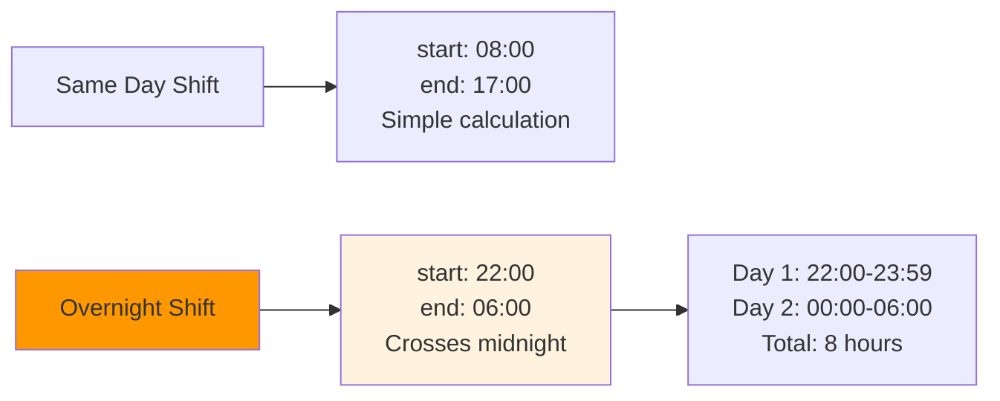

**Handling Midnight Crossing:**
```
If end_time < start_time:
    # Shift crosses midnight
    duration = (24:00 - start_time) + end_time
else:
    # Same day shift
    duration = end_time - start_time
```

#### Step 5: Implement break_start Field

**Field: break_start**

**Purpose:** When break period begins

**Specifications:**
- **Type:** TimeField
- **Required:** No (null=True, blank=True)
- **Indexed:** No (less frequent queries)
- **Help Text:** "Time when break starts (optional)"

**Business Rules:**
- Must be after start_time
- Must be before end_time
- Must be before break_end (if break_end exists)
- Optional: Some shifts have no breaks

**Use Cases:**
1. **Paid Breaks:** Include in work hours, track for compliance
2. **Unpaid Breaks:** Deduct from work hours
3. **Flexible Breaks:** Employee chooses within window

**Break Policies:**
```
Short Shift (< 6 hours): No break required
Medium Shift (6-8 hours): 30-minute break
Long Shift (> 8 hours): 1-hour break
Very Long Shift (> 12 hours): Multiple breaks
```

#### Step 6: Implement break_end Field

**Field: break_end**

**Purpose:** When break period ends

**Specifications:**
- **Type:** TimeField
- **Required:** No (null=True, blank=True)
- **Indexed:** No
- **Help Text:** "Time when break ends (optional)"

**Business Rules:**
- Required if break_start is set
- Must be after break_start
- Must be before end_time
- Maximum break duration: 2 hours (configurable)

**Break Duration Calculation:**
```
if break_start and break_end:
    break_duration = break_end - break_start
    
    # Validation
    if break_duration > timedelta(hours=2):
        raise ValidationError("Break cannot exceed 2 hours")
    
    if break_duration < timedelta(minutes=15):
        raise ValidationError("Break must be at least 15 minutes")
```

#### Step 7: Add Field-Level Validation

**Validation Requirements:**

1. **Time Order Validation:**
   ```
   start_time < break_start < break_end < end_time
   (when breaks are defined)
   ```

2. **Break Consistency:**
   ```
   If break_start is set, break_end must be set
   If break_end is set, break_start must be set
   Both or neither
   ```

3. **Reasonable Ranges:**
   ```
   Minimum shift: 1 hour
   Maximum shift: 24 hours
   Minimum break: 15 minutes
   Maximum break: 2 hours
   ```

**Implementation Location:**
- Model's `clean()` method (model-level validation)
- Custom field validators (field-level validation)
- Serializer validation (API-level validation)

### Time Fields Architecture

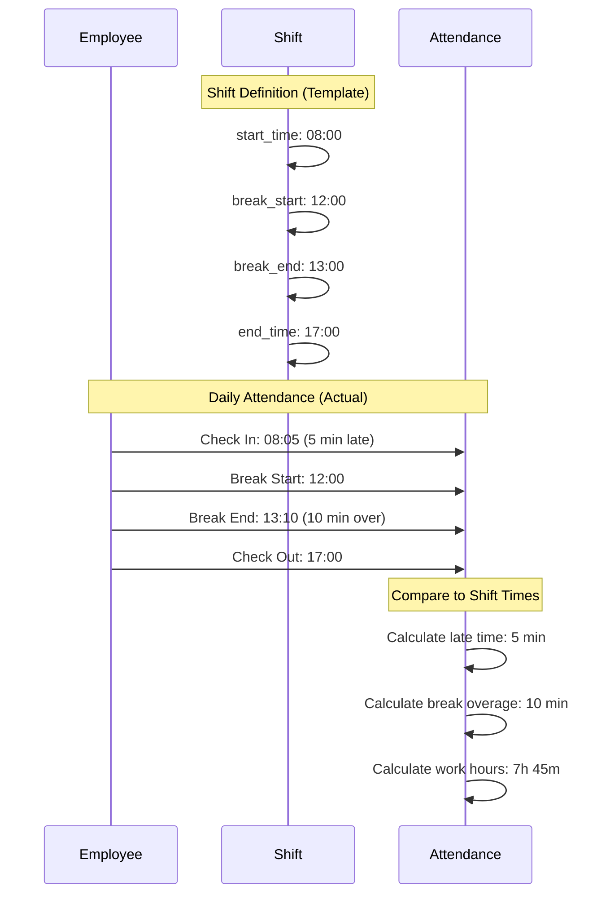

### Expected Outcome

**Deliverables:**
- ✅ Four time fields added to Shift model
- ✅ start_time: Required, indexed
- ✅ end_time: Required, indexed
- ✅ break_start: Optional, nullable
- ✅ break_end: Optional, nullable
- ✅ Help text added to all fields
- ✅ Field-level validation logic planned

**Updated Model Structure:**

| Field | Type | Required | Indexed | Purpose |
|-------|------|----------|---------|---------|
| start_time | TimeField | Yes | Yes | Shift start |
| end_time | TimeField | Yes | Yes | Shift end |
| break_start | TimeField | No | No | Break begins |
| break_end | TimeField | No | No | Break ends |

### Verification Checklist

- [ ] `start_time` field added: TimeField, required
- [ ] `end_time` field added: TimeField, required
- [ ] `break_start` field added: TimeField, nullable
- [ ] `break_end` field added: TimeField, nullable
- [ ] Help text provided for each field
- [ ] Indexes added to start_time and end_time
- [ ] Validation logic documented
- [ ] Midnight crossing scenario considered
- [ ] Break consistency rules documented
- [ ] Ready to add calculated duration fields

---

## Task 06: Add Duration Fields (Calculated)

### Overview

Add calculated duration fields to the Shift model that automatically compute work hours and break duration based on the time fields. These fields improve query performance and simplify reporting.

### Dependencies

**Before Starting:**
- ✅ Task 05 completed (Time fields implemented)
- ✅ Understanding of Django DurationField
- ✅ Knowledge of property vs stored field tradeoffs

**Python Requirements:**
- datetime.timedelta for duration calculations
- Time arithmetic and comparisons

### Instructions

#### Step 1: Understand Duration Storage Options

**Option A: Calculated Properties (Not Stored)**

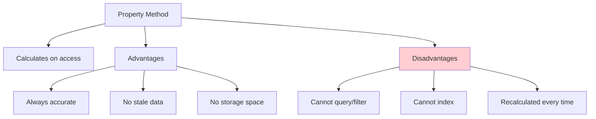

**Option B: Stored DurationField (Recommended)**

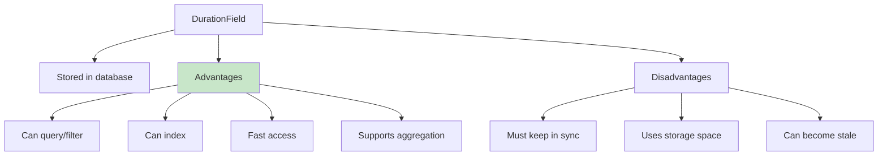

**Best Practice: Hybrid Approach**
- Store in DurationField for queries
- Update via property setter or save() override
- Validate consistency on save

#### Step 2: Implement work_hours Field

**Field: work_hours**

**Purpose:** Total working hours excluding breaks

**Specifications:**
- **Type:** DurationField
- **Required:** No (null=True, auto-calculated)
- **Indexed:** Yes (for reporting queries)
- **Editable:** No (calculated, not user-entered)
- **Help Text:** "Total work hours (auto-calculated)"

**Calculation Logic:**

```
Step 1: Calculate total shift duration
total = end_time - start_time

Step 2: Handle midnight crossing
if end_time < start_time:
    total = (time(23,59,59) - start_time) + (end_time - time(0,0,0))

Step 3: Subtract break duration
if break_start and break_end:
    break_duration = break_end - break_start
    work_hours = total - break_duration
else:
    work_hours = total
```

**Example Calculations:**

| Shift Type | Start | End | Break Start | Break End | Total | Break | Work Hours |
|------------|-------|-----|-------------|-----------|-------|-------|------------|
| Regular | 08:00 | 17:00 | 12:00 | 13:00 | 9h | 1h | 8h |
| Morning | 06:00 | 14:00 | 10:00 | 10:30 | 8h | 0.5h | 7.5h |
| Night | 22:00 | 06:00 | 02:00 | 02:30 | 8h | 0.5h | 7.5h |
| No Break | 09:00 | 13:00 | - | - | 4h | 0h | 4h |

**Query Use Cases:**
```
Total work hours this week:
    Shift.objects.aggregate(Sum('work_hours'))

Shifts with 8+ hours:
    Shift.objects.filter(work_hours__gte=timedelta(hours=8))

Average work hours:
    Shift.objects.aggregate(Avg('work_hours'))
```

#### Step 3: Implement break_duration Field

**Field: break_duration**

**Purpose:** Length of break period

**Specifications:**
- **Type:** DurationField
- **Required:** No (null=True, auto-calculated)
- **Indexed:** No (less common in queries)
- **Editable:** No (calculated)
- **Help Text:** "Break duration (auto-calculated)"

**Calculation Logic:**

```
if break_start and break_end:
    break_duration = break_end - break_start
    
    # Validation
    if break_duration < timedelta(minutes=0):
        raise ValueError("Break end must be after break start")
        
    if break_duration > timedelta(hours=2):
        raise ValueError("Break cannot exceed 2 hours")
else:
    break_duration = timedelta(0)  # No break
```

**Business Rules:**

1. **Minimum Break:**
   ```
   If shift > 6 hours: break >= 30 minutes (legal requirement)
   If shift > 8 hours: break >= 1 hour (company policy)
   ```

2. **Maximum Break:**
   ```
   Standard: 1 hour maximum
   Extended (with approval): 2 hours maximum
   ```

3. **Paid vs Unpaid:**
   ```
   break_duration <= 15 minutes: Paid
   break_duration > 15 minutes: Unpaid (deduct from work_hours)
   ```

**Example Scenarios:**

| Scenario | Break Start | Break End | Duration | Paid? | Notes |
|----------|-------------|-----------|----------|-------|-------|
| Lunch | 12:00 | 13:00 | 1h | No | Standard unpaid lunch |
| Coffee | 10:00 | 10:15 | 15m | Yes | Short paid break |
| None | - | - | 0h | N/A | No break in shift |
| Extended | 12:00 | 14:00 | 2h | No | Maximum allowed |

#### Step 4: Implement Calculation Method

**Method: calculate_durations()**

Create a method to compute all durations:

**Method Responsibilities:**
1. Calculate total shift duration
2. Handle midnight crossing
3. Calculate break duration
4. Compute work hours
5. Validate results
6. Update fields

**Calculation Flow:**

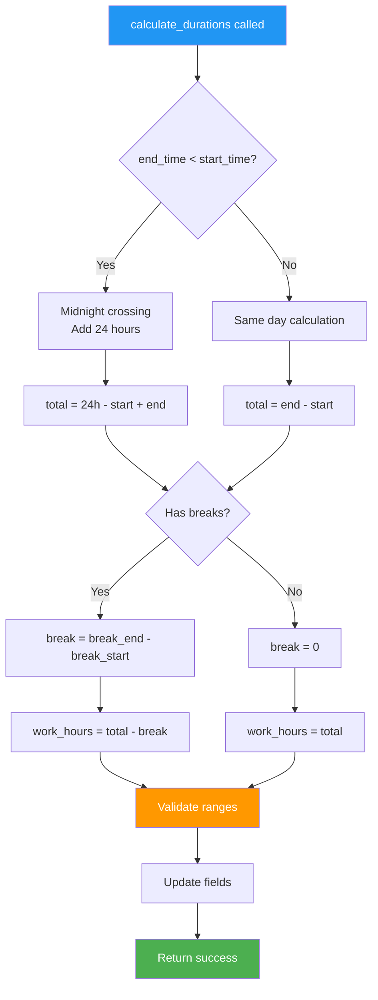

**Error Handling:**
```
Try-Except patterns:
- Catch ValueError for invalid time arithmetic
- Catch TypeError for None values
- Return default (timedelta(0)) on error
- Log calculation errors for debugging
```

#### Step 5: Hook into Save Method

**Override save() to auto-calculate:**

**Save Method Pattern:**

```
def save(self, *args, **kwargs):
    # Step 1: Calculate durations before saving
    self.calculate_durations()
    
    # Step 2: Run model validation
    self.full_clean()
    
    # Step 3: Call parent save
    super().save(*args, **kwargs)
```

**When Calculations Occur:**
- New shift created → Calculate on first save
- Time fields updated → Recalculate on save
- Admin form submission → Calculate before commit
- API update → Calculate via serializer

**Performance Consideration:**
```
For bulk operations:
    # Skip calculation for bulk_create
    Shift.objects.bulk_create([...], batch_size=100)
    
    # Then update in bulk
    for shift in Shift.objects.all():
        shift.calculate_durations()
        shift.save(update_fields=['work_hours', 'break_duration'])
```

#### Step 6: Add Property Fallbacks

**Provide property access for safety:**

**Property Pattern:**

```
@property
def calculated_work_hours(self):
    """
    Calculate work hours on-the-fly if stored value is None
    Provides fallback if database field not calculated
    """
    if self.work_hours is not None:
        return self.work_hours
    
    # Fallback calculation
    return self._calculate_work_hours_from_times()
```

**Benefits:**
- Always returns a value (never None)
- Handles edge cases in data migration
- Useful during development/testing
- Provides consistency guarantee

#### Step 7: Create Validation Rules

**Duration Validation:**

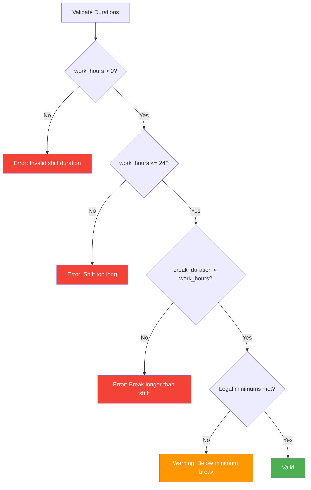

**Validation Checklist:**
- [ ] work_hours between 1 and 24 hours
- [ ] break_duration between 0 and 2 hours
- [ ] break_duration < work_hours
- [ ] If shift > 6h, break >= 30 min
- [ ] work_hours + break_duration = total shift time

### Duration Calculation Architecture

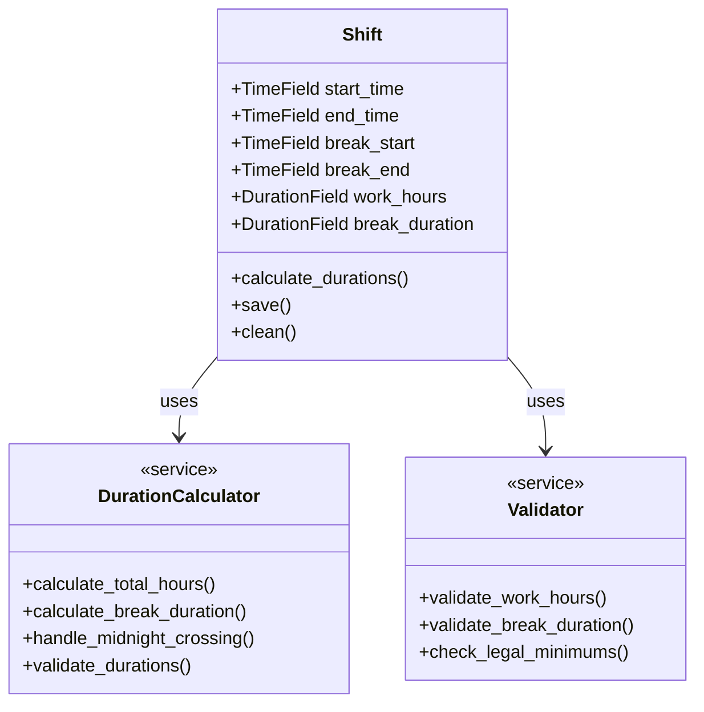

### Expected Outcome

**Deliverables:**
- ✅ `work_hours` DurationField added
- ✅ `break_duration` DurationField added
- ✅ `calculate_durations()` method implemented
- ✅ `save()` method overridden to auto-calculate
- ✅ Property fallbacks for safety
- ✅ Validation rules implemented
- ✅ Midnight crossing handled correctly

**Calculation Examples:**

```
Example 1: Standard Day Shift
    start_time: 08:00
    end_time: 17:00
    break_start: 12:00
    break_end: 13:00
    → work_hours: 8:00:00 (8 hours)
    → break_duration: 1:00:00 (1 hour)

Example 2: Night Shift (Crosses Midnight)
    start_time: 22:00
    end_time: 06:00
    break_start: 02:00
    break_end: 02:30
    → work_hours: 7:30:00 (7.5 hours)
    → break_duration: 0:30:00 (30 minutes)

Example 3: Short Shift (No Break)
    start_time: 14:00
    end_time: 18:00
    break_start: None
    break_end: None
    → work_hours: 4:00:00 (4 hours)
    → break_duration: 0:00:00 (0 hours)
```

### Verification Checklist

- [ ] `work_hours` DurationField added to model
- [ ] `break_duration` DurationField added to model
- [ ] Both fields are nullable and editable=False
- [ ] `work_hours` is indexed for queries
- [ ] `calculate_durations()` method implemented
- [ ] Handles midnight crossing correctly
- [ ] `save()` method calls calculate_durations()
- [ ] Validation prevents impossible durations
- [ ] Property fallbacks implemented
- [ ] Tested with various time combinations
- [ ] Ready for grace period fields

---

## Task 07: Add Grace Period Fields

### Overview

Add grace period fields that define acceptable lateness tolerance and early leave allowances. These fields allow flexibility in attendance tracking while maintaining policy compliance.

### Dependencies

**Before Starting:**
- ✅ Task 06 completed (Duration fields implemented)
- ✅ Understanding of attendance policy flexibility
- ✅ Knowledge of PositiveIntegerField usage

**Business Context:**
- Different shifts may have different tolerances
- Grace periods prevent minor lateness from triggering penalties
- Balance flexibility with accountability

### Instructions

#### Step 1: Understand Grace Period Concept

**Grace Period Purpose:**

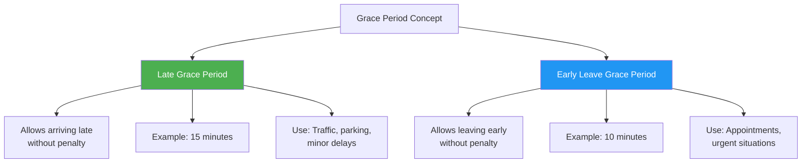

**Real-World Scenarios:**

**Scenario 1: Within Grace Period**
```
Shift Start: 08:00
Late Grace: 15 minutes
Employee Arrives: 08:12

Result: ✓ On time (within grace)
Status: No penalty
```

**Scenario 2: Beyond Grace Period**
```
Shift Start: 08:00
Late Grace: 15 minutes
Employee Arrives: 08:20

Result: ✗ Late (8 minutes over grace)
Status: Marked late, potential penalty
```

#### Step 2: Implement late_grace_minutes Field

**Field: late_grace_minutes**

**Purpose:** Allow arriving late without penalty

**Specifications:**
- **Type:** PositiveIntegerField
- **Default:** 15 (minutes)
- **Range:** 0-60 minutes (validation)
- **Required:** Yes (has default)
- **Help Text:** "Minutes employee can arrive late without penalty"

**Business Rules:**

| Shift Type | Typical Grace | Rationale |
|-----------|---------------|-----------|
| REGULAR | 15 minutes | Standard office flexibility |
| MORNING | 10 minutes | Production dependency |
| EVENING | 15 minutes | Standard flexibility |
| NIGHT | 20 minutes | Travel difficulty at night |
| FLEXIBLE | 30 minutes | Remote/flexible nature |

**Grace Period Zones:**

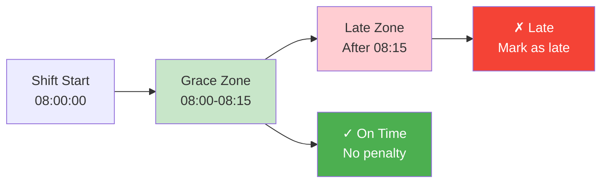

**Calculation Logic:**

```
Effective Start Time = start_time + late_grace_minutes

Examples:
    start_time: 08:00
    late_grace_minutes: 15
    effective_start: 08:15
    
    Employee check-in: 08:12 → On time (before 08:15)
    Employee check-in: 08:17 → Late (after 08:15)
```

**Policy Variations:**

1. **Strict Shifts:** `late_grace_minutes = 0`
   - No grace period
   - Used for critical operations
   - Example: Security, healthcare

2. **Standard Shifts:** `late_grace_minutes = 15`
   - Typical office setting
   - Balanced flexibility

3. **Flexible Shifts:** `late_grace_minutes = 30`
   - Remote work
   - Flexible schedules
   - Focus on results over presence

#### Step 3: Implement early_leave_grace_minutes Field

**Field: early_leave_grace_minutes**

**Purpose:** Allow leaving early without penalty

**Specifications:**
- **Type:** PositiveIntegerField
- **Default:** 10 (minutes)
- **Range:** 0-60 minutes (validation)
- **Required:** Yes (has default)
- **Help Text:** "Minutes employee can leave early without penalty"

**Business Rules:**

| Shift Type | Typical Grace | Rationale |
|-----------|---------------|-----------|
| REGULAR | 10 minutes | Standard flexibility |
| MORNING | 15 minutes | Allow early departure |
| EVENING | 10 minutes | Standard flexibility |
| NIGHT | 15 minutes | Shift handover buffer |
| FLEXIBLE | 30 minutes | Flexible nature |

**Grace Period Zones:**

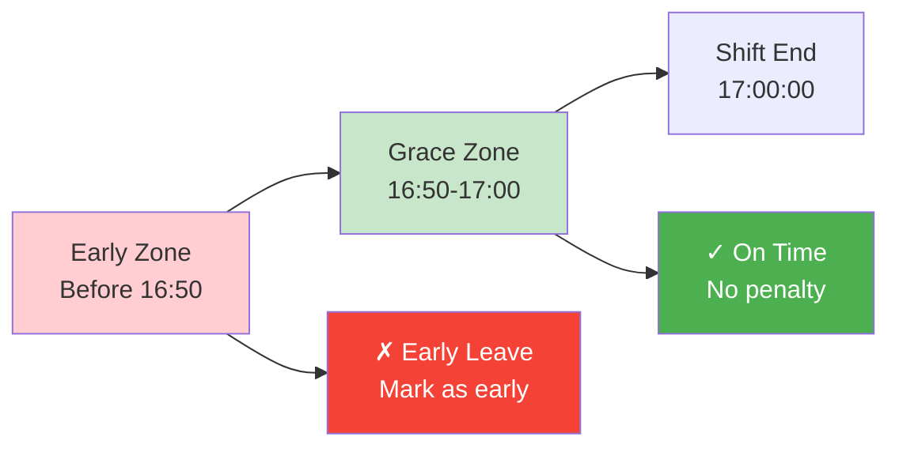

**Calculation Logic:**

```
Effective End Time = end_time - early_leave_grace_minutes

Examples:
    end_time: 17:00
    early_leave_grace_minutes: 10
    effective_end: 16:50
    
    Employee check-out: 16:55 → On time (after 16:50)
    Employee check-out: 16:45 → Early leave (before 16:50)
```

#### Step 4: Define Grace Period Defaults by Shift Type

**Method: get_default_grace_periods()**

Create a class method to suggest grace periods:

**Grace Period Matrix:**

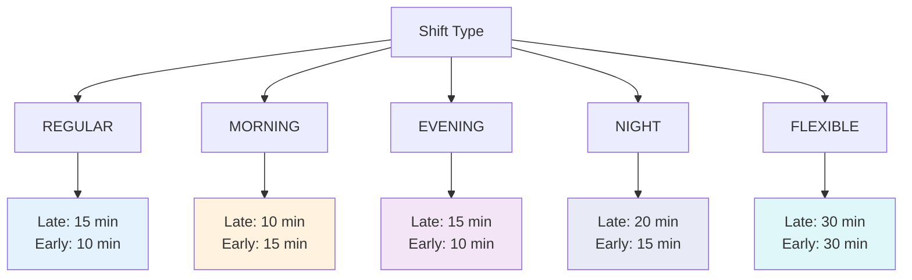

**Implementation Pattern:**

```
@classmethod
def get_default_grace_periods(cls, shift_type):
    """
    Return recommended grace periods for shift type
    
    Returns:
        tuple: (late_grace_minutes, early_leave_grace_minutes)
    """
    
    defaults = {
        ShiftType.REGULAR: (15, 10),
        ShiftType.MORNING: (10, 15),
        ShiftType.EVENING: (15, 10),
        ShiftType.NIGHT: (20, 15),
        ShiftType.FLEXIBLE: (30, 30),
    }
    
    return defaults.get(shift_type, (15, 10))
```

**Usage in Admin/API:**
```
When creating new shift:
    1. User selects shift_type
    2. System suggests grace periods
    3. Admin can accept or override
    4. Values stored with shift
```

#### Step 5: Implement Grace Period Validation

**Validation Rules:**

```mermaid
graph TD
    A[Validate Grace Periods]
    
    A --> B{late_grace >= 0?}
    B -->|No| E1[Error: Cannot be negative]
    B -->|Yes| C{late_grace <= 60?}
    C -->|No| E2[Error: Too long max 60]
    C -->|Yes| D{early_leave >= 0?}
    D -->|No| E3[Error: Cannot be negative]
    D -->|Yes| F{early_leave <= 60?}
    F -->|No| E4[Error: Too long max 60]
    F -->|Yes| G{Combined <= work_hours?}
    G -->|No| E5[Warning: Excessive flexibility]
    G -->|Yes| H[Valid]
    
    style H fill:#4caf50,color:#fff
    style E1 fill:#f44336,color:#fff
    style E2 fill:#f44336,color:#fff
    style E3 fill:#f44336,color:#fff
    style E4 fill:#f44336,color:#fff
    style E5 fill:#ff9800,color:#fff
```

**Validation Implementation:**

**Field-Level Validators:**
```
validators = [
    MinValueValidator(0, "Grace period cannot be negative"),
    MaxValueValidator(60, "Grace period cannot exceed 60 minutes")
]
```

**Model-Level Validation:**
```
def clean(self):
    # Check if grace periods are reasonable
    total_grace = self.late_grace_minutes + self.early_leave_grace_minutes
    
    # Convert work_hours to minutes
    work_minutes = self.work_hours.total_seconds() / 60
    
    # Grace should not exceed 25% of shift
    if total_grace > work_minutes * 0.25:
        raise ValidationError(
            "Total grace period exceeds 25% of shift duration"
        )
```

#### Step 6: Create Helper Methods

**Method: is_within_late_grace(check_in_time)**

Determine if check-in is within grace period:

**Method Logic:**
```
def is_within_late_grace(self, check_in_time):
    """
    Check if check-in time is within late grace period
    
    Args:
        check_in_time: Time employee checked in
        
    Returns:
        bool: True if within grace, False if late
    """
    
    # Calculate effective start time
    grace_delta = timedelta(minutes=self.late_grace_minutes)
    effective_start = (
        datetime.combine(date.today(), self.start_time) + grace_delta
    ).time()
    
    return check_in_time <= effective_start
```

**Method: is_within_early_leave_grace(check_out_time)**

Determine if check-out is within grace period:

**Usage Examples:**
```
Use Case 1: Validate Attendance Record
    attendance = AttendanceRecord.objects.get(id=123)
    shift = attendance.shift
    
    if shift.is_within_late_grace(attendance.check_in):
        attendance.status = 'ON_TIME'
    else:
        attendance.status = 'LATE'

Use Case 2: Real-time Alerts
    if not shift.is_within_late_grace(current_time):
        send_late_notification(employee)
```

### Grace Period Application Flow

```mermaid
sequenceDiagram
    participant E as Employee
    participant A as Attendance System
    participant S as Shift
    participant P as Policy Engine
    
    E->>A: Check In at 08:12
    A->>S: Get shift details
    S-->>A: start_time=08:00, late_grace=15
    
    A->>A: Calculate: 08:12 < 08:15?
    A->>A: Result: Yes (within grace)
    
    A->>P: Is penalty required?
    P-->>A: No (within grace period)
    
    A->>E: Status: On Time ✓
    
    Note over E,P: Grace Period Saved Employee from Late Mark
```

### Expected Outcome

**Deliverables:**
- ✅ `late_grace_minutes` field added (default: 15)
- ✅ `early_leave_grace_minutes` field added (default: 10)
- ✅ Field validation (0-60 range)
- ✅ Default values by shift type
- ✅ Helper methods for grace checking
- ✅ Model-level validation implemented

**Field Summary:**

| Field | Type | Default | Range | Purpose |
|-------|------|---------|-------|---------|
| late_grace_minutes | PositiveIntegerField | 15 | 0-60 | Lateness tolerance |
| early_leave_grace_minutes | PositiveIntegerField | 10 | 0-60 | Early departure tolerance |

### Verification Checklist

- [ ] `late_grace_minutes` field added with default=15
- [ ] `early_leave_grace_minutes` field added with default=10
- [ ] Both fields use PositiveIntegerField
- [ ] MinValueValidator(0) and MaxValueValidator(60) applied
- [ ] Help text describes purpose clearly
- [ ] `get_default_grace_periods()` class method implemented
- [ ] `is_within_late_grace()` helper method created
- [ ] `is_within_early_leave_grace()` helper method created
- [ ] Model-level validation prevents excessive grace
- [ ] Grace periods vary appropriately by shift type
- [ ] Ready for overtime rules fields

---

## Task 08: Add Overtime Rules

### Overview

Add overtime calculation fields that define when overtime begins and the multiplier for overtime pay. These fields automate overtime detection and pay calculation.

### Dependencies

**Before Starting:**
- ✅ Task 06 completed (Duration fields implemented)
- ✅ Understanding of labor laws regarding overtime
- ✅ Knowledge of DecimalField for monetary calculations

**Business Context:**
- Overtime policies vary by jurisdiction
- Different multipliers for weekday/weekend/holiday
- Automatic vs manual overtime approval

### Instructions

#### Step 1: Understand Overtime Concepts

**Overtime Basics:**

```mermaid
graph TB
    A[Work Hours]
    
    A --> B[Regular Hours]
    A --> C[Overtime Hours]
    
    B --> B1[Within scheduled shift]
    B --> B2[Standard pay rate]
    B --> B3[Example: 0-8 hours]
    
    C --> C1[Beyond scheduled shift]
    C --> C2[Premium pay rate]
    C --> C3[Example: 8+ hours]
    
    C --> D[Overtime Types]
    D --> D1[Weekday OT: 1.5x]
    D --> D2[Weekend OT: 2.0x]
    D --> D3[Holiday OT: 2.5x]
    
    style B fill:#c8e6c9
    style C fill:#fff3e0
    style D1 fill:#ff9800,color:#fff
    style D2 fill:#ff5722,color:#fff
    style D3 fill:#f44336,color:#fff
```

**Common Overtime Scenarios:**

**Scenario 1: Daily Overtime**
```
Shift: 8 hours (08:00-17:00)
Worked: 10 hours
Overtime: 2 hours at 1.5x rate
Calculation: (8 × regular) + (2 × 1.5 × regular)
```

**Scenario 2: No Overtime (Within Grace)**
```
Shift: 8 hours
Worked: 8 hours 15 minutes
Overtime Start After: 30 minutes
Result: No overtime (15 min < 30 min threshold)
```

**Scenario 3: Weekend Overtime**
```
Shift: 8 hours on Saturday
Worked: 8 hours
Overtime: All 8 hours at 2.0x (weekend premium)
```

#### Step 2: Implement overtime_start_after Field

**Field: overtime_start_after**

**Purpose:** Minutes beyond shift end before overtime begins

**Specifications:**
- **Type:** PositiveIntegerField
- **Default:** 30 (minutes)
- **Range:** 0-120 minutes (validation)
- **Required:** Yes (has default)
- **Help Text:** "Minutes after shift end before overtime pay begins"

**Business Rationale:**

Prevents overtime for minor overages:

```mermaid
graph LR
    A[Shift End<br/>17:00]
    
    A --> B[Buffer Zone<br/>17:00-17:30]
    B --> C[Overtime Zone<br/>After 17:30]
    
    B --> B1["No Overtime<br/>Within threshold"]
    C --> C1["Overtime Applies<br/>1.5x pay"]
    
    style B fill:#fff3e0
    style C fill:#ffcdd2
    style B1 fill:#ff9800,color:#fff
    style C1 fill:#f44336,color:#fff
```

**Configuration by Context:**

| Context | Threshold | Rationale |
|---------|-----------|-----------|
| Factory/Production | 15 min | Shift changeover time |
| Office/Administrative | 30 min | Task completion buffer |
| Healthcare/Emergency | 0 min | Immediate overtime (critical) |
| Retail/Customer Service | 15 min | Customer service completion |
| Remote/Flexible | 60 min | Flexible schedule nature |

**Calculation Example:**

```
Shift End: 17:00
overtime_start_after: 30 minutes
Effective OT Start: 17:30

Employee works until:
  17:20 → No overtime (within 30-min buffer)
  17:35 → 5 minutes overtime (35-30=5)
  18:00 → 30 minutes overtime (60-30=30)
```

**Policy Variations:**

1. **Strict Overtime (Healthcare):**
   ```
   overtime_start_after: 0
   Any work beyond shift = immediate overtime
   ```

2. **Standard Buffer (Office):**
   ```
   overtime_start_after: 30
   Allows minor overages for task completion
   ```

3. **Flexible Buffer (Remote):**
   ```
   overtime_start_after: 60
   Significant flexibility for remote workers
   ```

#### Step 3: Implement overtime_multiplier Field

**Field: overtime_multiplier**

**Purpose:** Pay rate multiplier for overtime hours

**Specifications:**
- **Type:** DecimalField
- **Max Digits:** 4
- **Decimal Places:** 2
- **Default:** 1.50 (150% or "time-and-a-half")
- **Range:** 1.00-3.00 (validation)
- **Required:** Yes (has default)
- **Help Text:** "Overtime pay multiplier (e.g., 1.50 for time-and-a-half)"

**Common Multipliers:**

```mermaid
graph TB
    A[Overtime Multipliers]
    
    A --> B[Regular OT: 1.5x]
    A --> C[Weekend OT: 2.0x]
    A --> D[Holiday OT: 2.5x]
    A --> E[Special OT: 3.0x]
    
    B --> B1["Weekday overtime<br/>Standard 'time-and-a-half'"]
    C --> C1["Saturday/Sunday<br/>'Double time'"]
    D --> D1["Public holidays<br/>'Double-and-a-half'"]
    E --> E1["Emergency call-out<br/>'Triple time'"]
    
    style B fill:#4caf50,color:#fff
    style C fill:#ff9800,color:#fff
    style D fill:#ff5722,color:#fff
    style E fill:#f44336,color:#fff
```

**Legal Requirements by Region:**

| Region | Standard OT | Weekend OT | Holiday OT |
|--------|-------------|------------|------------|
| Sri Lanka | 1.5x | 2.0x | 2.0x |
| USA (Federal) | 1.5x | Varies | Varies |
| EU (Average) | 1.25x | 2.0x | 2.0x |
| Australia | 1.5x | 2.0x | 2.5x |

**Calculation Examples:**

**Example 1: Weekday Overtime**
```
Regular Rate: $20/hour
Overtime Multiplier: 1.50
Overtime Rate: $20 × 1.50 = $30/hour

Work Day:
  Regular Hours: 8h × $20 = $160
  Overtime Hours: 2h × $30 = $60
  Total: $220
```

**Example 2: Weekend Shift**
```
Regular Rate: $20/hour
Overtime Multiplier: 2.00 (weekend)
Overtime Rate: $20 × 2.00 = $40/hour

Saturday Work:
  All Hours: 8h × $40 = $320
```

#### Step 4: Add Overtime Calculation Method

**Method: calculate_overtime()**

Calculate overtime hours and pay:

**Method Signature:**
```
def calculate_overtime(self, actual_hours, work_date=None):
    """
    Calculate overtime hours and pay
    
    Args:
        actual_hours: timedelta of actual work time
        work_date: date to check for weekend/holiday
        
    Returns:
        dict: {
            'regular_hours': timedelta,
            'overtime_hours': timedelta,
            'overtime_multiplier': Decimal,
            'overtime_starts_at': time
        }
    """
```

**Calculation Flow:**

```mermaid
graph TD
    A[Start Overtime Calculation]
    
    A --> B[Get scheduled work_hours]
    A --> C[Get actual_hours worked]
    
    B --> D[Add overtime_start_after buffer]
    D --> E[overtime_threshold]
    
    C --> F{actual > threshold?}
    F -->|No| G[No overtime<br/>regular_hours = actual]
    F -->|Yes| H[Calculate overtime]
    
    H --> I[regular = threshold]
    H --> J[overtime = actual - threshold]
    
    J --> K{Is weekend/holiday?}
    K -->|Yes| L[Apply higher multiplier]
    K -->|No| M[Apply standard multiplier]
    
    L --> N[Return OT breakdown]
    M --> N
    
    style G fill:#c8e6c9
    style H fill:#fff3e0
    style N fill:#2196f3,color:#fff
```

**Implementation Considerations:**

1. **Buffer Application:**
   ```
   OT Threshold = work_hours + overtime_start_after
   Example: 8h + 30min = 8.5h
   ```

2. **Weekend Detection:**
   ```
   if work_date.weekday() in [5, 6]:  # Saturday=5, Sunday=6
       multiplier = 2.0  # Weekend rate
   ```

3. **Holiday Detection:**
   ```
   if work_date in company_holidays:
       multiplier = 2.5  # Holiday rate
   ```

#### Step 5: Create Validation Rules

**Validation Requirements:**

```mermaid
graph TD
    A[Validate Overtime Rules]
    
    A --> B{overtime_start_after >= 0?}
    B -->|No| E1[Error: Cannot be negative]
    B -->|Yes| C{overtime_start_after <= 120?}
    C -->|No| E2[Error: Max 120 minutes]
    C -->|Yes| D{overtime_multiplier >= 1.0?}
    D -->|No| E3[Error: Multiplier min 1.0]
    D -->|Yes| F{overtime_multiplier <= 3.0?}
    F -->|No| E4[Error: Multiplier max 3.0]
    F -->|Yes| G{Decimal places <= 2?}
    G -->|No| E5[Error: Max 2 decimal places]
    G -->|Yes| H[Valid]
    
    style H fill:#4caf50,color:#fff
    style E1 fill:#f44336,color:#fff
    style E2 fill:#f44336,color:#fff
    style E3 fill:#f44336,color:#fff
    style E4 fill:#f44336,color:#fff
    style E5 fill:#f44336,color:#fff
```

**Field Validators:**

```
overtime_start_after validators:
    - MinValueValidator(0)
    - MaxValueValidator(120)

overtime_multiplier validators:
    - MinValueValidator(Decimal('1.00'))
    - MaxValueValidator(Decimal('3.00'))
    - DecimalValidator(max_digits=4, decimal_places=2)
```

#### Step 6: Integration with Payroll

**Payroll Integration Points:**

```mermaid
sequenceDiagram
    participant AR as Attendance Record
    participant S as Shift
    participant OT as Overtime Calculator
    participant PR as Payroll System
    
    AR->>S: Get shift details
    S-->>AR: work_hours, OT rules
    
    AR->>OT: Calculate OT
    Note over OT: actual_hours: 10h<br/>work_hours: 8h<br/>OT buffer: 30min
    
    OT->>OT: threshold = 8h + 30min = 8.5h
    OT->>OT: regular = 8.5h<br/>overtime = 1.5h
    
    OT-->>PR: regular: 8.5h @ 1.0x<br/>overtime: 1.5h @ 1.5x
    
    PR->>PR: Calculate pay
    PR-->>AR: Total: $230
```

**Payroll Calculation Example:**

```
Inputs:
    - base_rate: $20/hour
    - scheduled_hours: 8h
    - actual_hours: 10h
    - overtime_start_after: 30min
    - overtime_multiplier: 1.5

Calculation:
    1. OT threshold = 8h + 0.5h = 8.5h
    2. Regular hours = 8.5h × $20 = $170
    3. OT hours = 1.5h × ($20 × 1.5) = $45
    4. Total = $170 + $45 = $215
```

### Expected Outcome

**Deliverables:**
- ✅ `overtime_start_after` field added (default: 30 minutes)
- ✅ `overtime_multiplier` field added (default: 1.50)
- ✅ Field validation (ranges and precision)
- ✅ `calculate_overtime()` method implemented
- ✅ Weekend/holiday logic support
- ✅ Payroll integration ready

**Field Summary:**

| Field | Type | Default | Range | Purpose |
|-------|------|---------|-------|---------|
| overtime_start_after | PositiveIntegerField | 30 | 0-120 | OT threshold buffer |
| overtime_multiplier | DecimalField(4,2) | 1.50 | 1.00-3.00 | OT pay rate |

### Verification Checklist

- [ ] `overtime_start_after` field added with default=30
- [ ] `overtime_multiplier` field added with default=1.50
- [ ] DecimalField configured: max_digits=4, decimal_places=2
- [ ] Validators prevent invalid ranges
- [ ] Help text explains purpose clearly
- [ ] `calculate_overtime()` method implemented
- [ ] Method handles buffer zone correctly
- [ ] Weekend/holiday detection supported
- [ ] Integration points documented
- [ ] Ready for half-day threshold fields

---

## Task 09: Add Half-Day Threshold Fields

### Overview

Add fields that define minimum hours required for half-day and full-day attendance. These thresholds determine attendance status for partial shifts, leave calculations, and payroll processing.

### Dependencies

**Before Starting:**
- ✅ Task 06 completed (Duration fields implemented)
- ✅ Understanding of attendance policies
- ✅ Knowledge of leave and payroll integration

**Business Context:**
- Half-day vs full-day impacts leave balance
- Partial attendance scenarios (late arrivals, early departures, medical appointments)
- Payroll deductions based on attendance

### Instructions

#### Step 1: Understand Half-Day Concepts

**Attendance Status Thresholds:**

```mermaid
graph TB
    A[Work Hours]
    
    A --> B[Absent]
    A --> C[Half Day]
    A --> D[Full Day]
    
    B --> B1["0 - min_half_day<br/>Example: 0-4 hours"]
    B --> B2["Status: Absent<br/>Leave: Full day"]
    
    C --> C1["min_half_day - min_full_day<br/>Example: 4-6 hours"]
    C --> C2["Status: Half Day<br/>Leave: 0.5 day"]
    
    D --> D1["min_full_day and above<br/>Example: 6+ hours"]
    D --> D2["Status: Present<br/>Leave: None"]
    
    style B fill:#ffcdd2
    style C fill:#fff3e0
    style D fill:#c8e6c9
```

**Real-World Scenarios:**

**Scenario 1: Medical Appointment (Morning)**
```
Scheduled: 8 hours (08:00-17:00)
Worked: 4.5 hours (12:30-17:00)

Evaluation:
    4.5 >= min_hours_for_half_day (4h) ✓
    4.5 < min_hours_for_full_day (6h) ✓
    
Result: Half-day present, apply 0.5 day leave
```

**Scenario 2: Sick Leave (Left Early)**
```
Scheduled: 8 hours (08:00-17:00)
Worked: 2.5 hours (08:00-10:30)

Evaluation:
    2.5 < min_hours_for_half_day (4h) ✗
    
Result: Absent, apply 1 full day leave
```

**Scenario 3: Regular Attendance**
```
Scheduled: 8 hours (08:00-17:00)
Worked: 7.5 hours (08:00-16:30 with 1h break)

Evaluation:
    7.5 >= min_hours_for_full_day (6h) ✓
    
Result: Full day present, no leave deduction
```

#### Step 2: Implement min_hours_for_half_day Field

**Field: min_hours_for_half_day**

**Purpose:** Minimum work duration to count as half-day attendance

**Specifications:**
- **Type:** DurationField
- **Default:** 4 hours (timedelta(hours=4))
- **Range:** 1-12 hours (validation)
- **Required:** Yes (has default)
- **Help Text:** "Minimum hours to mark as half-day present"

**Business Rules:**

| Shift Length | Half-Day Threshold | Rationale |
|--------------|-------------------|-----------|
| 4 hours | 2 hours | 50% of shift |
| 6 hours | 3 hours | 50% of shift |
| 8 hours | 4 hours | 50% of shift |
| 10 hours | 5 hours | 50% of shift |
| 12 hours | 6 hours | 50% of shift |

**Common Pattern: 50% Rule**
```
min_hours_for_half_day = work_hours / 2

Example for 8-hour shift:
    work_hours = 8h
    min_hours_for_half_day = 4h
```

**Threshold Calculation:**

```mermaid
graph LR
    A[Actual Hours<br/>Worked]
    
    A --> B{< min_half_day?}
    B -->|Yes| C[Absent<br/>Full leave]
    B -->|No| D{>= min_full_day?}
    D -->|Yes| E[Full Day<br/>No leave]
    D -->|No| F[Half Day<br/>0.5 leave]
    
    style C fill:#f44336,color:#fff
    style F fill:#ff9800,color:#fff
    style E fill:#4caf50,color:#fff
```

**Use Cases:**

1. **Leave Application:**
   ```
   Employee works 4.5 hours (between thresholds)
   System: Apply 0.5 day leave
   Leave balance: Deduct 0.5 day
   ```

2. **Payroll Calculation:**
   ```
   Employee works 3.5 hours (below half-day)
   System: Mark absent for day
   Payroll: Deduct full day pay
   ```

3. **Attendance Report:**
   ```
   Monthly summary:
       Full Days: 20
       Half Days: 3
       Absent: 2
   Total Days: 20 + (3 × 0.5) + 0 = 21.5 days present
   ```

#### Step 3: Implement min_hours_for_full_day Field

**Field: min_hours_for_full_day**

**Purpose:** Minimum work duration to count as full-day attendance

**Specifications:**
- **Type:** DurationField
- **Default:** 6 hours (timedelta(hours=6))
- **Range:** 2-24 hours (validation)
- **Required:** Yes (has default)
- **Help Text:** "Minimum hours to mark as full-day present"

**Business Rules:**

| Shift Length | Full-Day Threshold | Rationale |
|--------------|-------------------|-----------|
| 4 hours | 3.5 hours | 87.5% attendance |
| 6 hours | 5 hours | 83% attendance |
| 8 hours | 6 hours | 75% attendance |
| 10 hours | 8 hours | 80% attendance |
| 12 hours | 10 hours | 83% attendance |

**Common Pattern: 75% Rule**
```
min_hours_for_full_day = work_hours × 0.75

Example for 8-hour shift:
    work_hours = 8h
    min_hours_for_full_day = 6h (75%)
```

**Allows for Reasonable Absences:**
- Traffic delays
- Medical appointments
- Family emergencies
- Grace period extensions

**Threshold Ranges:**

```mermaid
graph TB
    A["8-Hour Shift Example"]
    
    A --> B["Zone 1: Absent<br/>0 - 3.99 hours"]
    A --> C["Zone 2: Half Day<br/>4 - 5.99 hours"]
    A --> D["Zone 3: Full Day<br/>6+ hours"]
    
    B --> B1["Status: Absent<br/>Leave: 1 day<br/>Pay: Deduct full"]
    C --> C1["Status: Half Present<br/>Leave: 0.5 day<br/>Pay: Deduct half"]
    D --> D1["Status: Present<br/>Leave: None<br/>Pay: Full"]
    
    style B fill:#ffcdd2
    style C fill:#fff3e0
    style D fill:#c8e6c9
    style B1 fill:#f44336,color:#fff
    style C1 fill:#ff9800,color:#fff
    style D1 fill:#4caf50,color:#fff
```

#### Step 4: Add Threshold Validation

**Validation Requirements:**

```mermaid
graph TD
    A[Validate Thresholds]
    
    A --> B{min_half_day > 0?}
    B -->|No| E1[Error: Must be positive]
    B -->|Yes| C{min_full_day > min_half_day?}
    C -->|No| E2[Error: Full must exceed half]
    C -->|Yes| D{min_full_day <= work_hours?}
    D -->|No| E3[Error: Cannot exceed shift]
    D -->|Yes| F{Reasonable ratios?}
    F -->|No| W1[Warning: Unusual thresholds]
    F -->|Yes| G[Valid]
    
    style G fill:#4caf50,color:#fff
    style E1 fill:#f44336,color:#fff
    style E2 fill:#f44336,color:#fff
    style E3 fill:#f44336,color:#fff
    style W1 fill:#ff9800,color:#fff
```

**Validation Rules:**

1. **Positive Values:**
   ```
   min_hours_for_half_day > timedelta(0)
   min_hours_for_full_day > timedelta(0)
   ```

2. **Logical Order:**
   ```
   0 < min_hours_for_half_day < min_hours_for_full_day <= work_hours
   
   Invalid Examples:
       half_day=6h, full_day=4h  # Full < Half ✗
       half_day=9h, work_hours=8h  # Half > Total ✗
   ```

3. **Reasonable Ranges:**
   ```
   # Half-day should be 40-60% of shift
   0.4 × work_hours <= min_half_day <= 0.6 × work_hours
   
   # Full-day should be 70-90% of shift
   0.7 × work_hours <= min_full_day <= 0.9 × work_hours
   ```

#### Step 5: Implement Status Determination Method

**Method: determine_attendance_status()**

Calculate status based on worked hours:

**Method Logic:**

```
def determine_attendance_status(self, actual_hours):
    """
    Determine attendance status based on hours worked
    
    Args:
        actual_hours: timedelta of actual work time
        
    Returns:
        tuple: (status, leave_days)
            status: 'ABSENT', 'HALF_DAY', or 'FULL_DAY'
            leave_days: Decimal('0'), Decimal('0.5'), or Decimal('1')
    """
    
    if actual_hours < self.min_hours_for_half_day:
        return ('ABSENT', Decimal('1.0'))
    
    elif actual_hours < self.min_hours_for_full_day:
        return ('HALF_DAY', Decimal('0.5'))
    
    else:
        return ('FULL_DAY', Decimal('0'))
```

**Usage Example:**

```
shift = Shift.objects.get(code='REG_DAY_01')
actual = timedelta(hours=5, minutes=30)

status, leave = shift.determine_attendance_status(actual)
# Result: ('HALF_DAY', Decimal('0.5'))

# Apply to attendance record
attendance.status = status
attendance.leave_days_consumed = leave
attendance.save()
```

#### Step 6: Integration with Leave System

**Leave Deduction Flow:**

```mermaid
sequenceDiagram
    participant E as Employee
    participant AR as Attendance Record
    participant S as Shift
    participant LS as Leave System
    
    E->>AR: Check out at 14:30
    AR->>AR: Calculate: worked 5.5h
    
    AR->>S: determine_attendance_status(5.5h)
    S->>S: 5.5h >= 4h (half_day) ✓
    S->>S: 5.5h < 6h (full_day) ✗
    S-->>AR: ('HALF_DAY', 0.5)
    
    AR->>LS: Request leave deduction
    LS->>LS: Deduct 0.5 day from balance
    LS-->>AR: Confirmed
    
    AR->>E: Status: Half-Day Present<br/>Leave: 0.5 day applied
```

**Leave Balance Impact:**

```
Initial Balance: 20 days

Day 1: Full day (8h worked)
    Status: FULL_DAY
    Deduction: 0 days
    Balance: 20 days

Day 2: Half day (4.5h worked)
    Status: HALF_DAY
    Deduction: 0.5 days
    Balance: 19.5 days

Day 3: Absent (2h worked)
    Status: ABSENT
    Deduction: 1 day
    Balance: 18.5 days
```

### Expected Outcome

**Deliverables:**
- ✅ `min_hours_for_half_day` field added (default: 4 hours)
- ✅ `min_hours_for_full_day` field added (default: 6 hours)
- ✅ Field validation (ranges and logical order)
- ✅ `determine_attendance_status()` method implemented
- ✅ Leave system integration documented
- ✅ Threshold calculation logic implemented

**Field Summary:**

| Field | Type | Default | Purpose |
|-------|------|---------|---------|
| min_hours_for_half_day | DurationField | 4:00:00 | Half-day threshold |
| min_hours_for_full_day | DurationField | 6:00:00 | Full-day threshold |

**Attendance Status Matrix:**

| Hours Worked | Status | Leave Applied | Pay |
|--------------|--------|---------------|-----|
| 0 - 3.99h | ABSENT | 1.0 day | None or minimal |
| 4 - 5.99h | HALF_DAY | 0.5 day | 50% or proportional |
| 6+ hours | FULL_DAY | 0 day | Full |

### Verification Checklist

- [ ] `min_hours_for_half_day` field added: DurationField
- [ ] `min_hours_for_full_day` field added: DurationField
- [ ] Default values: 4 hours and 6 hours respectively
- [ ] Help text describes purpose clearly
- [ ] Validation ensures: half < full <= work_hours
- [ ] `determine_attendance_status()` method implemented
- [ ] Method returns correct tuple: (status, leave_days)
- [ ] Three status levels handled: ABSENT, HALF_DAY, FULL_DAY
- [ ] Leave deduction values correct: 1.0, 0.5, 0
- [ ] Integration points documented
- [ ] Ready for migrations

---

## Task 10: Generate and Run Migrations

### Overview

Generate Django migrations for the Shift model and apply them to create the database tables. This finalizes the model implementation and makes it ready for use.

### Dependencies

**Before Starting:**
- ✅ All previous tasks completed (Tasks 01-09)
- ✅ Shift model fully implemented
- ✅ App registered in TENANT_APPS
- ✅ Database configured and accessible

**Prerequisites:**
- Django project running
- Database connection working
- Virtual environment activated

### Instructions

#### Step 1: Pre-Migration Verification

**Verify Model Completeness:**

```mermaid
graph TB
    A[Pre-Migration Checklist]
    
    A --> B[Import Check]
    A --> C[Syntax Check]
    A --> D[Field Validation]
    A --> E[Meta Configuration]
    
    B --> B1[All imports resolved]
    B --> B2[No circular dependencies]
    
    C --> C1[No syntax errors]
    C --> C2[Model is importable]
    
    D --> D1[All fields defined]
    D --> D2[Validators attached]
    D --> D3[Choices configured]
    
    E --> E1[db_table set]
    E --> E2[Constraints defined]
    E --> E3[Indexes specified]
    
    style A fill:#2196f3,color:#fff
```

**Verification Commands:**

**Check Model Import:**
```
python manage.py shell
>>> from apps.tenant_apps.attendance.models import Shift
>>> Shift._meta.get_fields()
# Should list all fields without errors
```

**Check Settings:**
```
python manage.py shell
>>> from django.conf import settings
>>> 'apps.tenant_apps.attendance' in settings.TENANT_APPS
# Should return: True
```

**Check for Errors:**
```
python manage.py check
# Should report: System check identified no issues
```

#### Step 2: Understand Multi-Tenant Migrations

**Django-Tenants Migration Behavior:**

```mermaid
graph TB
    A[Migration Command]
    
    A --> B[Public Schema]
    A --> C[Tenant Schema 1]
    A --> D[Tenant Schema 2]
    A --> E[Tenant Schema N]
    
    B --> B1[SHARED_APPS migrations]
    B --> B2[Tenant, Domain, User models]
    
    C --> C1[TENANT_APPS migrations]
    C --> C2[Shift, Attendance models]
    
    D --> D1[TENANT_APPS migrations]
    D --> D2[Isolated tables per tenant]
    
    E --> E1[TENANT_APPS migrations]
    E --> E2[Same schema, different data]
    
    style A fill:#2196f3,color:#fff
    style B fill:#ffcdd2
    style C fill:#c8e6c9
    style D fill:#c8e6c9
    style E fill:#c8e6c9
```

**Key Concepts:**

1. **Shared Migrations:**
   - Run on public schema
   - SHARED_APPS only
   - Tenant, Domain, User tables

2. **Tenant Migrations:**
   - Run on each tenant schema
   - TENANT_APPS only
   - Shift, Attendance, HR tables

3. **Migration Commands:**
   ```
   # Standard: Runs on all schemas
   python manage.py migrate
   
   # Public only: SHARED_APPS
   python manage.py migrate_schemas --schema=public
   
   # Specific tenant: TENANT_APPS for one tenant
   python manage.py migrate_schemas --schema=tenant1
   
   # All tenants: TENANT_APPS for all
   python manage.py migrate_schemas --executor=parallel
   ```

#### Step 3: Generate Migration File

**Command: makemigrations**

Generate migration for attendance app:

**Basic Command:**
```
python manage.py makemigrations attendance
```

**With Name (Recommended):**
```
python manage.py makemigrations attendance --name initial_shift_model
```

**Expected Output:**
```
Migrations for 'attendance':
  apps/tenant_apps/attendance/migrations/0001_initial_shift_model.py
    - Create model Shift
    - Add index on start_time
    - Add index on end_time
    - Add index on code
    - Add constraint unique_shift_code_per_tenant
    - Add constraint unique_shift_name_per_tenant
```

**Generated Migration Structure:**

```mermaid
graph TB
    A[0001_initial_shift_model.py]
    
    A --> B[dependencies]
    A --> C[operations]
    
    B --> B1["('hr', '0001_initial')<br/>Employee dependency"]
    B --> B2["('contenttypes', '0002_remove...')<br/>Django dependency"]
    
    C --> C1[migrations.CreateModel]
    C --> C2[migrations.AddIndex]
    C --> C3[migrations.AddConstraint]
    
    C1 --> D[Model Definition]
    D --> D1[All fields]
    D --> D2[Field options]
    D --> D3[Meta options]
    
    style A fill:#4caf50,color:#fff
```

#### Step 4: Review Migration File

**Migration File Contents:**

**Key Sections to Review:**

1. **Dependencies:**
   ```
   dependencies = [
       ('hr', '0001_initial'),  # Employee model
       ('core', '0001_initial'),  # Base models
   ]
   ```

2. **Field Definitions:**
   ```
   Each field should have:
       - Correct field type
       - Proper max_length
       - Correct default values
       - Validators attached
       - null/blank settings
   ```

3. **Indexes:**
   ```
   Check indexes on:
       - code (frequent lookups)
       - start_time (scheduling queries)
       - end_time (scheduling queries)
       - shift_type (filtering)
   ```

4. **Constraints:**
   ```
   Verify unique constraints:
       - (tenant, code) unique together
       - (tenant, name) unique together
   ```

**Review Checklist:**

| Item | Check | Expected |
|------|-------|----------|
| Model name | Class name | 'Shift' |
| Table name | db_table | 'attendance_shift' |
| Fields count | Total fields | ~15 fields |
| Indexes | Count | 3-4 indexes |
| Constraints | Count | 2 constraints |
| Dependencies | Correct apps | hr, core |

#### Step 5: Apply Migration to Public Schema

**For Development:**

Run check first:
```
python manage.py check --tag=models
```

**Apply Migrations:**

```
# Dry run to see what will happen
python manage.py migrate attendance --plan

# Actually run migration
python manage.py migrate attendance
```

**Expected Output:**
```
Operations to perform:
  Apply all migrations: attendance
Running migrations:
  Applying attendance.0001_initial_shift_model... OK
```

**Verification:**

```
# Check migration status
python manage.py showmigrations attendance

# Should show:
attendance
 [X] 0001_initial_shift_model
```

#### Step 6: Apply to Tenant Schemas

**Multi-Tenant Migration:**

**Command Options:**

1. **All Tenants (Parallel):**
   ```
   python manage.py migrate_schemas --executor=parallel
   ```

2. **All Tenants (Sequential):**
   ```
   python manage.py migrate_schemas
   ```

3. **Specific Tenant:**
   ```
   python manage.py migrate_schemas --schema=tenant_demo
   ```

**Migration Flow:**

```mermaid
sequenceDiagram
    participant Dev as Developer
    participant Cmd as migrate_schemas
    participant T1 as Tenant Schema 1
    participant T2 as Tenant Schema 2
    participant TN as Tenant Schema N
    
    Dev->>Cmd: migrate_schemas --executor=parallel
    
    par Apply to all tenants
        Cmd->>T1: Apply attendance migrations
        T1-->>Cmd: OK
    and
        Cmd->>T2: Apply attendance migrations
        T2-->>Cmd: OK
    and
        Cmd->>TN: Apply attendance migrations
        TN-->>Cmd: OK
    end
    
    Cmd-->>Dev: All migrations complete
```

**Expected Output:**
```
=== Running migrate for schema: tenant1
Operations to perform:
  Apply all migrations: attendance
Running migrations:
  Applying attendance.0001_initial_shift_model... OK

=== Running migrate for schema: tenant2
Operations to perform:
  Apply all migrations: attendance
Running migrations:
  Applying attendance.0001_initial_shift_model... OK

All schemas migrated successfully.
```

#### Step 7: Verify Database Tables

**Database Inspection:**

**PostgreSQL Commands:**

```sql
-- Connect to database
psql -U postgres -d erp_database

-- List all schemas
\dn

-- Set search path to tenant schema
SET search_path TO tenant1, public;

-- Check table exists
\dt attendance_shift

-- Describe table structure
\d+ attendance_shift

-- Verify indexes
\di attendance_shift*

-- Check constraints
\d attendance_shift
```

**Expected Table Structure:**

```
Table "tenant1.attendance_shift"

Column                     | Type                  | Nullable | Default
---------------------------+-----------------------+----------+-------------------
id                        | bigint                | not null | nextval('...')
created_at                | timestamp with tz     | not null | now()
updated_at                | timestamp with tz     | not null | now()
name                      | varchar(100)          | not null |
code                      | varchar(20)           | not null |
shift_type                | varchar(20)           | not null | 'REGULAR'
start_time                | time                  | not null |
end_time                  | time                  | not null |
break_start               | time                  | null     |
break_end                 | time                  | null     |
work_hours                | interval              | null     |
break_duration            | interval              | null     |
late_grace_minutes        | integer               | not null | 15
early_leave_grace_minutes | integer               | not null | 10
overtime_start_after      | integer               | not null | 30
overtime_multiplier       | numeric(4,2)          | not null | 1.50
min_hours_for_half_day    | interval              | not null | '04:00:00'
min_hours_for_full_day    | interval              | not null | '06:00:00'
tenant_id                 | bigint                | not null | 
is_active                 | boolean               | not null | true

Indexes:
    "attendance_shift_pkey" PRIMARY KEY, btree (id)
    "attendance_shift_code_idx" btree (code)
    "attendance_shift_start_time_idx" btree (start_time)
    "attendance_shift_end_time_idx" btree (end_time)
    "unique_shift_code_per_tenant" UNIQUE CONSTRAINT, btree (tenant_id, code)
    "unique_shift_name_per_tenant" UNIQUE CONSTRAINT, btree (tenant_id, name)
```

#### Step 8: Test Model Functionality

**Create Test Instance:**

```
python manage.py shell

from apps.tenant_apps.attendance.models import Shift, ShiftType
from datetime import time, timedelta

# Create a shift
shift = Shift.objects.create(
    name="Morning Office Shift",
    code="MRN_OFF_01",
    shift_type=ShiftType.MORNING,
    start_time=time(6, 0),
    end_time=time(14, 0),
    break_start=time(10, 0),
    break_end=time(10, 30),
    late_grace_minutes=10,
    early_leave_grace_minutes=15
)

# Verify calculations
print(f"Work Hours: {shift.work_hours}")
# Expected: 7:30:00 (7.5 hours)

print(f"Break Duration: {shift.break_duration}")
# Expected: 0:30:00 (30 minutes)

# Test status determination
from datetime import timedelta
status, leave = shift.determine_attendance_status(timedelta(hours=5))
print(f"Status: {status}, Leave: {leave}")
# Expected: ('HALF_DAY', Decimal('0.5'))
```

### Migration Architecture

```mermaid
graph TB
    A[makemigrations]
    B[Migration File Generated]
    C[migrate command]
    
    A --> B
    B --> C
    
    C --> D[Public Schema]
    C --> E[Tenant Schemas]
    
    D --> D1[SHARED_APPS only]
    E --> E1[Tenant 1]
    E --> E2[Tenant 2]
    E --> E3[Tenant N]
    
    E1 --> F1[attendance_shift table]
    E2 --> F2[attendance_shift table]
    E3 --> F3[attendance_shift table]
    
    style B fill:#4caf50,color:#fff
    style F1 fill:#c8e6c9
    style F2 fill:#c8e6c9
    style F3 fill:#c8e6c9
```

### Expected Outcome

**Deliverables:**
- ✅ Migration file generated: `0001_initial_shift_model.py`
- ✅ Migration applied to public schema (if applicable)
- ✅ Migration applied to all tenant schemas
- ✅ Database tables created with correct structure
- ✅ Indexes and constraints in place
- ✅ Model tested and functional

**Migration Status:**
```
$ python manage.py showmigrations attendance
attendance
 [X] 0001_initial_shift_model
```

**Database Objects Created:**
- Table: `attendance_shift`
- Indexes: 4 (PK + 3 custom)
- Constraints: 2 unique constraints
- Fields: 18 (including base model fields)

### Verification Checklist

- [ ] `python manage.py check` passes with no errors
- [ ] Migration file generated successfully
- [ ] Migration file reviewed and correct
- [ ] Dependencies properly set (hr, core apps)
- [ ] All fields present in migration
- [ ] Indexes defined for key fields
- [ ] Unique constraints configured correctly
- [ ] Migration applied to public schema (if needed)
- [ ] Migration applied to all tenant schemas
- [ ] Database table exists with correct structure
- [ ] Indexes created in database
- [ ] Constraints enforced in database
- [ ] Test instance created successfully
- [ ] Calculated fields work correctly
- [ ] Model ready for use in application

---

## Summary & Next Steps

### Completed Tasks Overview

**Tasks 01-10 Completed:**

1. ✅ **Task 01:** Attendance Django app created
2. ✅ **Task 02:** App registered in TENANT_APPS
3. ✅ **Task 03:** ShiftType choices defined (5 types)
4. ✅ **Task 04:** Shift model core fields implemented
5. ✅ **Task 05:** Time fields added (start, end, breaks)
6. ✅ **Task 06:** Duration fields calculated automatically
7. ✅ **Task 07:** Grace period fields for flexibility
8. ✅ **Task 08:** Overtime rules configured
9. ✅ **Task 09:** Half-day thresholds defined
10. ✅ **Task 10:** Migrations generated and applied

### Shift Model Complete Structure

**Final Field Count:** 18 fields (including base model fields)

| Category | Fields | Purpose |
|----------|--------|---------|
| **Core Identity** | name, code, shift_type | Basic identification |
| **Time Definition** | start_time, end_time, break_start, break_end | Work schedule |
| **Calculated Duration** | work_hours, break_duration | Auto-computed totals |
| **Grace Periods** | late_grace_minutes, early_leave_grace_minutes | Attendance flexibility |
| **Overtime Rules** | overtime_start_after, overtime_multiplier | OT calculation |
| **Attendance Thresholds** | min_hours_for_half_day, min_hours_for_full_day | Status determination |
| **Base Fields** | created_at, updated_at, tenant, is_active | Audit & multi-tenancy |

### What's Working Now

**Capabilities:**
- ✅ Create and manage shift templates
- ✅ Define working hours with breaks
- ✅ Automatic duration calculations
- ✅ Flexible grace periods per shift
- ✅ Overtime policy configuration
- ✅ Half-day vs full-day determination
- ✅ Multi-tenant data isolation

**Ready For:**
- Shift scheduling (next tasks)
- Employee shift assignments
- Attendance record creation
- Leave integration
- Payroll calculations

### Next Steps

**Group A Continues:** Tasks 11-20
- ShiftSchedule model (weekly patterns)
- Employee shift assignments
- Shift rotation logic
- Schedule conflict detection
- Shift swap functionality

**Group B Begins:** Attendance Records
- AttendanceRecord model
- Check-in/check-out tracking
- Late/early detection
- Status calculation
- Reporting

### Testing Recommendations

**Unit Tests to Write:**

1. **Model Creation Tests:**
   - Test all field combinations
   - Verify default values
   - Test validation rules

2. **Calculation Tests:**
   - Duration calculations
   - Midnight crossing scenarios
   - Grace period logic
   - Overtime thresholds

3. **Status Determination Tests:**
   - Various work hour scenarios
   - Boundary conditions
   - Leave deduction accuracy

4. **Multi-Tenancy Tests:**
   - Tenant isolation
   - Unique constraints per tenant
   - Cross-tenant query prevention

### Documentation Complete

**This Document Provided:**
- ✅ Comprehensive task breakdowns
- ✅ Business context and rationale
- ✅ Step-by-step implementation instructions
- ✅ Architecture diagrams
- ✅ Code examples and patterns
- ✅ Verification checklists
- ✅ Integration guidance

---

**End of Document**

*Ready to proceed to [02_Tasks-11-20_Group-A-Next.md](02_Tasks-11-20_Group-A-Next.md)*

