# Tasks 11-16: ShiftSchedule Model Implementation

**Document Version:** 1.0  
**Last Updated:** 2026-01-24  
**Status:** Ready for Implementation

---

## Navigation

- **Parent:** [00_GROUP_OVERVIEW.md](00_GROUP_OVERVIEW.md)
- **Previous:** [01_Tasks-01-10_App-Shift-Model.md](01_Tasks-01-10_App-Shift-Model.md)
- **Next:** [Group-B Overview](../Group-B_Attendance-Tracking/00_GROUP_OVERVIEW.md)

---

## Document Overview

This document covers the implementation of the **ShiftSchedule** model, which is responsible for assigning shifts to employees and departments within specific time periods. The ShiftSchedule model supports both individual employee schedules and department-wide schedules, with a priority system where individual schedules override department schedules, which in turn override default shifts.

### Key Features

- **Assignment Flexibility:** Assign shifts to individual employees or entire departments
- **Temporal Validity:** Define effective date ranges for schedules
- **Recurring Schedules:** Support weekly recurring patterns with weekday flags
- **Priority System:** Individual > Department > Default
- **Night Shift Support:** Handle shifts that span across midnight
- **Multi-Tenancy:** Full tenant isolation for schedule data

### Tasks Covered

- **Task 11:** ShiftSchedule Model Structure
- **Task 12:** Date Range Fields (effective_from, effective_to)
- **Task 13:** Recurring Schedule Fields (is_recurring, weekday booleans)
- **Task 14:** Employee Foreign Key (Individual Schedules)
- **Task 15:** Department Foreign Key (Department-Wide Schedules)
- **Task 16:** ShiftSchedule Migrations

---

## Table of Contents

1. [Task 11: ShiftSchedule Model Structure](#task-11-shiftschedule-model-structure)
2. [Task 12: Date Range Fields](#task-12-date-range-fields)
3. [Task 13: Recurring Schedule Fields](#task-13-recurring-schedule-fields)
4. [Task 14: Employee Foreign Key](#task-14-employee-foreign-key)
5. [Task 15: Department Foreign Key](#task-15-department-foreign-key)
6. [Task 16: ShiftSchedule Migrations](#task-16-shiftschedule-migrations)

---

## Task 11: ShiftSchedule Model Structure

### Overview

Create the foundational structure for the ShiftSchedule model that will serve as the assignment mechanism between shifts and employees/departments. This model acts as the scheduling engine, determining which shift applies to which employee on any given day.

**Purpose:**
- Establish the base model structure for shift assignments
- Define the relationship between Shift model and Employee/Department
- Implement the core fields needed for schedule management
- Set up proper multi-tenancy support

**Business Context:**
The ShiftSchedule model is the bridge between defined shifts and the workforce. It allows organizations to:
- Assign different shifts to different employees
- Set up department-wide shift patterns
- Manage shift rotations and changes over time
- Handle temporary and permanent schedule changes

### Dependencies

**Must Complete First:**
- ✅ **Task 01-10:** Shift model fully implemented (from previous document)
- ✅ Django multi-tenancy infrastructure operational
- ✅ Employee model available (from Phase 04)
- ✅ Department model available (from Phase 04)

**Required Django Apps:**
- `attendance` app created and configured
- `employees` app accessible
- `organizations` app accessible (for departments)

**Database Requirements:**
- PostgreSQL tenant schemas functional
- Foreign key constraints supported

### Instructions

#### Step 1: Model Class Definition

Create the base ShiftSchedule model class with proper inheritance and configuration.

**Requirements:**
- Inherit from tenant-aware base model
- Include all standard tracking fields (created_at, updated_at, created_by, etc.)
- Set appropriate Meta options
- Define proper model name and verbose names

**Key Considerations:**
- Model must be tenant-aware (use TenantModel or similar)
- Should include soft delete capability
- Must support audit trail
- Proper ordering for query efficiency

#### Step 2: Shift Relationship Field

Add the foreign key to the Shift model to link schedules to specific shift definitions.

**Field Specifications:**
- Field name: `shift`
- Type: ForeignKey to Shift model
- On delete behavior: PROTECT (cannot delete shifts in use)
- Related name: `schedules` (allows reverse lookups)
- Null: False (every schedule must have a shift)
- Help text: Descriptive explanation of the relationship

**Rationale:**
- PROTECT prevents accidental deletion of shifts that are actively scheduled
- Related name allows finding all schedules for a given shift
- Required field ensures data integrity

#### Step 3: Basic Metadata Fields

Add essential fields for schedule identification and management.

**Fields to Include:**
- **name:** CharField for schedule identification (e.g., "Main Office Day Shift", "IT Night Rotation")
- **description:** TextField for detailed schedule notes (optional)
- **is_active:** BooleanField to enable/disable schedules
- **priority:** IntegerField for conflict resolution (higher number = higher priority)

**Field Details:**

**name field:**
- Max length: 200 characters
- Required: Yes
- Indexed: Yes (for search performance)
- Help text: "Descriptive name for this shift schedule"

**description field:**
- Required: No (blank=True, null=True)
- Help text: "Additional details about this schedule assignment"

**is_active field:**
- Default: True
- Help text: "Whether this schedule is currently active"
- Purpose: Allows disabling without deletion

**priority field:**
- Default: 50
- Range: 1-100 recommended
- Help text: "Priority for conflict resolution (higher = higher priority)"
- Purpose: Determines which schedule wins when multiple apply

#### Step 4: Model Methods and Properties

Implement essential model methods for business logic.

**Required Methods:**

**__str__ method:**
- Return format: "Schedule: {name} - {shift.name}"
- Should be informative for admin interface

**get_absolute_url method:**
- Return URL for schedule detail view
- Follow Django URL naming conventions

**clean method:**
- Validate business rules (implemented in later tasks)
- Called before save during form validation

**save method:**
- Override to add custom logic if needed
- Call super().save() properly
- Handle tenant context

#### Step 5: Model Diagram

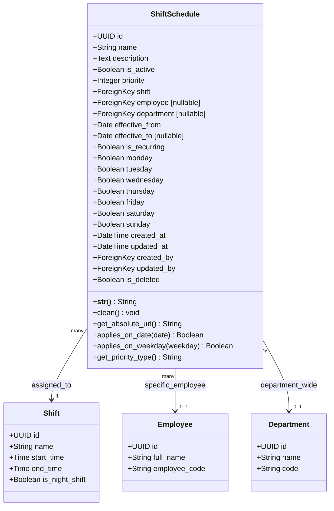
```mermaid
classDiagram
    class ShiftSchedule {
        +UUID id
        +String name
        +Text description
        +Boolean is_active
        +Integer priority
        +ForeignKey shift
        +ForeignKey employee [nullable]
        +ForeignKey department [nullable]
        +Date effective_from
        +Date effective_to [nullable]
        +Boolean is_recurring
        +Boolean monday
        +Boolean tuesday
        +Boolean wednesday
        +Boolean thursday
        +Boolean friday
        +Boolean saturday
        +Boolean sunday
        +DateTime created_at
        +DateTime updated_at
        +ForeignKey created_by
        +ForeignKey updated_by
        +Boolean is_deleted
        +__str__() String
        +clean() void
        +get_absolute_url() String
        +applies_on_date(date) Boolean
        +applies_on_weekday(weekday) Boolean
        +get_priority_type() String
    }
    
    class Shift {
        +UUID id
        +String name
        +Time start_time
        +Time end_time
        +Boolean is_night_shift
    }
    
    class Employee {
        +UUID id
        +String full_name
        +String employee_code
    }
    
    class Department {
        +UUID id
        +String name
        +String code
    }
    
    ShiftSchedule "many" --> "1" Shift : assigned_to
    ShiftSchedule "many" --> "0..1" Employee : specific_employee
    ShiftSchedule "many" --> "0..1" Department : department_wide
```

#### Step 6: Architecture Diagram

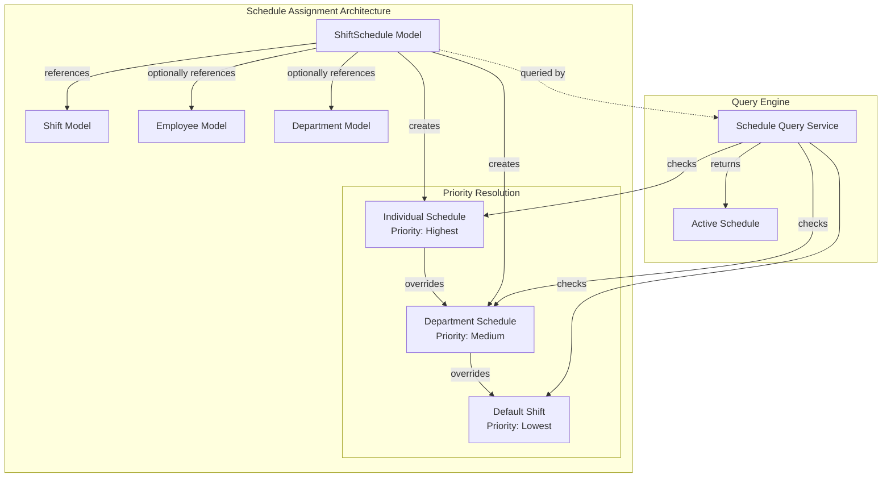
```mermaid
graph TB
    subgraph "Schedule Assignment Architecture"
        SS[ShiftSchedule Model]
        S[Shift Model]
        E[Employee Model]
        D[Department Model]
        
        SS -->|references| S
        SS -->|optionally references| E
        SS -->|optionally references| D
        
        subgraph "Priority Resolution"
            P1[Individual Schedule<br/>Priority: Highest]
            P2[Department Schedule<br/>Priority: Medium]
            P3[Default Shift<br/>Priority: Lowest]
            
            P1 -->|overrides| P2
            P2 -->|overrides| P3
        end
        
        SS -->|creates| P1
        SS -->|creates| P2
    end
    
    subgraph "Query Engine"
        QE[Schedule Query Service]
        QE -->|checks| P1
        QE -->|checks| P2
        QE -->|checks| P3
        QE -->|returns| AS[Active Schedule]
    end
    
    SS -.->|queried by| QE
```

#### Step 7: Priority System Diagram

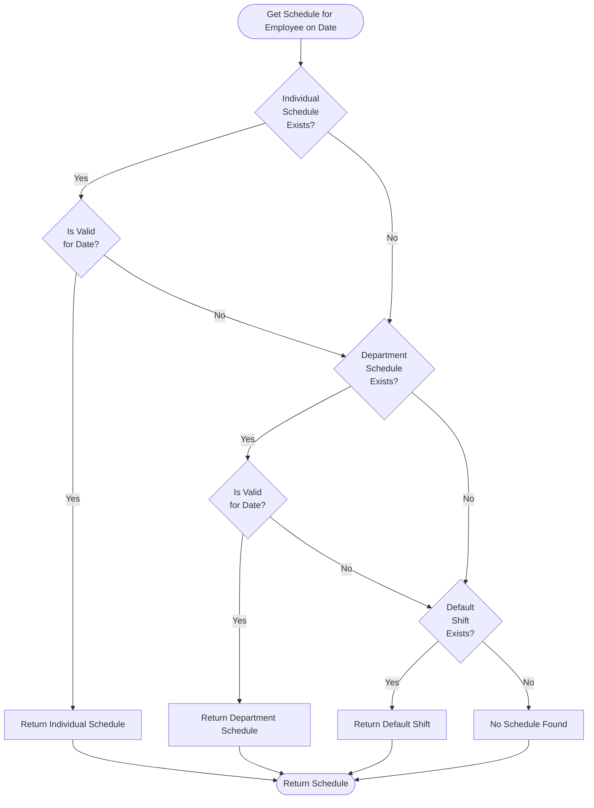
```mermaid
flowchart TD
    Start([Get Schedule for Employee on Date])
    
    Start --> CheckInd{Individual<br/>Schedule<br/>Exists?}
    
    CheckInd -->|Yes| ValidInd{Is Valid<br/>for Date?}
    ValidInd -->|Yes| ReturnInd[Return Individual Schedule]
    ValidInd -->|No| CheckDept
    
    CheckInd -->|No| CheckDept{Department<br/>Schedule<br/>Exists?}
    
    CheckDept -->|Yes| ValidDept{Is Valid<br/>for Date?}
    ValidDept -->|Yes| ReturnDept[Return Department Schedule]
    ValidDept -->|No| CheckDefault
    
    CheckDept -->|No| CheckDefault{Default<br/>Shift<br/>Exists?}
    
    CheckDefault -->|Yes| ReturnDefault[Return Default Shift]
    CheckDefault -->|No| NoSchedule[No Schedule Found]
    
    ReturnInd --> End([Return Schedule])
    ReturnDept --> End
    ReturnDefault --> End
    NoSchedule --> End
```

### Expected Outcome

**Database:**
- ShiftSchedule model defined in `attendance/models.py`
- Model includes all base fields: id, name, description, is_active, priority
- Foreign key to Shift model properly configured
- Tenant-aware implementation active
- All standard audit fields present

**Code Structure:**
- Clean model definition following Django best practices
- Proper use of field types and options
- Correct Meta class configuration
- Essential methods implemented (__str__, get_absolute_url)

**Documentation:**
- Model docstring explaining purpose and usage
- Field-level comments for complex logic
- Inline comments for business rules

**Admin Interface:**
- Model registered in admin (basic registration)
- List display shows key fields
- Search functionality on name field

### Verification Checklist

#### Code Quality
- [ ] Model inherits from correct tenant-aware base class
- [ ] All field types are appropriate for data being stored
- [ ] Field options (null, blank, default) are correctly set
- [ ] Foreign key relationships use proper on_delete behavior
- [ ] Model includes proper __str__ method
- [ ] Model includes proper Meta class with ordering
- [ ] Docstrings present for model and complex methods
- [ ] Code follows PEP 8 style guidelines

#### Functionality
- [ ] Model can be imported without errors
- [ ] Model name and verbose_name are appropriate
- [ ] Related name on Shift FK allows reverse queries
- [ ] Priority field has reasonable default value
- [ ] is_active field defaults to True
- [ ] Model validates correctly in Django shell

#### Multi-Tenancy
- [ ] Model is tenant-aware (uses tenant base class)
- [ ] Model will be created in tenant schemas
- [ ] Foreign keys respect tenant boundaries
- [ ] No cross-tenant data leakage possible

#### Integration
- [ ] Model imports Shift model correctly
- [ ] Model can reference Employee model (when added)
- [ ] Model can reference Department model (when added)
- [ ] No circular import issues

#### Testing Readiness
- [ ] Model structure supports all planned features
- [ ] Field choices enable required business logic
- [ ] Model can be instantiated in tests
- [ ] Clear path for adding validation logic

---

## Task 12: Date Range Fields

### Overview

Implement the temporal validity fields that determine when a shift schedule is active. These fields (effective_from and effective_to) define the date range during which a particular shift assignment is valid.

**Purpose:**
- Control the validity period of shift assignments
- Support schedule changes over time
- Enable advance scheduling
- Allow historical tracking of schedule changes

**Business Context:**
Organizations need to schedule shifts in advance and manage schedule changes:
- Seasonal shift patterns (summer vs. winter hours)
- Employee transfers between shifts
- Temporary shift assignments
- Probationary period schedules
- Permanent schedule changes

### Dependencies

**Must Complete First:**
- ✅ **Task 11:** ShiftSchedule base model structure
- ✅ Django ORM date field support
- ✅ Timezone configuration for tenant

**Required Knowledge:**
- Django date field behavior
- Date range validation logic
- Timezone-aware date handling

### Instructions

#### Step 1: Effective From Field

Add the effective_from field to define when a schedule becomes active.

**Field Specifications:**
- Field name: `effective_from`
- Type: DateField
- Null: False (required)
- Blank: False (required in forms)
- Default: No default (must be explicitly set)
- Help text: "Date when this schedule becomes active"
- Index: Yes (frequently queried)

**Purpose:**
- Defines the start date of the schedule validity
- Used in queries to find current schedules
- Enables advance scheduling
- Required for historical tracking

**Validation Requirements:**
- Must be a valid date
- Should not be in the distant past (business rule)
- Must be before or equal to effective_to (if set)

#### Step 2: Effective To Field

Add the effective_to field to define when a schedule ends (optional for open-ended schedules).

**Field Specifications:**
- Field name: `effective_to`
- Type: DateField
- Null: True (optional)
- Blank: True (optional in forms)
- Default: None (indicates open-ended)
- Help text: "Date when this schedule expires (leave empty for open-ended)"
- Index: Yes (frequently queried)

**Purpose:**
- Defines the end date of schedule validity
- Null value means schedule has no end date
- Enables automatic schedule expiration
- Supports temporary assignments

**Validation Requirements:**
- Must be a valid date if provided
- Must be after effective_from
- Can be null for permanent schedules
- Should warn if in the past when creating new schedule

#### Step 3: Date Range Validation

Implement validation logic to ensure date range integrity.

**Validation Rules:**

**Rule 1: effective_to must be after effective_from**
- Check in clean() method
- Raise ValidationError if violated
- Error message: "End date must be after start date"

**Rule 2: Prevent past dates for new schedules**
- Only validate on creation, not updates
- Allow grace period (e.g., 1 day) for scheduling flexibility
- Warning rather than hard error

**Rule 3: Check for overlapping schedules**
- Validate that no conflicting schedules exist for same employee/department
- Consider priority field for resolution
- Implemented in clean() method

**Rule 4: Validate reasonable date ranges**
- Warn if date range exceeds configurable maximum (e.g., 5 years)
- Business rule to prevent data entry errors
- Configurable via settings

#### Step 4: Date Range Query Methods

Implement model methods for date range queries.

**Method: is_valid_on_date(check_date)**
- Parameters: check_date (date object)
- Returns: Boolean
- Logic: Check if check_date falls within effective_from and effective_to
- Handles null effective_to (open-ended)

**Method: is_currently_valid()**
- Parameters: None (uses today's date)
- Returns: Boolean
- Logic: Calls is_valid_on_date with today's date
- Useful for filtering active schedules

**Method: get_validity_period()**
- Parameters: None
- Returns: String representation of date range
- Format: "YYYY-MM-DD to YYYY-MM-DD" or "YYYY-MM-DD onwards"
- Used in display and admin

**Method: days_remaining()**
- Parameters: None
- Returns: Integer (days until expiration) or None (if open-ended)
- Logic: Calculate difference between effective_to and today
- Returns negative if expired

#### Step 5: Date Range Diagram

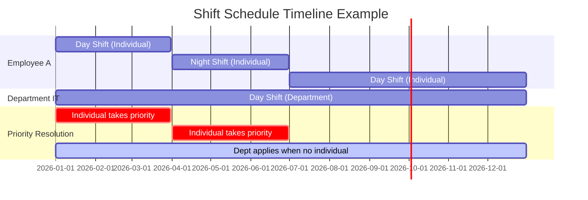
```mermaid
gantt
    title Shift Schedule Timeline Example
    dateFormat YYYY-MM-DD
    section Employee A
    Day Shift (Individual)    :a1, 2026-01-01, 2026-03-31
    Night Shift (Individual)  :a2, 2026-04-01, 2026-06-30
    Day Shift (Individual)    :a3, 2026-07-01, 2026-12-31
    
    section Department IT
    Day Shift (Department)    :b1, 2026-01-01, 2026-12-31
    
    section Priority Resolution
    Individual takes priority :crit, a1, 2026-01-01, 2026-03-31
    Individual takes priority :crit, a2, 2026-04-01, 2026-06-30
    Dept applies when no individual :active, 2026-01-01, 2026-12-31
```

#### Step 6: Date Range Validation Flow

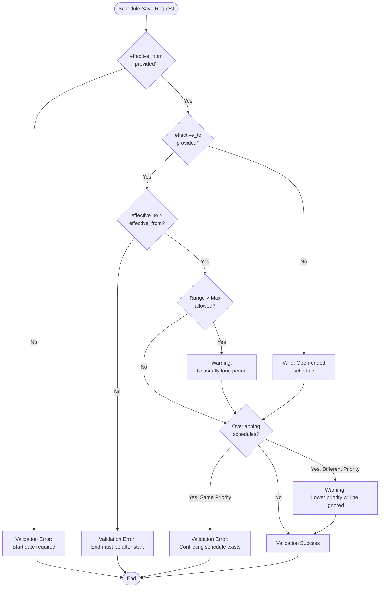
```mermaid
flowchart TD
    Start([Schedule Save Request])
    
    Start --> CheckFrom{effective_from<br/>provided?}
    CheckFrom -->|No| ErrorFrom[Validation Error:<br/>Start date required]
    CheckFrom -->|Yes| CheckRange{effective_to<br/>provided?}
    
    CheckRange -->|No| ValidOpen[Valid: Open-ended<br/>schedule]
    CheckRange -->|Yes| CompareRange{effective_to ><br/>effective_from?}
    
    CompareRange -->|No| ErrorRange[Validation Error:<br/>End must be after start]
    CompareRange -->|Yes| CheckLength{Range > Max<br/>allowed?}
    
    CheckLength -->|Yes| WarnLength[Warning:<br/>Unusually long period]
    CheckLength -->|No| CheckOverlap
    
    WarnLength --> CheckOverlap{Overlapping<br/>schedules?}
    
    CheckOverlap -->|Yes, Same Priority| ErrorOverlap[Validation Error:<br/>Conflicting schedule exists]
    CheckOverlap -->|Yes, Different Priority| WarnOverlap[Warning:<br/>Lower priority will be ignored]
    CheckOverlap -->|No| Success[Validation Success]
    
    ValidOpen --> CheckOverlap
    ErrorFrom --> End([End])
    ErrorRange --> End
    ErrorOverlap --> End
    WarnOverlap --> Success
    Success --> End
```

#### Step 7: Query Examples Diagram

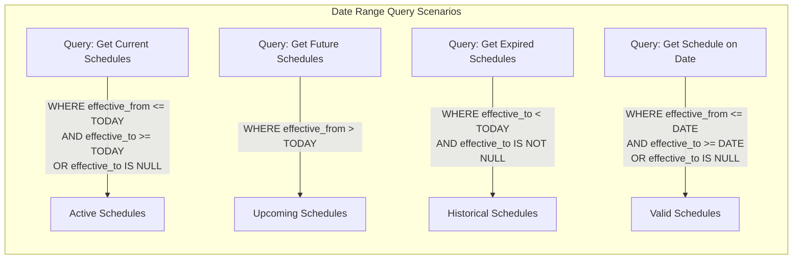
```mermaid
graph LR
    subgraph "Date Range Query Scenarios"
        Q1[Query: Get Current Schedules]
        Q2[Query: Get Future Schedules]
        Q3[Query: Get Expired Schedules]
        Q4[Query: Get Schedule on Date]
        
        Q1 -->|WHERE effective_from <= TODAY<br/>AND effective_to >= TODAY<br/>OR effective_to IS NULL| R1[Active Schedules]
        
        Q2 -->|WHERE effective_from > TODAY| R2[Upcoming Schedules]
        
        Q3 -->|WHERE effective_to < TODAY<br/>AND effective_to IS NOT NULL| R3[Historical Schedules]
        
        Q4 -->|WHERE effective_from <= DATE<br/>AND effective_to >= DATE<br/>OR effective_to IS NULL| R4[Valid Schedules]
    end
```

#### Step 8: Database Index Strategy

Create appropriate indexes for efficient date range queries.

**Indexes to Create:**

**Index 1: effective_from**
- Single column index
- Purpose: Query schedules starting in a date range
- Usage: Finding current and upcoming schedules

**Index 2: effective_to**
- Single column index
- Include NULL values
- Purpose: Query schedule end dates
- Usage: Finding expiring schedules

**Index 3: Composite Index (effective_from, effective_to)**
- Two column composite index
- Purpose: Optimize range queries
- Usage: Finding schedules active on specific date

**Index 4: Composite with employee (if applicable)**
- Columns: (employee, effective_from, effective_to)
- Purpose: Optimize per-employee schedule queries
- Usage: Finding all schedules for an employee

### Expected Outcome

**Database Schema:**
- effective_from field added as required DateField
- effective_to field added as optional DateField
- Both fields indexed for query performance
- Appropriate database constraints in place

**Model Functionality:**
- Date range validation in clean() method
- Helper methods for date checking
- Proper handling of open-ended schedules (null effective_to)
- Clear error messages for validation failures

**Query Capabilities:**
- Can efficiently find schedules active on any date
- Can filter current vs. future vs. expired schedules
- Can calculate schedule durations
- Can detect overlapping schedules

**Business Logic:**
- Supports temporary schedule assignments
- Enables advance scheduling
- Allows schedule changes over time
- Maintains historical schedule data

### Verification Checklist

#### Field Configuration
- [ ] effective_from field is DateField and required
- [ ] effective_to field is DateField and optional (null=True)
- [ ] Both fields have appropriate help text
- [ ] Both fields are indexed
- [ ] Default values are appropriate (none for effective_from)

#### Validation
- [ ] clean() method validates effective_to > effective_from
- [ ] Validation error messages are clear and helpful
- [ ] Open-ended schedules (null effective_to) are handled correctly
- [ ] Overlapping schedule detection works
- [ ] Date validation handles edge cases (same day start/end)

#### Model Methods
- [ ] is_valid_on_date() method implemented and tested
- [ ] is_currently_valid() method implemented
- [ ] get_validity_period() returns correct string format
- [ ] days_remaining() handles null effective_to
- [ ] Methods handle timezone considerations correctly

#### Database
- [ ] Migration creates fields without errors
- [ ] Indexes are created on both date fields
- [ ] Composite indexes created where beneficial
- [ ] Database constraints match Django model constraints

#### Query Performance
- [ ] Queries for current schedules use indexes effectively
- [ ] Date range queries execute efficiently
- [ ] EXPLAIN ANALYZE shows index usage
- [ ] No full table scans for common queries

#### Business Logic
- [ ] Can create open-ended schedules (no end date)
- [ ] Can create temporary schedules (with end date)
- [ ] Can query schedules for specific date
- [ ] Can find schedules expiring soon
- [ ] Historical schedules are preserved and queryable

#### Edge Cases
- [ ] Handles schedule starting and ending on same day
- [ ] Handles very long date ranges
- [ ] Handles dates at start of year, end of year
- [ ] Handles leap year dates correctly
- [ ] Handles timezone boundaries correctly

---

## Task 13: Recurring Schedule Fields

### Overview

Implement the recurring schedule functionality that allows shift schedules to repeat on specific days of the week. This includes the is_recurring flag and seven boolean fields (monday through sunday) that define the weekly pattern.

**Purpose:**
- Enable weekly recurring shift patterns
- Define which weekdays a schedule applies to
- Support flexible scheduling (e.g., Monday-Friday, weekends only)
- Reduce data entry for repetitive schedules

**Business Context:**
Most shift schedules follow weekly patterns:
- Standard Monday-Friday office hours
- Weekend shifts for retail/hospitality
- Alternating weekday/weekend patterns
- Specific days (e.g., Monday-Wednesday-Friday)
- Every day of the week for 24/7 operations

### Dependencies

**Must Complete First:**
- ✅ **Task 11:** ShiftSchedule base structure
- ✅ **Task 12:** Date range fields implemented

**Required Knowledge:**
- Python datetime weekday numbering (Monday=0, Sunday=6)
- ISO week date system
- Boolean field operations in Django

### Instructions

#### Step 1: is_recurring Field

Add the master flag that determines if a schedule uses the recurring pattern.

**Field Specifications:**
- Field name: `is_recurring`
- Type: BooleanField
- Default: True
- Null: False
- Help text: "Whether this schedule repeats weekly based on weekday pattern"

**Purpose:**
- Control flag for recurring behavior
- When True: weekday fields are checked
- When False: schedule applies every day within date range
- Default True encourages using recurring patterns

**Behavior:**
- **is_recurring=True:** Schedule only applies on days where corresponding weekday field is True
- **is_recurring=False:** Schedule applies on all days within date range (ignores weekday fields)

#### Step 2: Weekday Boolean Fields

Add seven boolean fields, one for each day of the week.

**Field Specifications (Pattern applies to all seven fields):**

**monday field:**
- Type: BooleanField
- Default: False
- Null: False
- Help text: "Schedule applies on Mondays"

**tuesday field:**
- Type: BooleanField
- Default: False
- Null: False
- Help text: "Schedule applies on Tuesdays"

**wednesday field:**
- Type: BooleanField
- Default: False
- Null: False
- Help text: "Schedule applies on Wednesdays"

**thursday field:**
- Type: BooleanField
- Default: False
- Null: False
- Help text: "Schedule applies on Thursdays"

**friday field:**
- Type: BooleanField
- Default: False
- Null: False
- Help text: "Schedule applies on Fridays"

**saturday field:**
- Type: BooleanField
- Default: False
- Null: False
- Help text: "Schedule applies on Saturdays"

**sunday field:**
- Type: BooleanField
- Default: False
- Null: False
- Help text: "Schedule applies on Sundays"

**Rationale:**
- Individual fields provide clear, explicit control
- Boolean type is efficient for storage and queries
- Default False requires explicit selection
- All seven days available for maximum flexibility

#### Step 3: Recurring Pattern Validation

Implement validation logic for the recurring schedule pattern.

**Validation Rules:**

**Rule 1: At least one weekday selected when recurring**
- If is_recurring=True, at least one weekday field must be True
- Validation in clean() method
- Error message: "Please select at least one weekday for recurring schedule"
- Critical for data integrity

**Rule 2: Weekday fields are ignored when not recurring**
- No validation of weekday fields when is_recurring=False
- UI should disable/hide weekday fields when is_recurring=False
- Documentation should clearly explain this behavior

**Rule 3: All weekdays selected warning**
- If is_recurring=True and all weekdays are True
- Suggest setting is_recurring=False instead
- Warning rather than error
- Improves data clarity

**Rule 4: Reasonable patterns**
- Warn about unusual patterns (e.g., only Tuesday and Thursday)
- Not a hard validation, just informational
- Helps catch data entry errors

#### Step 4: Weekday Query Methods

Implement methods to work with the weekday pattern.

**Method: applies_on_weekday(weekday)**
- Parameters: weekday (int, 0=Monday, 6=Sunday)
- Returns: Boolean
- Logic: 
  - If not is_recurring, return True
  - Otherwise, return value of corresponding weekday field
- Maps Python weekday numbers to field names

**Method: get_weekday_pattern()**
- Parameters: None
- Returns: List of weekday names that are enabled
- Example: ['Monday', 'Tuesday', 'Wednesday', 'Thursday', 'Friday']
- Used for display purposes

**Method: get_weekday_pattern_abbrev()**
- Parameters: None
- Returns: String of abbreviated weekday pattern
- Example: "Mon-Fri", "Sat-Sun", "Mon,Wed,Fri"
- Compact representation for tables and lists

**Method: set_weekday_pattern(weekdays)**
- Parameters: weekdays (list of weekday numbers or names)
- Returns: None (modifies instance)
- Logic: Sets corresponding weekday fields to True
- Helper for programmatic schedule creation

**Method: is_weekday_pattern()**
- Parameters: None
- Returns: Boolean
- Logic: Returns True if Monday-Friday are True and Sat-Sun are False
- Helper for common "weekday" pattern

**Method: is_weekend_pattern()**
- Parameters: None
- Returns: Boolean
- Logic: Returns True if Saturday-Sunday are True and weekdays are False
- Helper for common "weekend" pattern

#### Step 5: Combined Date and Weekday Validation

Implement the master method that checks both date range and weekday pattern.

**Method: applies_on_date(check_date)**
- Parameters: check_date (date object)
- Returns: Boolean
- Logic:
  1. Check if date falls within effective_from and effective_to
  2. If not in range, return False
  3. If is_recurring=False, return True
  4. Get weekday of check_date (0-6)
  5. Return applies_on_weekday(weekday)

**Purpose:**
- Central method for determining if schedule applies
- Used by attendance system to find active schedules
- Combines all temporal logic in one place
- Efficient for bulk date checking

#### Step 6: Recurring Pattern Diagram

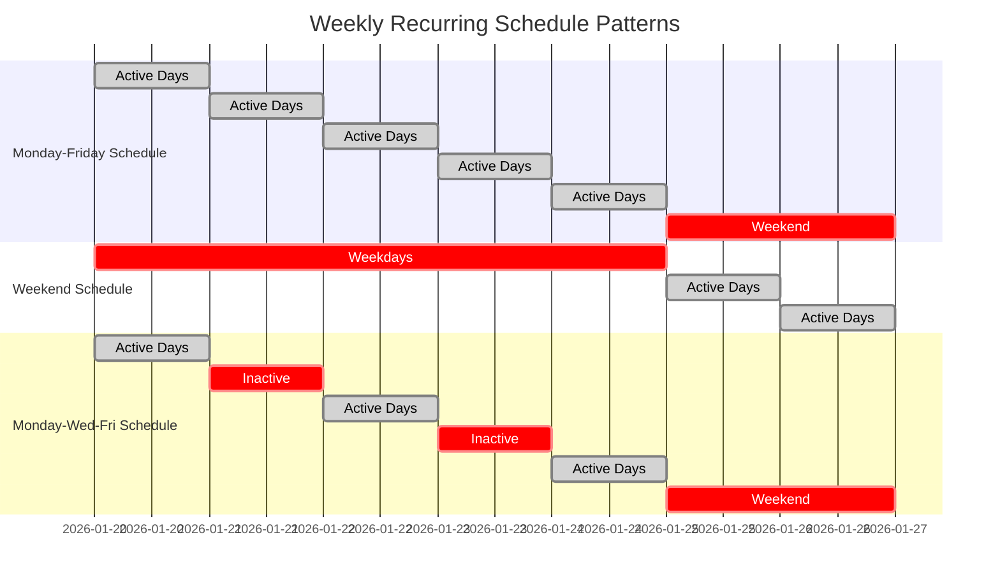
```mermaid
gantt
    title Weekly Recurring Schedule Patterns
    dateFormat YYYY-MM-DD
    
    section Monday-Friday Schedule
    Active Days    :done, 2026-01-20, 1d
    Active Days    :done, 2026-01-21, 1d
    Active Days    :done, 2026-01-22, 1d
    Active Days    :done, 2026-01-23, 1d
    Active Days    :done, 2026-01-24, 1d
    Weekend        :crit, 2026-01-25, 2d
    
    section Weekend Schedule
    Weekdays       :crit, 2026-01-20, 5d
    Active Days    :done, 2026-01-25, 1d
    Active Days    :done, 2026-01-26, 1d
    
    section Monday-Wed-Fri Schedule
    Active Days    :done, 2026-01-20, 1d
    Inactive       :crit, 2026-01-21, 1d
    Active Days    :done, 2026-01-22, 1d
    Inactive       :crit, 2026-01-23, 1d
    Active Days    :done, 2026-01-24, 1d
    Weekend        :crit, 2026-01-25, 2d
```

#### Step 7: Pattern Validation Flow

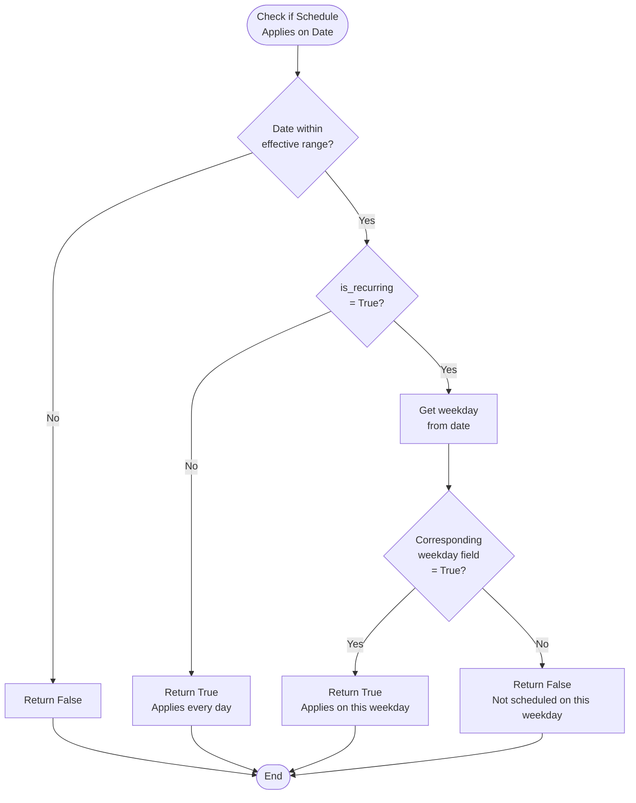
```mermaid
flowchart TD
    Start([Check if Schedule<br/>Applies on Date])
    
    Start --> InRange{Date within<br/>effective range?}
    InRange -->|No| ReturnFalse[Return False]
    InRange -->|Yes| IsRecur{is_recurring<br/>= True?}
    
    IsRecur -->|No| ReturnTrue[Return True<br/>Applies every day]
    IsRecur -->|Yes| GetWeekday[Get weekday<br/>from date]
    
    GetWeekday --> CheckWeekday{Corresponding<br/>weekday field<br/>= True?}
    
    CheckWeekday -->|Yes| ReturnTrueWeek[Return True<br/>Applies on this weekday]
    CheckWeekday -->|No| ReturnFalseWeek[Return False<br/>Not scheduled on this weekday]
    
    ReturnFalse --> End([End])
    ReturnTrue --> End
    ReturnTrueWeek --> End
    ReturnFalseWeek --> End
```

#### Step 8: Weekday Pattern Examples

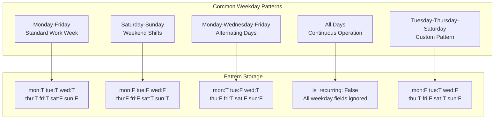
```mermaid
graph TB
    subgraph "Common Weekday Patterns"
        P1[Monday-Friday<br/>Standard Work Week]
        P2[Saturday-Sunday<br/>Weekend Shifts]
        P3[Monday-Wednesday-Friday<br/>Alternating Days]
        P4[All Days<br/>Continuous Operation]
        P5[Tuesday-Thursday-Saturday<br/>Custom Pattern]
    end
    
    subgraph "Pattern Storage"
        P1 --> F1[mon:T tue:T wed:T<br/>thu:T fri:T sat:F sun:F]
        P2 --> F2[mon:F tue:F wed:F<br/>thu:F fri:F sat:T sun:T]
        P3 --> F3[mon:T tue:F wed:T<br/>thu:F fri:T sat:F sun:F]
        P4 --> F4[is_recurring: False<br/>All weekday fields ignored]
        P5 --> F5[mon:F tue:T wed:F<br/>thu:T fri:F sat:T sun:F]
    end
```

#### Step 9: Database Storage Optimization

Consider storage and query optimization for weekday patterns.

**Storage Options:**

**Option 1: Seven Boolean Fields (Recommended)**
- Pros: Simple, explicit, easy to query, readable SQL
- Cons: Seven columns needed
- Best for: Most use cases, clear intent

**Option 2: Bitfield/Integer (Alternative)**
- Pros: Single column, compact storage
- Cons: Less readable, requires bit manipulation
- Best for: Very large datasets, advanced users

**Current Implementation: Option 1 (Seven Booleans)**
- Clearer code and queries
- Better admin interface UX
- Easier validation and debugging
- Minimal storage overhead with modern databases

**Index Strategy:**
- No individual indexes on weekday fields (low cardinality)
- Composite index with is_recurring if query patterns warrant
- Rely on date range indexes for query performance

### Expected Outcome

**Database Schema:**
- is_recurring field added as BooleanField (default True)
- Seven weekday boolean fields (monday-sunday) added
- All fields properly configured with defaults
- No indexes on weekday fields (low cardinality)

**Model Functionality:**
- Validation ensures at least one weekday selected when recurring
- Helper methods for checking weekday patterns
- applies_on_date() method combines date range and weekday logic
- Pattern display methods for UI

**Business Logic:**
- Supports all common weekly patterns
- Non-recurring schedules apply every day in date range
- Recurring schedules only apply on selected weekdays
- Clear distinction between recurring and non-recurring

**User Experience:**
- Admin interface shows weekday checkboxes
- Pattern validation provides helpful error messages
- Pattern display methods create readable output
- Common patterns (weekday, weekend) easily detectable

### Verification Checklist

#### Field Configuration
- [ ] is_recurring field is BooleanField with default=True
- [ ] All seven weekday fields are BooleanFields with default=False
- [ ] All fields have appropriate help text
- [ ] All fields are non-nullable (null=False)
- [ ] Field names are lowercase (monday, not Monday)

#### Validation
- [ ] Validation requires at least one weekday when is_recurring=True
- [ ] Validation does not fail when is_recurring=False
- [ ] Warning given when all weekdays selected with is_recurring=True
- [ ] Validation error messages are clear and actionable
- [ ] clean() method handles all validation logic

#### Model Methods
- [ ] applies_on_weekday() correctly maps weekday numbers to fields
- [ ] applies_on_date() combines date range and weekday checks
- [ ] get_weekday_pattern() returns list of active weekdays
- [ ] get_weekday_pattern_abbrev() returns compact string
- [ ] is_weekday_pattern() correctly identifies Mon-Fri pattern
- [ ] is_weekend_pattern() correctly identifies Sat-Sun pattern
- [ ] set_weekday_pattern() can set pattern from list

#### Business Logic
- [ ] Non-recurring schedules ignore weekday fields
- [ ] Recurring schedules respect weekday selection
- [ ] Schedule applies correctly on selected weekdays
- [ ] Schedule doesn't apply on unselected weekdays
- [ ] Date range still limits recurring schedules

#### Edge Cases
- [ ] Handles date at start of effective_from correctly
- [ ] Handles date at end of effective_to correctly
- [ ] Handles all seven weekdays selected
- [ ] Handles no weekdays selected (validation error)
- [ ] Handles is_recurring=False with weekdays selected (ignored)

#### Integration
- [ ] Works with date range validation from Task 12
- [ ] Weekday calculations handle all timezones correctly
- [ ] Python weekday numbering (0-6) handled correctly
- [ ] ISO week date calculations work properly

#### User Interface
- [ ] Admin shows weekday fields as checkboxes
- [ ] Admin groups recurring fields together
- [ ] Pattern display is readable in list views
- [ ] Common patterns (weekday/weekend) easily selectable

---

## Task 14: Employee Foreign Key

### Overview

Implement the employee foreign key field that enables individual employee-specific shift schedules. This field, when set, indicates that the schedule applies to a specific employee, giving it the highest priority in the priority system.

**Purpose:**
- Assign shifts to individual employees
- Override department-wide schedules
- Handle employee-specific schedule requests
- Support custom work arrangements

**Business Context:**
Individual schedules are needed for:
- Special shift requests from employees
- Temporary schedule changes
- Part-time employee schedules
- Manager and supervisor schedules
- Employees with custom arrangements (medical, religious, etc.)

### Dependencies

**Must Complete First:**
- ✅ **Task 11-13:** ShiftSchedule base structure with date and recurring fields
- ✅ Employee model available from Phase 04 (ERP Core)
- ✅ Understanding of priority system (Individual > Department > Default)

**Required Models:**
- Employee model from employees app
- User model (for employee relationship)

### Instructions

#### Step 1: Employee Foreign Key Field

Add the foreign key relationship to the Employee model.

**Field Specifications:**
- Field name: `employee`
- Type: ForeignKey
- Related model: Employee (from employees app)
- On delete: CASCADE (if employee deleted, remove their schedules)
- Related name: `shift_schedules`
- Null: True (optional, used for individual schedules only)
- Blank: True (optional in forms)
- Help text: "Specific employee for individual schedule (leave empty for department-wide)"
- Index: Yes (frequently queried)

**Import Requirements:**
- Import Employee model at module level
- Handle potential circular import issues
- Use string reference if needed: 'employees.Employee'

**Rationale for CASCADE:**
- Employee schedules are meaningless without the employee
- Cascading deletion maintains data integrity
- Alternative: Set to null and mark as archived (soft delete)
- Choose based on business requirements for historical data

#### Step 2: Employee-Department Mutual Exclusivity

Implement validation to ensure schedules are either individual OR department-wide, not both.

**Validation Rule:**
- A schedule cannot have both employee and department set
- Exactly one must be null (or both null for default shifts)
- Validation in clean() method

**Validation Logic:**

**If employee is set:**
- department must be null
- This is an individual schedule
- Has highest priority

**If department is set:**
- employee must be null
- This is a department-wide schedule
- Has medium priority

**If both are null:**
- This is a default shift
- Has lowest priority
- Or may be invalid depending on business rules

**If both are set:**
- Validation error
- Error message: "Schedule cannot be assigned to both an employee and a department. Please select one or the other."

#### Step 3: Priority System Implementation

Implement methods and properties related to the priority hierarchy.

**Property: schedule_type**
- Returns: String ('individual', 'department', or 'default')
- Logic:
  - If employee is set: return 'individual'
  - Elif department is set: return 'department'
  - Else: return 'default'
- Used for filtering and display

**Property: priority_level**
- Returns: Integer (1, 2, or 3)
- Logic:
  - Individual: 1 (highest)
  - Department: 2
  - Default: 3 (lowest)
- Used for sorting and conflict resolution

**Method: get_applicable_employee()**
- Returns: Employee instance or None
- Logic: Return the employee if this is an individual schedule
- Used for display and queries

**Method: conflicts_with(other_schedule)**
- Parameters: other_schedule (ShiftSchedule instance)
- Returns: Boolean
- Logic: Check if schedules overlap in time and assignment
- Used for validation and conflict detection

#### Step 4: Query Optimization for Employee Schedules

Implement query methods and managers for efficient employee schedule retrieval.

**Manager Method: for_employee(employee, date=None)**
- Parameters: employee (Employee instance), optional date
- Returns: QuerySet of schedules
- Logic:
  - Filter by employee field
  - If date provided, filter by date range
  - Order by priority (individual > department > default)
- Used to find all schedules for an employee

**Manager Method: get_active_schedule(employee, date)**
- Parameters: employee (Employee instance), date (date object)
- Returns: Single ShiftSchedule instance or None
- Logic:
  1. Check for individual schedule on date
  2. If not found, check employee's department schedule
  3. If not found, check default shift
  4. Return highest priority match
- Implements the priority system

**Method: applies_to_employee(employee, date)**
- Parameters: employee (Employee instance), date (date object)
- Returns: Boolean
- Logic: Check if this schedule applies to the given employee on the date
- Considers schedule type and priority

#### Step 5: Individual Schedule Diagram

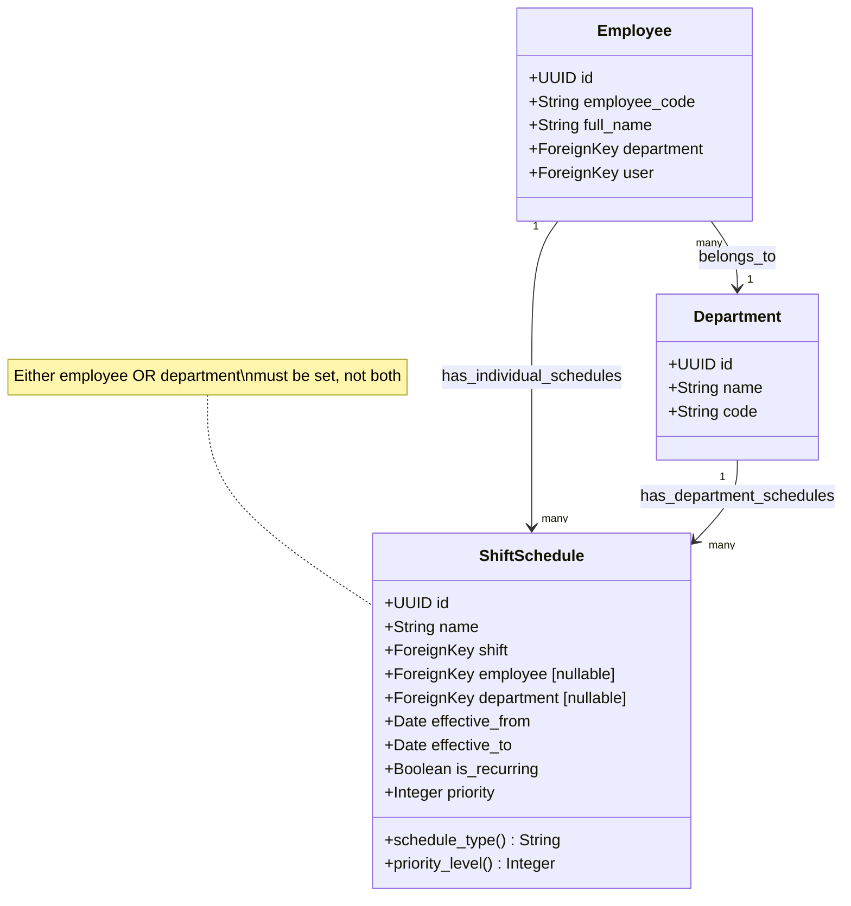
```mermaid
classDiagram
    class Employee {
        +UUID id
        +String employee_code
        +String full_name
        +ForeignKey department
        +ForeignKey user
    }
    
    class ShiftSchedule {
        +UUID id
        +String name
        +ForeignKey shift
        +ForeignKey employee [nullable]
        +ForeignKey department [nullable]
        +Date effective_from
        +Date effective_to
        +Boolean is_recurring
        +Integer priority
        +schedule_type() String
        +priority_level() Integer
    }
    
    class Department {
        +UUID id
        +String name
        +String code
    }
    
    Employee "1" --> "many" ShiftSchedule : has_individual_schedules
    Department "1" --> "many" ShiftSchedule : has_department_schedules
    Employee "many" --> "1" Department : belongs_to
    
    note for ShiftSchedule "Either employee OR department\nmust be set, not both"
```

#### Step 6: Priority Resolution Flow

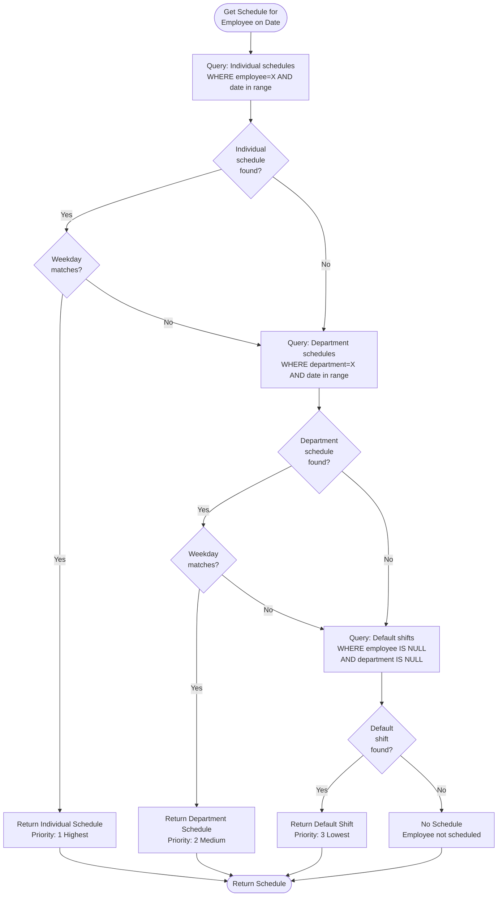
```mermaid
flowchart TD
    Start([Get Schedule for<br/>Employee on Date])
    
    Start --> Step1[Query: Individual schedules<br/>WHERE employee=X AND date in range]
    
    Step1 --> HasInd{Individual<br/>schedule<br/>found?}
    
    HasInd -->|Yes| CheckIndWeekday{Weekday<br/>matches?}
    CheckIndWeekday -->|Yes| ReturnInd[Return Individual Schedule<br/>Priority: 1 Highest]
    CheckIndWeekday -->|No| Step2
    
    HasInd -->|No| Step2[Query: Department schedules<br/>WHERE department=X AND date in range]
    
    Step2 --> HasDept{Department<br/>schedule<br/>found?}
    
    HasDept -->|Yes| CheckDeptWeekday{Weekday<br/>matches?}
    CheckDeptWeekday -->|Yes| ReturnDept[Return Department Schedule<br/>Priority: 2 Medium]
    CheckDeptWeekday -->|No| Step3
    
    HasDept -->|No| Step3[Query: Default shifts<br/>WHERE employee IS NULL<br/>AND department IS NULL]
    
    Step3 --> HasDefault{Default<br/>shift<br/>found?}
    
    HasDefault -->|Yes| ReturnDefault[Return Default Shift<br/>Priority: 3 Lowest]
    HasDefault -->|No| NoSchedule[No Schedule<br/>Employee not scheduled]
    
    ReturnInd --> End([Return Schedule])
    ReturnDept --> End
    ReturnDefault --> End
    NoSchedule --> End
```

#### Step 7: Schedule Conflict Detection

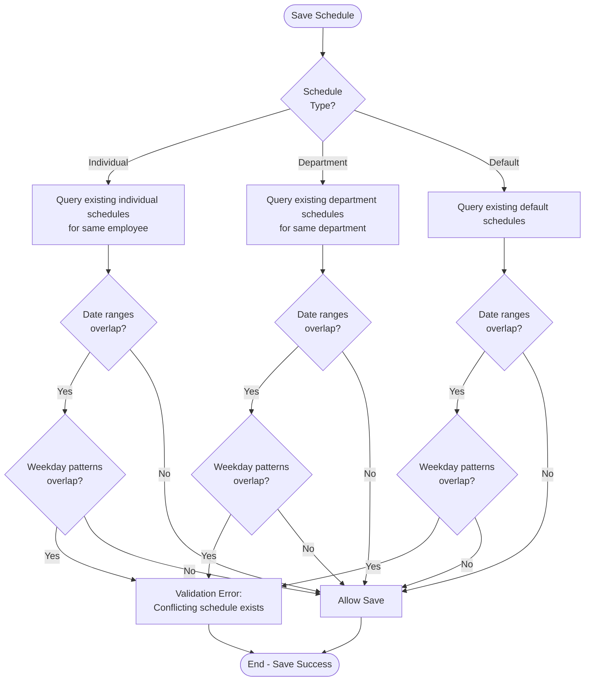
```mermaid
flowchart TD
    Start([Save Schedule])
    
    Start --> GetType{Schedule<br/>Type?}
    
    GetType -->|Individual| CheckIndConflict[Query existing individual schedules<br/>for same employee]
    GetType -->|Department| CheckDeptConflict[Query existing department schedules<br/>for same department]
    GetType -->|Default| CheckDefaultConflict[Query existing default schedules]
    
    CheckIndConflict --> DateOverlap1{Date ranges<br/>overlap?}
    CheckDeptConflict --> DateOverlap2{Date ranges<br/>overlap?}
    CheckDefaultConflict --> DateOverlap3{Date ranges<br/>overlap?}
    
    DateOverlap1 -->|Yes| WeekdayOverlap1{Weekday patterns<br/>overlap?}
    DateOverlap1 -->|No| AllowSave
    
    DateOverlap2 -->|Yes| WeekdayOverlap2{Weekday patterns<br/>overlap?}
    DateOverlap2 -->|No| AllowSave
    
    DateOverlap3 -->|Yes| WeekdayOverlap3{Weekday patterns<br/>overlap?}
    DateOverlap3 -->|No| AllowSave
    
    WeekdayOverlap1 -->|Yes| Error[Validation Error:<br/>Conflicting schedule exists]
    WeekdayOverlap1 -->|No| AllowSave[Allow Save]
    
    WeekdayOverlap2 -->|Yes| Error
    WeekdayOverlap2 -->|No| AllowSave
    
    WeekdayOverlap3 -->|Yes| Error
    WeekdayOverlap3 -->|No| AllowSave
    
    Error --> End([End - No Save])
    AllowSave --> End([End - Save Success])
```

#### Step 8: Individual vs. Department Assignment

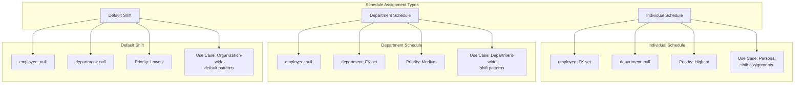
```mermaid
graph TB
    subgraph "Schedule Assignment Types"
        T1[Individual Schedule]
        T2[Department Schedule]
        T3[Default Shift]
    end
    
    subgraph "Individual Schedule"
        T1 --> A1[employee: FK set]
        T1 --> A2[department: null]
        T1 --> A3[Priority: Highest]
        T1 --> A4[Use Case: Personal<br/>shift assignments]
    end
    
    subgraph "Department Schedule"
        T2 --> B1[employee: null]
        T2 --> B2[department: FK set]
        T2 --> B3[Priority: Medium]
        T2 --> B4[Use Case: Department-wide<br/>shift patterns]
    end
    
    subgraph "Default Shift"
        T3 --> C1[employee: null]
        T3 --> C2[department: null]
        T3 --> C3[Priority: Lowest]
        T3 --> C4[Use Case: Organization-wide<br/>default patterns]
    end
```

### Expected Outcome

**Database Schema:**
- employee field added as optional ForeignKey to Employee
- Field is nullable and blank (not required)
- Indexed for query performance
- CASCADE delete behavior configured
- Foreign key constraint enforces referential integrity

**Model Functionality:**
- Validation prevents both employee and department being set
- Priority system implemented via properties and methods
- Query methods efficiently find schedules for employees
- Conflict detection prevents overlapping individual schedules

**Business Logic:**
- Individual schedules override department schedules
- Individual schedules override default shifts
- Each employee can have multiple schedules for different time periods
- Schedule history maintained (soft delete or archive)

**Query Performance:**
- Index on employee field enables fast lookups
- Composite indexes for complex queries if needed
- Efficient priority resolution queries
- Select_related used for employee data

### Verification Checklist

#### Field Configuration
- [ ] employee field is ForeignKey to Employee model
- [ ] Field is nullable (null=True) and blank (blank=True)
- [ ] on_delete=CASCADE configured (or appropriate alternative)
- [ ] related_name='shift_schedules' set for reverse queries
- [ ] Field has clear help text
- [ ] Field is indexed (db_index=True)

#### Validation
- [ ] Cannot set both employee and department simultaneously
- [ ] Validation error message is clear and helpful
- [ ] Validation runs in clean() method
- [ ] Can save with only employee set (individual schedule)
- [ ] Can save with only department set (department schedule)
- [ ] Can save with both null (default shift) if business rules allow

#### Properties and Methods
- [ ] schedule_type property returns correct value
- [ ] priority_level property returns correct integer
- [ ] get_applicable_employee() returns employee if set
- [ ] conflicts_with() detects overlapping schedules
- [ ] applies_to_employee() checks if schedule applies

#### Query Methods
- [ ] Can query all schedules for an employee
- [ ] Can query active schedule for employee on specific date
- [ ] Priority resolution works correctly
- [ ] Query performance is acceptable
- [ ] select_related used to avoid N+1 queries

#### Priority System
- [ ] Individual schedules have highest priority
- [ ] Individual schedules override department schedules
- [ ] Individual schedules override default shifts
- [ ] Priority resolution queries work correctly
- [ ] get_active_schedule() returns correct schedule

#### Business Logic
- [ ] Can assign individual schedule to employee
- [ ] Individual schedule only affects that employee
- [ ] Multiple individual schedules for same employee don't conflict if date ranges separate
- [ ] Overlapping individual schedules for same employee are prevented
- [ ] Can track schedule history for employee

#### Integration
- [ ] Works with Employee model from employees app
- [ ] No circular import issues
- [ ] Foreign key relationship accessible from both sides
- [ ] Admin interface shows employee selection
- [ ] Can filter schedules by employee in admin

---

## Task 15: Department Foreign Key

### Overview

Implement the department foreign key field that enables department-wide shift schedules. This field, when set, indicates that the schedule applies to all employees in a department, providing medium priority in the schedule hierarchy.

**Purpose:**
- Assign shifts to entire departments
- Simplify scheduling for large teams
- Override default shifts while allowing individual exceptions
- Support organizational structure in scheduling

**Business Context:**
Department-wide schedules are essential for:
- Departmental shift patterns (e.g., IT department night support)
- Different operating hours per department
- Retail floor shifts vs. back office shifts
- 24/7 departments needing rotation coverage

### Dependencies

**Must Complete First:**
- ✅ **Task 11-14:** ShiftSchedule with employee FK
- ✅ Department model available from Phase 04
- ✅ Understanding of priority system

**Required Models:**
- Department model from organizations or employees app
- Employee model (for department relationship)

### Instructions

#### Step 1: Department Foreign Key Field

Add the foreign key relationship to the Department model.

**Field Specifications:**
- Field name: `department`
- Type: ForeignKey
- Related model: Department (from organizations app)
- On delete: CASCADE (if department deleted, remove department schedules)
- Related name: `shift_schedules`
- Null: True (optional, used for department schedules only)
- Blank: True (optional in forms)
- Help text: "Department for department-wide schedule (leave empty for individual)"
- Index: Yes (frequently queried)

**Import Requirements:**
- Import Department model at module level
- Use string reference if needed: 'organizations.Department'
- Handle any app dependency issues

**Rationale for CASCADE:**
- Department schedules are tied to the department's existence
- Cascading maintains data integrity
- Alternative: Set to null or restrict deletion if department has schedules
- Consider business requirements for restructuring

#### Step 2: Employee-Department Validation Enhancement

Strengthen the mutual exclusivity validation from Task 14.

**Enhanced Validation Logic:**

**Case 1: Individual Schedule**
- employee is set
- department must be null
- Valid: Individual employee override

**Case 2: Department Schedule**
- department is set
- employee must be null
- Valid: Department-wide pattern

**Case 3: Default Shift**
- Both employee and department are null
- May be valid or invalid depending on business rules
- Consider if default shifts are allowed

**Case 4: Both Set (Invalid)**
- Both employee and department are set
- Always invalid
- Clear error message needed

**Validation Implementation:**
- Check in clean() method
- Raise ValidationError with clear message
- Consider UI/UX to prevent this state (radio button selection)

#### Step 3: Department Schedule Query Methods

Implement query methods for department-wide schedules.

**Manager Method: for_department(department, date=None)**
- Parameters: department (Department instance), optional date
- Returns: QuerySet of department schedules
- Logic:
  - Filter by department field
  - If date provided, filter by date range
  - Exclude individual overrides (employee not null)
- Used to view all department schedules

**Manager Method: get_employees_with_schedules(department, date)**
- Parameters: department, date
- Returns: QuerySet of employees with their active schedules
- Logic:
  - Get all employees in department
  - For each, find active schedule (individual or department)
  - Annotate with schedule information
- Used for department schedule reporting

**Method: get_affected_employees()**
- Parameters: None
- Returns: QuerySet of Employee instances
- Logic: Return all employees in the department
- Used to see who is affected by department schedule

**Method: applies_to_department(department, date)**
- Parameters: department instance, date
- Returns: Boolean
- Logic: Check if this schedule applies to the department on date
- Considers date range and weekday pattern

#### Step 4: Department Schedule Propagation Logic

Implement how department schedules affect employees.

**Schedule Resolution Algorithm:**

**For employee on date:**
1. Check individual schedules for employee on date
2. If found and valid → Use individual schedule (HIGHEST PRIORITY)
3. If not found, get employee's department
4. Check department schedules for that department on date
5. If found and valid → Use department schedule (MEDIUM PRIORITY)
6. If not found, check default shifts
7. If found and valid → Use default shift (LOWEST PRIORITY)
8. If not found → No schedule / Not scheduled

**Implementation Considerations:**
- Cache department lookups for performance
- Use select_related for employee.department
- Consider prefetch_related for bulk operations
- Handle employees without departments gracefully

#### Step 5: Department Schedule Conflict Detection

Implement validation to prevent conflicting department schedules.

**Conflict Scenarios:**

**Scenario 1: Overlapping Department Schedules**
- Same department
- Overlapping date ranges
- Overlapping weekday patterns
- Result: Validation error (ambiguous which applies)

**Scenario 2: Department Schedule vs. Individual**
- Not a conflict - individual wins
- Allow creation without error
- Optionally warn user that individual schedules will override

**Scenario 3: Multiple Department Schedules (Sequential)**
- Same department
- Non-overlapping date ranges
- Result: Valid (schedule changes over time)

**Validation Logic:**
- Query existing schedules for same department
- Check for date range overlap
- Check for weekday pattern overlap
- Raise ValidationError if true conflict detected

#### Step 6: Department Schedule Architecture

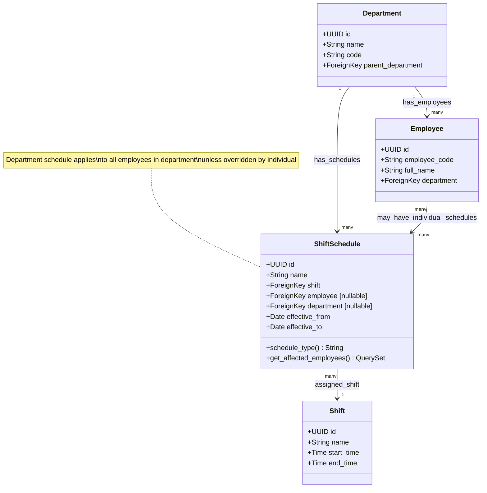
```mermaid
classDiagram
    class Department {
        +UUID id
        +String name
        +String code
        +ForeignKey parent_department
    }
    
    class Employee {
        +UUID id
        +String employee_code
        +String full_name
        +ForeignKey department
    }
    
    class ShiftSchedule {
        +UUID id
        +String name
        +ForeignKey shift
        +ForeignKey employee [nullable]
        +ForeignKey department [nullable]
        +Date effective_from
        +Date effective_to
        +schedule_type() String
        +get_affected_employees() QuerySet
    }
    
    class Shift {
        +UUID id
        +String name
        +Time start_time
        +Time end_time
    }
    
    Department "1" --> "many" Employee : has_employees
    Department "1" --> "many" ShiftSchedule : has_schedules
    Employee "many" --> "many" ShiftSchedule : may_have_individual_schedules
    ShiftSchedule "many" --> "1" Shift : assigned_shift
    
    note for ShiftSchedule "Department schedule applies\nto all employees in department\nunless overridden by individual"
```

#### Step 7: Multi-Level Priority System

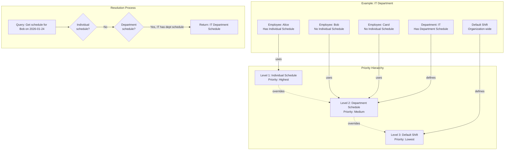
```mermaid
graph TD
    subgraph "Priority Hierarchy"
        P1[Level 1: Individual Schedule<br/>Priority: Highest]
        P2[Level 2: Department Schedule<br/>Priority: Medium]
        P3[Level 3: Default Shift<br/>Priority: Lowest]
        
        P1 -.overrides.-> P2
        P2 -.overrides.-> P3
    end
    
    subgraph "Example: IT Department"
        E1[Employee: Alice<br/>Has Individual Schedule]
        E2[Employee: Bob<br/>No Individual Schedule]
        E3[Employee: Carol<br/>No Individual Schedule]
        D1[Department: IT<br/>Has Department Schedule]
        DEF[Default Shift<br/>Organization-wide]
        
        E1 -->|uses| P1
        E2 -->|uses| P2
        E3 -->|uses| P2
        D1 -->|defines| P2
        DEF -->|defines| P3
    end
    
    subgraph "Resolution Process"
        Q[Query: Get schedule for Bob on 2026-01-24]
        Q --> C1{Individual<br/>schedule?}
        C1 -->|No| C2{Department<br/>schedule?}
        C2 -->|Yes, IT has dept schedule| R[Return: IT Department Schedule]
    end
```

#### Step 8: Department Schedule Propagation

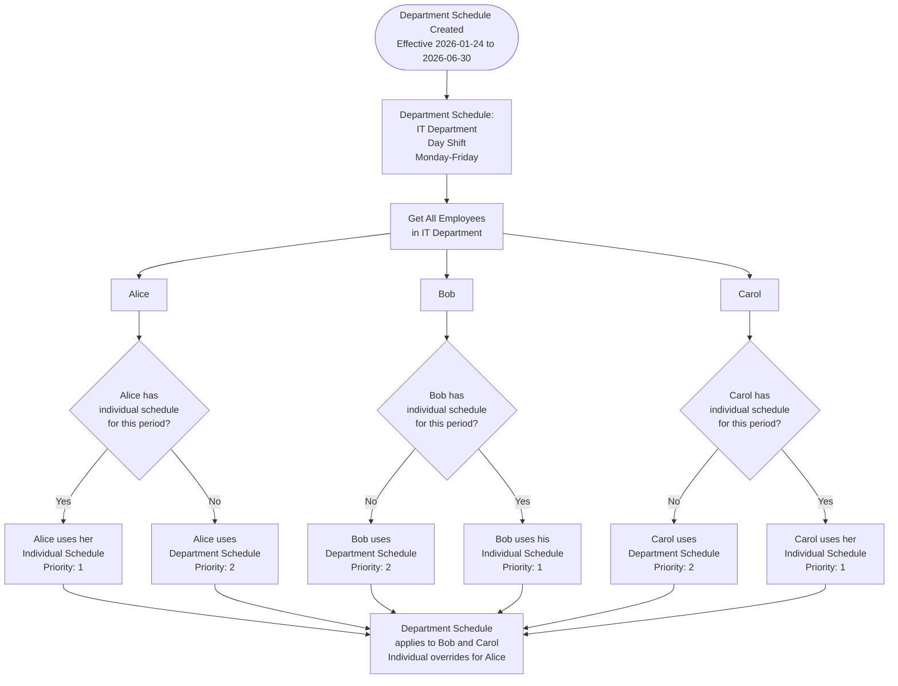
```mermaid
flowchart TD
    Start([Department Schedule Created<br/>Effective 2026-01-24 to 2026-06-30])
    
    Start --> DS[Department Schedule:<br/>IT Department<br/>Day Shift<br/>Monday-Friday]
    
    DS --> GetEmps[Get All Employees<br/>in IT Department]
    
    GetEmps --> E1[Alice]
    GetEmps --> E2[Bob]
    GetEmps --> E3[Carol]
    
    E1 --> CheckAlice{Alice has<br/>individual schedule<br/>for this period?}
    CheckAlice -->|Yes| AliceInd[Alice uses her<br/>Individual Schedule<br/>Priority: 1]
    CheckAlice -->|No| AliceDept[Alice uses<br/>Department Schedule<br/>Priority: 2]
    
    E2 --> CheckBob{Bob has<br/>individual schedule<br/>for this period?}
    CheckBob -->|No| BobDept[Bob uses<br/>Department Schedule<br/>Priority: 2]
    CheckBob -->|Yes| BobInd[Bob uses his<br/>Individual Schedule<br/>Priority: 1]
    
    E3 --> CheckCarol{Carol has<br/>individual schedule<br/>for this period?}
    CheckCarol -->|No| CarolDept[Carol uses<br/>Department Schedule<br/>Priority: 2]
    CheckCarol -->|Yes| CarolInd[Carol uses her<br/>Individual Schedule<br/>Priority: 1]
    
    AliceInd --> Result[Department Schedule<br/>applies to Bob and Carol<br/>Individual overrides for Alice]
    AliceDept --> Result
    BobDept --> Result
    BobInd --> Result
    CarolDept --> Result
    CarolInd --> Result
```

#### Step 9: Conflict Detection for Department Schedules

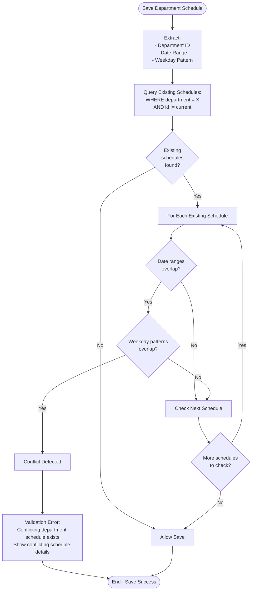
```mermaid
flowchart TD
    Start([Save Department Schedule])
    
    Start --> Extract[Extract:<br/>- Department ID<br/>- Date Range<br/>- Weekday Pattern]
    
    Extract --> Query[Query Existing Schedules:<br/>WHERE department = X<br/>AND id != current]
    
    Query --> HasExisting{Existing<br/>schedules<br/>found?}
    
    HasExisting -->|No| AllowSave[Allow Save]
    HasExisting -->|Yes| CheckEach[For Each Existing Schedule]
    
    CheckEach --> DateCheck{Date ranges<br/>overlap?}
    
    DateCheck -->|No| NextSchedule[Check Next Schedule]
    DateCheck -->|Yes| WeekdayCheck{Weekday patterns<br/>overlap?}
    
    WeekdayCheck -->|No| NextSchedule
    WeekdayCheck -->|Yes| Conflict[Conflict Detected]
    
    Conflict --> Error[Validation Error:<br/>Conflicting department schedule exists<br/>Show conflicting schedule details]
    
    NextSchedule --> MoreSchedules{More schedules<br/>to check?}
    MoreSchedules -->|Yes| CheckEach
    MoreSchedules -->|No| AllowSave
    
    Error --> End([End - Prevent Save])
    AllowSave --> End([End - Save Success])
```

### Expected Outcome

**Database Schema:**
- department field added as optional ForeignKey to Department
- Field is nullable and blank (not required)
- Indexed for query performance
- CASCADE delete behavior configured
- Foreign key constraint enforces referential integrity

**Model Functionality:**
- Validation prevents both employee and department being set
- Query methods efficiently find department schedules
- Conflict detection prevents overlapping department schedules
- get_affected_employees() returns all employees in department

**Business Logic:**
- Department schedules apply to all employees in department
- Individual schedules override department schedules
- Department schedules override default shifts
- Multiple sequential department schedules allowed (non-overlapping)

**Query Performance:**
- Index on department field enables fast lookups
- select_related used for department data
- Efficient queries for all affected employees
- Bulk operations optimized with prefetch_related

### Verification Checklist

#### Field Configuration
- [ ] department field is ForeignKey to Department model
- [ ] Field is nullable (null=True) and blank (blank=True)
- [ ] on_delete=CASCADE configured (or appropriate alternative)
- [ ] related_name='shift_schedules' set for reverse queries
- [ ] Field has clear help text
- [ ] Field is indexed (db_index=True)

#### Validation
- [ ] Cannot set both employee and department simultaneously
- [ ] Validation prevents conflicting department schedules
- [ ] Validation allows sequential department schedules
- [ ] Validation error messages are clear and helpful
- [ ] Can save with only department set (department schedule)

#### Query Methods
- [ ] Can query all schedules for a department
- [ ] Can query active schedule for department on specific date
- [ ] get_affected_employees() returns all department employees
- [ ] for_department() manager method works correctly
- [ ] Query performance is acceptable

#### Priority System
- [ ] Individual schedules override department schedules
- [ ] Department schedules override default shifts
- [ ] Priority resolution considers department schedules
- [ ] get_active_schedule() returns correct schedule when department schedule applies

#### Business Logic
- [ ] Department schedule applies to all employees in department
- [ ] Adding employee to department automatically includes them in department schedule
- [ ] Removing employee from department stops department schedule from applying
- [ ] Can have multiple department schedules for different time periods
- [ ] Department schedule changes are tracked

#### Conflict Detection
- [ ] Overlapping department schedules for same department are prevented
- [ ] Sequential department schedules are allowed
- [ ] Conflict detection considers both date ranges and weekday patterns
- [ ] Error messages show which schedule is conflicting

#### Integration
- [ ] Works with Department model from organizations app
- [ ] No circular import issues
- [ ] Foreign key relationship accessible from both sides
- [ ] Admin interface shows department selection
- [ ] Can filter schedules by department in admin
- [ ] Bulk operations work correctly for department schedules

#### Edge Cases
- [ ] Handles employees without departments
- [ ] Handles departments without employees
- [ ] Handles department hierarchy if applicable
- [ ] Handles employee transfer between departments
- [ ] Handles department deletion gracefully

---

## Task 16: ShiftSchedule Migrations

### Overview

Create and apply Django migrations for the ShiftSchedule model, ensuring all fields, indexes, and constraints are properly created in the database. This includes handling multi-tenancy requirements and ensuring migrations work correctly across all tenant schemas.

**Purpose:**
- Generate database schema for ShiftSchedule model
- Create appropriate indexes for query performance
- Establish foreign key constraints
- Ensure multi-tenancy compatibility
- Enable migration rollback if needed

**Business Context:**
Proper migrations are critical for:
- Safe deployment to production
- Schema versioning and history
- Team collaboration (everyone has same schema)
- Rollback capability if issues arise
- Multi-tenant schema management

### Dependencies

**Must Complete First:**
- ✅ **Task 11-15:** Complete ShiftSchedule model implementation
- ✅ Shift model migrations (from previous document)
- ✅ Employee and Department models migrated
- ✅ Multi-tenancy infrastructure operational

**Required Setup:**
- Django migrations framework configured
- PostgreSQL database accessible
- Tenant schemas framework operational
- All referenced models migrated

### Instructions

#### Step 1: Generate Initial Migration

Create the migration file for the ShiftSchedule model.

**Command to Run:**
```
python manage.py makemigrations attendance
```

**Expected Output:**
- Migration file created in `attendance/migrations/`
- File name pattern: `000X_shiftschedule.py`
- Migration includes all model fields
- Migration includes Meta options

**Migration File Contents:**

**Should Include:**
- CreateModel operation for ShiftSchedule
- All fields defined in Tasks 11-15
- Foreign key definitions (shift, employee, department)
- Date fields (effective_from, effective_to)
- Boolean fields (is_recurring, weekday fields)
- Metadata fields (name, description, is_active, priority)
- All standard tracking fields

**Should Verify:**
- Field types match model definition
- null and blank options correct
- default values set appropriately
- help_text preserved
- max_length values correct

#### Step 2: Add Custom Indexes

Enhance the migration with custom indexes for query optimization.

**Indexes to Add:**

**Index 1: Date Range Query Index**
- Fields: (effective_from, effective_to)
- Purpose: Optimize queries for schedules active on a date
- Type: B-tree index
- Name: 'idx_schedule_daterange'

**Index 2: Employee Schedule Index**
- Fields: (employee, effective_from, is_active)
- Purpose: Optimize queries for employee schedules
- Type: B-tree index
- Name: 'idx_schedule_employee'
- Partial index: WHERE employee IS NOT NULL

**Index 3: Department Schedule Index**
- Fields: (department, effective_from, is_active)
- Purpose: Optimize queries for department schedules
- Type: B-tree index
- Name: 'idx_schedule_department'
- Partial index: WHERE department IS NOT NULL

**Index 4: Active Schedules Index**
- Fields: (is_active, effective_from)
- Purpose: Quickly filter active schedules
- Type: B-tree index
- Name: 'idx_schedule_active'

**Implementation:**
- Add indexes in Meta.indexes list in model
- Or add using migrations.AddIndex operations
- Use db_index=True for simple single-column indexes

#### Step 3: Add Database Constraints

Add database-level constraints for data integrity.

**Constraint 1: Employee-Department Mutual Exclusivity**
- Type: CheckConstraint
- Logic: (employee IS NULL OR department IS NULL)
- Name: 'schedule_employee_or_department'
- Ensures schedule is not assigned to both

**Constraint 2: Date Range Validity**
- Type: CheckConstraint
- Logic: (effective_to IS NULL OR effective_to >= effective_from)
- Name: 'schedule_valid_daterange'
- Ensures end date is after start date

**Constraint 3: Recurring Pattern Validation**
- Type: CheckConstraint
- Logic: Complex check for at least one weekday when is_recurring=True
- Name: 'schedule_recurring_weekday'
- May be complex for database constraint - consider model validation only

**Constraint 4: Priority Range**
- Type: CheckConstraint
- Logic: (priority >= 1 AND priority <= 100)
- Name: 'schedule_priority_range'
- Ensures priority is within reasonable range

**Implementation Note:**
- Django 2.2+ supports CheckConstraint
- Use in Meta.constraints list
- Requires PostgreSQL 9.4+ for complex constraints
- Test thoroughly before deploying

#### Step 4: Multi-Tenancy Migration Considerations

Ensure migrations work correctly with django-tenants or similar framework.

**Considerations:**

**Public Schema:**
- ShiftSchedule model should NOT be in public schema
- Verify app is in TENANT_APPS, not SHARED_APPS
- Public schema only contains Tenant model and shared lookups

**Tenant Schemas:**
- Migration must run in all tenant schemas
- Use: `python manage.py migrate_schemas --shared`
- Or: `python manage.py migrate_schemas`
- Test with at least one tenant

**Migration Dependencies:**
- Ensure Employee and Department models are in same schema
- Foreign keys must reference models in same schema type
- No cross-schema foreign keys allowed

**Tenant-Specific Considerations:**
- Each tenant has independent ShiftSchedule table
- No data sharing between tenants
- Schema isolation enforced by framework

#### Step 5: Migration Testing Strategy

Test migrations thoroughly before applying to production.

**Test 1: Fresh Migration**
- Create new test database
- Run migrations from scratch
- Verify all tables, indexes, and constraints created
- Check EXPLAIN ANALYZE output for queries

**Test 2: Rollback Testing**
- Apply migration
- Insert test data
- Rollback migration
- Verify data cleanup (or preservation if needed)
- Reapply migration

**Test 3: Multi-Tenant Testing**
- Create multiple test tenants
- Run migration on each tenant schema
- Verify schema isolation
- Test cross-tenant queries (should fail)

**Test 4: Data Migration (if applicable)**
- If migrating from previous schema
- Test data transformation logic
- Verify data integrity after migration
- Test with realistic data volume

**Test 5: Performance Testing**
- Insert realistic data volume (10k-100k rows)
- Run common queries
- Verify index usage
- Check query performance

#### Step 6: Migration Workflow Diagram

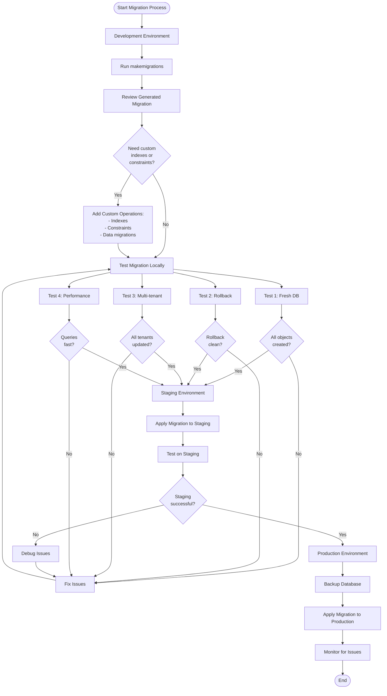
```mermaid
flowchart TD
    Start([Start Migration Process])
    
    Start --> Dev[Development Environment]
    Dev --> Make[Run makemigrations]
    Make --> Review[Review Generated Migration]
    
    Review --> Custom{Need custom<br/>indexes or<br/>constraints?}
    Custom -->|Yes| AddCustom[Add Custom Operations:<br/>- Indexes<br/>- Constraints<br/>- Data migrations]
    Custom -->|No| Test
    
    AddCustom --> Test[Test Migration Locally]
    
    Test --> Fresh[Test 1: Fresh DB]
    Test --> Roll[Test 2: Rollback]
    Test --> Multi[Test 3: Multi-tenant]
    Test --> Perf[Test 4: Performance]
    
    Fresh --> Verify1{All objects<br/>created?}
    Roll --> Verify2{Rollback<br/>clean?}
    Multi --> Verify3{All tenants<br/>updated?}
    Perf --> Verify4{Queries<br/>fast?}
    
    Verify1 -->|No| Fix[Fix Issues]
    Verify2 -->|No| Fix
    Verify3 -->|No| Fix
    Verify4 -->|No| Fix
    
    Fix --> Test
    
    Verify1 -->|Yes| Stage
    Verify2 -->|Yes| Stage
    Verify3 -->|Yes| Stage
    Verify4 -->|Yes| Stage
    
    Stage[Staging Environment]
    Stage --> ApplyStage[Apply Migration to Staging]
    ApplyStage --> TestStage[Test on Staging]
    
    TestStage --> StageOK{Staging<br/>successful?}
    StageOK -->|No| Debug[Debug Issues]
    Debug --> Fix
    StageOK -->|Yes| Prod
    
    Prod[Production Environment]
    Prod --> Backup[Backup Database]
    Backup --> ApplyProd[Apply Migration to Production]
    ApplyProd --> Monitor[Monitor for Issues]
    
    Monitor --> End([End])
```

#### Step 7: Multi-Tenant Migration Flow

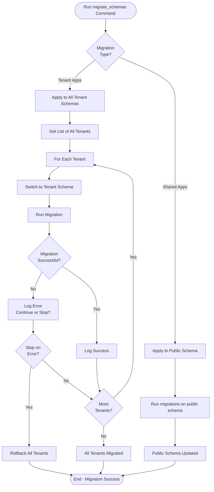
```mermaid
flowchart TD
    Start([Run migrate_schemas Command])
    
    Start --> CheckType{Migration<br/>Type?}
    
    CheckType -->|Shared Apps| Public[Apply to Public Schema]
    CheckType -->|Tenant Apps| Tenants[Apply to All Tenant Schemas]
    
    Public --> RunPublic[Run migrations on public schema]
    RunPublic --> PublicDone[Public Schema Updated]
    
    Tenants --> GetTenants[Get List of All Tenants]
    GetTenants --> ForEach[For Each Tenant]
    
    ForEach --> SwitchSchema[Switch to Tenant Schema]
    SwitchSchema --> RunMigration[Run Migration]
    
    RunMigration --> Success{Migration<br/>Successful?}
    
    Success -->|Yes| LogSuccess[Log Success]
    Success -->|No| LogError[Log Error<br/>Continue or Stop?]
    
    LogError --> StopCheck{Stop on<br/>Error?}
    StopCheck -->|Yes| Rollback[Rollback All Tenants]
    StopCheck -->|No| NextTenant
    
    LogSuccess --> NextTenant{More<br/>Tenants?}
    NextTenant -->|Yes| ForEach
    NextTenant -->|No| Complete[All Tenants Migrated]
    
    Rollback --> End([End - Migration Failed])
    Complete --> End([End - Migration Success])
    PublicDone --> End
```

#### Step 8: Index Strategy Visualization

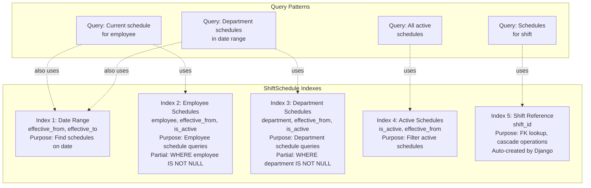
```mermaid
graph TB
    subgraph "ShiftSchedule Indexes"
        I1[Index 1: Date Range<br/>effective_from, effective_to<br/>Purpose: Find schedules on date]
        
        I2[Index 2: Employee Schedules<br/>employee, effective_from, is_active<br/>Purpose: Employee schedule queries<br/>Partial: WHERE employee IS NOT NULL]
        
        I3[Index 3: Department Schedules<br/>department, effective_from, is_active<br/>Purpose: Department schedule queries<br/>Partial: WHERE department IS NOT NULL]
        
        I4[Index 4: Active Schedules<br/>is_active, effective_from<br/>Purpose: Filter active schedules]
        
        I5[Index 5: Shift Reference<br/>shift_id<br/>Purpose: FK lookup, cascade operations<br/>Auto-created by Django]
    end
    
    subgraph "Query Patterns"
        Q1[Query: Current schedule<br/>for employee]
        Q2[Query: Department schedules<br/>in date range]
        Q3[Query: All active<br/>schedules]
        Q4[Query: Schedules<br/>for shift]
        
        Q1 -.uses.-> I2
        Q2 -.uses.-> I3
        Q3 -.uses.-> I4
        Q4 -.uses.-> I5
        
        Q1 -.also uses.-> I1
        Q2 -.also uses.-> I1
    end
```

### Expected Outcome

**Migration Files:**
- Migration file created in `attendance/migrations/`
- File name: `000X_shiftschedule.py` (where X is next number)
- Migration is idempotent (can run multiple times safely)
- Migration includes rollback instructions (migrations.ReverseOperation)

**Database Schema:**
- `attendance_shiftschedule` table created
- All fields present with correct types
- All indexes created and active
- All constraints enforced at database level
- Foreign key relationships established

**Multi-Tenancy:**
- Table created in all tenant schemas, not public schema
- Schema isolation verified
- All tenants have identical schema
- No cross-tenant data possible

**Performance:**
- Indexes improve query performance measurably
- EXPLAIN ANALYZE shows index usage
- No full table scans for common queries
- Query times acceptable for expected data volume

**Documentation:**
- Migration purpose documented in docstring
- Custom operations explained in comments
- Rollback considerations noted
- Dependencies clearly listed

### Verification Checklist

#### Migration Generation
- [ ] makemigrations runs without errors
- [ ] Migration file created in correct location
- [ ] Migration file named appropriately
- [ ] Migration includes all model fields
- [ ] Migration includes all indexes
- [ ] Migration includes all constraints
- [ ] Migration dependencies are correct

#### Migration Content
- [ ] All fields have correct types
- [ ] null and blank options match model
- [ ] default values are correct
- [ ] Foreign keys reference correct models
- [ ] on_delete behaviors are correct
- [ ] Related names are set correctly
- [ ] help_text is preserved

#### Indexes
- [ ] Date range index created
- [ ] Employee schedule index created (partial)
- [ ] Department schedule index created (partial)
- [ ] Active schedules index created
- [ ] Shift FK index auto-created by Django
- [ ] Index names are meaningful
- [ ] Indexes improve query performance (verified)

#### Constraints
- [ ] Employee-department mutual exclusivity constraint
- [ ] Date range validity constraint
- [ ] Priority range constraint (if applicable)
- [ ] Constraints enforced by database
- [ ] Constraint violations raise IntegrityError

#### Multi-Tenancy
- [ ] Model in TENANT_APPS configuration
- [ ] Migration applies to tenant schemas only
- [ ] migrate_schemas command works correctly
- [ ] All tenants have table created
- [ ] Schema isolation verified
- [ ] No public schema table created

#### Testing
- [ ] Fresh migration tested successfully
- [ ] Rollback tested successfully
- [ ] Multi-tenant migration tested
- [ ] Data integrity verified
- [ ] Performance tested with realistic data
- [ ] Edge cases tested (null values, defaults)

#### Database Verification
- [ ] Table exists in database
- [ ] All columns present and correct type
- [ ] Indexes exist and active (check with \d+ in psql)
- [ ] Constraints exist and active
- [ ] Foreign key relationships work
- [ ] Can insert, update, delete records

#### Query Performance
- [ ] Common queries use indexes (EXPLAIN ANALYZE)
- [ ] No full table scans for indexed queries
- [ ] Query times acceptable
- [ ] Performance with large datasets acceptable
- [ ] Bulk operations perform well

#### Rollback Capability
- [ ] Can rollback migration cleanly
- [ ] Rollback removes table, indexes, constraints
- [ ] Dependent objects handled correctly
- [ ] Can reapply migration after rollback
- [ ] No orphaned database objects

#### Documentation
- [ ] Migration file has docstring
- [ ] Custom operations explained
- [ ] Dependencies documented
- [ ] Rollback considerations noted
- [ ] Breaking changes highlighted
- [ ] Team notified of migration

---

## Summary and Next Steps

### Tasks Completed

This document covered the complete implementation of the ShiftSchedule model (Tasks 11-16):

✅ **Task 11:** ShiftSchedule model base structure with core fields and relationships  
✅ **Task 12:** Date range fields (effective_from, effective_to) with validation  
✅ **Task 13:** Recurring schedule fields (is_recurring, weekday booleans)  
✅ **Task 14:** Employee foreign key for individual schedules (highest priority)  
✅ **Task 15:** Department foreign key for department-wide schedules (medium priority)  
✅ **Task 16:** Complete migrations with indexes, constraints, and multi-tenancy support

### Key Achievements

**Model Architecture:**
- Flexible schedule assignment (individual, department, or default)
- Temporal validity with date ranges
- Weekly recurring patterns with weekday selection
- Three-tier priority system for conflict resolution

**Data Integrity:**
- Foreign key relationships with appropriate on_delete behavior
- Database-level constraints for data validation
- Mutual exclusivity between employee and department assignments
- Date range and weekday pattern validation

**Performance:**
- Strategic indexes for common query patterns
- Partial indexes for employee and department schedules
- Efficient priority resolution queries
- Multi-tenant schema isolation

**Business Logic:**
- Individual schedules override department schedules
- Department schedules override default shifts
- Night shift support (spans midnight)
- Historical schedule tracking

### Integration Points

**Depends On:**
- Shift model (from Tasks 01-10)
- Employee model (Phase 04)
- Department model (Phase 04)
- Multi-tenancy infrastructure

**Required By:**
- Attendance tracking system (Group B)
- Leave management integration
- Payroll shift differentials
- Reporting and analytics

### Next Steps

**Group B: Attendance Tracking Models** (Next)
- AttendanceRecord model (clock in/out)
- Break records
- Attendance validation
- Real-time status tracking

**Group C: Advanced Features**
- Overtime calculations
- Shift swap requests
- Schedule templates
- Bulk schedule operations

### Validation Checklist (All Tasks)

#### Overall Implementation
- [ ] All six tasks (11-16) completed
- [ ] Model structure follows Django best practices
- [ ] Multi-tenancy fully implemented
- [ ] All foreign key relationships correct
- [ ] All validation rules implemented

#### Functionality
- [ ] Can create individual schedules
- [ ] Can create department schedules
- [ ] Date range validation works
- [ ] Recurring patterns work correctly
- [ ] Priority system functions properly
- [ ] Conflict detection prevents invalid schedules

#### Database
- [ ] Migrations apply successfully
- [ ] All indexes created and functional
- [ ] All constraints enforced
- [ ] Foreign keys work correctly
- [ ] Multi-tenant isolation verified

#### Performance
- [ ] Common queries use indexes
- [ ] Query performance acceptable
- [ ] Bulk operations efficient
- [ ] No N+1 query problems

#### Documentation
- [ ] Model docstrings complete
- [ ] Method documentation clear
- [ ] Business rules explained
- [ ] Integration points documented

---

## References and Resources

### Related Documents
- [01_Tasks-01-10_App-Shift-Model.md](01_Tasks-01-10_App-Shift-Model.md) - Shift model foundation
- [00_GROUP_OVERVIEW.md](00_GROUP_OVERVIEW.md) - Group A overview and architecture
- [../Group-B_Attendance-Tracking/00_GROUP_OVERVIEW.md](../Group-B_Attendance-Tracking/00_GROUP_OVERVIEW.md) - Next group

### Django Documentation
- Django Models: Field types, Meta options, model methods
- Django Migrations: Creating, applying, and rolling back
- Django QuerySets: Efficient querying and optimization
- Django Constraints: CheckConstraint for data integrity

### Multi-Tenancy Resources
- django-tenants documentation
- PostgreSQL schema management
- Tenant isolation best practices

### Best Practices
- Foreign key on_delete behaviors
- Index optimization strategies
- Database constraint patterns
- Migration testing procedures

---

**Document End**

*Last Updated: 2026-01-24*  
*Status: Ready for Implementation*  
*Version: 1.0*
