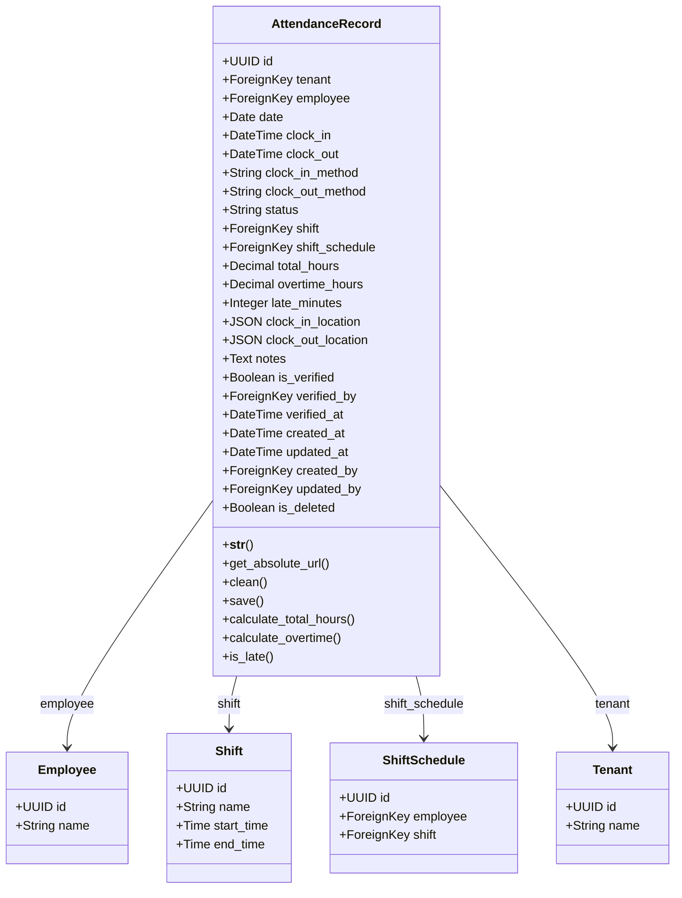

# Tasks 17-24: AttendanceRecord Model - Choices and Core Fields

**Document Version:** 1.0  
**Last Updated:** 2026-01-24  
**Status:** Ready for Implementation

---

## Navigation

- **Parent:** [00_GROUP_OVERVIEW.md](00_GROUP_OVERVIEW.md)
- **Previous:** [Group-A: ShiftSchedule Model](../Group-A_Shift-Schedule-Models/02_Tasks-11-16_ShiftSchedule-Model.md)
- **Next:** [02_Tasks-25-32_Time-Calculations.md](02_Tasks-25-32_Time-Calculations.md)

---

## Document Overview

This document covers the implementation of the **AttendanceRecord** model's foundational elements, including choice field definitions and core data fields. The AttendanceRecord model is the central entity for tracking employee attendance, capturing clock-in/clock-out times, attendance status, and the methods used for time recording.

### Key Features

- **Attendance Status Tracking:** Seven distinct status types covering all attendance scenarios
- **Multiple Check-In Methods:** Support for web, mobile, biometric, manual, and import methods
- **Unique Daily Records:** One attendance record per employee per day constraint
- **Time Precision:** Microsecond-accurate clock-in and clock-out timestamps
- **Method Tracking:** Capture how employees check in and out for audit purposes
- **Multi-Tenancy:** Full tenant isolation for attendance data

### Tasks Covered

- **Task 17:** AttendanceStatus Choices Definition
- **Task 18:** CheckInMethod Choices Definition
- **Task 19:** AttendanceRecord Model Structure
- **Task 20:** Employee Foreign Key with Date Uniqueness
- **Task 21:** Date Field Implementation
- **Task 22:** Clock-In and Clock-Out DateTimeFields
- **Task 23:** Check-In and Check-Out Method Fields
- **Task 24:** Status Field Implementation

---

## Table of Contents

1. [Task 17: AttendanceStatus Choices Definition](#task-17-attendancestatus-choices-definition)
2. [Task 18: CheckInMethod Choices Definition](#task-18-checkinmethod-choices-definition)
3. [Task 19: AttendanceRecord Model Structure](#task-19-attendancerecord-model-structure)
4. [Task 20: Employee Foreign Key with Date Uniqueness](#task-20-employee-foreign-key-with-date-uniqueness)
5. [Task 21: Date Field Implementation](#task-21-date-field-implementation)
6. [Task 22: Clock-In and Clock-Out DateTimeFields](#task-22-clock-in-and-clock-out-datetimefields)
7. [Task 23: Check-In and Check-Out Method Fields](#task-23-check-in-and-check-out-method-fields)
8. [Task 24: Status Field Implementation](#task-24-status-field-implementation)

---

## Task 17: AttendanceStatus Choices Definition

### Overview

Define the comprehensive set of attendance status choices that represent all possible attendance states for employees. This enum-like structure will be used throughout the attendance system to categorize and filter attendance records.

**Purpose:**
- Establish standard attendance status vocabulary
- Enable consistent status reporting across the system
- Support filtering and analytics based on attendance patterns
- Provide clear status options for manual attendance entry

**Business Context:**
The attendance status serves as the primary indicator of an employee's work presence. Organizations need to distinguish between:
- Regular working days (present, late)
- Absences (absent, on leave)
- Non-working days (holidays, weekends)
- Partial attendance (half-day)

### Status Types Definition

#### PRESENT Status

**Code Value:** `'PRESENT'`  
**Display Label:** `'Present'`  
**Description:** Employee was present and worked their scheduled shift  

**Use Cases:**
- Employee clocked in and out within acceptable timeframes
- Full day attendance with no late arrival
- Default status for successful attendance
- Used for calculating working days

**Business Rules:**
- Must have clock_in timestamp
- Should have clock_out timestamp (may be pending for ongoing shifts)
- Total hours worked should be near shift duration
- No leave applications for this date

**Reporting Implications:**
- Counts toward attendance percentage
- Included in working days calculations
- Used for salary and payroll processing
- Affects perfect attendance bonuses

**Status Transitions:**
- Initial status when clocking in on time
- Can be changed to LATE if late arrival detected
- Can be changed to HALF_DAY if insufficient hours
- Can be corrected to other statuses via manual override

#### ABSENT Status

**Code Value:** `'ABSENT'`  
**Display Label:** `'Absent'`  
**Description:** Employee did not report to work without prior approval  

**Use Cases:**
- No clock-in record on a scheduled working day
- Unauthorized absence
- No-show situations
- Missing attendance data for working days

**Business Rules:**
- No clock_in timestamp (or system-marked as absent)
- No approved leave application
- Date is a scheduled working day
- Not a holiday or weekend

**Reporting Implications:**
- Counts as unauthorized absence
- Reduces attendance percentage
- May trigger disciplinary actions
- Affects performance reviews
- May result in pay deductions

**Status Transitions:**
- System-assigned at end of day if no check-in
- Can be changed to ON_LEAVE if leave is retroactively approved
- Can be changed to PRESENT if clock-in data is added late
- May be changed to HOLIDAY if company declares unexpected holiday

**Alert Triggers:**
- Notify supervisor immediately
- Alert HR if consecutive absences
- Trigger absence workflow
- Send notification to employee

#### LATE Status

**Code Value:** `'LATE'`  
**Display Label:** `'Late'`  
**Description:** Employee arrived after the allowed grace period  

**Use Cases:**
- Clock-in time exceeds shift start + grace period
- Delayed arrival with full or partial day work
- Tardiness tracking
- Punctuality monitoring

**Business Rules:**
- Must have clock_in timestamp
- Clock_in time > shift.start_time + grace_period
- Still counted as present but flagged
- May accumulate late penalties

**Grace Period Calculation:**
- Default grace period: Typically 10-15 minutes
- Configurable per shift or organization
- Can vary by employee level or department
- Grace period stored in Shift model

**Reporting Implications:**
- Counts toward attendance but tracked separately
- Accumulation may trigger warnings
- May affect performance bonuses
- Used for punctuality reports
- Can impact promotion considerations

**Status Transitions:**
- Automatically detected on clock-in
- Can be changed to PRESENT if manager approves
- Can be combined with HALF_DAY if leaving early too
- Remains LATE for historical tracking

**Threshold Examples:**
- Shift starts at 9:00 AM, grace until 9:15 AM
- Clock-in at 9:16 AM = LATE
- Clock-in at 9:14 AM = PRESENT
- Multiple late arrivals in period = escalation

#### HALF_DAY Status

**Code Value:** `'HALF_DAY'`  
**Display Label:** `'Half Day'`  
**Description:** Employee worked approximately half of their scheduled shift  

**Use Cases:**
- Partial day attendance
- Medical appointments during work hours
- Planned half-day leave
- Early departure or late arrival with limited hours

**Business Rules:**
- Total hours worked between 40-60% of shift duration
- Has both clock_in and clock_out timestamps
- May be planned (approved) or unplanned
- Salary calculation at 50% for the day

**Half-Day Criteria:**
- Full shift: 8 hours → Half-day: 4-5 hours
- Full shift: 9 hours → Half-day: 4.5-5.5 hours
- Configurable minimum hours threshold
- Organization-specific policies apply

**Reporting Implications:**
- Counts as 0.5 days attendance
- Partial pay for the day
- May require leave application
- Tracked separately in reports

**Status Transitions:**
- Auto-calculated based on worked hours
- Can be set manually by HR/manager
- May be combined with leave records
- Final status determined at day end

**Policy Variations:**
- Some organizations: Half-day = specific time ranges
- Others: Half-day = total hours threshold
- May require advance approval
- Different rules for planned vs unplanned

#### ON_LEAVE Status

**Code Value:** `'ON_LEAVE'`  
**Display Label:** `'On Leave'`  
**Description:** Employee on approved leave (sick, casual, annual, etc.)  

**Use Cases:**
- Approved leave applications
- Sick leave with proper documentation
- Annual/vacation leave
- Casual/personal leave
- Maternity/paternity leave
- Compensatory off

**Business Rules:**
- Must link to approved LeaveApplication record
- No clock_in/clock_out required
- Leave balance deducted accordingly
- Counts toward leave quota

**Leave Type Integration:**
- Connects to separate LeaveApplication model
- Different leave types have different rules
- Leave balance verification required
- Approval workflow completed

**Reporting Implications:**
- Not counted as absence (authorized)
- Doesn't reduce attendance percentage
- Deducts from leave balance
- Included in leave utilization reports
- May be paid or unpaid depending on type

**Status Transitions:**
- Set when leave is approved
- Reverts to ABSENT if leave is rejected/cancelled
- Can be changed to PRESENT if employee withdraws leave
- Historical record maintained

**Leave Categories:**
- Sick Leave: Medical grounds
- Casual Leave: Short-term personal needs
- Annual Leave: Vacation/holiday
- Maternity/Paternity: Family leave
- Compensatory Off: Extra time off for overtime worked
- Special Leave: Bereavement, study, etc.

#### HOLIDAY Status

**Code Value:** `'HOLIDAY'`  
**Display Label:** `'Holiday'`  
**Description:** Company-declared holiday or public holiday  

**Use Cases:**
- National public holidays
- Company-specific holidays
- Religious observances
- Emergency closures
- Organizational celebration days

**Business Rules:**
- No attendance expected
- No clock_in/clock_out data
- Doesn't count toward absence
- Paid day off (typically)
- Defined in Holiday calendar

**Holiday Calendar Integration:**
- Links to separate Holiday model/calendar
- Applies to entire organization or specific locations
- May be tenant-specific
- Announced in advance

**Reporting Implications:**
- Excluded from attendance calculations
- Not counted as working day
- Full pay provided (typically)
- Not part of attendance percentage denominator
- Tracked separately for HR records

**Status Transitions:**
- Pre-populated from holiday calendar
- Can be changed to PRESENT if emergency work required
- Remains HOLIDAY for most employees
- Override possible for essential services

**Special Cases:**
- Employees working on holidays: Overtime pay
- Compensatory off for holiday work
- Location-specific holidays
- Optional holidays with choice

**Holiday Types:**
- National/Public: Government-declared
- Religious: Festival observances
- Company-specific: Foundation day, etc.
- Regional: State or province-specific
- Floating: Employee choice holidays

#### WEEKEND Status

**Code Value:** `'WEEKEND'`  
**Display Label:** `'Weekend'`  
**Description:** Regular weekly off day (typically Saturday/Sunday)  

**Use Cases:**
- Regular weekly rest days
- Standard non-working days
- Organizational weekly pattern
- Work-life balance compliance

**Business Rules:**
- No attendance expected normally
- Configurable per organization (Saturday-Sunday, Friday-Saturday, etc.)
- No clock_in/clock_out required
- Doesn't count toward absence

**Weekend Pattern Configuration:**
- Traditional: Saturday-Sunday
- Middle Eastern: Friday-Saturday
- 5.5-day week: Half-day Saturday
- 6-day week: Only Sunday off
- Shift-specific patterns

**Reporting Implications:**
- Excluded from attendance calculations
- Not counted as working day
- Doesn't affect attendance percentage
- Tracked for roster planning

**Status Transitions:**
- Pre-assigned based on organizational calendar
- Can be changed to PRESENT if weekend work happens
- May involve overtime pay
- Compensatory off may be granted

**Special Scenarios:**
- Retail/hospitality: Rotating weekend shifts
- Essential services: No fixed weekends
- Weekend work: Extra pay or comp-off
- Shift workers: Different weekly patterns

**Compliance Considerations:**
- Labor law requirements for rest days
- Minimum weekly rest period
- Overtime calculation for weekend work
- Employee consent for weekend work

### Implementation Structure

**Django Model Integration:**
```
Model TextChoices class or tuple of tuples
Each status with constant name and display value
Used in status field with choices parameter
Default status logic based on business rules
```

**Status Field Configuration:**
- Field type: CharField
- Max length: 20 characters
- Choices: AttendanceStatus enum
- Default: Determined by business logic (typically PRESENT on clock-in)
- Indexed: Yes (for filtering and reporting)
- Null: False (status always required)

**Database Indexing:**
- Create index on status field for query performance
- Composite index: (date, status) for date-range status queries
- Composite index: (employee, status) for employee-specific reports
- Consider partial indexes for active/recent records

### Status Priority and Logic

**Automatic Status Determination:**
1. Check if date is weekend → WEEKEND
2. Check if date is holiday → HOLIDAY
3. Check if approved leave exists → ON_LEAVE
4. Check if clock_in exists:
   - No clock_in → ABSENT (at end of day)
   - Clock_in late → LATE
   - Clock_in on time → PRESENT
5. At day end, calculate hours worked:
   - Less than 50% → HALF_DAY
   - 50% or more → Keep PRESENT/LATE

**Manual Override Capability:**
- HR/managers can override system-determined status
- Audit trail maintained for status changes
- Comments required for manual changes
- Original status preserved in history

### Status-Based Workflows

**ABSENT Status Workflow:**
1. System marks absent at end of day
2. Notification sent to employee and supervisor
3. HR may initiate disciplinary process
4. Employee can submit late attendance or leave request
5. Status updated if valid justification provided

**LATE Status Workflow:**
1. Late arrival detected on clock-in
2. Notification to supervisor (if configured)
3. Accumulation tracked (e.g., 3 lates = 1 absence)
4. Monthly/quarterly late report generated
5. Potential performance review impact

**ON_LEAVE Status Workflow:**
1. Leave application submitted
2. Approval chain processed
3. On approval: Status set to ON_LEAVE
4. Leave balance deducted
5. Calendar and roster updated

### Validation Rules

**Status Consistency Checks:**
- PRESENT/LATE must have clock_in timestamp
- ABSENT should not have clock_in timestamp
- ON_LEAVE must have linked leave application
- HOLIDAY must match holiday calendar
- WEEKEND must align with weekly pattern

**Status Transition Rules:**
- Some transitions require supervisor approval
- Historical changes logged
- Cannot change status beyond retention period
- Bulk status changes audited

### Dependencies

**Required Models:**
- ✅ Employee model (from Phase 04)
- ✅ Shift model (from previous Group A)
- ⏳ LeaveApplication model (may be separate app)
- ⏳ Holiday calendar model
- ⏳ WeekendConfiguration model

**Configuration Requirements:**
- Grace period settings
- Half-day hour thresholds
- Holiday calendar populated
- Weekend pattern configured

### Instructions

#### Step 1: Define AttendanceStatus Choices

Create a Django TextChoices class or tuple definition for attendance statuses.

**Requirements:**
- Use Django 3.0+ TextChoices (preferred) or traditional tuple approach
- Define constant names matching status codes
- Provide human-readable display labels
- Order statuses logically (working statuses first, then non-working)

**Naming Conventions:**
- Constant names: UPPER_SNAKE_CASE
- String values: UPPER_CASE (database storage)
- Display labels: Title Case (user interface)

#### Step 2: Create Status Documentation

Document each status with clear definitions for developers and users.

**Documentation Elements:**
- Status code and display name
- When to use this status
- Business rules and constraints
- Reporting implications
- Related workflows

**Location:**
- Inline docstrings in model file
- Separate documentation file
- Admin interface help text
- API documentation

#### Step 3: Implement Status Validation Logic

Create validation functions for status-specific rules.

**Validation Functions:**
- validate_present_status(): Ensure clock_in exists
- validate_absent_status(): Ensure no clock_in
- validate_leave_status(): Verify leave application
- validate_holiday_status(): Check holiday calendar
- validate_weekend_status(): Verify weekly pattern

**Error Messages:**
- Clear, actionable error messages
- Indicate what's wrong and how to fix
- Localized for international use

#### Step 4: Setup Status Change Auditing

Implement change tracking for status modifications.

**Audit Requirements:**
- Record old status and new status
- Capture user who made change
- Store timestamp of change
- Optional comment/reason field
- Link to attendance record

**Audit Model Fields:**
- attendance_record (ForeignKey)
- old_status (CharField)
- new_status (CharField)
- changed_by (ForeignKey to User)
- changed_at (DateTimeField)
- reason (TextField)

#### Step 5: Status Transition Matrix

Define allowed and restricted status transitions.

**Allowed Transitions:**
- PRESENT → LATE: If late detection improved
- PRESENT → HALF_DAY: If hours recalculated
- ABSENT → ON_LEAVE: If leave approved retroactively
- ABSENT → PRESENT: If late clock-in data added
- LATE → PRESENT: If supervisor approves

**Restricted Transitions:**
- HOLIDAY → ABSENT: Illogical
- WEEKEND → ABSENT: Doesn't make sense
- ON_LEAVE → ABSENT: Leave should be cancelled first

#### Step 6: Integration Points

Define where status is used throughout the system.

**Usage Points:**
- Attendance reports and dashboards
- Payroll calculations
- Performance reviews
- Disciplinary actions
- Leave balance adjustments
- Roster planning
- Analytics and forecasting

---

## Task 18: CheckInMethod Choices Definition

### Overview

Define the comprehensive set of check-in and check-out method choices that track how employees record their attendance. This enables organizations to support multiple attendance capture methods and maintain audit trails of data sources.

**Purpose:**
- Track the source/method of attendance data
- Enable method-specific validations and rules
- Support multiple attendance capture devices/platforms
- Provide audit trail for attendance disputes
- Generate reliability reports by method

**Business Context:**
Modern organizations use various methods for attendance tracking:
- Web portals for office workers
- Mobile apps for field employees
- Biometric devices for factory/retail
- Manual entry by HR for corrections
- Bulk imports from third-party systems

### Method Types Definition

#### WEB Method

**Code Value:** `'WEB'`  
**Display Label:** `'Web Portal'`  
**Description:** Attendance recorded via web browser interface  

**Use Cases:**
- Office employees using desktop computers
- Check-in from company intranet
- IP-restricted attendance marking
- Location-based web check-in

**Technical Characteristics:**
- User-agent: Browser identification
- Session-based authentication
- CSRF protection required
- IP address logging
- Cookie-based security

**Validation Requirements:**
- User must be authenticated
- Valid session token required
- IP address validation (optional)
- Location verification (optional)
- Timestamp accuracy: Server time

**Advantages:**
- No additional hardware required
- Easy to implement and maintain
- Accessible from any workstation
- Standard authentication mechanisms
- No device dependencies

**Limitations:**
- Can be manipulated (buddy punching)
- Requires network connectivity
- No biometric verification
- Depends on user honesty
- IP spoofing possible

**Audit Trail Fields:**
- IP address of request
- Browser user-agent
- Session ID
- GPS coordinates (if available)
- Device fingerprint

**Security Measures:**
- IP whitelist configuration
- Geofencing restrictions
- Rate limiting (prevent spam)
- Anomaly detection (unusual times/locations)
- Two-factor authentication option

**Reporting Considerations:**
- Web check-ins by department
- Peak usage times
- IP address distribution
- Browser compatibility issues
- Failed check-in attempts

#### MOBILE Method

**Code Value:** `'MOBILE'`  
**Display Label:** `'Mobile App'`  
**Description:** Attendance recorded via mobile application  

**Use Cases:**
- Field employees and sales teams
- Remote workers
- Delivery personnel
- On-site service technicians
- Traveling employees

**Technical Characteristics:**
- Native iOS/Android apps
- GPS-based location verification
- Device ID tracking
- Photo capture capability
- Offline mode support

**Validation Requirements:**
- App authentication token
- Device ID verification
- GPS location accuracy check
- Photo submission (optional)
- Network connectivity (sync)

**Advantages:**
- GPS location verification
- Photo proof of attendance
- Push notifications
- Offline capability
- Real-time tracking
- Employee convenience

**Limitations:**
- Requires smartphone
- GPS can be spoofed
- Battery consumption
- App maintenance needed
- Platform fragmentation (iOS/Android)

**Audit Trail Fields:**
- Device ID (IMEI/UUID)
- GPS coordinates (latitude/longitude)
- Location accuracy radius
- Photo ID (if captured)
- App version
- OS version
- Network type (WiFi/cellular)

**Security Measures:**
- Device binding (one device per employee)
- Geofencing with allowed radius
- Photo verification
- Liveness detection (advanced)
- App attestation (prevent rooted devices)
- Certificate pinning

**Geofencing Configuration:**
- Define allowed check-in zones
- Radius around office/site
- Multiple zones per employee
- Zone scheduling (different locations different days)
- Alert on out-of-zone check-ins

**Photo Capture Features:**
- Front camera selfie
- Timestamp overlay
- Location overlay
- Image quality checks
- Face detection/recognition (advanced)
- Photo storage and retrieval

**Offline Mode:**
- Store check-ins locally
- Sync when connectivity restored
- Conflict resolution
- Timestamp integrity
- Prevents data loss

**Reporting Considerations:**
- Mobile check-ins by location
- GPS accuracy statistics
- Device distribution
- App version adoption
- Photo verification rate
- Offline sync frequency

#### BIOMETRIC Method

**Code Value:** `'BIOMETRIC'`  
**Display Label:** `'Biometric Device'`  
**Description:** Attendance recorded via fingerprint/facial recognition device  

**Use Cases:**
- Factory floor workers
- Retail stores
- Manufacturing facilities
- Security-sensitive areas
- Large employee populations

**Technical Characteristics:**
- Fingerprint scanners
- Facial recognition systems
- Iris scanners (advanced)
- RFID card readers
- Multi-modal biometric systems

**Validation Requirements:**
- Biometric template match
- Device ID verification
- Liveness detection
- Quality score threshold
- Anti-spoofing checks

**Advantages:**
- Eliminates buddy punching
- Highest accuracy
- Fraud prevention
- No credential sharing
- Fast authentication
- Reliable audit trail

**Limitations:**
- Hardware cost
- Maintenance requirements
- Hygiene concerns (fingerprint)
- False rejection rate
- False acceptance rate
- Initial enrollment required
- Privacy concerns

**Audit Trail Fields:**
- Device ID
- Biometric quality score
- Match confidence percentage
- Attempt count
- Rejected attempts log
- Device location
- Template version

**Device Integration:**
- API integration with attendance system
- Real-time data sync
- Middleware/integration layer
- Protocol support (TCP/IP, HTTP, etc.)
- Device management platform
- Firmware updates

**Biometric Types:**

**Fingerprint:**
- Most common and affordable
- Requires physical contact
- Issues with wet/damaged fingers
- Quality degrades over time

**Facial Recognition:**
- Contactless (hygienic)
- Can work from distance
- Lighting dependent
- Mask issues (post-pandemic)

**Iris Scan:**
- Very high accuracy
- Expensive hardware
- Slower processing
- User cooperation needed

**Security Measures:**
- Encrypted biometric templates
- No storage of actual biometric images
- Template stored in secure enclave
- Anti-spoofing (liveness detection)
- Regular template updates
- Audit log of all attempts

**Performance Metrics:**
- False Acceptance Rate (FAR)
- False Rejection Rate (FRR)
- Failure to Enroll (FTE)
- Failure to Acquire (FTA)
- Authentication speed
- Device uptime

**Compliance Considerations:**
- GDPR compliance (biometric data)
- Employee consent required
- Data protection regulations
- Right to alternative method
- Data retention policies
- Regular audits

**Reporting Considerations:**
- Biometric device status
- Authentication success rates
- Quality score distributions
- Rejection analysis
- Device utilization
- Maintenance schedules

#### MANUAL Method

**Code Value:** `'MANUAL'`  
**Display Label:** `'Manual Entry'`  
**Description:** Attendance manually entered by HR or supervisor  

**Use Cases:**
- Attendance corrections
- Missed check-ins
- System downtime recovery
- Special circumstances
- Historical data entry
- Guest/temporary workers

**Technical Characteristics:**
- Admin interface entry
- Supervisor-approved entry
- Requires justification/comments
- Full audit trail
- Approval workflow

**Validation Requirements:**
- Authorized user (HR/manager)
- Required comment/reason
- Supervisor approval (optional)
- Date range restrictions
- Duplicate entry prevention

**Advantages:**
- Handles edge cases
- Corrects errors
- System downtime backup
- Flexibility for special cases
- Human judgment application

**Limitations:**
- Subject to errors
- Time-consuming
- Fraud potential
- Requires oversight
- Not scalable for daily use

**Audit Trail Fields:**
- Entered by (user ID)
- Entry timestamp
- Reason/comment (required)
- Approver (if applicable)
- Original data (if correction)
- IP address of entry
- Related documents/proof

**Use Case Scenarios:**

**Scenario 1: Missed Clock-Out**
- Employee forgot to clock out
- Supervisor verifies actual leave time
- Manual entry with comment: "Left at 5:30 PM, forgot to clock out"
- Supervisor approval recorded

**Scenario 2: System Downtime**
- Biometric device malfunction
- Employees present but no records
- HR enters attendance based on gate register
- Bulk manual entry with note: "Device down on [date]"

**Scenario 3: Field Work**
- Employee at client site without access
- Supervisor confirms attendance
- Manual entry with justification
- Linked to work order or project

**Scenario 4: Data Correction**
- Wrong date entered initially
- HR corrects the record
- Original values preserved in audit
- Correction reason documented

**Approval Workflow:**
- Employee or supervisor requests manual entry
- Justification provided
- Manager reviews and approves
- HR executes manual entry
- Notifications sent to stakeholders

**Bulk Manual Entry:**
- CSV upload for multiple records
- Template validation
- Preview before commit
- Rollback capability
- Bulk audit record

**Security Measures:**
- Role-based permissions
- Limited to HR/admin users
- Mandatory reason field
- Second-level approval option
- Regular audit reviews
- Anomaly detection

**Reporting Considerations:**
- Manual entry frequency by user
- Reasons categorization
- Time between actual event and entry
- Department-wise manual entries
- Trend analysis (increasing = potential issue)

#### IMPORT Method

**Code Value:** `'IMPORT'`  
**Display Label:** `'Data Import'`  
**Description:** Attendance imported from external system or bulk upload  

**Use Cases:**
- Migration from legacy system
- Third-party device integration
- Bulk data uploads
- Historical data import
- Multi-system consolidation
- Partner/contractor attendance

**Technical Characteristics:**
- CSV/Excel file uploads
- API integration from external systems
- Batch processing
- Data transformation/mapping
- Validation and error handling

**Validation Requirements:**
- File format validation
- Data structure compliance
- Required fields check
- Date range verification
- Employee ID validation
- Duplicate detection
- Logical consistency checks

**Advantages:**
- Handles large volumes
- System integration capability
- Historical data migration
- Third-party compatibility
- Automated processing
- Reduced manual effort

**Limitations:**
- Data quality dependent on source
- Mapping complexities
- Error handling challenges
- Limited real-time capability
- Requires technical setup

**Audit Trail Fields:**
- Import batch ID
- Import timestamp
- Source file name/system
- Imported by (user)
- Record count (total/success/failed)
- Transformation rules applied
- Original source data reference

**Import Scenarios:**

**Scenario 1: Legacy System Migration**
- Historical attendance from old system
- One-time bulk import
- Data mapping and transformation
- Validation against business rules
- Audit trail preservation

**Scenario 2: Contractor Portal Integration**
- Daily attendance from contractor management system
- Automated API integration
- Real-time or scheduled sync
- Data reconciliation
- Error notifications

**Scenario 3: Biometric Device Sync**
- Device maintains local database
- Periodic sync to central system
- Conflict resolution
- Missing data handling

**Scenario 4: Branch Office Consolidation**
- Multiple branches use local systems
- Consolidated reporting needed
- Daily/weekly data import
- Standardization of formats

**File Upload Process:**
1. User selects file (CSV/Excel)
2. System validates file structure
3. Preview with validation results
4. User confirms import
5. Batch processing begins
6. Success/error report generated
7. Records inserted with IMPORT method

**Required CSV Columns:**
- Employee ID (required)
- Date (required)
- Clock-in time (required)
- Clock-out time (optional)
- Status (optional, derived if missing)
- Location (optional)
- Notes (optional)

**Validation Rules:**
- Employee ID exists in system
- Date is valid and in allowed range
- Clock-in time is valid timestamp
- Clock-out after clock-in (if present)
- No duplicate entry for same employee-date
- Status matches time data

**Error Handling:**
- Row-level error reporting
- Continue processing valid rows
- Error file download with reasons
- Retry mechanism for failed records
- Notification to importer

**API Integration:**
- RESTful API endpoints
- Authentication token required
- Rate limiting
- JSON/XML payload support
- Webhook for callbacks
- API documentation

**Data Transformation:**
- Date format standardization
- Time zone conversions
- Field mapping configurations
- Default value application
- Calculated fields

**Security Measures:**
- Authorized users only for import
- Virus scanning on file uploads
- Input sanitization
- SQL injection prevention
- File size limits
- API rate limiting and authentication

**Reporting Considerations:**
- Import history and status
- Success/failure rates
- Processing time metrics
- Error pattern analysis
- Source system reliability
- Data quality trends

### Implementation Structure

**Django Model Integration:**
```
Model TextChoices class for check-in methods
Used in both clock_in_method and clock_out_method fields
Each method tracks how attendance was captured
Enables method-specific business logic
```

**Method Field Configuration:**
- Field type: CharField
- Max length: 20 characters
- Choices: CheckInMethod enum
- Default: None (determined at check-in time)
- Null: True initially, False after check-in
- Indexed: Yes (for method-based analytics)

**Separate Fields for Check-In and Check-Out:**
- clock_in_method: Method used for clocking in
- clock_out_method: Method used for clocking out
- Allows different methods for in/out
- Example: Clock in via BIOMETRIC, out via WEB

### Method Selection Logic

**Automatic Method Detection:**
- API endpoint determines method
- /api/web-check-in/ → WEB
- /api/mobile-check-in/ → MOBILE
- /api/biometric-check-in/ → BIOMETRIC
- Admin interface → MANUAL
- Bulk import → IMPORT

**Method-Specific Validations:**
- WEB: Check IP address, session
- MOBILE: Verify GPS, device ID
- BIOMETRIC: Validate device, quality score
- MANUAL: Require reason, approval
- IMPORT: Validate batch, source

**Cross-Method Consistency:**
- Check-in and check-out can use different methods
- No restrictions on method combinations
- Track method changes over time
- Report on method preferences

### Method-Based Business Rules

**WEB-Specific Rules:**
- IP whitelist enforcement
- Geofencing if available
- Session timeout settings
- Browser requirements

**MOBILE-Specific Rules:**
- GPS accuracy threshold (e.g., within 100m)
- Photo capture mandatory (optional)
- Offline sync time limits
- Device binding (one per employee)

**BIOMETRIC-Specific Rules:**
- Minimum quality score
- Liveness detection required
- Template update frequency
- Device certification

**MANUAL-Specific Rules:**
- Mandatory justification
- Supervisor approval for own team
- Time limits for back-dating
- Audit review requirements

**IMPORT-Specific Rules:**
- Source system verification
- Batch validation requirements
- Reconciliation with source
- Retention of source data

### Method Reliability Metrics

**Track by Method:**
- Success rate percentage
- Average check-in time
- Error frequency
- User satisfaction
- Device uptime (for BIOMETRIC)

**Comparative Analysis:**
- Most reliable method
- Fastest method
- Most secure method
- User preferred method
- Cost per check-in

**Quality Indicators:**
- GPS accuracy (MOBILE)
- Biometric quality score (BIOMETRIC)
- Response time (WEB)
- Error rate (IMPORT)
- Manual intervention frequency (MANUAL)

### Dependencies

**Required Components:**
- ✅ API endpoints for each method
- ⏳ Biometric device integration (if using)
- ⏳ Mobile app deployment (if using)
- ⏳ Import framework and validators
- ⏳ Admin interface for manual entry

**Configuration Requirements:**
- IP whitelist for WEB method
- Geofence coordinates for MOBILE
- Device registration for BIOMETRIC
- Import templates and mappers
- Manual entry approval workflows

### Instructions

#### Step 1: Define CheckInMethod Choices

Create a Django TextChoices class for check-in methods.

**Requirements:**
- Use Django TextChoices (or tuples)
- Five method types: WEB, MOBILE, BIOMETRIC, MANUAL, IMPORT
- Clear display labels for UI
- Order by frequency of use

**Naming Conventions:**
- Constant: UPPERCASE
- Database value: UPPERCASE
- Display label: Title Case

#### Step 2: Create Method Documentation

Document each method thoroughly.

**Documentation Elements:**
- Method description and use cases
- Technical requirements
- Validation rules
- Security considerations
- Audit trail fields

#### Step 3: Implement Method-Specific Validators

Create validation functions for each method.

**Validator Functions:**
- validate_web_check_in(): IP, session validation
- validate_mobile_check_in(): GPS, device validation
- validate_biometric_check_in(): Quality score validation
- validate_manual_entry(): Authorization, reason validation
- validate_import_data(): Batch, structure validation

#### Step 4: Setup Method Audit Trail

Implement comprehensive logging for each method.

**Audit Data Storage:**
- Separate JSONField for method-specific data
- Store all relevant metadata
- Encrypted sensitive data
- Retention policy compliance

#### Step 5: Method Configuration Interface

Create admin configuration for method settings.

**Configuration Options:**
- Enable/disable each method
- Method-specific parameters (grace periods, accuracy thresholds)
- IP whitelist management
- Geofence zone configuration
- Biometric device registration

#### Step 6: Method Analytics Dashboard

Build reporting for method usage and reliability.

**Dashboard Metrics:**
- Method distribution (pie chart)
- Success rates by method
- Time-series usage trends
- Geographic distribution (MOBILE)
- Device performance (BIOMETRIC)

---

## Task 19: AttendanceRecord Model Structure

### Overview

Create the foundational structure for the AttendanceRecord model that will serve as the central entity for all attendance data. This model captures daily attendance information for each employee, including their presence status, work hours, and check-in/out details.

**Purpose:**
- Establish the core model for attendance tracking
- Define relationships with Employee, Shift, and other models
- Implement proper multi-tenancy isolation
- Set up audit trail and change tracking
- Support various attendance capture methods

**Business Context:**
The AttendanceRecord is the heart of the attendance management system. Every working day, each employee generates one attendance record that captures:
- Whether they were present, absent, or on leave
- When they arrived and departed
- How they recorded their attendance
- Deviations from scheduled hours
- Any special circumstances or notes

This data drives payroll, performance reviews, compliance reporting, and workforce analytics.

### Model Characteristics

#### Core Purpose

The AttendanceRecord model represents a single day's attendance for one employee.

**Key Attributes:**
- **Daily Granularity:** One record per employee per day
- **Comprehensive:** Captures all attendance-related data
- **Immutable-ish:** Historical records generally shouldn't change
- **Auditable:** All changes tracked
- **Tenant-Isolated:** Each tenant's data completely separate

#### Entity Relationships

**Primary Relationships:**
- **Employee (Many-to-One):** Each record belongs to one employee
- **Shift (Many-to-One, Optional):** Expected shift for the day
- **ShiftSchedule (Many-to-One, Optional):** Assigned schedule
- **Tenant (Many-to-One):** Multi-tenancy support

**Secondary Relationships:**
- **LeaveApplication (One-to-One, Optional):** If on leave
- **OvertimeRecord (One-to-One, Optional):** If overtime worked
- **AttendanceCorrection (One-to-Many):** History of modifications

#### Data Lifecycle

**Creation:**
- Created when employee clocks in (for PRESENT status)
- Auto-created at end of day if absent (for ABSENT status)
- Created in advance for holidays/weekends (batch process)
- Created via import for historical data

**Updates:**
- Clock-out timestamp added when employee clocks out
- Status may change based on hours worked
- Corrections applied by HR/manager
- Calculated fields updated (total hours, etc.)

**Finalization:**
- Records typically finalized end of day/shift
- No changes after payroll processing (configurable)
- Historical records locked after period
- Audit trail preserved forever

### Model Inheritance and Mixins

#### Base Model Inheritance

The AttendanceRecord should inherit from tenant-aware base model.

**Inheritance Options:**

**Option 1: Django-tenants TenantModel**
- Automatic tenant isolation
- Leverages schema-based multi-tenancy
- Each tenant gets separate schema

**Option 2: Custom TenantAwareModel**
- Includes tenant foreign key
- Row-level tenant filtering
- Shared schema approach

**Option 3: Combination**
- TenantModel + custom mixins
- Best of both worlds
- Maximum flexibility

**Required Base Fields:**
- id (UUID Primary Key)
- tenant (ForeignKey to Tenant)
- created_at (DateTimeField)
- updated_at (DateTimeField)
- created_by (ForeignKey to User)
- updated_by (ForeignKey to User)

#### Mixins to Include

**TimestampMixin:**
- created_at field (auto_now_add=True)
- updated_at field (auto_now=True)
- Automatic timestamp management

**UserTrackingMixin:**
- created_by field
- updated_by field
- Tracks who made changes

**SoftDeleteMixin:**
- is_deleted field (BooleanField)
- deleted_at field (DateTimeField)
- deleted_by field (ForeignKey)
- Soft delete capability for data retention

**TenantMixin:**
- tenant field (ForeignKey to Tenant)
- Automatic tenant filtering
- Tenant-aware querysets

**AuditMixin:**
- version number
- change reason
- History tracking integration

### Meta Options Configuration

#### Database Configuration

**Table Name:**
- Standard: `attendance_attendancerecord`
- Custom: `att_attendance_records` (shorter, clearer)
- Convention: Follow organization standards

**Database Indexes:**
- Composite index: (tenant, employee, date) → Primary query pattern
- Index: (tenant, date) → Date-range queries
- Index: (tenant, status) → Status-based filtering
- Index: (employee, date) → Employee-specific queries
- Unique constraint: (tenant, employee, date) → One record per employee per day

#### Ordering

**Default Ordering:**
- Order by: ['-date', 'employee__last_name', 'employee__first_name']
- Rationale: Most recent first, alphabetical within date
- Override as needed in specific queries

#### Permissions

**Model-Level Permissions:**
- add_attendancerecord: Create records
- change_attendancerecord: Modify records
- delete_attendancerecord: Delete records (soft delete preferred)
- view_attendancerecord: Read records

**Custom Permissions:**
- correct_attendancerecord: Apply corrections
- approve_attendancerecord: Approve manual entries
- finalize_attendancerecord: Lock records for payroll
- export_attendancerecord: Export data

#### Model Metadata

**Verbose Names:**
- verbose_name: 'Attendance Record'
- verbose_name_plural: 'Attendance Records'
- Used in admin interface and messages

**Constraints:**
- UniqueConstraint: (tenant, employee, date)
- CheckConstraint: clock_out >= clock_in (if both exist)
- CheckConstraint: status in allowed values

**Managers:**
- Default manager: Filter out soft-deleted records
- All objects manager: Include deleted records
- Tenant-aware managers: Automatic tenant filtering

### Model Methods and Properties

#### String Representation

**__str__ method:**
- Format: "{employee.name} - {date} - {status}"
- Example: "John Doe - 2026-01-24 - PRESENT"
- Should be concise and informative

#### URL Methods

**get_absolute_url method:**
- Return URL for detail view
- Format: /attendance/records/{id}/
- Use reverse() for URL construction

#### Validation Methods

**clean method:**
- Validate business rules
- Check clock-out after clock-in
- Validate status consistency
- Verify shift assignment logic

**save method override:**
- Calculate derived fields
- Apply business logic
- Trigger workflows
- Update related models

#### Calculation Methods

**calculate_total_hours method:**
- Return timedelta of worked hours
- Handle overnight shifts
- Account for breaks

**calculate_overtime method:**
- Compare against shift hours
- Return overtime hours
- Consider grace periods

**is_late method:**
- Check if late arrival
- Compare against shift + grace
- Return boolean

#### Query Methods

**Class Methods:**
- get_for_employee_date(employee, date): Fetch specific record
- get_for_period(employee, start_date, end_date): Date range
- get_by_status(status, date_range): Status-based filtering

### Field Categories

The AttendanceRecord model fields can be grouped into logical categories:

#### 1. Identification Fields
- id (Primary Key)
- tenant (Multi-tenancy)

#### 2. Employee Association
- employee (Foreign Key)
- department (Denormalized from employee)
- designation (Denormalized from employee)

#### 3. Date and Time Fields
- date (The attendance date)
- clock_in (Arrival timestamp)
- clock_out (Departure timestamp)

#### 4. Shift Information
- shift (Expected shift)
- shift_schedule (Assigned schedule)

#### 5. Status and Method
- status (AttendanceStatus choice)
- clock_in_method (CheckInMethod choice)
- clock_out_method (CheckInMethod choice)

#### 6. Calculated Fields
- total_hours (Worked hours)
- overtime_hours (Beyond shift)
- late_minutes (Delay in arrival)

#### 7. Location Data
- clock_in_location (GPS/IP)
- clock_out_location (GPS/IP)

#### 8. Additional Information
- notes (Free text)
- verification_status (Approved/Pending)
- is_verified (Boolean)
- verified_by (User)
- verified_at (Timestamp)

#### 9. Audit Fields
- created_at
- updated_at
- created_by
- updated_by
- is_deleted
- deleted_at
- deleted_by

### Dependencies

**Must Complete First:**
- ✅ Tenant infrastructure (Phase 02)
- ✅ Employee model (Phase 04)
- ✅ User authentication (Phase 03)
- ✅ Shift model (Group A, Tasks 01-10)
- ✅ ShiftSchedule model (Group A, Tasks 11-16)

**Concurrent Development:**
- ⏳ LeaveApplication model (for ON_LEAVE status)
- ⏳ Holiday calendar (for HOLIDAY status)
- ⏳ Overtime calculation model (Group D)

**Future Enhancements:**
- ⏳ AttendanceCorrection model (audit trail)
- ⏳ Biometric device integration
- ⏳ Mobile app endpoints
- ⏳ Real-time notifications

### Instructions

#### Step 1: Create Model File

Create the AttendanceRecord model in the attendance app.

**File Location:**
- Path: `apps/attendance/models/attendance_record.py`
- Import in: `apps/attendance/models/__init__.py`

**Initial Structure:**
- Import required Django fields and models
- Import base model and mixins
- Import related models (Employee, Shift, etc.)
- Import choice definitions (AttendanceStatus, CheckInMethod)

#### Step 2: Define Model Class

Create the model class with proper inheritance.

**Class Definition:**
- Class name: AttendanceRecord
- Inherit from: TenantAwareModel (or appropriate base)
- Include docstring explaining model purpose
- Reference related models

#### Step 3: Add Core Fields

Add the fundamental fields (will be detailed in subsequent tasks).

**Initial Fields:**
- employee (Foreign Key)
- date (Date field)
- status (CharField with choices)
- clock_in (DateTimeField)
- clock_out (DateTimeField)
- clock_in_method (CharField with choices)
- clock_out_method (CharField with choices)

**Field Order:**
- Identification fields first
- Relationships next
- Core data fields
- Calculated/derived fields
- Metadata fields last

#### Step 4: Configure Meta Class

Set up the Meta inner class with all options.

**Meta Configuration:**
- db_table: Custom table name
- ordering: Default sort order
- indexes: Database indexes
- constraints: Unique and check constraints
- verbose_name and verbose_name_plural
- permissions: Custom permissions

#### Step 5: Implement Core Methods

Add essential model methods.

**Methods to Implement:**
- `__str__`: String representation
- `get_absolute_url`: Detail page URL
- `clean`: Validation logic
- `save`: Custom save logic

#### Step 6: Add Managers

Create custom model managers for common queries.

**Managers:**
- Default manager (active records)
- All objects manager (including deleted)
- Tenant-aware managers
- Status-based managers

#### Step 7: Documentation

Document the model thoroughly.

**Documentation Elements:**
- Model-level docstring
- Field-level help text
- Method docstrings
- Business rule comments
- Example usage

### Model Diagram



---

## Task 20: Employee Foreign Key with Date Uniqueness

### Overview

Implement the employee foreign key field that links each attendance record to a specific employee, along with the critical unique constraint ensuring only one attendance record exists per employee per day within each tenant.

**Purpose:**
- Establish the core relationship between attendance records and employees
- Enforce data integrity with unique daily records
- Enable efficient employee-specific queries
- Support multi-tenancy isolation at the employee level
- Prevent duplicate attendance entries

**Business Context:**
The employee field is the most critical relationship in the AttendanceRecord model. Every attendance record must be associated with exactly one employee. The uniqueness constraint (one record per employee per day per tenant) is fundamental to attendance data integrity:
- Prevents duplicate clock-ins for the same day
- Ensures accurate attendance reporting
- Simplifies payroll calculations
- Maintains data consistency

### Employee Foreign Key Field

#### Field Specifications

**Field Name:** `employee`  
**Field Type:** `ForeignKey`  
**Related Model:** `Employee` (from employees app)  
**Required:** Yes (null=False, blank=False)

**ForeignKey Parameters:**
- **to:** `'employees.Employee'` (string reference or direct import)
- **on_delete:** `models.PROTECT` (prevent deletion of employees with attendance records)
- **related_name:** `'attendance_records'` (access from employee object)
- **db_index:** `True` (indexed for query performance)
- **verbose_name:** `'Employee'`
- **help_text:** `'Employee for whom attendance is being recorded'`

#### On Delete Behavior

**PROTECT Strategy:**

Prevents accidental deletion of employee records that have attendance data.

**Rationale:**
- Attendance data is critical for payroll and compliance
- Historical records must be preserved
- Employee data is referenced by many systems
- Deletion should be a controlled process

**Workflow:**
1. Attempt to delete employee with attendance records
2. Django raises `ProtectedError`
3. Application prompts for confirmation or alternative action
4. Options:
   - Cancel deletion
   - Soft delete employee (mark inactive)
   - Archive employee and records
   - Transfer records (rare, complex)

**Alternative Strategies:**

**CASCADE:**
- Deletes all attendance records with employee
- NOT RECOMMENDED: Loses critical data
- Only if truly transient data

**SET_NULL:**
- Sets employee field to NULL on deletion
- NOT RECOMMENDED: Orphans attendance records
- Breaks reporting integrity

**SET_DEFAULT:**
- Sets to default employee (e.g., "Deleted User")
- NOT RECOMMENDED: Confuses reporting
- Unclear attribution

**DO_NOTHING:**
- No automatic handling
- Database constraint error if FK exists
- NOT RECOMMENDED: Manual cleanup required

**Recommended:** Always use **PROTECT** for attendance records.

#### Related Name

**Purpose of related_name='attendance_records':**

Enables reverse relationship queries from Employee model.

**Usage Examples:**

```python
# Get all attendance records for an employee
employee.attendance_records.all()

# Filter employee's records by date
employee.attendance_records.filter(date__gte=start_date)

# Count present days
employee.attendance_records.filter(status='PRESENT').count()

# Check if employee has record for specific date
employee.attendance_records.filter(date=today).exists()
```

**Naming Convention:**
- Use plural form: 'attendance_records' not 'attendance_record'
- Descriptive and clear
- Consistent with other related names in system

#### Database Indexing

**Index on employee Field:**

Automatically created by Django for ForeignKey fields.

**Performance Benefits:**
- Fast lookups by employee
- Efficient joins in queries
- Quick filtering and ordering

**Query Patterns:**
```sql
-- Fast with index
SELECT * FROM attendance_records WHERE employee_id = ?;

-- Compound query (uses composite index if available)
SELECT * FROM attendance_records 
WHERE employee_id = ? AND date BETWEEN ? AND ?;
```

### Unique Constraint: (tenant, employee, date)

#### Constraint Purpose

Ensures exactly one attendance record per employee per day per tenant.

**Why This Matters:**
- **Data Integrity:** No duplicate entries
- **Calculation Accuracy:** Payroll and reports rely on unique daily records
- **System Logic:** Code assumes one record per day
- **User Experience:** Clear, unambiguous attendance status
- **Audit Trail:** Single source of truth for daily attendance

#### Constraint Implementation

**Django Implementation Options:**

**Option 1: Meta Constraints (Django 2.2+, Preferred)**

```python
Recommended approach using Meta.constraints
```

**Advantages:**
- Modern Django approach
- Supports database-level enforcement
- Better error messages
- Compatible with all databases

**Option 2: unique_together (Legacy)**

```python
Still supported but deprecated in favor of constraints
```

**Disadvantages:**
- Deprecated in Django 2.2+
- Less flexible
- Migrate to constraints approach

**Option 3: Model Clean Method**

```python
Validation-level checking in clean() method
```

**Disadvantages:**
- Not database-enforced
- Can be bypassed
- Race conditions possible
- Use as supplement, not replacement

**Recommended:** Use Meta.constraints with UniqueConstraint.

#### Constraint Definition

**UniqueConstraint Specification:**

**Name:** `unique_tenant_employee_date`  
**Fields:** `['tenant', 'employee', 'date']`  
**Error Message:** `'An attendance record already exists for this employee on this date.'`

**Constraint Properties:**
- **Database-Level:** Enforced by PostgreSQL
- **Tenant-Aware:** Includes tenant field
- **Date-Specific:** Per calendar date, not datetime
- **Named:** Explicit name for migrations and errors

#### Multi-Tenancy Consideration

**Why Include tenant in Constraint:**

In schema-based multi-tenancy (django-tenants), each tenant has separate schema, so technically employee-date uniqueness would suffice. However, including tenant:

**Benefits:**
- **Explicit Documentation:** Clear intent in code
- **Flexibility:** Supports future shared-schema approach
- **Consistency:** Matches other unique constraints
- **Defensive:** Extra layer of protection

**Schema-Based Multi-Tenancy:**
- Each tenant: Separate database schema
- Automatic tenant isolation
- Unique constraint within schema
- Tenant field still valuable for queries

**Row-Based Multi-Tenancy:**
- Shared tables across tenants
- Tenant field required for isolation
- Unique constraint must include tenant
- Critical for data integrity

**Recommendation:** Always include tenant in unique constraints, regardless of multi-tenancy approach.

### Violation Handling

#### Database Constraint Violation

**Error Type:**
- Django: `django.db.IntegrityError`
- PostgreSQL: `psycopg2.IntegrityError`
- Message: Includes constraint name

**Handling Strategy:**

**In Views:**
```python
Try to save, catch IntegrityError
Check if duplicate exists
Provide user-friendly error message
Offer options: view existing, update, cancel
```

**In Forms:**
```python
Validate in clean method
Check for existing record
Add non_field_error
Prevent submission
```

**In API:**
```python
Catch IntegrityError
Return 409 Conflict status
Include error details in response
Provide existing record ID
```

**In Background Tasks:**
```python
Bulk import scenario
Catch duplicates
Log to error file
Continue with non-duplicates
Report summary at end
```

#### User Experience

**Error Messages:**

**Bad:**
- "IntegrityError at /attendance/create/"
- "Constraint violation: unique_tenant_employee_date"

**Good:**
- "Attendance already recorded for John Doe on Jan 24, 2026"
- "A record already exists for this employee today. Would you like to view or edit it?"

**Action Options:**
1. **View Existing Record:** Navigate to detail page
2. **Edit Existing Record:** Open edit form
3. **Delete and Recreate:** Confirm, then delete and create
4. **Cancel:** Return to previous page

#### Business Scenarios

**Scenario 1: Double Clock-In**

**Situation:**
- Employee clocks in via web at 9:00 AM
- Accidentally clicks clock-in again at 9:05 AM

**System Behavior:**
- Second clock-in attempt fails (record exists)
- Show message: "You already clocked in today at 9:00 AM"
- Display option to clock out instead

**Resolution:**
- No duplicate record created
- Original record preserved
- User redirected to dashboard

**Scenario 2: Manual Entry Collision**

**Situation:**
- HR creating manual entry for employee
- Employee has already clocked in via mobile

**System Behavior:**
- Manual entry form checks for existing record
- Warning message before submission
- Option to view/edit existing or cancel

**Resolution:**
- HR views existing record
- Updates if needed (e.g., adds clock-out time)
- No duplicate created

**Scenario 3: Import Conflict**

**Situation:**
- Bulk import of attendance from biometric device
- Some employees already have web-based records

**System Behavior:**
- Import process checks each record
- Identifies conflicts
- Generates conflict report
- Options: Skip, Update, Replace

**Resolution:**
- Admin reviews conflict report
- Chooses resolution strategy
- Re-import with selected strategy
- Log all actions

**Scenario 4: Correction Workflow**

**Situation:**
- Employee forgot to clock out yesterday
- HR needs to add clock-out time
- Record already exists (with clock-in only)

**System Behavior:**
- Not a constraint violation (updating, not creating)
- Update existing record with clock-out time
- Log change in audit trail

**Resolution:**
- Record updated successfully
- History preserved
- No duplicate issue

### Query Performance

#### Index Strategy

**Single-Column Indexes:**
- employee_id (ForeignKey, automatic)
- date (separate index)
- tenant_id (if shared schema)

**Composite Indexes:**
- (tenant, employee, date) (unique constraint, also serves as index)
- (tenant, date, status) (for date-range status queries)
- (employee, date) (redundant with composite, but useful)

**Index Size Considerations:**
- Each index consumes disk space
- Balance query performance vs. storage
- Monitor index usage (PostgreSQL pg_stat_user_indexes)
- Drop unused indexes

#### Query Optimization

**Efficient Queries:**

**Get Record for Employee-Date:**
```sql
SELECT * FROM attendance_records
WHERE tenant_id = ? AND employee_id = ? AND date = ?;
-- Uses unique index, very fast
```

**Employee's Monthly Attendance:**
```sql
SELECT * FROM attendance_records
WHERE employee_id = ? 
  AND date >= ? 
  AND date < ?
ORDER BY date;
-- Uses employee index + date filter
```

**Daily Attendance Report:**
```sql
SELECT employee_id, status, clock_in, clock_out
FROM attendance_records
WHERE tenant_id = ? AND date = ?;
-- Uses tenant+date composite index
```

**Inefficient Queries to Avoid:**

**Missing Filters:**
```sql
-- Scans all records, very slow
SELECT * FROM attendance_records WHERE status = 'ABSENT';
```

**Unindexed Calculations:**
```sql
-- Cannot use date index
SELECT * FROM attendance_records 
WHERE EXTRACT(MONTH FROM date) = 1;
```

**Use Proper Filtering:**
```sql
-- Much better
SELECT * FROM attendance_records 
WHERE date >= '2026-01-01' AND date < '2026-02-01';
```

### Validation Rules

#### Model-Level Validation

**In clean() Method:**

Validate employee-date combination logic.

**Checks:**
- Employee is active (not terminated)
- Date is not in future (configurable)
- Date is within employee's tenure
- Employee belongs to same tenant

**Example Validation Logic:**
```
1. Check if employee.is_active
2. Check if date <= today (unless admin override)
3. Check if date >= employee.joining_date
4. Check if employee.tenant == self.tenant
5. Raise ValidationError if any check fails
```

#### View-Level Validation

**Before Saving:**

Check for existing records in view logic.

**Approach:**
```python
1. Query for existing record
2. If exists and creating new: Error
3. If exists and updating: Proceed
4. If not exists: Create
```

**User-Friendly Handling:**
- Clear error messages
- Offer existing record link
- Auto-redirect to edit form
- Log duplicate attempts

### Dependencies

**Required Models:**
- ✅ Employee model (from Phase 04)
- ✅ Tenant model (from Phase 02)
- ⏳ AttendanceRecord model structure (Task 19)

**Database Requirements:**
- ✅ PostgreSQL with constraint support
- ✅ Django 2.2+ for UniqueConstraint

### Instructions

#### Step 1: Add Employee Foreign Key

Add the employee field to AttendanceRecord model.

**Field Definition:**
- Field name: `employee`
- Type: `models.ForeignKey`
- Related model: `'employees.Employee'`
- Parameters: on_delete=PROTECT, related_name, etc.
- Add help_text and verbose_name

**Import Requirements:**
- Import Employee model or use string reference
- Import models from django.db

#### Step 2: Configure Meta Unique Constraint

Add UniqueConstraint to Meta class.

**Constraint Configuration:**
- Use Meta.constraints list
- Define UniqueConstraint
- Name: 'unique_tenant_employee_date'
- Fields: ['tenant', 'employee', 'date']
- Provide violation_error_message (Django 4.0+)

#### Step 3: Implement Validation Logic

Add validation in clean() method.

**Validation Steps:**
- Check employee active status
- Validate date range
- Verify tenant match
- Check for duplicates (if creating new)
- Raise ValidationError with clear messages

#### Step 4: Handle Constraint Violations

Implement error handling in views and API.

**Error Handling:**
- Try-except for IntegrityError
- User-friendly error messages
- Provide action options
- Log duplicate attempts

#### Step 5: Create Database Indexes

Ensure proper indexing for performance.

**Index Creation:**
- Employee ForeignKey (automatic)
- Composite index from unique constraint (automatic)
- Additional indexes if needed (via Meta.indexes)

#### Step 6: Testing

Test uniqueness constraint thoroughly.

**Test Cases:**
- Create first record: Success
- Create duplicate: Fails with IntegrityError
- Update existing: Success
- Different employee, same date: Success
- Same employee, different date: Success
- Different tenant, same employee-date: Success (multi-tenancy)

#### Step 7: Documentation

Document the uniqueness requirement.

**Documentation:**
- Model docstring
- Field help_text
- Constraint comment
- API documentation
- User guide notes

---

## Task 21: Date Field Implementation

### Overview

Implement the date field that stores the calendar date for which the attendance is being recorded. This field is one of the three components of the unique constraint (tenant, employee, date) and serves as the primary temporal dimension for attendance tracking.

**Purpose:**
- Store the specific calendar date of attendance
- Enable date-based queries and filtering
- Support date-range reporting
- Participate in unique constraint
- Facilitate temporal analytics

**Business Context:**
The date field represents the business date or calendar date of attendance, not the exact timestamp. All attendance activity for a single work day (clock-ins, clock-outs, status changes) is associated with one date value. This allows:
- Daily attendance reports
- Date-range analytics (monthly, quarterly)
- Payroll period calculations
- Calendar-based visualizations
- Historical trend analysis

### Field Specifications

#### Basic Configuration

**Field Name:** `date`  
**Field Type:** `DateField`  
**Required:** Yes (null=False, blank=False)

**DateField Parameters:**
- **null:** `False` (database-level required)
- **blank:** `False` (form-level required)
- **db_index:** `True` (essential for performance)
- **verbose_name:** `'Attendance Date'`
- **help_text:** `'The calendar date for which attendance is being recorded'`

**Why DateField (not DateTimeField):**
- Attendance is tracked per calendar day
- Simplifies uniqueness constraint
- Aligns with business reporting (daily reports)
- Clock-in/out times stored separately as DateTimeFields
- Avoids timezone complications at date level

#### Database Storage

**PostgreSQL Date Type:**
- Stored as 4-byte date value
- Range: 4713 BC to 5874897 AD (practically unlimited)
- No time zone information
- Format: YYYY-MM-DD internally

**Storage Efficiency:**
- DateField: 4 bytes
- DateTimeField: 8 bytes
- Significant saving with millions of records

#### Default Value Considerations

**Should date have a default?**

**No Default (Recommended):**
- Forces explicit date specification
- Prevents accidental wrong-date entries
- Clear intent required

**With Default (Alternative):**
- default=timezone.now().date() or default=date.today
- Convenience for current-day entries
- Risk of unintended dates

**Best Practice:**
- No default in model
- Set default in forms/views based on context
- Clock-in endpoint: Use current date
- Manual entry form: Require date selection
- Import: Date from source data

#### Date Range Validation

**Minimum Date:**
- Should not be too far in past
- Typically: Employee joining date
- Organization founding date
- System go-live date

**Maximum Date:**
- Should not be in future (usually)
- Exception: Pre-planning scenarios
- Configurable based on use case

**Validation Logic:**
```python
Validate in clean() method:
1. Date must be >= employee.joining_date
2. Date must be <= today (unless admin override)
3. Date must be within payroll period lock (no changes after finalized)
4. Date format must be valid
```

### Indexing Strategy

#### Single-Column Index

**Purpose:**
- Fast date-based queries
- Date-range filtering
- Sorting by date

**Specification:**
- Column: date
- Type: B-tree index (default)
- Order: Ascending (default)

**Performance Impact:**
```sql
-- Without index: Sequential scan (slow)
-- With index: Index scan (fast)
SELECT * FROM attendance_records WHERE date = '2026-01-24';
```

#### Composite Indexes

**Multi-Column Indexes Involving Date:**

**Index 1: (tenant, employee, date)**
- Automatically created by unique constraint
- Serves both uniqueness and query performance
- Optimal for employee-specific date-range queries

**Index 2: (tenant, date, status)**
- Useful for daily status reports
- Filters by date and status efficiently
- Tenant isolation maintained

**Index 3: (date, status)**
- Alternative for date-status queries
- Smaller than including tenant
- Consider if many such queries

**Index Selection Rule:**
- Leftmost column principle applies
- Query must use leftmost column(s) to use index
- Example: (tenant, employee, date) index
  - Query (tenant, employee): Uses index
  - Query (tenant, employee, date): Uses index
  - Query (date): Does NOT use this index

#### Partial Indexes

**Index on Recent Records:**

For systems with large historical data, index only recent records.

**Example:**
- Index where date >= '2025-01-01' (last year)
- Significantly smaller index
- Faster queries on current data
- Historical data less frequently accessed

**Trade-off:**
- Recent queries: Very fast
- Historical queries: Slower
- Disk space saving
- Maintenance overhead

### Date Timezone Considerations

#### Date vs. DateTime

**Date Field Characteristics:**
- No time component
- No timezone awareness
- Represents calendar day
- Consistent across timezones

**Challenge: Global Operations**

For organizations operating across multiple timezones:

**Scenario:**
- Employee in New York clocks in: 2026-01-24 11:00 PM EST
- System server in UTC: 2026-01-25 04:00 AM UTC
- Which date to record? 24th or 25th?

**Solution Approaches:**

**Approach 1: Employee's Local Date**
- Use date in employee's timezone
- Recommended for attendance tracking
- Business date from employee perspective
- Requires timezone field on employee or location

**Approach 2: Server/System Date**
- Use date in system timezone
- Simpler implementation
- May not match employee's calendar
- Confusing for employees

**Approach 3: Tenant's Date**
- Use date in tenant's configured timezone
- Flexible per organization
- Handles single-timezone orgs well
- Complex for multi-timezone orgs

**Recommended:** Approach 1 (Employee's Local Date)

**Implementation:**
```python
Calculate date based on employee's timezone
Store as date field (without timezone)
Display consistently in reports
Clock-in/out times maintain full timestamp with timezone
```

### Date-Based Queries

#### Common Query Patterns

**Single Date:**
```python
# Get all attendance for specific date
AttendanceRecord.objects.filter(date=target_date)
```

**Date Range:**
```python
# Monthly attendance
AttendanceRecord.objects.filter(
    date__gte=month_start,
    date__lt=next_month_start
)
```

**Relative Dates:**
```python
# Last 7 days
from datetime import datetime, timedelta
seven_days_ago = datetime.now().date() - timedelta(days=7)
AttendanceRecord.objects.filter(date__gte=seven_days_ago)
```

**Date Comparisons:**
```python
# Before a date
AttendanceRecord.objects.filter(date__lt=cutoff_date)

# After a date
AttendanceRecord.objects.filter(date__gt=start_date)

# Between dates (inclusive)
AttendanceRecord.objects.filter(
    date__gte=start_date,
    date__lte=end_date
)
```

#### Aggregate by Date

**Count by Date:**
```python
from django.db.models import Count
AttendanceRecord.objects.values('date').annotate(
    count=Count('id')
).order_by('date')
```

**Group by Month:**
```python
from django.db.models.functions import TruncMonth
AttendanceRecord.objects.annotate(
    month=TruncMonth('date')
).values('month').annotate(
    count=Count('id')
)
```

**Status Distribution by Date:**
```python
AttendanceRecord.objects.values('date', 'status').annotate(
    count=Count('id')
).order_by('date', 'status')
```

### Date Field Edge Cases

#### Overnight Shifts

**Challenge:**
- Shift starts: 11:00 PM on 2026-01-24
- Shift ends: 7:00 AM on 2026-01-25
- Which date for attendance record?

**Solution:**
- Use shift start date: 2026-01-24
- Attendance record date = date of shift start
- Consistent and logical
- Matches payroll period

**Implementation:**
- Date field: 2026-01-24
- Clock-in: 2026-01-24 23:00:00
- Clock-out: 2026-01-25 07:00:00
- Shift date calculation: Use shift.start_time to determine

#### Retroactive Entries

**Scenario:**
- Employee forgot to clock in yesterday
- Submits manual request today

**Handling:**
- Allow date in past (within limits)
- Validation: Date >= employee.joining_date
- Validation: Date <= today
- Approval workflow required
- Audit trail preserved

#### Future Dates

**Typically Not Allowed:**
- Attendance is historical record
- Cannot be present in future

**Exceptions:**
- Pre-planning leave (separate system usually)
- Scheduled holidays (pre-populated)
- Testing and demos

**Validation:**
- Raise error if date > today
- Admin override option (for special cases)

### Date Field in Reports

#### Daily Reports

- Group records by date
- Display attendance status distribution
- Show present/absent/late counts
- List employees by status

#### Date Range Reports

- Monthly attendance summary
- Payroll period reports
- Quarterly reviews
- Annual statistics

#### Calendar Views

- Display attendance in calendar format
- Visual status indicators (green=present, red=absent)
- Click date to see details
- Navigate months

#### Trend Analysis

- Attendance trends over time
- Day-of-week patterns (Mondays more absences?)
- Seasonal variations
- Date-based forecasting

### Date Field Migrations

#### Initial Migration

**Creating Date Field:**
- Add date field to model
- Generate migration
- Apply migration
- Field will be required (null=False)

**Data Population (if records exist):**
- Cannot add non-nullable field to table with data
- Options:
  - Provide default in migration
  - Make nullable initially, populate, then set non-nullable
  - Delete existing records (if test data)

#### Date Format Changes

**Unlikely but possible:**
- Date format in database doesn't usually change
- Django abstracts database date format
- Database handles formatting

### Dependencies

**Required:**
- ✅ Python datetime module
- ✅ Django DateField
- ⏳ AttendanceRecord model structure (Task 19)
- ⏳ Employee model with timezone info (if needed)

**Optional:**
- ⏳ Timezone configuration (django.utils.timezone)
- ⏳ Date validation utilities

### Instructions

#### Step 1: Add Date Field to Model

Add the date field to AttendanceRecord model.

**Field Definition:**
- Field name: `date`
- Type: `models.DateField`
- Parameters: null=False, blank=False, db_index=True
- Add verbose_name and help_text

**Positioning:**
- Place after employee field
- Before clock-in/clock-out fields
- Logical grouping with identification fields

#### Step 2: Configure Date Indexing

Ensure proper database indexing.

**Index Configuration:**
- Single-column index on date (via db_index=True)
- Composite indexes via Meta.indexes (if needed)
- Consider partial indexes for recent data

#### Step 3: Implement Date Validation

Add validation logic in clean() method.

**Validation Rules:**
- Date not in future (unless explicitly allowed)
- Date >= employee.joining_date
- Date <= employee.termination_date (if terminated)
- Date format validation (handled by DateField)

**Error Messages:**
- Clear and actionable
- Indicate valid date range
- User-friendly language

#### Step 4: Handle Timezone Considerations

Implement timezone-aware date calculation.

**If Multi-Timezone:**
- Determine employee/tenant timezone
- Convert current timestamp to local timezone
- Extract date component
- Store as date field

**If Single Timezone:**
- Use server timezone
- Simpler implementation

#### Step 5: Create Date Helper Methods

Add utility methods for date operations.

**Methods:**
- get_month_start(date): First day of month
- get_month_end(date): Last day of month
- get_week_start(date): First day of week
- is_weekend(date): Check if weekend
- is_holiday(date): Check if holiday

#### Step 6: Configure Date Display

Set up date formatting for UI.

**Display Formats:**
- Short: 24 Jan 2026
- Medium: 24 January 2026
- Long: Friday, 24 January 2026
- ISO: 2026-01-24
- Localized based on user preferences

#### Step 7: Testing

Test date field thoroughly.

**Test Cases:**
- Create record with valid date: Success
- Create with future date: Validation error
- Create with past date (within range): Success
- Create with date before joining: Validation error
- Date-range queries: Correct results
- Date sorting: Proper order
- Timezone scenarios: Correct date extraction

#### Step 8: Documentation

Document date field usage.

**Documentation:**
- Field purpose and business rules
- Date format expectations
- Timezone handling approach
- Validation rules
- Query examples
- Edge cases and solutions

---

## Task 22: Clock-In and Clock-Out DateTimeFields

### Overview

Implement the clock_in and clock_out DateTimeField columns that capture the precise timestamps when employees start and end their work periods. These fields store microsecond-accurate timestamps with timezone information, enabling accurate work duration calculations, overtime tracking, and audit trails.

**Purpose:**
- Record exact arrival and departure times
- Calculate total worked hours
- Detect late arrivals and early departures
- Support overtime calculations
- Provide audit trail for disputes
- Enable time-based analytics

**Business Context:**
Clock-in and clock-out times are the fundamental data points for attendance tracking. They determine:
- Whether employee was present
- How long they worked
- If they arrived late or left early
- Overtime eligibility
- Shift compliance
- Payroll calculations

Unlike the date field (calendar day), these DateTimeFields capture the specific moment of arrival and departure with full precision.

### Clock-In Field Specifications

#### Field Configuration

**Field Name:** `clock_in`  
**Field Type:** `DateTimeField`  
**Required:** Conditionally (see below)

**Parameters:**
- **null:** `True` (can be NULL initially/for certain statuses)
- **blank:** `True` (optional in forms initially)
- **db_index:** `True` (for time-based queries)
- **verbose_name:** `'Clock In Time'`
- **help_text:** `'Timestamp when employee clocked in/arrived at work'`

**Why Nullable:**
- Record may be created before clock-in (e.g., pre-populated for holidays)
- ABSENT status has no clock-in time
- ON_LEAVE status has no clock-in time
- HOLIDAY/WEEKEND statuses have no clock-in time
- Manual corrections may create record without times initially

#### Timestamp Precision

**DateTimeField Characteristics:**
- Stores date and time combined
- Microsecond precision (up to 6 decimal places for seconds)
- Timezone-aware (with proper Django configuration)
- Python: datetime.datetime object

**Database Storage (PostgreSQL):**
- Type: timestamp with time zone (or timestamptz)
- 8 bytes storage
- Range: 4713 BC to 294276 AD
- Precision: 1 microsecond

**Precision Example:**
- Low precision: 2026-01-24 09:00:00 (seconds)
- High precision: 2026-01-24 09:00:00.123456 (microseconds)

**Why Microsecond Precision:**
- Accurate time calculations
- No rounding errors
- Support high-frequency clock-ins (rare but possible)
- Database supports it natively

#### Timezone Awareness

**Django Timezone Settings:**

```python
# settings.py
USE_TZ = True  # Enable timezone support
TIME_ZONE = 'UTC'  # Default timezone
```

**Timezone-Aware DateTime:**
- All DateTimeFields are timezone-aware when USE_TZ=True
- Stored in UTC in database
- Converted to local timezone for display
- Automatic conversion by Django

**Clock-In Time Flow:**
1. Employee clocks in via web/mobile
2. Current time captured in local timezone
3. Converted to UTC for storage
4. Stored as UTC timestamp
5. Retrieved as UTC timezone-aware datetime
6. Converted to display timezone (user/tenant preference)

**Example:**
```
Employee in New York (EST/UTC-5):
- Local time: 2026-01-24 09:00:00 EST
- Stored as: 2026-01-24 14:00:00 UTC
- Displayed as: 2026-01-24 09:00:00 EST (for NY user)
- Displayed as: 2026-01-24 19:30:00 IST (for Indian user)
```

#### Auto-Set on Clock-In

**Clock-In Endpoint Logic:**

When employee clocks in via any method:

```python
1. Determine current timestamp (timezone-aware)
2. Create or retrieve AttendanceRecord for employee-date
3. Set clock_in = current timestamp
4. Set clock_in_method = detected method
5. Set initial status (PRESENT or LATE based on shift)
6. Save record
```

**Preventing Multiple Clock-Ins:**
- Check if clock_in already set
- If yes: Reject with error message
- If no: Proceed with clock-in
- Alternative: Update existing clock-in (with audit trail)

### Clock-Out Field Specifications

#### Field Configuration

**Field Name:** `clock_out`  
**Field Type:** `DateTimeField`  
**Required:** Conditionally

**Parameters:**
- **null:** `True` (can be NULL)
- **blank:** `True` (optional in forms)
- **db_index:** `False` (less frequently queried alone)
- **verbose_name:** `'Clock Out Time'`
- **help_text:** `'Timestamp when employee clocked out/left work'`

**Why Nullable:**
- Not set until employee clocks out
- Ongoing shift has clock-in but no clock-out
- Forgotten clock-out scenarios
- ABSENT/LEAVE/HOLIDAY statuses have no clock-out

#### Clock-Out Timing

**Normal Flow:**
1. Employee clocks in: clock_in set, clock_out NULL
2. Employee works shift
3. Employee clocks out: clock_out set
4. Record complete

**Missed Clock-Out:**
- End of day: clock_out still NULL
- Auto-clockout system (optional):
  - Set clock_out to shift end time
  - Or mark as requiring correction
- Manual correction by HR:
  - Supervisor confirms actual leave time
  - HR sets clock_out manually
  - Audit trail logged

**Overnight Shifts:**
- Clock-in: 2026-01-24 23:00:00
- Clock-out: 2026-01-25 07:00:00 (next day)
- Record date: 2026-01-24 (shift start date)
- Clock-out is later date: Valid and expected

### Timestamp Validation

#### Basic Constraints

**Clock-Out After Clock-In:**
- Fundamental rule: clock_out must be > clock_in
- Database check constraint (optional)
- Model clean() method validation
- Form validation

**Constraint Definition:**
```sql
CheckConstraint:
  condition: clock_out IS NULL OR clock_out > clock_in
  name: 'clock_out_after_clock_in'
```

**Validation in clean():**
```python
def clean(self):
    if self.clock_in and self.clock_out:
        if self.clock_out <= self.clock_in:
            raise ValidationError({
                'clock_out': 'Clock-out time must be after clock-in time.'
            })
```

#### Reasonable Time Limits

**Maximum Shift Duration:**
- Typical: 8-12 hours
- Maximum reasonable: 24 hours
- Red flag: > 24 hours (potential error)

**Validation:**
```python
if clock_out - clock_in > timedelta(hours=24):
    # Warn or error
    # May be valid (e.g., forgot to clock out, clocked out next day)
    # Require supervisor approval
```

**Minimum Shift Duration:**
- Minimum meaningful: 30 minutes (half-day)
- Less than 30 min: Likely error or test
- Allow but flag for review

#### Date Alignment

**Clock-In Date vs. Record Date:**
- Record date = date(clock_in) in employee's timezone
- Must match for consistency
- Validation: record.date == clock_in.date() (in local TZ)

**Clock-Out Date:**
- Can be next day (overnight shift)
- Should be same or next day of clock-in
- Beyond next day: Requires investigation

### Time Calculations

#### Total Hours Worked

**Basic Calculation:**
```python
if clock_in and clock_out:
    total_hours = (clock_out - clock_in).total_seconds() / 3600
```

**Returns:**
- Decimal hours (e.g., 8.5 hours)
- Timedelta object (8 hours 30 minutes)

**Considerations:**
- Include or exclude breaks?
- Unpaid lunch breaks
- Paid short breaks
- Break tracking (separate model typically)

#### Late Arrival Detection

**Logic:**
```python
shift = get_shift_for_date(employee, date)
expected_start = combine(date, shift.start_time)
grace_period = shift.grace_period_minutes
latest_on_time = expected_start + timedelta(minutes=grace_period)

if clock_in > latest_on_time:
    is_late = True
    late_minutes = (clock_in - latest_on_time).total_seconds() / 60
```

**Automatic Status Setting:**
- If late: Set status to LATE
- If on time: Set status to PRESENT

#### Early Departure Detection

**Logic:**
```python
expected_end = combine(date, shift.end_time)
if clock_out < expected_end:
    is_early = True
    early_minutes = (expected_end - clock_out).total_seconds() / 60
```

**Implications:**
- May affect total hours
- May convert to HALF_DAY status
- May require approval

#### Overtime Calculation

**Basic Overtime:**
```python
shift_duration = shift.duration_hours
actual_hours = total_hours_worked
if actual_hours > shift_duration:
    overtime_hours = actual_hours - shift_duration
```

**Advanced Overtime:**
- Daily overtime threshold
- Weekly overtime calculation
- Holiday overtime (double pay)
- Different overtime rules by country/state

### Nullable Logic and Status Relationship

#### Status-Based Clock-In/Out Requirements

**PRESENT Status:**
- clock_in: Required
- clock_out: Optional (may still be working)

**LATE Status:**
- clock_in: Required (late)
- clock_out: Optional

**HALF_DAY Status:**
- clock_in: Required
- clock_out: Required (to calculate hours)

**ABSENT Status:**
- clock_in: NULL
- clock_out: NULL

**ON_LEAVE Status:**
- clock_in: NULL
- clock_out: NULL

**HOLIDAY Status:**
- clock_in: NULL
- clock_out: NULL

**WEEKEND Status:**
- clock_in: NULL
- clock_out: NULL
- Exception: If working on weekend, times present

#### Validation Rules

**Status Consistency:**
```python
def clean(self):
    if self.status in ['ABSENT', 'ON_LEAVE', 'HOLIDAY', 'WEEKEND']:
        if self.clock_in or self.clock_out:
            raise ValidationError(
                f'Clock-in/out times should not be set for {self.status} status'
            )
    
    if self.status in ['PRESENT', 'LATE']:
        if not self.clock_in:
            raise ValidationError(
                f'Clock-in time is required for {self.status} status'
            )
```

### Clock-In/Out Workflow

#### Web Portal Clock-In

**Flow:**
1. Employee navigates to attendance page
2. Clicks "Clock In" button
3. System captures current timestamp
4. Records IP address, session details
5. Creates AttendanceRecord with clock_in
6. Sets status based on shift timing
7. Confirms to employee

#### Mobile App Clock-In

**Flow:**
1. Employee opens app, taps "Clock In"
2. App captures GPS location
3. App captures photo (optional)
4. Sends to server with timestamp
5. Server validates location
6. Creates AttendanceRecord with clock_in
7. Returns confirmation to app

#### Biometric Clock-In

**Flow:**
1. Employee scans fingerprint
2. Device verifies identity
3. Device sends event to server
4. Server receives device ID, employee ID, timestamp
5. Creates AttendanceRecord with clock_in
6. Sets clock_in_method = BIOMETRIC
7. Device displays confirmation

#### Manual Clock-In Entry

**Flow:**
1. HR/Supervisor logs in
2. Selects employee and date
3. Enters clock-in time manually
4. Provides justification
5. System creates record with entered time
6. Marked as MANUAL method
7. Audit trail logged

### Clock-Out Workflow

Similar to clock-in, but updates existing record instead of creating new.

**Key Differences:**
- Record must already exist (has clock-in)
- Updates clock_out field
- Sets clock_out_method
- Triggers time calculations
- May adjust status (e.g., PRESENT to HALF_DAY if insufficient hours)

### Indexing Clock-In/Out Fields

**Clock-In Index:**
- Created via db_index=True
- Useful for time-based queries
- Sorting by arrival time
- Filtering by time ranges

**Clock-Out Index:**
- Less critical (not indexed by default)
- Add if frequently queried
- Trade-off: Query speed vs. write speed and storage

**Composite Indexes:**
- (date, clock_in): Daily time-sorted lists
- (employee, clock_in): Employee's chronological history

### Edge Cases and Special Scenarios

#### Forgotten Clock-Out

**Detection:**
- End of day, clock_out still NULL
- Automated job checks unclosed records

**Resolution:**
- Notify employee to clock out or explain
- Auto-set to shift end time (with flag)
- HR manually sets based on evidence
- Leave as NULL with notes

#### Double Clock-In

**Scenario:**
- Employee clocks in
- Accidentally clicks again

**Handling:**
- Reject second clock-in
- Display error: "Already clocked in at {time}"
- Offer clock-out option instead

#### Wrong Time Zone

**Scenario:**
- Clock-in timestamp in wrong timezone
- Mobile device with incorrect TZ setting

**Prevention:**
- Validate timezone with GPS location
- Device timezone vs. expected timezone
- Alert if mismatch

**Correction:**
- Admin adjusts timestamp
- Audit trail notes correction
- Display warnings for future

### Dependencies

**Required:**
- ✅ Django timezone support (USE_TZ=True)
- ✅ Python datetime module
- ⏳ AttendanceRecord model (Task 19)
- ⏳ Shift model (for time validation)

**Optional:**
- ⏳ Break tracking model (deduct from total hours)
- ⏳ Auto-clockout scheduled job
- ⏳ Reminder notifications

### Instructions

#### Step 1: Add Clock-In Field

Add clock_in DateTimeField to model.

**Field Definition:**
- Field name: `clock_in`
- Type: `models.DateTimeField`
- Parameters: null=True, blank=True, db_index=True
- Add verbose_name and help_text

#### Step 2: Add Clock-Out Field

Add clock_out DateTimeField to model.

**Field Definition:**
- Field name: `clock_out`
- Type: `models.DateTimeField`
- Parameters: null=True, blank=True
- Add verbose_name and help_text

#### Step 3: Add Check Constraint

Add database constraint for clock_out > clock_in.

**Constraint:**
- Use Meta.constraints
- CheckConstraint
- Condition: clock_out IS NULL OR clock_out > clock_in

#### Step 4: Implement Validation

Add validation in clean() method.

**Validations:**
- Clock-out after clock-in
- Status-based time requirements
- Reasonable duration limits
- Date alignment

#### Step 5: Create Time Calculation Methods

Add methods for time-based calculations.

**Methods:**
- calculate_total_hours(): Returns worked hours
- calculate_late_minutes(): Returns late arrival time
- calculate_early_minutes(): Returns early departure time
- is_late(): Boolean check
- is_early(): Boolean check

#### Step 6: Implement Clock-In/Out Endpoints

Create API endpoints for clocking in and out.

**Endpoints:**
- POST /api/attendance/clock-in/
- POST /api/attendance/clock-out/
- Handle method detection
- Return updated record

#### Step 7: Add Timezone Handling

Ensure proper timezone conversion.

**Implementation:**
- Capture times in local timezone
- Convert to UTC for storage
- Use Django's timezone utilities
- Display in user's timezone

#### Step 8: Testing

Test timestamp fields thoroughly.

**Test Cases:**
- Clock-in sets timestamp correctly
- Clock-out updates record
- Clock-out before clock-in: Validation error
- Overnight shift: Clock-out next day is valid
- Timezone conversion: Correct UTC storage
- Nullable fields: NULL values handled correctly
- Time calculations: Accurate results

#### Step 9: Documentation

Document clock-in/out fields and workflows.

**Documentation:**
- Field descriptions
- Validation rules
- Workflow diagrams
- API documentation
- Timezone handling approach
- Edge case resolutions

---

## Task 23: Check-In and Check-Out Method Fields

### Overview

Implement the clock_in_method and clock_out_method CharField columns that track how employees recorded their attendance times. These fields store the method used (WEB, MOBILE, BIOMETRIC, MANUAL, IMPORT) for both arrival and departure, enabling audit trails, method-specific validations, and reliability analysis.

**Purpose:**
- Track the source/channel of attendance data
- Enable method-specific business rules
- Provide audit trail for compliance
- Support method-based reporting and analytics
- Facilitate troubleshooting and dispute resolution
- Assess reliability by method

**Business Context:**
Organizations often support multiple attendance capture methods simultaneously. Knowing how attendance was recorded helps with:
- Validating data accuracy (biometric more reliable than web)
- Identifying fraudulent patterns (buddy punching via web)
- Planning infrastructure (usage by method)
- Compliance audits (documented source)
- User experience improvements (preferred methods)

### Clock-In Method Field Specifications

#### Field Configuration

**Field Name:** `clock_in_method`  
**Field Type:** `CharField`  
**Required:** Conditionally

**Parameters:**
- **max_length:** `20` (sufficient for method codes)
- **choices:** `CheckInMethod.choices` (from Task 18)
- **null:** `True` (NULL when no clock-in)
- **blank:** `True` (optional in forms)
- **db_index:** `False` (not typically queried alone, but consider for analytics)
- **verbose_name:** `'Clock-In Method'`
- **help_text:** `'Method used to record clock-in (Web, Mobile, Biometric, etc.)'`

**Why Nullable:**
- No clock-in for ABSENT/LEAVE/HOLIDAY/WEEKEND statuses
- Matches nullable clock_in field
- Only set when clock_in timestamp exists

**Choices Reference:**
- Uses CheckInMethod enum defined in Task 18
- Values: WEB, MOBILE, BIOMETRIC, MANUAL, IMPORT
- Display labels for user interface

### Clock-Out Method Field Specifications

#### Field Configuration

**Field Name:** `clock_out_method`  
**Field Type:** `CharField`  
**Required:** Conditionally

**Parameters:**
- **max_length:** `20`
- **choices:** `CheckInMethod.choices` (same choices as clock_in_method)
- **null:** `True` (NULL when no clock-out)
- **blank:** `True` (optional in forms)
- **db_index:** `False`
- **verbose_name:** `'Clock-Out Method'`
- **help_text:** `'Method used to record clock-out (Web, Mobile, Biometric, etc.)'`

**Why Separate Field:**
- Clock-in and clock-out can use different methods
- Example: Clock in via BIOMETRIC, out via WEB
- Common scenario: Arrive via biometric device, leave and forget, manual clock-out by HR
- Separate tracking provides richer audit data

### Method Detection Logic

#### Automatic Method Detection

**Based on API Endpoint:**

Each clock-in/out endpoint automatically determines the method.

**Endpoint-Method Mapping:**
- `/api/attendance/web-clock-in/` → WEB
- `/api/attendance/mobile-clock-in/` → MOBILE
- `/api/biometric/clock-in/` → BIOMETRIC
- Admin interface manual entry → MANUAL
- Bulk import process → IMPORT

**Implementation:**
```python
View or serializer sets method automatically
No manual selection by user (prevents fraud)
Method derived from authentication/endpoint context
Logged for audit purposes
```

#### Method Selection Validation

**Prevent Manual Selection:**
- User cannot choose method arbitrarily
- Method set by system based on actual usage
- Admin can override (with audit trail)

**Override Scenarios:**
- Correcting wrong method due to system error
- Migration/import corrections
- Consolidating methods during transition

### Method-Based Business Rules

#### WEB Method Rules

**Validation:**
- Must have valid session
- IP address logged
- User agent captured
- Optional: IP whitelist check
- Optional: Geolocation verification

**Security:**
- Check for proxy usage
- Detect VPN (optional)
- Rate limiting
- Anti-bot measures

**Audit Data:**
- IP address
- Browser info
- Session ID
- Request headers (partial)

#### MOBILE Method Rules

**Validation:**
- Must have valid device token
- GPS coordinates required
- Location accuracy threshold
- Optional: Photo capture
- Device ID verification

**Security:**
- Device binding (one device per employee)
- Geofence validation
- Certificate pinning
- App attestation (rooted device detection)

**Audit Data:**
- GPS coordinates
- Location accuracy
- Device ID
- Photo reference
- App version
- OS version

#### BIOMETRIC Method Rules

**Validation:**
- Must have device ID
- Biometric quality score threshold
- Liveness detection passed
- Device authenticated

**Security:**
- Encrypted communication
- Device whitelist
- Anti-spoofing measures
- Template integrity check

**Audit Data:**
- Device ID
- Quality score
- Match confidence
- Attempt count
- Device location

#### MANUAL Method Rules

**Validation:**
- Must have authorized user (HR/admin)
- Reason/comment required
- Optional: Supervisor approval
- Date range restrictions (no future dates)

**Security:**
- Role-based access control
- Second-level approval option
- Detailed audit trail
- Regular review process

**Audit Data:**
- Entered by (user)
- Reason/justification
- Approval chain
- Original values (if correction)

#### IMPORT Method Rules

**Validation:**
- Valid batch ID
- Source system verification
- Data integrity checks
- Duplicate detection

**Security:**
- Authorized import users only
- Batch validation
- Rollback capability
- Source authentication

**Audit Data:**
- Batch ID
- Import timestamp
- Source file/system
- Imported by user
- Success/failure status

### Method-Specific Metadata Storage

#### Additional Data JSONField

Store method-specific metadata in separate JSONField.

**Field Name:** `clock_in_metadata` / `clock_out_metadata`  
**Type:** JSONField  
**Structure:** Flexible key-value pairs

**Example Data:**

**WEB Method:**
```json
{
  "ip_address": "192.168.1.100",
  "user_agent": "Mozilla/5.0...",
  "session_id": "abc123...",
  "referer": "https://..."
}
```

**MOBILE Method:**
```json
{
  "device_id": "DEVICE-UUID-123",
  "gps_latitude": 6.9271,
  "gps_longitude": 79.8612,
  "gps_accuracy": 15.2,
  "photo_id": "photo-uuid-456",
  "app_version": "2.3.1",
  "os_version": "Android 13"
}
```

**BIOMETRIC Method:**
```json
{
  "device_id": "BIO-DEVICE-789",
  "quality_score": 95,
  "match_confidence": 98.5,
  "template_version": "v2.1",
  "attempt_count": 1
}
```

**MANUAL Method:**
```json
{
  "entered_by_user_id": "user-uuid-321",
  "reason": "Forgot to clock out, left at 5:30 PM per supervisor confirmation",
  "approved_by": "supervisor-uuid-654",
  "original_value": null
}
```

**IMPORT Method:**
```json
{
  "batch_id": "import-batch-987",
  "source_system": "Legacy HRMS",
  "source_file": "attendance_jan_2026.csv",
  "import_timestamp": "2026-01-25T10:30:00Z",
  "row_number": 142
}
```

### Status and Method Consistency

#### Valid Method-Status Combinations

**PRESENT/LATE/HALF_DAY:**
- clock_in_method: Any method (required)
- clock_out_method: Any method (optional if still working)

**ABSENT:**
- clock_in_method: NULL
- clock_out_method: NULL
- No attendance captured

**ON_LEAVE:**
- clock_in_method: NULL
- clock_out_method: NULL
- Leave application, not physical attendance

**HOLIDAY/WEEKEND:**
- clock_in_method: NULL
- clock_out_method: NULL
- Exception: If working, methods present

#### Validation Logic

```python
def clean(self):
    # Method should only be set if clock_in exists
    if self.clock_in_method and not self.clock_in:
        raise ValidationError(
            'Clock-in method cannot be set without clock-in time'
        )
    
    # Method required if clock_in exists
    if self.clock_in and not self.clock_in_method:
        raise ValidationError(
            'Clock-in method is required when clock-in time is present'
        )
    
    # Same for clock_out
    if self.clock_out_method and not self.clock_out:
        raise ValidationError(
            'Clock-out method cannot be set without clock-out time'
        )
    
    # Status consistency
    if self.status in ['ABSENT', 'ON_LEAVE', 'HOLIDAY', 'WEEKEND']:
        if self.clock_in_method or self.clock_out_method:
            raise ValidationError(
                f'Methods should not be set for {self.status} status'
            )
```

### Method Analytics and Reporting

#### Usage Statistics

**Metrics to Track:**
- Count by method (pie chart)
- Method usage over time (line graph)
- Method by department
- Method by employee type
- Peak usage times by method

**Sample Query:**
```python
from django.db.models import Count

method_distribution = AttendanceRecord.objects.filter(
    date__gte=start_date,
    date__lte=end_date
).values('clock_in_method').annotate(
    count=Count('id')
).order_by('-count')
```

#### Reliability Metrics

**By Method:**
- Success rate
- Error frequency
- Average time to clock-in
- Forgotten clock-outs by method
- Correction/adjustment rate

**Comparative Analysis:**
- Most reliable method
- Fastest method
- Most secure method
- User-preferred method
- Cost-effectiveness

#### Anomaly Detection

**Patterns to Flag:**
- Sudden change in method usage
- Unusual method for employee
- High manual entry rate (potential fraud or system issues)
- Biometric failures increasing (device maintenance needed)
- Mobile GPS accuracy declining

### Dependencies

**Required:**
- ✅ CheckInMethod choices (Task 18)
- ⏳ AttendanceRecord model (Task 19)
- ⏳ clock_in and clock_out fields (Task 22)

**Optional:**
- ⏳ JSONField for metadata storage
- ⏳ Analytics dashboard
- ⏳ Anomaly detection system

### Instructions

#### Step 1: Add Clock-In Method Field

Add clock_in_method CharField to model.

**Field Definition:**
- Field name: `clock_in_method`
- Type: `models.CharField`
- Parameters: max_length=20, choices=CheckInMethod.choices, null=True, blank=True
- Add verbose_name and help_text

**Import Requirements:**
- Import CheckInMethod from choices module

#### Step 2: Add Clock-Out Method Field

Add clock_out_method CharField to model.

**Field Definition:**
- Field name: `clock_out_method`
- Type: `models.CharField`
- Parameters: max_length=20, choices=CheckInMethod.choices, null=True, blank=True
- Add verbose_name and help_text

#### Step 3: Add Metadata Fields (Optional)

Add JSONFields for method-specific metadata.

**Fields:**
- clock_in_metadata (JSONField, null=True, blank=True)
- clock_out_metadata (JSONField, null=True, blank=True)

**Note:** Requires PostgreSQL or Django 3.1+ for JSONField

#### Step 4: Implement Method Validation

Add validation in clean() method.

**Validations:**
- Method set only if time exists
- Method required if time exists
- Status-method consistency

#### Step 5: Method Detection in Views/APIs

Implement automatic method detection.

**In Clock-In View:**
- Detect method from endpoint/context
- Set clock_in_method automatically
- Store metadata if applicable

**In Clock-Out View:**
- Detect method from endpoint/context
- Set clock_out_method automatically
- Store metadata if applicable

#### Step 6: Method-Specific Validators

Create validation functions for each method.

**Validators:**
- validate_web_method_data(): IP, session checks
- validate_mobile_method_data(): GPS, device checks
- validate_biometric_method_data(): Quality score checks
- validate_manual_method_data(): Authorization, reason checks
- validate_import_method_data(): Batch, source checks

#### Step 7: Analytics Queries

Create queries and reports for method analytics.

**Queries:**
- Method distribution
- Usage trends over time
- Department-wise method preference
- Reliability metrics by method

#### Step 8: Admin Interface

Configure admin display for method fields.

**Admin Configuration:**
- Display method in list view
- Filter by method
- Search by method
- Color-code methods in display

#### Step 9: Testing

Test method fields thoroughly.

**Test Cases:**
- Clock-in sets method correctly
- Different methods for in and out
- Method validation enforced
- Metadata stored properly
- Method-based queries work
- Null methods for non-working statuses

#### Step 10: Documentation

Document method fields and usage.

**Documentation:**
- Field descriptions
- Method detection logic
- Validation rules
- Metadata structure
- Analytics examples
- Best practices

---

## Task 24: Status Field Implementation

### Overview

Implement the status CharField that stores the attendance status for each record, using the AttendanceStatus choices defined in Task 17. This field is the primary indicator of an employee's attendance state and drives business logic, reporting, and payroll calculations.

**Purpose:**
- Store the attendance status (PRESENT, ABSENT, LATE, etc.)
- Enable status-based filtering and reporting
- Support business rule enforcement
- Facilitate status-based workflows
- Provide clear attendance categorization

**Business Context:**
The status field is arguably the most important field in the AttendanceRecord model. It provides the high-level answer to "Was the employee at work?" and determines:
- Payroll processing (paid vs. unpaid)
- Attendance percentage calculations
- Disciplinary actions (for absences)
- Performance reviews
- Leave balance adjustments
- Reporting and analytics

### Field Specifications

#### Basic Configuration

**Field Name:** `status`  
**Field Type:** `CharField`  
**Required:** Yes

**Parameters:**
- **max_length:** `20` (sufficient for status codes)
- **choices:** `AttendanceStatus.choices` (from Task 17)
- **null:** `False` (status always required)
- **blank:** `False` (required in forms)
- **db_index:** `True` (frequently filtered by status)
- **default:** No default (explicitly set based on logic)
- **verbose_name:** `'Attendance Status'`
- **help_text:** `'Current attendance status for this record'`

**Why Not Nullable:**
- Every record must have a status
- Status is fundamental to attendance record
- Simplifies business logic (no NULL checks)
- Clear semantics

**Why No Default:**
- Status depends on context (time, method, circumstances)
- PRESENT for on-time clock-in
- LATE for late clock-in
- ABSENT if no clock-in by end of day
- ON_LEAVE if leave approved
- Explicit setting prevents errors

### Status Value Reference

**Allowed Values (from Task 17):**
1. **PRESENT:** Regular attendance, on time
2. **ABSENT:** No attendance, unauthorized
3. **LATE:** Arrived after grace period
4. **HALF_DAY:** Worked partial day
5. **ON_LEAVE:** Approved leave
6. **HOLIDAY:** Company holiday
7. **WEEKEND:** Regular day off

**Choice Implementation:**
```python
from attendance.choices import AttendanceStatus

status = models.CharField(
    max_length=20,
    choices=AttendanceStatus.choices,
    null=False,
    blank=False,
    db_index=True,
    verbose_name='Attendance Status',
    help_text='Current attendance status for this record'
)
```

### Status Determination Logic

#### Automatic Status Assignment

**On Clock-In:**

```python
Logic flow:
1. Employee clocks in
2. Retrieve expected shift for employee-date
3. Calculate expected_start = shift.start_time
4. Calculate grace_period = shift.grace_period_minutes
5. Calculate latest_on_time = expected_start + grace_period
6. Compare clock_in time with latest_on_time:
   - If clock_in <= latest_on_time: status = PRESENT
   - If clock_in > latest_on_time: status = LATE
7. Save record with status
```

**At End of Day:**

```python
For employees with no clock-in:
1. Check if date is weekend: status = WEEKEND
2. Check if date is holiday: status = HOLIDAY
3. Check if employee has approved leave: status = ON_LEAVE
4. Otherwise: status = ABSENT
5. Create record with status (no clock-in/out times)
```

**After Clock-Out:**

```python
Recalculate status based on total hours:
1. Calculate total_hours = clock_out - clock_in
2. Get shift_duration = shift.duration_hours
3. Calculate half_day_threshold = shift_duration * 0.5
4. If total_hours < half_day_threshold:
   - Change status from PRESENT/LATE to HALF_DAY
5. Otherwise: Keep existing status
6. Update record
```

#### Manual Status Setting

**HR/Admin Override:**
- Authorized users can manually set status
- Requires justification/comment
- Audit trail logged
- Original status preserved in history

**Use Cases:**
- Correcting errors
- Special circumstances
- Retroactive adjustments
- Dispute resolution

### Status-Based Validation

#### Status Consistency Rules

**PRESENT Status:**
- Must have clock_in
- Should have clock_out (optional if ongoing)
- clock_in on time (within grace period)
- Sufficient hours worked

**LATE Status:**
- Must have clock_in
- clock_in after grace period
- Otherwise same as PRESENT

**HALF_DAY Status:**
- Must have both clock_in and clock_out
- Total hours < full shift but > minimum threshold
- May be manually set

**ABSENT Status:**
- Should NOT have clock_in or clock_out
- Date is scheduled working day
- No approved leave

**ON_LEAVE Status:**
- Should NOT have clock_in or clock_out
- Must link to approved leave application
- Leave balance deducted

**HOLIDAY Status:**
- Should NOT have clock_in or clock_out
- Date matches holiday calendar
- Exception: Emergency work

**WEEKEND Status:**
- Should NOT have clock_in or clock_out
- Date matches weekend configuration
- Exception: Weekend work

**Validation Implementation:**
```python
def clean(self):
    super().clean()
    
    # PRESENT/LATE must have clock_in
    if self.status in ['PRESENT', 'LATE']:
        if not self.clock_in:
            raise ValidationError({
                'status': f'{self.status} status requires clock-in time'
            })
    
    # ABSENT/LEAVE/HOLIDAY/WEEKEND should not have times
    if self.status in ['ABSENT', 'ON_LEAVE', 'HOLIDAY', 'WEEKEND']:
        if self.clock_in or self.clock_out:
            raise ValidationError({
                'status': f'{self.status} status should not have clock-in/out times'
            })
    
    # HALF_DAY must have both times
    if self.status == 'HALF_DAY':
        if not self.clock_in or not self.clock_out:
            raise ValidationError({
                'status': 'HALF_DAY status requires both clock-in and clock-out times'
            })
    
    # ON_LEAVE must have leave application
    if self.status == 'ON_LEAVE':
        # Check for linked leave application
        pass  # Implementation depends on leave model
```

### Status Transitions

#### Allowed Transitions

**From PRESENT:**
- To LATE: If late detection improved/corrected
- To HALF_DAY: If recalculated hours insufficient
- To ON_LEAVE: If leave retroactively approved

**From LATE:**
- To PRESENT: If supervisor approves/waives lateness
- To HALF_DAY: If hours insufficient

**From HALF_DAY:**
- To PRESENT: If hours recalculated/corrected
- To LATE: If hours sufficient but late arrival

**From ABSENT:**
- To PRESENT: If late clock-in data added
- To ON_LEAVE: If leave approved retroactively
- To HOLIDAY: If holiday declared retroactively

**From ON_LEAVE:**
- To PRESENT: If leave cancelled and worked
- To ABSENT: If leave cancelled and didn't work

**Restricted Transitions:**
- HOLIDAY → ABSENT (illogical)
- WEEKEND → ABSENT (doesn't make sense)
- Generally from non-working to working statuses require verification

**Transition Logging:**
- All status changes logged
- Old status, new status, timestamp
- User who made change
- Reason for change
- Audit trail maintained

### Status-Based Business Logic

#### Payroll Implications

**PRESENT/LATE:**
- Full day pay
- LATE may have penalty deduction (configurable)
- Counts toward attendance bonus

**HALF_DAY:**
- Half-day pay (50%)
- May deduct from leave balance or unpaid
- Counts as 0.5 days attendance

**ABSENT:**
- No pay (unpaid absence)
- Doesn't count toward attendance
- May trigger disciplinary action

**ON_LEAVE:**
- Paid or unpaid based on leave type
- Deducts from leave balance
- Doesn't affect attendance percentage

**HOLIDAY/WEEKEND:**
- Regular pay (not working day)
- If worked: Overtime/compensatory off

#### Attendance Percentage Calculation

**Formula:**
```
Working Days = PRESENT + LATE + HALF_DAY (as 0.5)
Total Working Days = All days - (HOLIDAY + WEEKEND)
Attendance % = (Working Days / Total Working Days) * 100
```

**Example:**
- 22 working days in month
- PRESENT: 18 days
- LATE: 2 days
- HALF_DAY: 2 days
- ABSENT: 0 days
- Working Days = 18 + 2 + (2 * 0.5) = 21
- Attendance % = (21 / 22) * 100 = 95.45%

#### Leave Balance Adjustment

**ON_LEAVE Status:**
- Deduct from appropriate leave balance
- Casual leave, sick leave, annual leave, etc.
- Leave type from leave application
- Balance updated upon status confirmation

### Status-Based Queries and Reporting

#### Common Queries

**All Present Employees for Date:**
```python
AttendanceRecord.objects.filter(
    date=target_date,
    status='PRESENT'
)
```

**Absent Employees for Date:**
```python
AttendanceRecord.objects.filter(
    date=target_date,
    status='ABSENT'
)
```

**Late Arrivals in Month:**
```python
AttendanceRecord.objects.filter(
    date__gte=month_start,
    date__lt=next_month_start,
    status='LATE'
).count()
```

**Employee's Attendance Status Distribution:**
```python
AttendanceRecord.objects.filter(
    employee=employee,
    date__gte=period_start,
    date__lte=period_end
).values('status').annotate(
    count=Count('id')
)
```

#### Aggregations

**Daily Status Summary:**
```python
from django.db.models import Count

daily_summary = AttendanceRecord.objects.filter(
    date=target_date
).values('status').annotate(
    count=Count('id')
).order_by('status')

# Result: {'PRESENT': 45, 'LATE': 5, 'ABSENT': 2, ...}
```

**Department-wise Status:**
```python
AttendanceRecord.objects.filter(
    date=target_date
).values('employee__department__name', 'status').annotate(
    count=Count('id')
)
```

### Status Display and UI

#### Color Coding

**Visual Representation:**
- PRESENT: Green
- LATE: Yellow/Orange
- HALF_DAY: Light Yellow
- ABSENT: Red
- ON_LEAVE: Blue
- HOLIDAY: Gray
- WEEKEND: Light Gray

**Implementation:**
- CSS classes based on status
- Admin interface customization
- Dashboard widgets
- Calendar views

#### Status Icons

**Iconography:**
- PRESENT: ✓ (checkmark)
- LATE: ⏰ (clock)
- HALF_DAY: ◐ (half-filled circle)
- ABSENT: ✗ (cross)
- ON_LEAVE: 🏖 (leave icon)
- HOLIDAY: 🎉 (celebration)
- WEEKEND: 🏡 (home)

### Status Indexing

**Database Index:**
- Created via db_index=True
- B-tree index on status column
- Fast filtering by status

**Composite Indexes:**
- (tenant, date, status): Daily status reports
- (employee, status): Employee status history
- (date, status): Date-range status queries

**Query Performance:**
```sql
-- Fast with index
SELECT * FROM attendance_records WHERE status = 'ABSENT';

-- Very fast with composite index
SELECT * FROM attendance_records 
WHERE date = '2026-01-24' AND status = 'PRESENT';
```

### Dependencies

**Required:**
- ✅ AttendanceStatus choices (Task 17)
- ⏳ AttendanceRecord model (Task 19)
- ⏳ clock_in and clock_out fields (Task 22)

**Optional:**
- ⏳ Leave application model (for ON_LEAVE validation)
- ⏳ Holiday calendar (for HOLIDAY validation)
- ⏳ Weekend configuration (for WEEKEND validation)
- ⏳ Shift model (for status determination)

### Instructions

#### Step 1: Add Status Field

Add status CharField to model.

**Field Definition:**
- Field name: `status`
- Type: `models.CharField`
- Parameters: max_length=20, choices=AttendanceStatus.choices, null=False, blank=False, db_index=True
- Add verbose_name and help_text

**Import Requirements:**
- Import AttendanceStatus from choices module

#### Step 2: Implement Status Validation

Add validation in clean() method.

**Validations:**
- Status-specific time requirements
- Status consistency with data
- Allowed status values

**Example in clean() method:**
```python
def clean(self):
    super().clean()
    # Add status validation logic
    self.validate_status_consistency()

def validate_status_consistency(self):
    # Implement validation rules
    pass
```

#### Step 3: Status Determination Logic

Implement methods for automatic status assignment.

**Methods:**
- determine_status_on_clock_in(): Set initial status
- recalculate_status_after_clock_out(): Adjust after clock-out
- set_absent_status(): Called by end-of-day job
- override_status(): Manual override with audit

#### Step 4: Status Transition Logging

Implement audit trail for status changes.

**Approach:**
- Django Simple History (recommended)
- Custom audit model
- Log old status, new status, user, timestamp, reason

#### Step 5: Status-Based Business Logic

Implement methods that use status.

**Methods:**
- is_working_day(): Returns True if PRESENT/LATE/HALF_DAY
- counts_toward_attendance(): Returns True if should count
- is_paid(): Returns True if status results in payment
- get_attendance_value(): Returns 1.0, 0.5, or 0.0

#### Step 6: Status-Based Queries

Create querysets and managers for status filtering.

**Manager Methods:**
- present_records(): Filter PRESENT status
- absent_records(): Filter ABSENT status
- working_day_records(): Filter working statuses
- non_working_day_records(): Filter HOLIDAY/WEEKEND/LEAVE

#### Step 7: Status Display Configuration

Configure display in admin and UI.

**Admin Configuration:**
- Color-coded list display
- Status filter
- Status-based actions (bulk status change)
- Status change logging

**UI Components:**
- Status badges
- Color indicators
- Icons
- Tooltips with explanations

#### Step 8: Testing

Test status field thoroughly.

**Test Cases:**
- Status set correctly on clock-in
- Status adjusted after clock-out
- Status validation enforced
- Status transitions logged
- Status-based queries work
- Invalid status rejected

#### Step 9: Documentation

Document status field and business rules.

**Documentation:**
- Status definitions (reference Task 17)
- Status determination logic
- Validation rules
- Transition rules
- Business implications
- Query examples

---

## Completion Checklist

### Task 17: AttendanceStatus Choices Definition ✓
- [ ] Defined all seven status types
- [ ] Documented business rules for each status
- [ ] Defined status priority and logic
- [ ] Created status-based workflow documentation
- [ ] Specified validation rules

### Task 18: CheckInMethod Choices Definition ✓
- [ ] Defined all five method types
- [ ] Documented technical requirements for each method
- [ ] Specified method-specific validation rules
- [ ] Defined audit trail requirements
- [ ] Created method reliability metrics framework

### Task 19: AttendanceRecord Model Structure ✓
- [ ] Defined model class with proper inheritance
- [ ] Configured Meta options (table name, ordering, permissions)
- [ ] Specified model methods (__str__, get_absolute_url, clean, save)
- [ ] Defined model managers
- [ ] Created model diagram
- [ ] Documented field categories

### Task 20: Employee Foreign Key with Date Uniqueness ✓
- [ ] Added employee ForeignKey field
- [ ] Configured PROTECT on_delete behavior
- [ ] Set up related_name
- [ ] Implemented unique constraint (tenant, employee, date)
- [ ] Created violation handling logic
- [ ] Defined validation rules
- [ ] Documented business scenarios

### Task 21: Date Field Implementation ✓
- [ ] Added date DateField
- [ ] Configured database indexing
- [ ] Implemented date range validation
- [ ] Handled timezone considerations
- [ ] Created date-based query examples
- [ ] Documented edge cases (overnight shifts, retroactive entries)

### Task 22: Clock-In and Clock-Out DateTimeFields ✓
- [ ] Added clock_in DateTimeField
- [ ] Added clock_out DateTimeField
- [ ] Configured timestamp precision and timezone awareness
- [ ] Implemented check constraint (clock_out > clock_in)
- [ ] Created time calculation methods
- [ ] Defined nullable logic based on status
- [ ] Documented clock-in/out workflows
- [ ] Handled edge cases (forgotten clock-out, overnight shifts)

### Task 23: Check-In and Check-Out Method Fields ✓
- [ ] Added clock_in_method CharField
- [ ] Added clock_out_method CharField
- [ ] Linked to CheckInMethod choices
- [ ] Implemented method detection logic
- [ ] Defined method-specific business rules
- [ ] Specified metadata storage structure
- [ ] Created method analytics framework
- [ ] Documented validation rules

### Task 24: Status Field Implementation ✓
- [ ] Added status CharField
- [ ] Linked to AttendanceStatus choices
- [ ] Implemented status determination logic
- [ ] Created status validation rules
- [ ] Defined status transitions
- [ ] Documented status-based business logic
- [ ] Created status-based query examples
- [ ] Configured status display (colors, icons)

---

## Summary

This document provides comprehensive specifications for implementing the core components of the AttendanceRecord model:

1. **AttendanceStatus Choices:** Seven status types (PRESENT, ABSENT, LATE, HALF_DAY, ON_LEAVE, HOLIDAY, WEEKEND) with detailed business rules and workflows.

2. **CheckInMethod Choices:** Five method types (WEB, MOBILE, BIOMETRIC, MANUAL, IMPORT) with technical requirements and validation rules.

3. **AttendanceRecord Model Structure:** Foundational model setup with proper inheritance, Meta configuration, and method definitions.

4. **Employee Foreign Key:** Core relationship with unique constraint ensuring one record per employee per day per tenant.

5. **Date Field:** Calendar date storage with indexing, validation, and timezone considerations.

6. **Clock-In/Out DateTimeFields:** Precise timestamp capture with validation, timezone handling, and calculation methods.

7. **Method Fields:** Track how attendance was recorded with method-specific validations and metadata.

8. **Status Field:** Primary attendance indicator with automatic determination, validation, and business logic.

Together, these tasks establish the core data model for attendance tracking with comprehensive validation, audit trails, and business rule enforcement.

---

## Navigation

- **Parent:** [00_GROUP_OVERVIEW.md](00_GROUP_OVERVIEW.md)
- **Previous:** [Group-A: ShiftSchedule Model](../Group-A_Shift-Schedule-Models/02_Tasks-11-16_ShiftSchedule-Model.md)
- **Next:** [02_Tasks-25-32_Time-Calculations.md](02_Tasks-25-32_Time-Calculations.md)

---

**End of Document**
