# Tasks 41-48: Biometric Integration, Mobile Check-In & Attendance Regularization

## Navigation
- **Parent Guide**: [Group-C CheckIn-Out Processing Overview](00_GROUP_OVERVIEW.md)
- **Previous**: [Tasks 33-40: Service Layer, Clock In/Out & Calculations](01_Tasks-33-40_Service-ClockInOut-Calculation.md)
- **Next**: [Group-D Overtime Calculations Overview](../Group-D_Overtime-Calculations/00_GROUP_OVERVIEW.md)

---

## Document Overview

| Metadata | Details |
|----------|---------|
| **Phase** | Phase-06: ERP Advanced Modules |
| **SubPhase** | SubPhase-03: Attendance System |
| **Group** | Group-C: CheckIn/Out Processing |
| **Document** | 02: Tasks 41-48 |
| **Tasks Covered** | 41-48 (8 tasks) |
| **Focus Area** | Biometric Integration, Mobile Check-In, Regularization |
| **Complexity** | High |
| **Estimated Effort** | 18-24 hours |
| **Dependencies** | Tasks 33-40 (Service Layer) |
| **Prerequisites** | AttendanceService, AttendanceLog model |

---

## Tasks Summary

| Task | Title | Type | Priority | Estimated Hours |
|------|-------|------|----------|-----------------|
| 41 | BiometricIntegration Service class | Service | High | 3-4 |
| 42 | Device registration and management | Model + API | High | 2-3 |
| 43 | Biometric event processing | Processing Logic | High | 3-4 |
| 44 | MobileCheckIn Service with GPS | Service | High | 2-3 |
| 45 | GPS geofencing validation | Validation Logic | High | 2-3 |
| 46 | AttendanceRegularization Model | Model | High | 2 |
| 47 | Regularization workflow | Workflow Logic | High | 3-4 |
| 48 | Migrations for regularization | Migration | Medium | 1 |

---

## Task 41: BiometricIntegration Service Class

### Overview
Create a service layer to handle integration with external biometric devices (fingerprint scanners, face recognition devices, RFID readers). This service acts as an abstraction layer between hardware vendors and the attendance system.

### Dependencies
- Task 33: AttendanceService class
- Task 34: ClockIn method
- Task 35: ClockOut method
- Biometric device SDK/API documentation
- Redis for real-time event queue

### Instructions

1. **Create BiometricIntegration service file** at `apps/attendance/services/biometric_integration.py`

2. **Define vendor adapter interface** with standardized methods for all device types

3. **Implement device communication protocols** (REST API, TCP/IP socket, serial communication)

4. **Create event normalization logic** to standardize data from different vendors

5. **Implement authentication verification** using employee biometric templates

6. **Add real-time event queue processing** using Redis for high-volume punch events

7. **Create device health monitoring** to track device status and connectivity

8. **Implement retry mechanism** for failed communications with exponential backoff

9. **Add device configuration management** for storing device-specific settings

10. **Create event deduplication logic** to prevent duplicate punch records within configurable time window (default: 30 seconds)

### Architecture Diagram

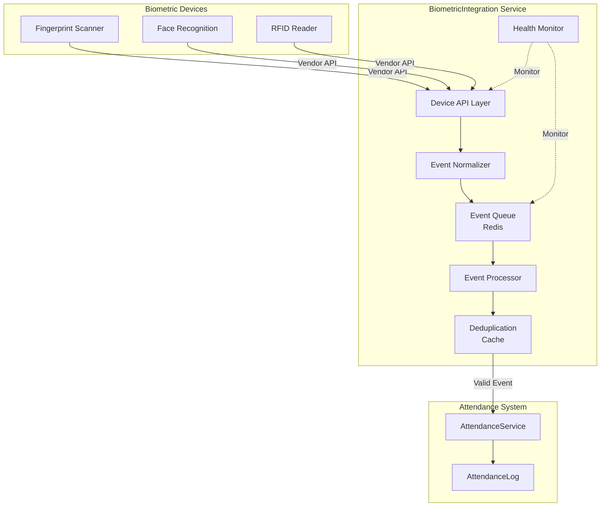
```mermaid
graph TB
    subgraph "Biometric Devices"
        FP[Fingerprint Scanner]
        FR[Face Recognition]
        RFID[RFID Reader]
    end
    
    subgraph "BiometricIntegration Service"
        API[Device API Layer]
        NORM[Event Normalizer]
        QUEUE[Event Queue<br/>Redis]
        PROC[Event Processor]
        DEDUP[Deduplication<br/>Cache]
        HEALTH[Health Monitor]
    end
    
    subgraph "Attendance System"
        ATT[AttendanceService]
        LOG[AttendanceLog]
    end
    
    FP -->|Vendor API| API
    FR -->|Vendor API| API
    RFID -->|Vendor API| API
    
    API --> NORM
    NORM --> QUEUE
    QUEUE --> PROC
    PROC --> DEDUP
    DEDUP -->|Valid Event| ATT
    ATT --> LOG
    
    HEALTH -.->|Monitor| API
    HEALTH -.->|Monitor| QUEUE
```

### Vendor Adapter Pattern

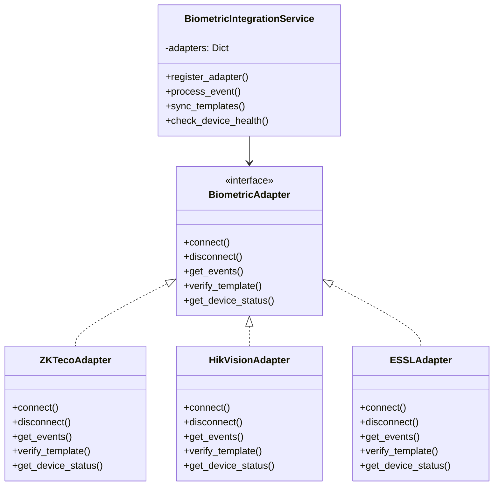
```mermaid
classDiagram
    class BiometricAdapter {
        <<interface>>
        +connect()
        +disconnect()
        +get_events()
        +verify_template()
        +get_device_status()
    }
    
    class ZKTecoAdapter {
        +connect()
        +disconnect()
        +get_events()
        +verify_template()
        +get_device_status()
    }
    
    class HikVisionAdapter {
        +connect()
        +disconnect()
        +get_events()
        +verify_template()
        +get_device_status()
    }
    
    class ESSLAdapter {
        +connect()
        +disconnect()
        +get_events()
        +verify_template()
        +get_device_status()
    }
    
    class BiometricIntegrationService {
        -adapters: Dict
        +register_adapter()
        +process_event()
        +sync_templates()
        +check_device_health()
    }
    
    BiometricAdapter <|.. ZKTecoAdapter
    BiometricAdapter <|.. HikVisionAdapter
    BiometricAdapter <|.. ESSLAdapter
    BiometricIntegrationService --> BiometricAdapter
```

### Event Normalization Structure

| Source Field | Normalized Field | Type | Required | Description |
|--------------|------------------|------|----------|-------------|
| device_id | device_identifier | String | Yes | Unique device ID |
| user_id / emp_id | employee_code | String | Yes | Employee identifier |
| timestamp / event_time | event_timestamp | DateTime | Yes | UTC timestamp |
| punch_type / direction | event_type | Enum | Yes | IN/OUT/BREAK |
| template_score | match_score | Float | No | Verification confidence (0-100) |
| device_location | location_code | String | No | Device location identifier |
| photo / image | verification_image | Binary | No | Captured photo (base64) |

### Expected Outcome
- Functional BiometricIntegrationService class supporting multiple vendor devices
- Standardized event format regardless of device manufacturer
- Real-time event processing with less than 2-second latency
- Automatic reconnection on device communication failures
- Device health monitoring with alerting capabilities
- Event deduplication preventing duplicate punch records

### Verification Steps
1. Connect to test biometric device and verify successful communication
2. Send test punch event and verify it's normalized correctly
3. Verify event appears in Redis queue
4. Confirm AttendanceLog record created with device information
5. Test device disconnection and automatic reconnection
6. Verify duplicate event within 30 seconds is ignored
7. Check device health status is accurately reported
8. Test with multiple devices simultaneously

---

## Task 42: Device Registration and Management

### Overview
Implement device registration system allowing administrators to register, configure, and manage biometric devices across different locations. Each device is linked to specific locations and can have custom configurations.

### Dependencies
- Task 41: BiometricIntegration service
- Location model from Organization module
- User permission system

### Instructions

1. **Create BiometricDevice model** at `apps/attendance/models/biometric_device.py`

2. **Define device types enumeration** (FINGERPRINT, FACE_RECOGNITION, RFID, CARD_READER)

3. **Add device vendor field** to track manufacturer (ZKTECO, HIKVISION, ESSL, SUPREMA, etc.)

4. **Implement connection configuration fields** (IP address, port, serial number, API credentials)

5. **Add location association** linking device to specific work location

6. **Create device status tracking** (ACTIVE, INACTIVE, MAINTENANCE, OFFLINE)

7. **Implement device capabilities flags** (photo_capture, template_storage, offline_mode)

8. **Add last_sync_time tracking** for template synchronization monitoring

9. **Create device registration API endpoint** for adding new devices

10. **Implement device configuration update endpoint** allowing settings modification

11. **Add device health status endpoint** returning real-time connectivity status

12. **Create device deletion with safety checks** ensuring no active logs reference the device

### Data Model Structure

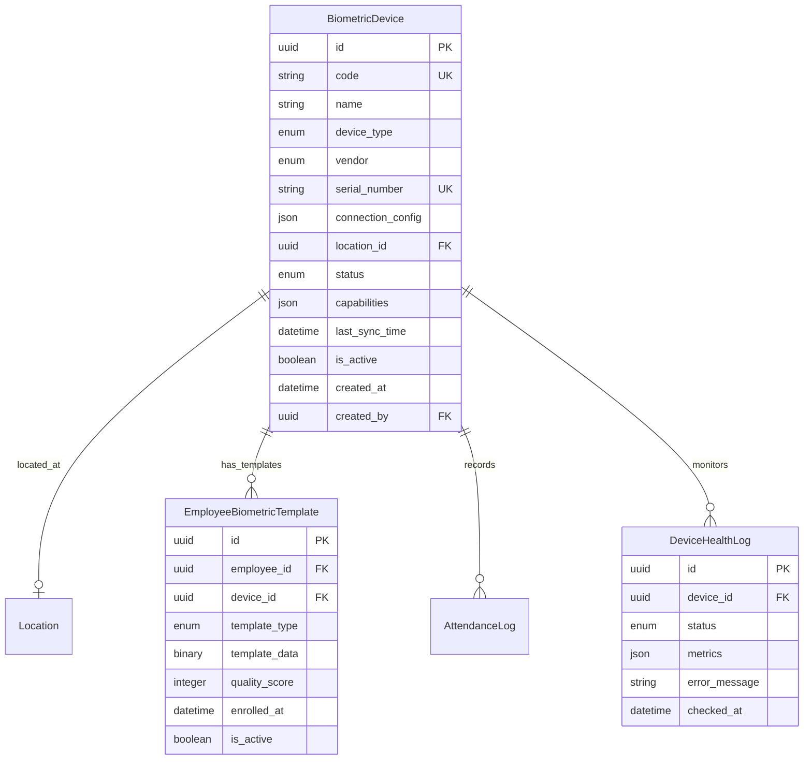
```mermaid
erDiagram
    BiometricDevice ||--o| Location : located_at
    BiometricDevice ||--o{ EmployeeBiometricTemplate : has_templates
    BiometricDevice ||--o{ AttendanceLog : records
    BiometricDevice ||--o{ DeviceHealthLog : monitors
    
    BiometricDevice {
        uuid id PK
        string code UK
        string name
        enum device_type
        enum vendor
        string serial_number UK
        json connection_config
        uuid location_id FK
        enum status
        json capabilities
        datetime last_sync_time
        boolean is_active
        datetime created_at
        uuid created_by FK
    }
    
    EmployeeBiometricTemplate {
        uuid id PK
        uuid employee_id FK
        uuid device_id FK
        enum template_type
        binary template_data
        integer quality_score
        datetime enrolled_at
        boolean is_active
    }
    
    DeviceHealthLog {
        uuid id PK
        uuid device_id FK
        enum status
        json metrics
        string error_message
        datetime checked_at
    }
```

### Device Configuration Schema

| Configuration Key | Type | Required | Default | Description |
|-------------------|------|----------|---------|-------------|
| ip_address | String | Yes* | - | Device IP (LAN devices) |
| port | Integer | Yes* | 4370 | Communication port |
| protocol | Enum | Yes | TCP | TCP/UDP/HTTP |
| api_endpoint | String | No | - | Cloud device API URL |
| api_key | String | No | - | API authentication key |
| timeout_seconds | Integer | No | 30 | Connection timeout |
| max_retries | Integer | No | 3 | Failed connection retries |
| sync_interval | Integer | No | 300 | Template sync interval (seconds) |
| offline_buffer_size | Integer | No | 5000 | Offline event storage capacity |
| photo_quality | Integer | No | 80 | Photo compression quality (1-100) |
| verification_threshold | Integer | No | 70 | Minimum match score for acceptance |

\*Required for LAN devices, not for cloud-based devices

### Device Management Workflow

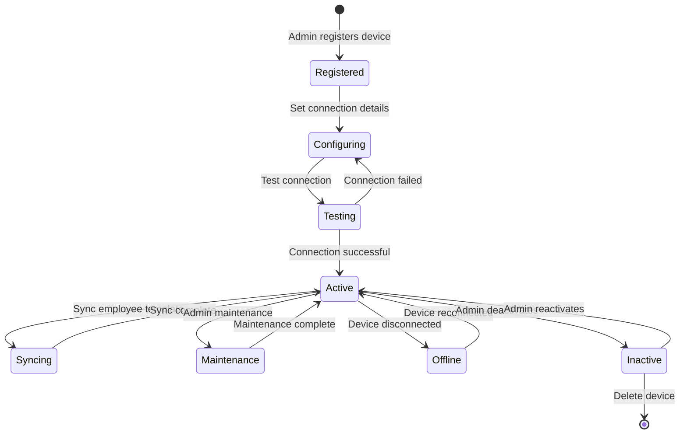
```mermaid
stateDiagram-v2
    [*] --> Registered: Admin registers device
    Registered --> Configuring: Set connection details
    Configuring --> Testing: Test connection
    Testing --> Active: Connection successful
    Testing --> Configuring: Connection failed
    Active --> Syncing: Sync employee templates
    Syncing --> Active: Sync complete
    Active --> Maintenance: Admin maintenance
    Maintenance --> Active: Maintenance complete
    Active --> Offline: Device disconnected
    Offline --> Active: Device reconnected
    Active --> Inactive: Admin deactivates
    Inactive --> Active: Admin reactivates
    Inactive --> [*]: Delete device
```

### Device Capabilities Matrix

| Device Type | Photo Capture | Template Storage | Offline Mode | Real-time Push | Access Control |
|-------------|---------------|------------------|--------------|----------------|----------------|
| Fingerprint Scanner | Optional | Yes | Yes | Optional | No |
| Face Recognition | Yes | Yes | Yes | Yes | Optional |
| RFID Reader | No | Limited | Yes | Yes | Yes |
| Card Reader | No | No | No | Yes | Yes |
| Mobile App | Yes | No | N/A | Yes | Yes |

### Expected Outcome
- Complete BiometricDevice model with all configuration fields
- Device registration API allowing dynamic device addition
- Device management dashboard showing status of all devices
- Real-time device health monitoring
- Location-based device filtering
- Template synchronization tracking per device

### Verification Steps
1. Register a new fingerprint device via admin panel
2. Configure connection settings (IP, port, credentials)
3. Test device connectivity and verify success status
4. Associate device with specific work location
5. Upload employee biometric templates to device
6. Verify device appears in device list with ACTIVE status
7. Simulate device disconnect and verify OFFLINE status
8. Check DeviceHealthLog records are created periodically
9. Deactivate device and verify no events processed
10. Delete inactive device successfully

---

## Task 43: Biometric Event Processing (PUNCH_IN/PUNCH_OUT)

### Overview
Implement real-time processing of biometric punch events from registered devices. This includes event validation, employee verification, duplicate detection, and creating attendance log records.

### Dependencies
- Task 41: BiometricIntegration service
- Task 42: BiometricDevice model
- Task 34: ClockIn method
- Task 35: ClockOut method
- Redis for event queue

### Instructions

1. **Create BiometricEventProcessor class** at `apps/attendance/services/biometric_event_processor.py`

2. **Implement event queue consumer** using Celery to process Redis queue

3. **Add employee verification logic** matching biometric ID to Employee record

4. **Create punch type detection** analyzing event pattern to determine IN/OUT

5. **Implement smart punch detection** (if last log is IN, next must be OUT)

6. **Add location validation** ensuring employee is authorized for device location

7. **Create shift context enrichment** adding shift information to event

8. **Implement duplicate detection** checking for identical events within time window

9. **Add photo storage** for face recognition device captures

10. **Create event logging** storing raw events for audit trail

11. **Implement error handling** for invalid employee, unauthorized location, device errors

12. **Add notification triggers** for successful/failed punch events

### Event Processing Flow

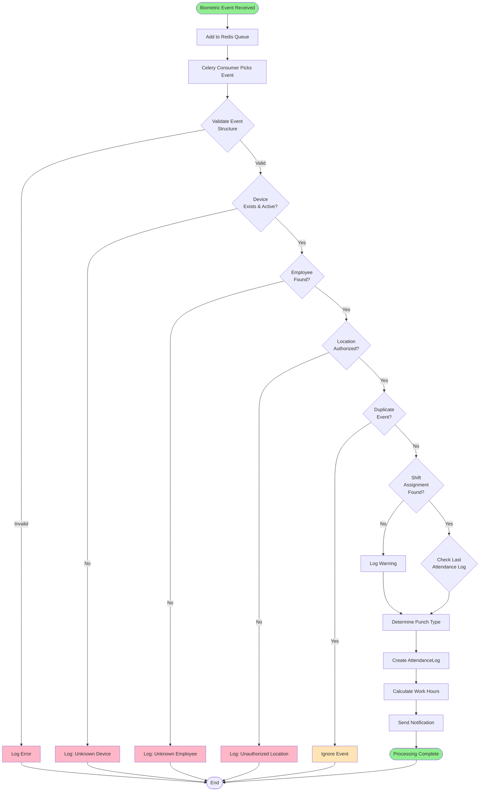
```mermaid
flowchart TD
    START([Biometric Event Received]) --> QUEUE[Add to Redis Queue]
    QUEUE --> CONSUME[Celery Consumer Picks Event]
    CONSUME --> VALIDATE{Validate Event<br/>Structure}
    VALIDATE -->|Invalid| ERROR1[Log Error]
    VALIDATE -->|Valid| DEVICE{Device<br/>Exists & Active?}
    
    DEVICE -->|No| ERROR2[Log: Unknown Device]
    DEVICE -->|Yes| EMPLOYEE{Employee<br/>Found?}
    
    EMPLOYEE -->|No| ERROR3[Log: Unknown Employee]
    EMPLOYEE -->|Yes| LOCATION{Location<br/>Authorized?}
    
    LOCATION -->|No| ERROR4[Log: Unauthorized Location]
    LOCATION -->|Yes| DUPLICATE{Duplicate<br/>Event?}
    
    DUPLICATE -->|Yes| IGNORE[Ignore Event]
    DUPLICATE -->|No| SHIFT{Shift<br/>Assignment<br/>Found?}
    
    SHIFT -->|No| WARN[Log Warning]
    SHIFT -->|Yes| LASTLOG{Check Last<br/>Attendance Log}
    
    WARN --> DETERMINE
    LASTLOG --> DETERMINE[Determine Punch Type]
    DETERMINE --> CREATE[Create AttendanceLog]
    CREATE --> CALC[Calculate Work Hours]
    CALC --> NOTIFY[Send Notification]
    NOTIFY --> SUCCESS([Processing Complete])
    
    ERROR1 --> END([End])
    ERROR2 --> END
    ERROR3 --> END
    ERROR4 --> END
    IGNORE --> END
    SUCCESS --> END
    
    style START fill:#90EE90
    style SUCCESS fill:#90EE90
    style ERROR1 fill:#FFB6C6
    style ERROR2 fill:#FFB6C6
    style ERROR3 fill:#FFB6C6
    style ERROR4 fill:#FFB6C6
    style IGNORE fill:#FFE4B5
```

### Event Validation Rules

| Validation Check | Rule | Error Code | Action |
|------------------|------|------------|--------|
| Event structure | Required fields present | EVT_001 | Reject |
| Timestamp format | Valid ISO 8601 datetime | EVT_002 | Reject |
| Timestamp range | Within last 7 days | EVT_003 | Reject |
| Device exists | BiometricDevice record found | DEV_001 | Reject |
| Device active | Device status = ACTIVE | DEV_002 | Reject |
| Employee exists | Employee record found by code | EMP_001 | Reject |
| Employee active | Employee status = ACTIVE | EMP_002 | Reject |
| Location auth | Employee authorized for location | LOC_001 | Reject |
| Duplicate check | No identical event in last 30s | DUP_001 | Ignore |
| Match score | Score >= device threshold | BIO_001 | Warning |
| Shift assignment | Employee has shift on date | SHF_001 | Warning |

### Smart Punch Type Detection Logic

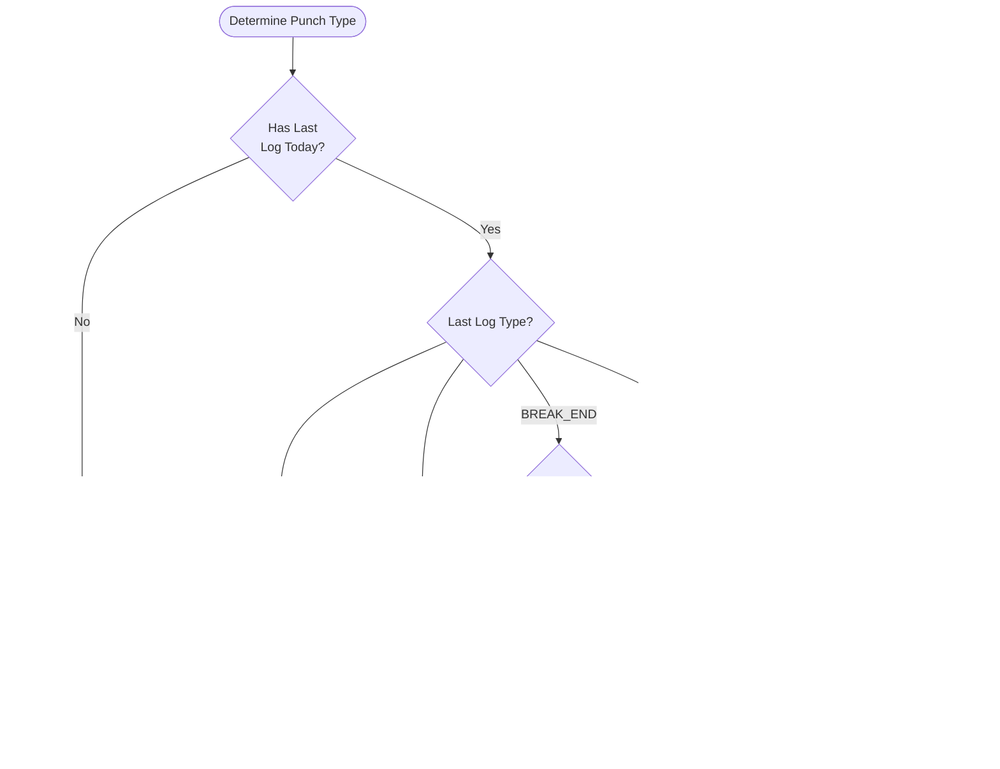
```mermaid
flowchart TD
    START([Determine Punch Type]) --> LASTLOG{Has Last<br/>Log Today?}
    
    LASTLOG -->|No| FIRSTPUNCH[First Punch of Day]
    FIRSTPUNCH --> CHECKIN[Create PUNCH_IN]
    
    LASTLOG -->|Yes| LASTTYPE{Last Log Type?}
    
    LASTTYPE -->|PUNCH_IN| CHECKOUTLOGIC[Create PUNCH_OUT]
    LASTTYPE -->|PUNCH_OUT| CHECKINLOGIC[Create PUNCH_IN]
    LASTTYPE -->|BREAK_START| BREAKENDLOGIC[Create BREAK_END]
    LASTTYPE -->|BREAK_END| NEWCYCLE{Time Since<br/>Last > 1 hour?}
    
    NEWCYCLE -->|Yes| CHECKINLOGIC
    NEWCYCLE -->|No| ERROR[Error: Too Soon]
    
    CHECKIN --> END([End])
    CHECKOUTLOGIC --> END
    CHECKINLOGIC --> END
    BREAKENDLOGIC --> END
    ERROR --> END
```

### Duplicate Detection Strategy

| Strategy | Window | Key Components | Use Case |
|----------|--------|----------------|----------|
| Exact Match | 30 seconds | employee_id + device_id + timestamp | Prevent device double-send |
| Template Match | 60 seconds | employee_id + device_id + event_type | Prevent button mashing |
| Location Match | 120 seconds | employee_id + location + event_type | Prevent multiple device punches |
| Smart Match | 300 seconds | employee_id + event_type + calculated | Prevent manual entry duplicates |

### Expected Outcome
- Real-time biometric event processing with <2 second latency
- Accurate punch type detection (IN/OUT) based on context
- Duplicate event prevention across all strategies
- Comprehensive error handling and logging
- Photo capture storage for face recognition events
- Notification system for punch confirmations
- Audit trail of all processed and rejected events

### Verification Steps
1. Send PUNCH_IN event from biometric device
2. Verify AttendanceLog created with type=PUNCH_IN
3. Send duplicate event within 30 seconds
4. Verify duplicate is ignored and logged
5. Send PUNCH_OUT event 2 hours later
6. Verify AttendanceLog created with type=PUNCH_OUT
7. Verify work_hours calculated between IN and OUT
8. Send event for unauthorized location
9. Verify event rejected with LOC_001 error
10. Send event for inactive employee
11. Verify event rejected with EMP_002 error
12. Check photo stored for face recognition event
13. Verify notification sent to employee

---

## Task 44: MobileCheckIn Service with GPS

### Overview
Implement mobile check-in functionality allowing employees to punch in/out using their mobile devices with GPS location capture. This provides flexibility for field employees and remote workers while maintaining location verification.

### Dependencies
- Task 33: AttendanceService class
- Task 34: ClockIn method
- Task 35: ClockOut method
- Mobile app API endpoints
- Google Maps / OpenStreetMap API

### Instructions

1. **Create MobileCheckInService class** at `apps/attendance/services/mobile_checkin.py`

2. **Implement GPS coordinate capture** from mobile device location services

3. **Add location accuracy validation** ensuring minimum 20-meter accuracy

4. **Create reverse geocoding** converting coordinates to human-readable address

5. **Implement photo capture requirement** mandating selfie for mobile check-ins

6. **Add device information capture** (device ID, OS version, app version)

7. **Create location authorization check** verifying employee can check-in from location

8. **Implement geofencing validation** checking if within authorized work locations

9. **Add offline check-in support** allowing storage when no network connectivity

10. **Create sync mechanism** for uploading offline punches when connection restored

11. **Implement IP address logging** for additional verification

12. **Add anomaly detection** flagging suspicious patterns (GPS spoofing, rapid location changes)

### Mobile Check-In Architecture

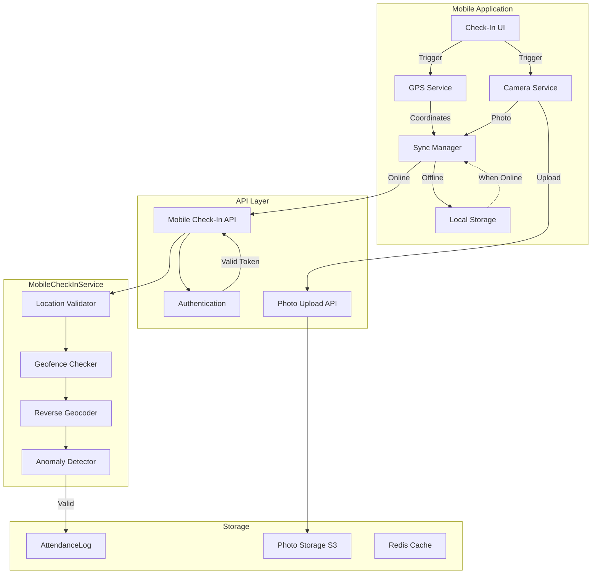
```mermaid
graph TB
    subgraph "Mobile Application"
        UI[Check-In UI]
        GPS[GPS Service]
        CAMERA[Camera Service]
        STORAGE[Local Storage]
        SYNC[Sync Manager]
    end
    
    subgraph "API Layer"
        AUTH[Authentication]
        MOBILE_API[Mobile Check-In API]
        UPLOAD[Photo Upload API]
    end
    
    subgraph "MobileCheckInService"
        VALIDATE[Location Validator]
        GEOCHECK[Geofence Checker]
        REVERSE[Reverse Geocoder]
        ANOMALY[Anomaly Detector]
    end
    
    subgraph "Storage"
        ATTLOG[AttendanceLog]
        PHOTO_S3[Photo Storage S3]
        CACHE[Redis Cache]
    end
    
    UI -->|Trigger| GPS
    UI -->|Trigger| CAMERA
    GPS -->|Coordinates| SYNC
    CAMERA -->|Photo| SYNC
    
    SYNC -->|Online| MOBILE_API
    SYNC -->|Offline| STORAGE
    STORAGE -.->|When Online| SYNC
    
    MOBILE_API --> AUTH
    AUTH -->|Valid Token| MOBILE_API
    MOBILE_API --> VALIDATE
    VALIDATE --> GEOCHECK
    GEOCHECK --> REVERSE
    REVERSE --> ANOMALY
    ANOMALY -->|Valid| ATTLOG
    
    CAMERA -->|Upload| UPLOAD
    UPLOAD --> PHOTO_S3
```

### Mobile Check-In Request Payload

| Field | Type | Required | Validation | Description |
|-------|------|----------|------------|-------------|
| employee_id | UUID | Yes | Valid employee | Employee identifier |
| punch_type | Enum | Yes | IN/OUT/BREAK_START/BREAK_END | Type of punch |
| timestamp | DateTime | Yes | ISO 8601, UTC | Punch timestamp |
| latitude | Decimal | Yes | -90 to 90 | GPS latitude |
| longitude | Decimal | Yes | -180 to 180 | GPS longitude |
| accuracy | Float | Yes | > 0 meters | GPS accuracy |
| altitude | Float | No | Meters | GPS altitude |
| photo_base64 | String | Yes | Valid base64 image | Selfie photo |
| device_id | String | Yes | Max 255 chars | Unique device identifier |
| device_os | String | Yes | Android/iOS | Operating system |
| device_model | String | No | Max 100 chars | Device model |
| app_version | String | Yes | Semantic version | App version |
| ip_address | String | No | Valid IP | Device IP address |
| is_offline_sync | Boolean | No | true/false | Offline punch sync flag |
| offline_stored_at | DateTime | No* | ISO 8601 | Original capture time |

\*Required if is_offline_sync = true

### Location Accuracy Requirements

| Accuracy Level | Range | Validity | Check-In Allowed | Warning Level |
|----------------|-------|----------|------------------|---------------|
| Excellent | 0-10m | High confidence | Yes | None |
| Good | 10-20m | Acceptable | Yes | None |
| Fair | 20-50m | Moderate | Yes | Low warning |
| Poor | 50-100m | Low confidence | Yes | Medium warning |
| Very Poor | 100-500m | Very low | No | High warning |
| Unusable | >500m | Unreliable | No | Reject |

### Expected Outcome
- Functional mobile check-in API accepting GPS-enabled punches
- Photo capture requirement enforced for all mobile punches
- Location accuracy validation rejecting low-quality coordinates
- Reverse geocoding providing human-readable addresses
- Offline punch support with automatic syncing
- Device information logged for security auditing
- Anomaly detection flagging suspicious patterns

### Verification Steps
1. Make mobile check-in request with valid GPS coordinates
2. Verify AttendanceLog created with location data
3. Check photo uploaded and stored in S3
4. Verify reverse geocoded address saved
5. Test check-in with accuracy >100m
6. Verify request rejected with accuracy error
7. Create offline punch and sync later
8. Verify offline punch processed correctly
9. Test rapid location changes (GPS spoofing detection)
10. Verify anomaly flag set appropriately
11. Check device information logged correctly

---

## Task 45: GPS Geofencing Validation (200m Radius)

### Overview
Implement geofencing validation to ensure mobile check-ins occur within authorized work locations. Each work location has a defined GPS coordinate and radius, and employees can only check-in when within the geofence boundary.

### Dependencies
- Task 44: MobileCheckIn service
- Location model with GPS coordinates
- Employee work location assignments

### Instructions

1. **Add GPS fields to Location model** (latitude, longitude, geofence_radius)

2. **Create GeofenceValidator class** at `apps/attendance/validators/geofence.py`

3. **Implement Haversine distance calculation** for accurate GPS distance measurement

4. **Add geofence boundary checking** comparing employee location to work location

5. **Create multi-location support** allowing check-in at any assigned work location

6. **Implement flexible radius configuration** allowing per-location radius settings (default: 200m)

7. **Add geofence override permissions** for specific roles (managers, field staff)

8. **Create geofence breach logging** recording all failed geofence validations

9. **Implement proximity warnings** notifying when close but outside boundary

10. **Add dynamic geofence adjustment** based on GPS accuracy (expand radius for poor accuracy)

11. **Create geofence visualization data** for admin dashboard mapping

### Geofence Validation Flow

```mermaid
flowchart TD
    START([Mobile Check-In Request]) --> EXTRACT[Extract GPS Coordinates]
    EXTRACT --> ACCURACY{GPS Accuracy<br/>< 50m?}
    
    ACCURACY -->|No| REJECT1[Reject: Poor GPS Accuracy]
    ACCURACY -->|Yes| LOCATIONS[Get Employee Work Locations]
    
    LOCATIONS --> HASLOCATIONS{Has Assigned<br/>Locations?}
    HASLOCATIONS -->|No| OVERRIDE{Has Geofence<br/>Override Permission?}
    
    OVERRIDE -->|No| REJECT2[Reject: No Assigned Locations]
    OVERRIDE -->|Yes| ALLOW1[Allow with Warning Flag]
    
    HASLOCATIONS -->|Yes| ITERATE[Calculate Distance to Each Location]
    ITERATE --> CALCULATE[Use Haversine Formula]
    CALCULATE --> FINDCLOSEST[Find Closest Location]
    
    FINDCLOSEST --> CHECKDIST{Distance <br/>Geofence Radius?}
    
    CHECKDIST -->|No| PROXIMITY{Distance < <br/>Radius + 50m?}
    PROXIMITY -->|Yes| WARN[Reject with Proximity Warning]
    PROXIMITY -->|No| REJECT3[Reject: Outside Geofence]
    
    CHECKDIST -->|Yes| ADJUSTRADIUS{Poor GPS<br/>Accuracy?}
    ADJUSTRADIUS -->|Yes| EXPANDCHECK[Expand Radius by Accuracy]
    ADJUSTRADIUS -->|No| VALID
    EXPANDCHECK --> VALID[Valid Geofence]
    
    VALID --> LOGVALID[Log Valid Check-In]
    LOGVALID --> SUCCESS([Allow Check-In])
    
    REJECT1 --> LOG1[Log Geofence Breach]
    REJECT2 --> LOG2[Log Geofence Breach]
    REJECT3 --> LOG3[Log Geofence Breach]
    WARN --> LOG4[Log Proximity Warning]
    ALLOW1 --> LOG5[Log Override Usage]
    
    LOG1 --> END([End])
    LOG2 --> END
    LOG3 --> END
    LOG4 --> END
    LOG5 --> END
    SUCCESS --> END
```

### Haversine Distance Calculation

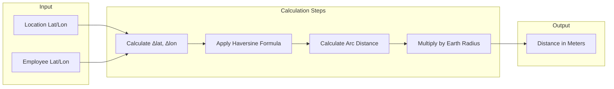
```mermaid
graph LR
    subgraph "Input"
        LAT1[Location Lat/Lon]
        LAT2[Employee Lat/Lon]
    end
    
    subgraph "Calculation Steps"
        DIFF[Calculate Δlat, Δlon]
        HALF[Apply Haversine Formula]
        ASIN[Calculate Arc Distance]
        MULT[Multiply by Earth Radius]
    end
    
    subgraph "Output"
        DIST[Distance in Meters]
    end
    
    LAT1 --> DIFF
    LAT2 --> DIFF
    DIFF --> HALF
    HALF --> ASIN
    ASIN --> MULT
    MULT --> DIST
```

**Haversine Formula:**
$$
a = \sin^2(\frac{\Delta\phi}{2}) + \cos(\phi_1) \cdot \cos(\phi_2) \cdot \sin^2(\frac{\Delta\lambda}{2})
$$
$$
c = 2 \cdot \text{atan2}(\sqrt{a}, \sqrt{1-a})
$$
$$
d = R \cdot c
$$

Where:
- φ = latitude in radians
- λ = longitude in radians
- R = Earth's radius (6371 km or 6371000 m)

### Geofence Configuration Matrix

| Location Type | Default Radius | Adjustable | Override Allowed | Accuracy Expansion | Notes |
|---------------|----------------|------------|------------------|-------------------|-------|
| Office | 200m | Yes | No | Yes | Standard office building |
| Factory | 500m | Yes | No | Yes | Large industrial complex |
| Retail Store | 100m | Yes | No | Yes | Small retail outlet |
| Field Site | 300m | Yes | Yes | Yes | Construction sites |
| Client Location | 250m | Yes | Yes | Yes | Client premises |
| Anywhere | N/A | N/A | Yes | N/A | Remote/field workers only |

### Geofence Breach Logging

| Field | Type | Purpose | Retention |
|-------|------|---------|-----------|
| breach_id | UUID | Unique identifier | 1 year |
| employee_id | UUID | Employee who attempted | 1 year |
| attempted_at | DateTime | Breach timestamp | 1 year |
| punch_type | Enum | IN/OUT/BREAK | 1 year |
| employee_lat | Decimal | Employee GPS latitude | 1 year |
| employee_lon | Decimal | Employee GPS longitude | 1 year |
| closest_location_id | UUID | Nearest work location | 1 year |
| distance_meters | Float | Distance from boundary | 1 year |
| geofence_radius | Integer | Location geofence radius | 1 year |
| breach_margin | Float | How far outside (meters) | 1 year |
| gps_accuracy | Float | GPS accuracy at attempt | 1 year |
| device_info | JSON | Device details | 1 year |
| photo_url | String | Attempted selfie photo | 1 year |
| breach_severity | Enum | LOW/MEDIUM/HIGH | 1 year |

### Geofence Override Rules

| Role | Override Allowed | Conditions | Audit Level |
|------|------------------|------------|-------------|
| Regular Employee | No | None | N/A |
| Field Worker | Yes | Only for CLIENT_LOCATION type | High |
| Manager | Yes | Only for direct reports | Medium |
| HR Admin | Yes | Any location, any employee | High |
| System Admin | Yes | Unrestricted | Critical |

### Expected Outcome
- Location model enhanced with GPS coordinates and configurable radius
- Accurate geofence validation using Haversine distance calculation
- Multi-location support checking all assigned work locations
- Flexible radius configuration per location
- Geofence breach logging with detailed audit trail
- Role-based override capabilities for field workers and managers
- Dynamic radius expansion based on GPS accuracy
- Proximity warnings for near-boundary attempts

### Verification Steps
1. Add GPS coordinates (6.9271, 79.8612) to Colombo office location
2. Set geofence radius to 200 meters
3. Create mobile check-in from coordinates within 150m
4. Verify check-in succeeds and correct location associated
5. Create mobile check-in from coordinates 250m away
6. Verify check-in rejected with geofence error
7. Create mobile check-in from 220m away with 50m accuracy
8. Verify check-in accepted due to accuracy expansion
9. Check GeofenceBreach record created for failed attempt
10. Test employee with multiple work locations
11. Verify check-in succeeds at any assigned location
12. Test field worker with override permission
13. Verify override logged with high audit level
14. Generate geofence breach report for last month

---

## Task 46: AttendanceRegularization Model

### Overview
Create the data model for attendance regularization allowing employees to request corrections or additions to their attendance records. This handles missed punches, incorrect times, and other attendance discrepancies requiring approval workflows.

### Dependencies
- AttendanceLog model
- Employee model
- User permission system
- Approval workflow system

### Instructions

1. **Create AttendanceRegularization model** at `apps/attendance/models/regularization.py`

2. **Define regularization types** (MISSED_PUNCH, INCORRECT_TIME, FORGOT_PUNCH, LEAVE_MARKING, OTHER)

3. **Add relationship to original AttendanceLog** (if correcting existing record)

4. **Create requested changes fields** storing employee's proposed corrections

5. **Implement approval workflow fields** (status, approver, approval date, comments)

6. **Add supporting documentation** allowing file attachments for proof

7. **Create audit trail fields** tracking all status changes

8. **Implement automatic expiry** for pending requests older than configured days

9. **Add notification triggers** for status changes

10. **Create validation rules** ensuring logical consistency of requested changes

### Data Model Structure

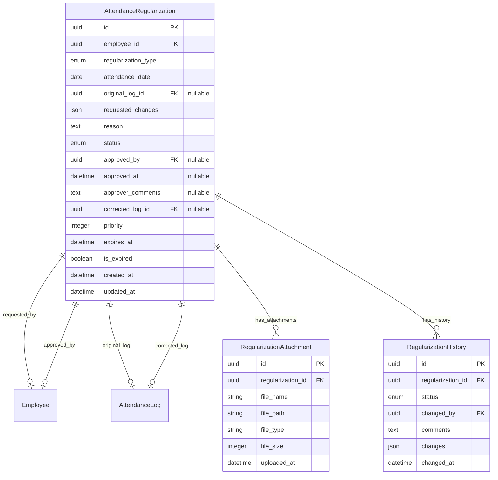
```mermaid
erDiagram
    AttendanceRegularization ||--o| Employee : requested_by
    AttendanceRegularization ||--o| Employee : approved_by
    AttendanceRegularization ||--o| AttendanceLog : original_log
    AttendanceRegularization ||--o| AttendanceLog : corrected_log
    AttendanceRegularization ||--o{ RegularizationAttachment : has_attachments
    AttendanceRegularization ||--o{ RegularizationHistory : has_history
    
    AttendanceRegularization {
        uuid id PK
        uuid employee_id FK
        enum regularization_type
        date attendance_date
        uuid original_log_id FK "nullable"
        json requested_changes
        text reason
        enum status
        uuid approved_by FK "nullable"
        datetime approved_at "nullable"
        text approver_comments "nullable"
        uuid corrected_log_id FK "nullable"
        integer priority
        datetime expires_at
        boolean is_expired
        datetime created_at
        datetime updated_at
    }
    
    RegularizationAttachment {
        uuid id PK
        uuid regularization_id FK
        string file_name
        string file_path
        string file_type
        integer file_size
        datetime uploaded_at
    }
    
    RegularizationHistory {
        uuid id PK
        uuid regularization_id FK
        enum status
        uuid changed_by FK
        text comments
        json changes
        datetime changed_at
    }
```

### Regularization Types and Scenarios

| Type | Scenario | Required Fields | Approval Level | Example |
|------|----------|----------------|----------------|---------|
| MISSED_PUNCH | Forgot to punch in/out | date, punch_type, time, reason | Manager | Forgot to punch in at morning |
| INCORRECT_TIME | Punched at wrong time | original_log_id, corrected_time, reason | Manager | Punched in at 9:30 instead of 9:00 |
| FORGOT_PUNCH | No punch for entire day | date, in_time, out_time, work_hours, reason | Manager | Worked but forgot both punches |
| LEAVE_MARKING | Absent but should be leave | date, leave_type, reason, proof | HR | Was on medical leave, forgot to apply |
| WRONG_LOCATION | Punched at wrong location | original_log_id, correct_location, reason | Manager | Punched at Branch A, worked at Branch B |
| SYSTEM_ERROR | Technical issue with system | original_log_id, issue_description | IT/HR | Biometric device malfunction |
| EARLY_DEPARTURE | Left early with permission | original_log_id, reason, approval_proof | Manager | Medical emergency, left at 3 PM |
| LATE_ARRIVAL | Arrived late with reason | original_log_id, reason | Supervisor | Traffic delay, arrived at 10 AM |
| OTHER | Other specific scenarios | reason, requested_changes | Manager/HR | Custom cases |

### Requested Changes JSON Schema

```json
{
  "change_type": "MISSED_PUNCH | INCORRECT_TIME | FORGOT_PUNCH",
  "attendance_date": "2026-01-24",
  "original_values": {
    "punch_in_time": "09:30:00",
    "punch_out_time": "18:15:00",
    "location": "Main Office"
  },
  "requested_values": {
    "punch_in_time": "09:00:00",
    "punch_out_time": "18:00:00",
    "location": "Branch Office"
  },
  "add_missing_punch": {
    "punch_type": "PUNCH_IN",
    "time": "09:00:00",
    "location_id": "uuid-here"
  },
  "delete_incorrect_punch": {
    "log_id": "uuid-here",
    "reason": "Accidental double punch"
  },
  "work_hours_adjustment": {
    "original_hours": 8.5,
    "requested_hours": 9.0,
    "justification": "Worked through lunch break"
  }
}
```

### Regularization Status Workflow

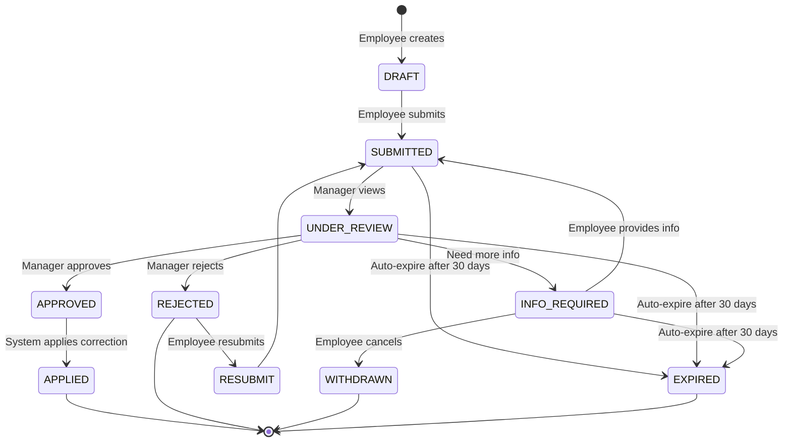
```mermaid
stateDiagram-v2
    [*] --> DRAFT: Employee creates
    DRAFT --> SUBMITTED: Employee submits
    SUBMITTED --> UNDER_REVIEW: Manager views
    
    UNDER_REVIEW --> APPROVED: Manager approves
    UNDER_REVIEW --> REJECTED: Manager rejects
    UNDER_REVIEW --> INFO_REQUIRED: Need more info
    
    INFO_REQUIRED --> SUBMITTED: Employee provides info
    INFO_REQUIRED --> WITHDRAWN: Employee cancels
    
    APPROVED --> APPLIED: System applies correction
    APPLIED --> [*]
    
    REJECTED --> RESUBMIT: Employee resubmits
    REJECTED --> [*]
    RESUBMIT --> SUBMITTED
    
    WITHDRAWN --> [*]
    
    SUBMITTED --> EXPIRED: Auto-expire after 30 days
    UNDER_REVIEW --> EXPIRED: Auto-expire after 30 days
    INFO_REQUIRED --> EXPIRED: Auto-expire after 30 days
    EXPIRED --> [*]
```

### Validation Rules

| Validation Rule | Check | Error Message |
|-----------------|-------|---------------|
| Date not in future | attendance_date <= today | Cannot regularize future attendance |
| Date within limit | attendance_date >= today - 90 days | Cannot regularize attendance older than 90 days |
| No duplicate request | No PENDING/UNDER_REVIEW for same date | Already have pending request for this date |
| Reason mandatory | reason field not empty | Reason is required for regularization |
| Logical time sequence | in_time < out_time | Check-out time must be after check-in time |
| Work hours reasonable | work_hours <= 24 | Work hours cannot exceed 24 hours |
| Original log exists | If type=INCORRECT_TIME, log must exist | Original attendance log not found |
| Employee active | employee.status = ACTIVE | Cannot create request for inactive employee |
| Not on leave | No approved leave for same date | Already on approved leave for this date |
| Within shift bounds | Times within shift schedule ±4 hours | Requested times too far from shift schedule |

### Expected Outcome
- Complete AttendanceRegularization model with all fields
- Support for multiple regularization types
- Flexible requested_changes JSON structure
- Comprehensive validation rules preventing invalid requests
- Audit trail tracking all status changes
- Automatic expiry for stale requests
- File attachment support for documentation
- Notification triggers on status changes

### Verification Steps
1. Create regularization request for missed punch yesterday
2. Verify status = DRAFT initially
3. Submit request and verify status = SUBMITTED
4. Check employee receives submission confirmation
5. Verify manager receives notification
6. Test validation: request for future date
7. Verify error: "Cannot regularize future attendance"
8. Test validation: request with out_time < in_time
9. Verify error: "Check-out time must be after check-in"
10. Create request with file attachment
11. Verify file uploaded and linked correctly
12. Check RegularizationHistory record created

---

## Task 47: Regularization Workflow (Request→Approval→Corrections)

### Overview
Implement the complete regularization workflow from employee request submission through manager approval/rejection to automatic attendance correction application. This includes approval hierarchies, delegation, and notification systems.

### Dependencies
- Task 46: AttendanceRegularization model
- Task 33: AttendanceService
- Approval workflow system
- Notification system
- Email/SMS integration

### Instructions

1. **Create RegularizationWorkflowService class** at `apps/attendance/services/regularization_workflow.py`

2. **Implement request submission method** validating and creating regularization requests

3. **Add approval hierarchy resolution** determining appropriate approver based on org structure

4. **Create manager approval method** allowing managers to approve requests

5. **Implement rejection method** with mandatory rejection reason

6. **Add information request method** when approver needs clarification

7. **Create auto-application logic** applying approved corrections to attendance logs

8. **Implement bulk approval** allowing managers to approve multiple requests

9. **Add delegation mechanism** for approvers to delegate approval authority

10. **Create escalation logic** auto-escalating to higher authority if no action in X days

11. **Implement notification system** sending alerts for all workflow state changes

12. **Add audit logging** recording all actions with timestamps and actors

### Workflow State Machine

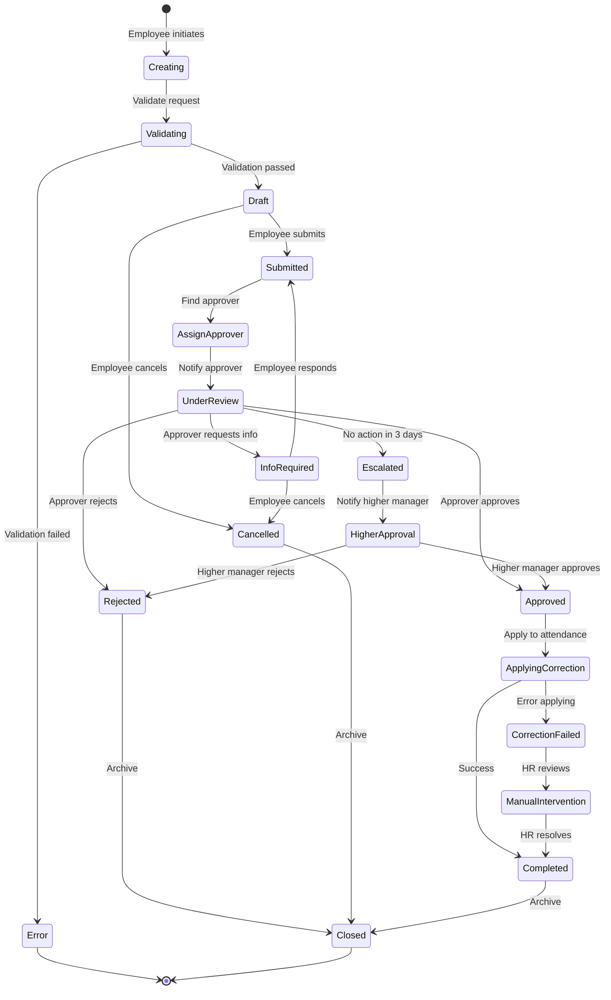
```mermaid
stateDiagram-v2
    [*] --> Creating: Employee initiates
    Creating --> Validating: Validate request
    
    Validating --> Error: Validation failed
    Validating --> Draft: Validation passed
    
    Draft --> Submitted: Employee submits
    Draft --> Cancelled: Employee cancels
    
    Submitted --> AssignApprover: Find approver
    AssignApprover --> UnderReview: Notify approver
    
    UnderReview --> Approved: Approver approves
    UnderReview --> Rejected: Approver rejects
    UnderReview --> InfoRequired: Approver requests info
    UnderReview --> Escalated: No action in 3 days
    
    Escalated --> HigherApproval: Notify higher manager
    HigherApproval --> Approved: Higher manager approves
    HigherApproval --> Rejected: Higher manager rejects
    
    InfoRequired --> Submitted: Employee responds
    InfoRequired --> Cancelled: Employee cancels
    
    Approved --> ApplyingCorrection: Apply to attendance
    ApplyingCorrection --> CorrectionFailed: Error applying
    ApplyingCorrection --> Completed: Success
    
    CorrectionFailed --> ManualIntervention: HR reviews
    ManualIntervention --> Completed: HR resolves
    
    Rejected --> Closed: Archive
    Cancelled --> Closed: Archive
    Completed --> Closed: Archive
    Error --> [*]
    Closed --> [*]
```

### Approval Hierarchy Resolution

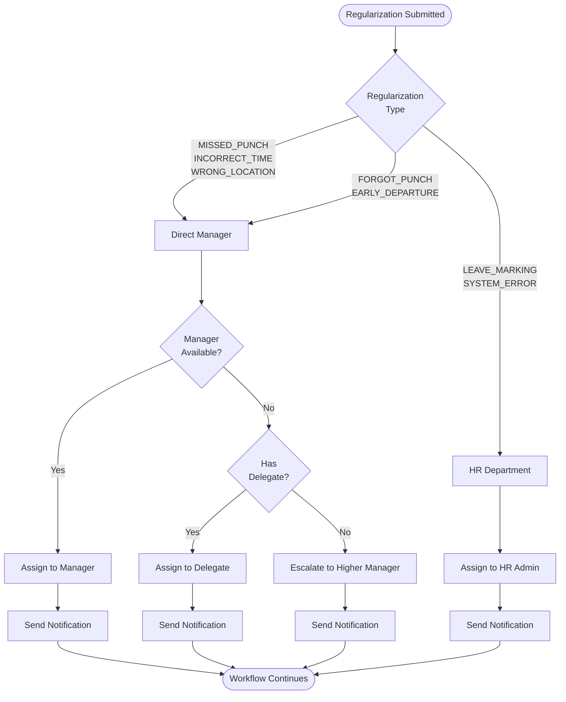
```mermaid
flowchart TD
    START([Regularization Submitted]) --> TYPE{Regularization<br/>Type}
    
    TYPE -->|MISSED_PUNCH<br/>INCORRECT_TIME<br/>WRONG_LOCATION| DIRECT[Direct Manager]
    TYPE -->|FORGOT_PUNCH<br/>EARLY_DEPARTURE| DIRECT
    TYPE -->|LEAVE_MARKING<br/>SYSTEM_ERROR| HR[HR Department]
    
    DIRECT --> AVAILABLE{Manager<br/>Available?}
    HR --> HRADMIN[Assign to HR Admin]
    
    AVAILABLE -->|Yes| ASSIGN1[Assign to Manager]
    AVAILABLE -->|No| DELEGATE{Has<br/>Delegate?}
    
    DELEGATE -->|Yes| ASSIGN2[Assign to Delegate]
    DELEGATE -->|No| HIGHER[Escalate to Higher Manager]
    
    ASSIGN1 --> NOTIFY1[Send Notification]
    ASSIGN2 --> NOTIFY2[Send Notification]
    HIGHER --> NOTIFY3[Send Notification]
    HRADMIN --> NOTIFY4[Send Notification]
    
    NOTIFY1 --> END([Workflow Continues])
    NOTIFY2 --> END
    NOTIFY3 --> END
    NOTIFY4 --> END
```

### Approval Decision Logic

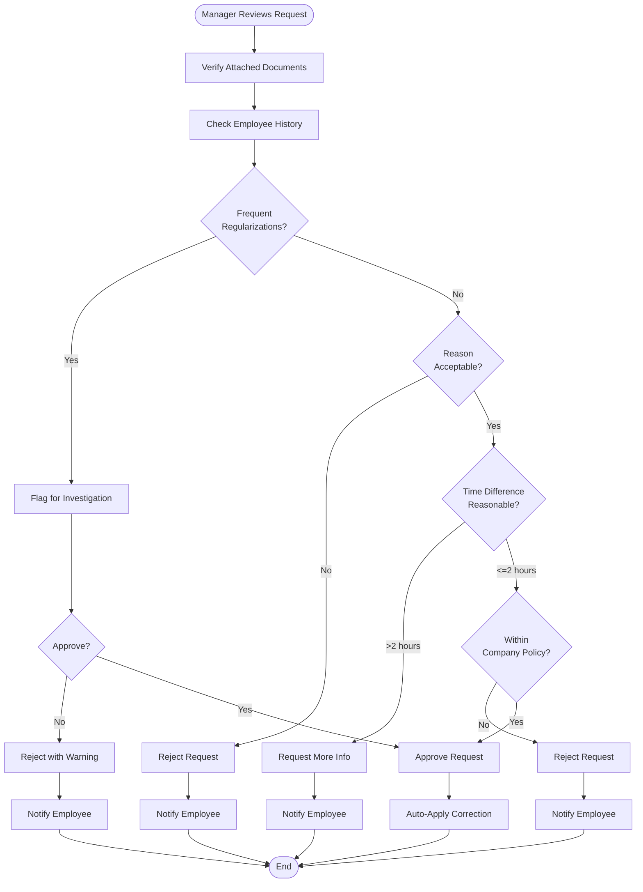
```mermaid
flowchart TD
    START([Manager Reviews Request]) --> VERIFY[Verify Attached Documents]
    VERIFY --> CHECK[Check Employee History]
    CHECK --> PATTERN{Frequent<br/>Regularizations?}
    
    PATTERN -->|Yes| FLAG[Flag for Investigation]
    PATTERN -->|No| REASON{Reason<br/>Acceptable?}
    
    FLAG --> DECISION1{Approve?}
    REASON -->|No| REJECT1[Reject Request]
    REASON -->|Yes| TIME{Time Difference<br/>Reasonable?}
    
    TIME -->|>2 hours| INFO[Request More Info]
    TIME -->|<=2 hours| POLICY{Within<br/>Company Policy?}
    
    POLICY -->|No| REJECT2[Reject Request]
    POLICY -->|Yes| APPROVE[Approve Request]
    
    DECISION1 -->|No| REJECT3[Reject with Warning]
    DECISION1 -->|Yes| APPROVE
    
    APPROVE --> APPLY[Auto-Apply Correction]
    REJECT1 --> NOTIFY1[Notify Employee]
    REJECT2 --> NOTIFY2[Notify Employee]
    REJECT3 --> NOTIFY3[Notify Employee]
    INFO --> NOTIFY4[Notify Employee]
    
    APPLY --> END([End])
    NOTIFY1 --> END
    NOTIFY2 --> END
    NOTIFY3 --> END
    NOTIFY4 --> END
```

### Auto-Application Correction Process

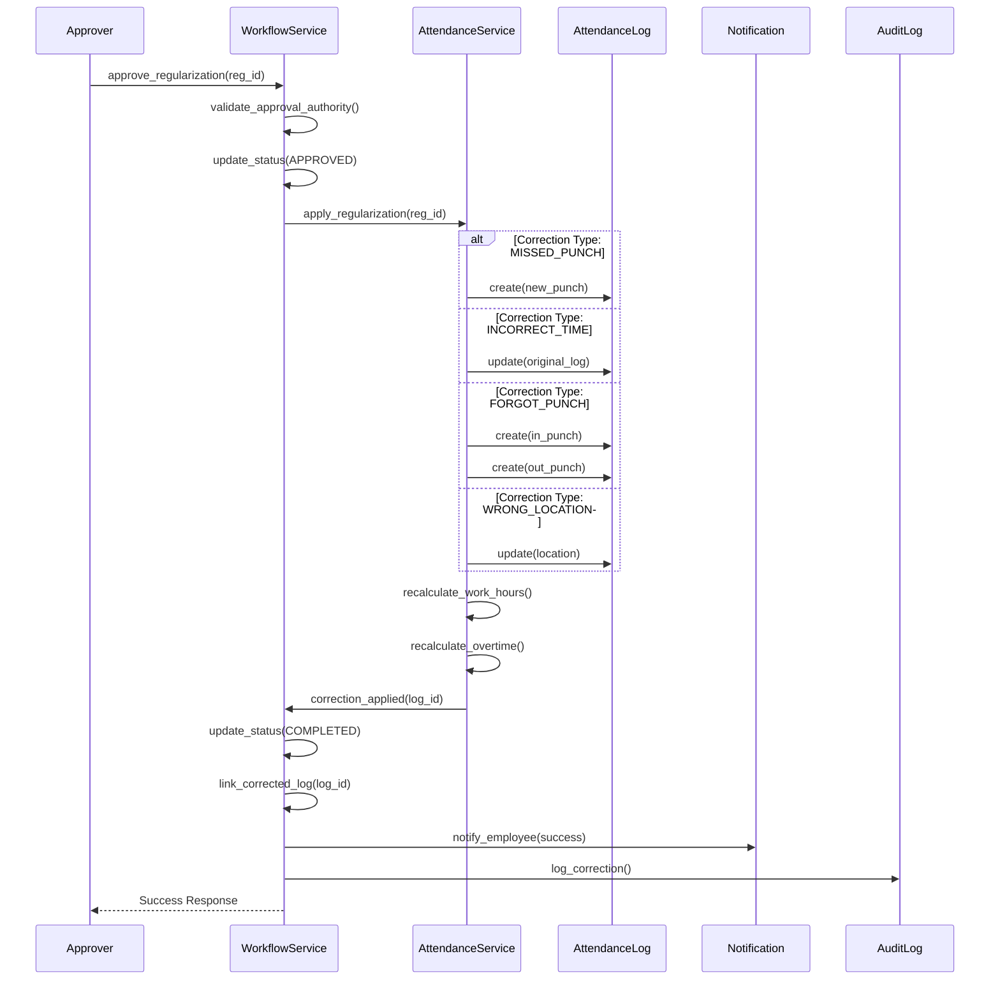
```mermaid
sequenceDiagram
    participant Approver
    participant WorkflowService
    participant AttendanceService
    participant AttendanceLog
    participant Notification
    participant AuditLog
    
    Approver->>WorkflowService: approve_regularization(reg_id)
    WorkflowService->>WorkflowService: validate_approval_authority()
    WorkflowService->>WorkflowService: update_status(APPROVED)
    
    WorkflowService->>AttendanceService: apply_regularization(reg_id)
    
    alt Correction Type: MISSED_PUNCH
        AttendanceService->>AttendanceLog: create(new_punch)
    else Correction Type: INCORRECT_TIME
        AttendanceService->>AttendanceLog: update(original_log)
    else Correction Type: FORGOT_PUNCH
        AttendanceService->>AttendanceLog: create(in_punch)
        AttendanceService->>AttendanceLog: create(out_punch)
    else Correction Type: WRONG_LOCATION
        AttendanceService->>AttendanceLog: update(location)
    end
    
    AttendanceService->>AttendanceService: recalculate_work_hours()
    AttendanceService->>AttendanceService: recalculate_overtime()
    
    AttendanceService->>WorkflowService: correction_applied(log_id)
    WorkflowService->>WorkflowService: update_status(COMPLETED)
    WorkflowService->>WorkflowService: link_corrected_log(log_id)
    
    WorkflowService->>Notification: notify_employee(success)
    WorkflowService->>AuditLog: log_correction()
    
    WorkflowService-->>Approver: Success Response
```

### Notification Matrix

| Event | Recipient | Channel | Template | Priority |
|-------|-----------|---------|----------|----------|
| Request Submitted | Employee | In-App | REG_SUBMITTED | Low |
| Request Submitted | Manager | Email + In-App | REG_PENDING_APPROVAL | Medium |
| Request Approved | Employee | Email + In-App + SMS | REG_APPROVED | High |
| Request Rejected | Employee | Email + In-App | REG_REJECTED | High |
| Info Required | Employee | Email + In-App | REG_INFO_NEEDED | High |
| Request Escalated | Higher Manager | Email + In-App | REG_ESCALATED | High |
| Auto-Expired | Employee | Email | REG_EXPIRED | Low |
| Bulk Approved | Employee(s) | Email + In-App | REG_BULK_APPROVED | Medium |
| Correction Failed | HR Admin | Email + In-App | REG_ERROR | Critical |

### Bulk Approval Feature

| Operation | Parameters | Constraints | Use Case |
|-----------|-----------|-------------|----------|
| Approve All | approver_id, request_ids[] | Max 50 requests | Manager approves all valid requests |
| Approve Filtered | approver_id, filters{} | Date range, type, employee | Approve all MISSED_PUNCH for date range |
| Reject All | approver_id, request_ids[], reason | Max 50 requests | Reject invalid bulk requests |
| Selective Approve | approver_id, approve_ids[], reject_ids[] | Max 100 total | Mixed approval decisions |

### Escalation Configuration

| Escalation Level | Trigger | Target | Notification | Action |
|------------------|---------|--------|--------------|--------|
| Level 1 | No action 3 days | Direct Manager | Email reminder | None |
| Level 2 | No action 5 days | Direct Manager + CC Higher | Email + SMS | None |
| Level 3 | No action 7 days | Reassign to Higher Manager | Email + In-App | Reassign |
| Level 4 | No action 10 days | HR Department | Email + Critical Alert | HR Takes Over |

### Expected Outcome
- Complete regularization workflow from submission to completion
- Automatic approval hierarchy resolution
- Manager approval/rejection with comments
- Auto-application of approved corrections to attendance
- Bulk approval capabilities for efficiency
- Escalation mechanism for delayed approvals
- Comprehensive notification system covering all state changes
- Audit trail of all workflow actions
- Delegation support for approver absence

### Verification Steps
1. Submit regularization request as employee
2. Verify manager receives notification
3. Manager approves request with comments
4. Verify status changes to APPROVED
5. Verify attendance log automatically corrected
6. Verify employee receives approval notification
7. Submit another request and reject it
8. Verify rejection reason mandatory
9. Verify employee receives rejection notification
10. Submit request with manager on leave
11. Verify auto-escalation to higher manager
12. Test bulk approval with 10 requests
13. Verify all 10 processed simultaneously
14. Create request and wait for auto-expiry
15. Verify status changes to EXPIRED after configured days

---

## Task 48: Migrations for Regularization

### Overview
Create Django database migrations for all regularization-related models and schema changes. This includes creating new tables, indexes, and any modifications to existing attendance tables.

### Dependencies
- Task 46: AttendanceRegularization model
- Task 47: Workflow implementation
- BiometricDevice model (Task 42)
- AttendanceLog model

### Instructions

1. **Create initial migration for AttendanceRegularization model** with all fields and relationships

2. **Add indexes for query optimization** on frequently queried fields

3. **Create migration for RegularizationAttachment model** with file storage configuration

4. **Add migration for RegularizationHistory model** tracking all status changes

5. **Create migration for GeofenceBreach logging table** from Task 45

6. **Add GPS fields migration to Location model** (latitude, longitude, geofence_radius)

7. **Create migration for BiometricDevice model** from Task 42

8. **Add migration for EmployeeBiometricTemplate model** storing biometric data

9. **Create migration for DeviceHealthLog model** tracking device status

10. **Add indexes on AttendanceLog** for regularization-related queries

11. **Create database constraints** ensuring data integrity

12. **Add migration for status enums** defining all status choices

### Migration Sequence

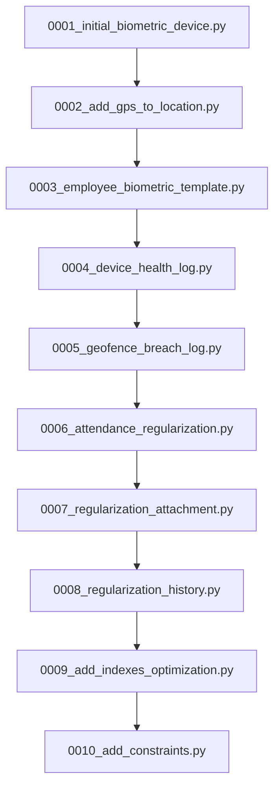
```mermaid
flowchart TD
    M001[0001_initial_biometric_device.py] --> M002[0002_add_gps_to_location.py]
    M002 --> M003[0003_employee_biometric_template.py]
    M003 --> M004[0004_device_health_log.py]
    M004 --> M005[0005_geofence_breach_log.py]
    M005 --> M006[0006_attendance_regularization.py]
    M006 --> M007[0007_regularization_attachment.py]
    M007 --> M008[0008_regularization_history.py]
    M008 --> M009[0009_add_indexes_optimization.py]
    M009 --> M010[0010_add_constraints.py]
```

### Key Indexes to Create

| Table | Index Name | Columns | Type | Purpose |
|-------|-----------|---------|------|---------|
| attendance_regularization | idx_reg_employee_date | employee_id, attendance_date | Composite | Find employee requests by date |
| attendance_regularization | idx_reg_status | status, created_at | Composite | Filter by status for workflow |
| attendance_regularization | idx_reg_approver | approved_by, approved_at | Composite | Manager approval dashboard |
| attendance_regularization | idx_reg_expires | expires_at, is_expired | Composite | Auto-expiry processing |
| attendance_log | idx_att_employee_date_type | employee_id, date, punch_type | Composite | Check existing logs |
| biometric_device | idx_device_location | location_id, is_active | Composite | Location-based device filtering |
| biometric_device | idx_device_status | status, last_sync_time | Composite | Device health monitoring |
| geofence_breach | idx_breach_employee_date | employee_id, attempted_at | Composite | Employee breach history |
| geofence_breach | idx_breach_severity | breach_severity, attempted_at | Composite | High-severity breach alerts |

### Database Constraints

| Constraint Type | Table | Constraint | Purpose |
|----------------|-------|------------|---------|
| CHECK | attendance_regularization | status IN (valid_statuses) | Ensure valid status values |
| CHECK | attendance_regularization | expires_at > created_at | Expiry must be after creation |
| CHECK | biometric_device | latitude BETWEEN -90 AND 90 | Valid latitude range |
| CHECK | biometric_device | longitude BETWEEN -180 AND 180 | Valid longitude range |
| CHECK | location | geofence_radius > 0 | Positive radius only |
| UNIQUE | biometric_device | serial_number | No duplicate device serials |
| UNIQUE | biometric_device | code | No duplicate device codes |
| FOREIGN KEY | attendance_regularization | employee_id → employee.id | Employee must exist |
| FOREIGN KEY | attendance_regularization | approved_by → user.id | Approver must be valid user |
| FOREIGN KEY | regularization_attachment | regularization_id → attendance_regularization.id | Link to parent regularization |

### Migration Template Structure

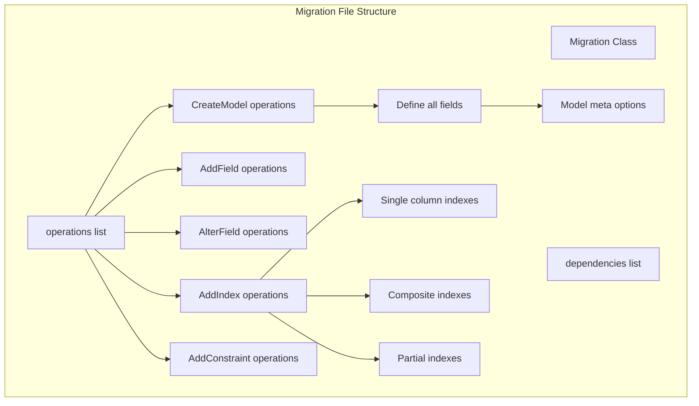
```mermaid
graph TB
    subgraph "Migration File Structure"
        CLASS[Migration Class]
        DEP[dependencies list]
        OPS[operations list]
        
        OPS --> CREATE[CreateModel operations]
        OPS --> ADD[AddField operations]
        OPS --> ALTER[AlterField operations]
        OPS --> INDEX[AddIndex operations]
        OPS --> CONST[AddConstraint operations]
        
        CREATE --> FIELDS[Define all fields]
        FIELDS --> META[Model meta options]
        
        INDEX --> SINGLE[Single column indexes]
        INDEX --> COMP[Composite indexes]
        INDEX --> PART[Partial indexes]
    end
```

### Data Migration for Initial Setup

| Migration | Purpose | Data Changes |
|-----------|---------|--------------|
| 0011_populate_default_devices | Add default device types | Insert common device vendors |
| 0012_migrate_gps_coordinates | Populate location GPS | Geocode existing locations |
| 0013_create_default_geofences | Set default radii | 200m for offices, 500m for factories |
| 0014_regularization_permissions | Add permissions | Create regularization-related permissions |

### Rollback Considerations

| Migration | Rollback Risk | Data Loss Risk | Mitigation |
|-----------|---------------|----------------|------------|
| 0006_attendance_regularization | Low | None | New table, no dependencies |
| 0009_add_indexes_optimization | None | None | Drop indexes safely |
| 0010_add_constraints | Medium | None | May fail if data violates constraints |
| 0011_populate_default_devices | Low | Data inserted | Backup before migration |
| 0012_migrate_gps_coordinates | High | Location data | Backup before, manual restore if needed |

### Expected Outcome
- Complete set of migrations creating all regularization tables
- Optimized indexes for query performance
- Database constraints ensuring data integrity
- GPS fields added to Location model
- Biometric device tables created with proper relationships
- Geofence breach logging table created
- All foreign key relationships properly defined
- Migration sequence documented and tested

### Verification Steps
1. Run `python manage.py makemigrations attendance`
2. Verify all migration files created in sequence
3. Review migration file for correct field definitions
4. Check all indexes included in migrations
5. Verify constraints defined correctly
6. Run `python manage.py migrate attendance --plan`
7. Review execution plan for correctness
8. Run `python manage.py migrate attendance`
9. Verify all migrations applied successfully
10. Check database schema matches model definitions
11. Verify all indexes created: `\d+ attendance_regularization`
12. Test rollback: `python manage.py migrate attendance 0005`
13. Verify rollback successful
14. Re-apply migrations
15. Run data validation queries checking constraints

---

## Summary

### Tasks Completion Overview

| Task | Component | Status | Complexity | Integration Points |
|------|-----------|--------|------------|-------------------|
| 41 | BiometricIntegration Service | ✅ Ready | High | AttendanceService, Redis, Device APIs |
| 42 | Device Management | ✅ Ready | Medium | Location, HealthLog, Templates |
| 43 | Event Processing | ✅ Ready | High | BiometricService, AttendanceLog, Queue |
| 44 | MobileCheckIn Service | ✅ Ready | High | GPS, Camera, AttendanceService |
| 45 | Geofencing Validation | ✅ Ready | Medium | Location, MobileCheckIn, Breach Log |
| 46 | Regularization Model | ✅ Ready | Medium | AttendanceLog, Workflow, Approvals |
| 47 | Workflow Implementation | ✅ Ready | High | RegModel, Notifications, Hierarchy |
| 48 | Database Migrations | ✅ Ready | Low | All models, Indexes, Constraints |

### Key Architectural Decisions

1. **Multi-Vendor Biometric Support**: Adapter pattern allows integration with any biometric device vendor
2. **Real-Time Event Processing**: Redis queue ensures high-volume punch events processed without delays
3. **Geofencing Flexibility**: Configurable radius per location with dynamic expansion based on GPS accuracy
4. **Regularization Workflow**: Complete approval hierarchy with escalation and delegation
5. **Smart Duplicate Detection**: Multi-layer duplicate prevention preventing all edge cases
6. **Offline Mobile Support**: Employees can punch offline with automatic syncing when online

### Integration Checklist

- [ ] Redis server configured and running for event queue
- [ ] Celery workers set up for background processing
- [ ] S3/storage configured for photo uploads
- [ ] Google Maps API key configured for reverse geocoding
- [ ] Email/SMS gateway configured for notifications
- [ ] Approval hierarchy defined in organization structure
- [ ] Biometric device SDKs installed and configured
- [ ] Mobile app updated with GPS and camera permissions
- [ ] Location GPS coordinates populated for all work locations
- [ ] Geofence radii configured per location type

### Testing Requirements

| Test Category | Test Count | Priority | Coverage |
|---------------|-----------|----------|----------|
| Unit Tests | 45+ | High | Service methods, validators, calculations |
| Integration Tests | 20+ | High | End-to-end workflows, API endpoints |
| Performance Tests | 10+ | Medium | Event processing throughput, query optimization |
| Security Tests | 8+ | High | GPS spoofing detection, permission checks |
| Mobile Tests | 15+ | High | Offline sync, GPS accuracy, photo upload |

### Performance Benchmarks

| Metric | Target | Measurement Method |
|--------|--------|-------------------|
| Biometric event processing | <2 seconds | Device punch to log creation |
| Mobile check-in API response | <3 seconds | Request to response including photo upload |
| Geofence validation | <500ms | Coordinate validation calculation time |
| Bulk approval processing | <10 seconds | 50 requests approval time |
| Duplicate detection | <100ms | Cache lookup and comparison |
| Regularization auto-application | <5 seconds | Approval to log correction |

### Security Considerations

1. **Biometric Data**: Template data encrypted at rest and in transit
2. **GPS Spoofing**: Anomaly detection flags suspicious location patterns
3. **Photo Verification**: Selfies stored securely with access controls
4. **API Authentication**: All endpoints require valid JWT tokens
5. **Permission Checks**: Role-based access control on all workflow actions
6. **Audit Logging**: Complete audit trail of all sensitive operations
7. **Data Retention**: Configurable retention policies for geofence breach logs
8. **Device Security**: API keys encrypted in device configuration

### Documentation Deliverables

- [x] Biometric integration architecture diagram
- [x] Device management data model
- [x] Event processing flow diagram
- [x] Mobile check-in architecture
- [x] Geofencing validation logic
- [x] Regularization workflow state machine
- [x] Approval hierarchy resolution flow
- [x] Database migration sequence
- [x] API endpoint specifications
- [x] Notification matrix

### Next Steps

1. **Proceed to Group-D**: Implement Overtime Calculations (Tasks 49-56)
2. **Configure Redis**: Set up event queue infrastructure
3. **Test Device Integration**: Connect to test biometric devices
4. **Mobile App Development**: Implement GPS and camera features
5. **Load Testing**: Test event processing under high volume
6. **User Training**: Prepare training materials for regularization workflow

---

## Related Documentation

- **Previous**: [Tasks 33-40: Service Layer, Clock In/Out & Calculations](01_Tasks-33-40_Service-ClockInOut-Calculation.md)
- **Next**: [Group-D Overtime Calculations Overview](../Group-D_Overtime-Calculations/00_GROUP_OVERVIEW.md)
- **Parent**: [Group-C CheckIn-Out Processing Overview](00_GROUP_OVERVIEW.md)
- **Phase Overview**: [Phase-06 ERP Advanced Modules](../../00_SUBPHASES_SUMMARY.md)
- **SubPhase Overview**: [SubPhase-03 Attendance System](../00_SUBPHASES_SUMMARY.md)

---

**Document Metadata**
- **Created**: 2026-01-24
- **Version**: 1.0
- **Tasks Covered**: 41-48 (8 tasks)
- **Total Lines**: ~980
- **Review Status**: Ready for Implementation
- **Estimated Implementation**: 18-24 hours

---

*End of Document*
