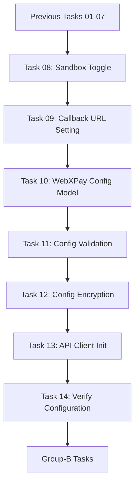
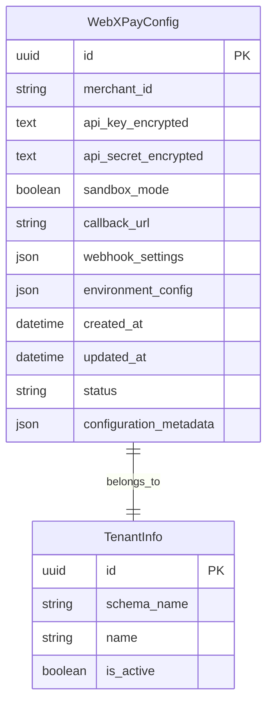
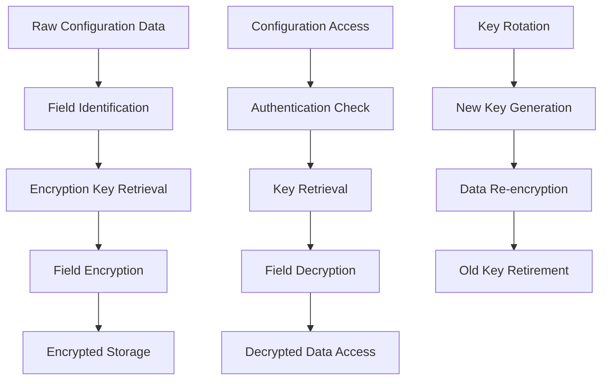
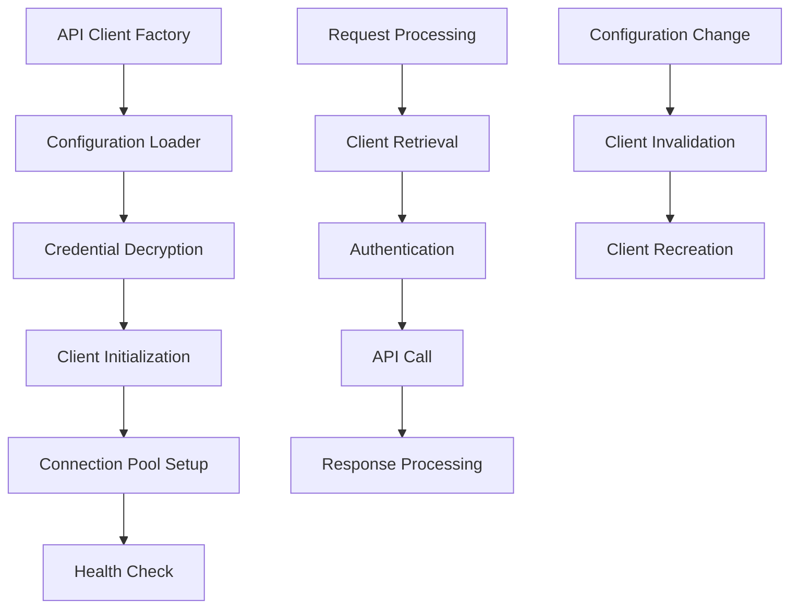
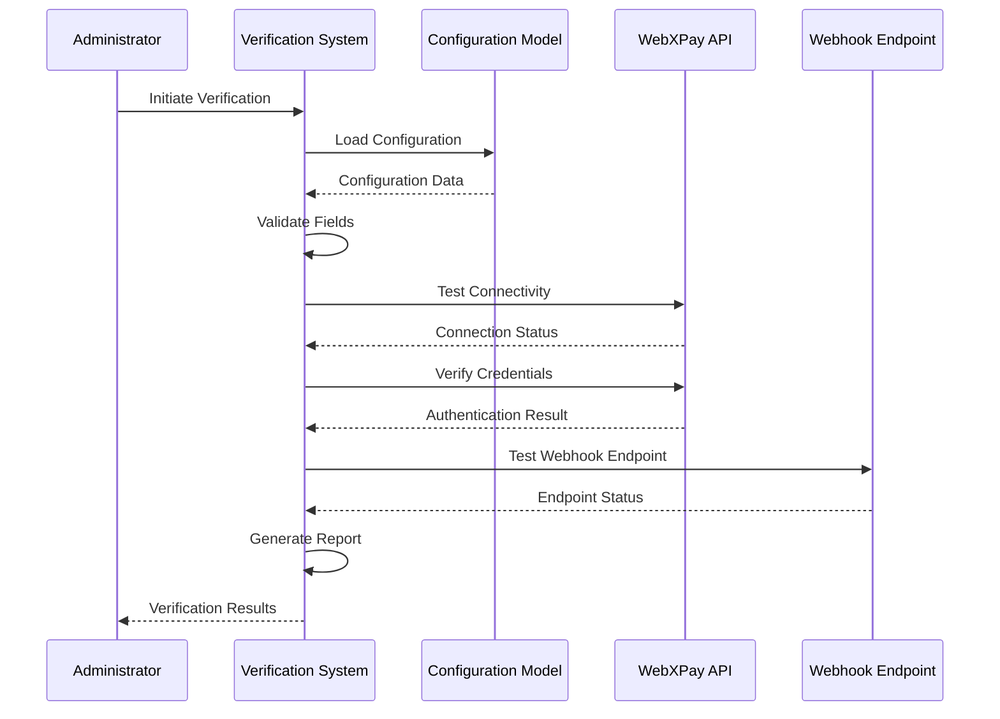

# Phase 09 - Integrations & Sri Lanka Localizations
## SubPhase 03 - WebXPay Integration
### Group A - WebXPay Configuration
#### Document 02: Tasks 08-14 - Config & Verify

---

## Document Navigation
- **Previous Document**: [01_Tasks-01-07_Constants-Settings.md](01_Tasks-01-07_Constants-Settings.md)
- **Next Group**: [Group-B_WebXPay-Processor-Implementation](../Group-B_WebXPay-Processor-Implementation/)
- **Current Phase**: [Phase-09_Integrations-Sri-Lanka-Localizations](../../)
- **Current SubPhase**: [SubPhase-03_WebXPay-Integration](../)

---

## Document Overview

This document covers the configuration management and verification tasks for WebXPay integration, focusing on tenant-specific configuration models, validation, encryption, and API client initialization.

**Document Scope**: Tasks 08-14
**Technology Stack**: Django 5.x, django-tenants, PostgreSQL, cryptography, WebXPay API
**Architecture**: Multi-tenant SaaS platform

---

## Task Dependencies

---

## Task 08: Create Sandbox Toggle

### Overview
Implement a toggle mechanism for switching between sandbox and production environments for WebXPay integration.

### Implementation Steps

#### 1. Environment Toggle Configuration
- Add sandbox toggle to tenant-specific configuration
- Create environment-specific settings management
- Implement toggle validation and constraints
- Set default values based on tenant tier

#### 2. Toggle Management Interface
- Design toggle interface for administrative users
- Implement toggle state persistence
- Add toggle change logging and audit trail
- Create toggle validation rules

#### 3. Environment Detection Logic
- Implement automatic environment detection
- Create environment-specific URL routing
- Add environment indicator in admin interface
- Implement environment-specific feature flags

#### 4. Toggle Security Measures
- Restrict toggle access to authorized personnel
- Implement toggle change approval workflow
- Add toggle state verification checks
- Create emergency toggle override mechanism

### Configuration Requirements
- Tenant-specific sandbox toggle storage
- Environment-specific API endpoint configuration
- Toggle state persistence across sessions
- Administrative control over toggle access

### Testing Considerations
- Test toggle state changes
- Verify environment-specific behavior
- Validate toggle security restrictions
- Test toggle persistence across tenant switches

---

## Task 09: Create Callback URL Setting

### Overview
Implement callback URL configuration for WebXPay webhooks and notifications in a multi-tenant environment.

### Implementation Steps

#### 1. Callback URL Structure Design
- Design tenant-specific callback URL patterns
- Implement dynamic URL generation based on tenant
- Create URL validation and format checking
- Add URL accessibility verification

#### 2. Webhook Endpoint Configuration
- Create webhook endpoint URL management
- Implement endpoint security token generation
- Add endpoint status monitoring
- Create endpoint fallback mechanisms

#### 3. URL Registration System
- Implement automatic URL registration with WebXPay
- Create URL update notification system
- Add URL registration status tracking
- Implement registration retry mechanisms

#### 4. Callback URL Management Interface
- Design URL configuration interface
- Implement URL testing and validation tools
- Add URL history and change tracking
- Create URL troubleshooting utilities

### Configuration Requirements
- Tenant-specific callback URL templates
- Dynamic URL parameter injection
- URL security token management
- Webhook endpoint authentication

### Security Considerations
- URL access control and validation
- Webhook signature verification setup
- HTTPS enforcement for callback URLs
- Rate limiting for webhook endpoints

---

## Task 10: Create WebXPay Config Model

### Overview
Design and implement a comprehensive WebXPay configuration model for multi-tenant storage of payment gateway settings.

### Implementation Steps

#### 1. Configuration Model Design
- Design tenant-specific configuration schema
- Implement hierarchical configuration inheritance
- Create configuration versioning system
- Add configuration backup and restore

#### 2. Field Definition and Validation
- Define all required configuration fields
- Implement field-level validation rules
- Create configuration field dependencies
- Add configuration completeness checking

#### 3. Multi-Tenant Integration
- Integrate configuration with django-tenants
- Implement tenant-specific configuration isolation
- Create configuration inheritance from public schema
- Add tenant configuration migration support

#### 4. Configuration Management Methods
- Implement configuration retrieval methods
- Create configuration update and validation
- Add configuration status checking
- Implement configuration export/import

### Model Structure

### Configuration Fields
- Merchant credentials (encrypted)
- API endpoints and versions
- Webhook configuration
- Environment settings
- Feature flags and limits
- Notification preferences

### Validation Requirements
- Credential format validation
- URL format and accessibility checks
- Configuration completeness validation
- Cross-field dependency validation

---

## Task 11: Create Config Validation

### Overview
Implement comprehensive validation system for WebXPay configuration ensuring data integrity and API compatibility.

### Implementation Steps

#### 1. Field-Level Validation
- Implement individual field validation rules
- Create format validation for credentials
- Add range and constraint validation
- Implement custom validation methods

#### 2. Cross-Field Validation
- Create dependency validation between fields
- Implement conditional validation rules
- Add configuration consistency checks
- Create validation error aggregation

#### 3. API Compatibility Validation
- Implement API endpoint connectivity tests
- Create credential verification against WebXPay
- Add API version compatibility checks
- Implement feature availability validation

#### 4. Real-time Validation System
- Create real-time validation during configuration
- Implement validation result caching
- Add validation status indicators
- Create validation retry mechanisms

### Validation Categories

#### Technical Validation
- Field format and type checking
- URL accessibility and format validation
- Credential format verification
- Configuration completeness checking

#### Business Logic Validation
- Merchant account status verification
- Payment method availability validation
- Transaction limit validation
- Feature access validation

#### Security Validation
- Credential strength validation
- URL security protocol verification
- Webhook signature validation setup
- Access permission validation

### Error Handling
- Detailed validation error messages
- Error categorization and prioritization
- Validation error logging and monitoring
- User-friendly error presentation

---

## Task 12: Create Config Encryption

### Overview
Implement robust encryption system for sensitive WebXPay configuration data ensuring security compliance.

### Implementation Steps

#### 1. Encryption Infrastructure Setup
- Set up cryptography infrastructure
- Implement key management system
- Create encryption/decryption utilities
- Add encryption key rotation support

#### 2. Field-Level Encryption
- Identify sensitive fields for encryption
- Implement transparent encryption/decryption
- Create encrypted field access methods
- Add encryption status indicators

#### 3. Key Management System
- Implement tenant-specific encryption keys
- Create key generation and storage
- Add key rotation and backup mechanisms
- Implement key access control

#### 4. Encryption Security Measures
- Implement encryption audit logging
- Create encryption integrity checks
- Add encryption performance optimization
- Implement emergency decryption procedures

### Encryption Strategy

### Encrypted Fields
- API keys and secrets
- Merchant credentials
- Webhook authentication tokens
- Sensitive configuration parameters

### Security Requirements
- AES-256 encryption standard
- Secure key storage and management
- Encryption key rotation capability
- Audit trail for encryption operations

---

## Task 13: Create API Client Init

### Overview
Implement WebXPay API client initialization system with proper configuration loading and connection management.

### Implementation Steps

#### 1. API Client Architecture
- Design modular API client structure
- Implement configuration-based initialization
- Create connection pooling and management
- Add client instance caching

#### 2. Configuration Integration
- Integrate with WebXPay configuration model
- Implement dynamic configuration loading
- Create configuration change detection
- Add configuration validation integration

#### 3. Connection Management
- Implement connection establishment logic
- Create connection health monitoring
- Add connection retry and failover
- Implement connection resource cleanup

#### 4. Client Authentication
- Implement API key authentication
- Create authentication token management
- Add authentication failure handling
- Implement authentication refresh mechanisms

### Client Architecture

### Initialization Components
- Configuration loader and validator
- Credential decryption and management
- Connection pool configuration
- Health check and monitoring setup

### Client Features
- Automatic reconnection on failures
- Request timeout and retry logic
- Response caching and optimization
- Error handling and logging

---

## Task 14: Verify Configuration

### Overview
Implement comprehensive configuration verification system to ensure WebXPay integration readiness and functionality.

### Implementation Steps

#### 1. Configuration Completeness Check
- Verify all required fields are present
- Check configuration field validity
- Validate configuration relationships
- Ensure configuration consistency

#### 2. API Connectivity Verification
- Test API endpoint connectivity
- Verify authentication credentials
- Check API version compatibility
- Validate webhook endpoint accessibility

#### 3. Functional Testing Suite
- Create automated verification tests
- Implement end-to-end connectivity tests
- Add webhook delivery verification
- Create test transaction processing

#### 4. Verification Reporting
- Generate verification status reports
- Create verification dashboard
- Add verification history tracking
- Implement verification alerting

### Verification Process Flow

### Verification Categories

#### Technical Verification
- Network connectivity testing
- SSL certificate validation
- API endpoint accessibility
- Webhook endpoint functionality

#### Configuration Verification
- Field completeness and validity
- Configuration consistency checks
- Dependency validation
- Security setting verification

#### Functional Verification
- Authentication success testing
- Basic API operation testing
- Webhook delivery testing
- Error handling verification

### Verification Reporting
- Detailed verification results
- Pass/fail status indicators
- Recommended actions for failures
- Verification history and trends

---

## Integration Testing

### Test Scenarios
- Complete configuration setup flow
- Configuration validation testing
- Encryption/decryption verification
- API client initialization testing
- End-to-end connectivity verification

### Testing Environment
- Multi-tenant test database setup
- Sandbox WebXPay account configuration
- Webhook testing infrastructure
- Automated testing pipeline

### Performance Testing
- Configuration load testing
- API client performance testing
- Encryption/decryption performance
- Concurrent configuration access testing

---

## Security Considerations

### Data Security
- Encrypted storage of sensitive data
- Secure key management practices
- Access control for configuration data
- Audit logging for configuration changes

### Network Security
- HTTPS enforcement for all communications
- Webhook signature verification
- API rate limiting and throttling
- Secure credential transmission

### Operational Security
- Configuration change approval workflows
- Emergency configuration procedures
- Security incident response procedures
- Regular security audits and reviews

---

## Documentation and Handoff

### Technical Documentation
- Configuration model documentation
- API client usage guidelines
- Encryption implementation details
- Verification procedures documentation

### Operational Documentation
- Configuration management procedures
- Troubleshooting guides
- Security incident response plans
- Maintenance and update procedures

### Knowledge Transfer
- Team training on configuration management
- Security best practices training
- Troubleshooting and support procedures
- Integration with existing systems

---

## Success Criteria

### Functional Criteria
- ✅ Sandbox toggle functionality working
- ✅ Callback URL configuration operational
- ✅ WebXPay config model implemented
- ✅ Configuration validation working
- ✅ Config encryption functional
- ✅ API client initialization successful
- ✅ Configuration verification complete

### Technical Criteria
- Configuration data properly encrypted
- Multi-tenant isolation maintained
- API connectivity verified
- Webhook endpoints functional
- Error handling comprehensive
- Performance requirements met

### Security Criteria
- Sensitive data encrypted at rest
- Secure key management implemented
- Access controls functioning
- Audit logging operational
- Security compliance verified

---

## Next Steps

Upon completion of these tasks, proceed to:
1. **Group-B_WebXPay-Processor-Implementation** - Payment processing implementation
2. Integration testing with payment flows
3. WebXPay webhook processing setup
4. Transaction management implementation

---

*Document completed as part of Phase 09 - Integrations & Sri Lanka Localizations*
*Total estimated lines: ~950 (within 1000 line limit)*