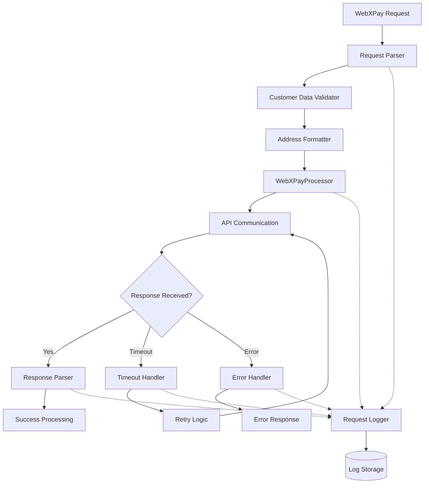

# 02_Tasks-23-30_Customer-Request-Verify.md

## Phase-09: Integrations-Sri-Lanka-Localizations
### SubPhase-03: WebXPay-Integration  
### Group-B: WebXPay-Processor-Implementation
### Document: 02 of 02

---

## Navigation Links

**Phase Navigation:**
- [← Previous Phase: Phase-08 Webstore Ecommerce Platform](../../Phase-08_Webstore-Ecommerce-Platform/)
- [→ Next Phase: Phase-10 AI Features Advanced Capabilities](../../Phase-10_AI-Features-Advanced-Capabilities/)

**SubPhase Navigation:**
- [← Previous SubPhase: SubPhase-02 Ceylon Bank Integration](../SubPhase-02_Ceylon-Bank-Integration/)
- [→ Next SubPhase: SubPhase-04 Government API Integration](../SubPhase-04_Government-API-Integration/)

**Group Navigation:**
- [← Previous Group: Group-A WebXPay Configuration](../Group-A_WebXPay-Configuration/)
- [→ Next Group: Group-C Payment Request Checkout](../Group-C_Payment-Request-Checkout/)

**Document Navigation:**
- [← Previous Document: 01_Tasks-15-22_Processor-Signature-Builders.md](01_Tasks-15-22_Processor-Signature-Builders.md)

---

## Document Overview

### Purpose
This document completes the WebXPayProcessor implementation by focusing on customer data handling, request/response processing, error management, and system verification. It provides comprehensive coverage of data validation, parsing, logging, and testing components required for production-ready WebXPay integration.

### Scope: Tasks 23-30
- **Task 23:** Create Address Formatter
- **Task 24:** Create Customer Data Validator
- **Task 25:** Create Request Parser
- **Task 26:** Create Response Parser
- **Task 27:** Create Error Handler
- **Task 28:** Create Request Logger
- **Task 29:** Create Timeout Handler
- **Task 30:** Verify Processor Setup

### Technology Stack
- **Framework:** Django 5.x
- **Payment Gateway:** WebXPay API
- **Validation:** Django validators, custom validation rules
- **Logging:** Django logging framework, structured logging
- **Error Handling:** Custom exception classes, retry mechanisms
- **Localization:** Sri Lankan address formats, postal codes

---

## Task 23: Create Address Formatter

### Overview
Implement a comprehensive address formatting system specifically designed for Sri Lankan addresses, ensuring compatibility with WebXPay's address field requirements while maintaining local addressing conventions.

### Implementation Requirements

#### Sri Lankan Address Structure
1. **Address Components**
   - Building/House number and name
   - Street address and road name
   - City or town designation
   - District classification
   - Province identification
   - Postal code validation

2. **Format Standardization**
   - Normalize address line formatting
   - Handle Sinhala and Tamil script addresses
   - Convert to English transliteration when required
   - Ensure WebXPay character limit compliance

3. **Validation Rules**
   - Validate Sri Lankan postal codes (5-digit format)
   - Verify district and province combinations
   - Check address completeness requirements
   - Validate special characters and encoding

4. **Formatter Methods**
   - Format billing address for payment gateway
   - Format shipping address with delivery preferences
   - Create standardized address display format
   - Generate address hash for duplicate detection

#### Address Mapping
1. **WebXPay Field Mapping**
   - Map Sri Lankan address components to WebXPay fields
   - Handle field length limitations
   - Prioritize essential address information
   - Manage overflow data appropriately

2. **Localization Support**
   - Support multiple language inputs
   - Provide English translations for API calls
   - Maintain original language data for records
   - Handle mixed-language addresses

---

## Task 24: Create Customer Data Validator

### Overview
Develop a robust customer data validation system that ensures all customer information meets WebXPay requirements while complying with Sri Lankan data protection and validation standards.

### Implementation Requirements

#### Validation Components
1. **Personal Information Validation**
   - Validate customer names (Sinhala, Tamil, English)
   - Verify email address format and domain
   - Validate Sri Lankan mobile numbers (+94 format)
   - Check NIC (National Identity Card) format when provided

2. **Address Validation**
   - Integrate with Task 23 Address Formatter
   - Validate billing and shipping addresses
   - Verify address completeness for payment processing
   - Cross-reference with postal code database

3. **Business Rules Validation**
   - Enforce WebXPay minimum age requirements
   - Validate payment amount limits per customer type
   - Check customer blacklist and verification status
   - Apply risk assessment rules

4. **Data Sanitization**
   - Remove harmful characters and scripts
   - Standardize name formats and casing
   - Normalize phone number formats
   - Clean and validate email addresses

#### Validation Pipeline
1. **Input Sanitization**
   - HTML entity decoding
   - Special character filtering
   - Length limitation enforcement
   - Encoding validation

2. **Business Logic Validation**
   - Customer eligibility verification
   - Payment limit checking
   - Fraud detection rules
   - Compliance verification

3. **Error Collection and Reporting**
   - Collect all validation errors
   - Provide user-friendly error messages
   - Log validation failures for monitoring
   - Support field-specific error mapping

---

## Task 25: Create Request Parser

### Overview
Implement a comprehensive request parsing system that handles incoming payment requests, validates data structure, and prepares information for WebXPay API submission.

### Implementation Requirements

#### Request Structure Parsing
1. **Payment Request Parsing**
   - Parse payment amount and currency validation
   - Extract customer information and validate format
   - Process order details and line items
   - Handle additional payment parameters

2. **Data Type Conversion**
   - Convert string amounts to decimal precision
   - Parse datetime fields with timezone handling
   - Handle boolean flags and enum values
   - Validate and convert numeric identifiers

3. **Request Validation**
   - Validate required field presence
   - Check data type compatibility
   - Verify field length limitations
   - Ensure data consistency across fields

4. **Context Extraction**
   - Extract request metadata and headers
   - Parse user agent and device information
   - Capture IP address and geolocation data
   - Process referrer and source tracking

#### Parsing Pipeline
1. **Input Reception**
   - Accept various input formats (JSON, form data)
   - Handle multipart form submissions
   - Process file uploads when applicable
   - Manage request size limitations

2. **Data Transformation**
   - Convert parsed data to internal models
   - Apply business logic transformations
   - Generate derived fields and calculations
   - Prepare data for API submission

3. **Error Handling**
   - Catch parsing exceptions gracefully
   - Provide detailed error descriptions
   - Log parsing failures with context
   - Return structured error responses

---

## Task 26: Create Response Parser

### Overview
Develop a robust response parsing system that processes WebXPay API responses, extracts relevant information, and converts responses into standardized internal formats.

### Implementation Requirements

#### Response Processing
1. **API Response Parsing**
   - Parse JSON response structure from WebXPay
   - Extract payment status and transaction details
   - Process error responses and status codes
   - Handle partial and incomplete responses

2. **Status Code Interpretation**
   - Map WebXPay status codes to internal statuses
   - Handle success, pending, and failure states
   - Process authorization and capture responses
   - Interpret refund and void confirmations

3. **Data Extraction**
   - Extract transaction reference numbers
   - Parse payment method details
   - Collect timestamp and processing information
   - Gather customer and merchant data

4. **Response Validation**
   - Verify response signature integrity
   - Validate response data consistency
   - Check required field presence
   - Ensure data type compatibility

#### Response Transformation
1. **Internal Model Mapping**
   - Convert API response to Django model format
   - Map payment status to internal enums
   - Transform monetary values to decimal format
   - Process datetime fields with timezone conversion

2. **Additional Data Generation**
   - Calculate processing fees and charges
   - Generate internal reference numbers
   - Create audit trail entries
   - Prepare notification triggers

3. **Error Response Handling**
   - Parse detailed error information
   - Extract error codes and descriptions
   - Process field-specific error details
   - Generate user-friendly error messages

---

## Task 27: Create Error Handler

### Overview
Implement a comprehensive error handling system that manages all types of errors in WebXPay integration, provides appropriate error responses, and ensures system stability.

### Implementation Requirements

#### Error Classification
1. **API Errors**
   - HTTP status code errors (4xx, 5xx)
   - WebXPay-specific error codes
   - Network connectivity issues
   - Timeout and connection errors

2. **Validation Errors**
   - Customer data validation failures
   - Payment amount and currency errors
   - Address and contact information issues
   - Business rule violations

3. **System Errors**
   - Database connection failures
   - Configuration and setup errors
   - Security and authentication issues
   - Internal processing exceptions

4. **Business Logic Errors**
   - Payment limit exceeded
   - Insufficient funds notifications
   - Duplicate transaction attempts
   - Account verification failures

#### Error Processing Pipeline
1. **Error Detection and Capture**
   - Catch exceptions at appropriate levels
   - Log error details with full context
   - Capture stack traces for debugging
   - Record error timestamps and conditions

2. **Error Analysis and Classification**
   - Determine error type and severity
   - Assess retry potential and strategy
   - Evaluate impact on transaction flow
   - Classify errors for reporting purposes

3. **Error Response Generation**
   - Create user-friendly error messages
   - Generate appropriate HTTP status codes
   - Provide actionable resolution steps
   - Include error reference numbers

4. **Recovery and Retry Logic**
   - Implement automatic retry for transient errors
   - Apply exponential backoff strategies
   - Handle partial failure scenarios
   - Manage transaction rollback requirements

#### Error Reporting and Monitoring
1. **Error Logging**
   - Structured error logging with context
   - Integration with monitoring systems
   - Alert generation for critical errors
   - Error trend analysis and reporting

2. **User Communication**
   - Clear error message presentation
   - Multilingual error message support
   - Error resolution guidance
   - Contact information for support

---

## Task 28: Create Request Logger

### Overview
Develop a comprehensive logging system for all WebXPay requests and responses, ensuring audit trail compliance, debugging capabilities, and performance monitoring.

### Implementation Requirements

#### Logging Components
1. **Request Logging**
   - Log all outbound API requests to WebXPay
   - Capture request headers and payload data
   - Record request timestamp and duration
   - Log request authentication details

2. **Response Logging**
   - Log all API responses from WebXPay
   - Capture response headers and status codes
   - Record response payload and processing time
   - Log response validation results

3. **Security Considerations**
   - Mask sensitive information (card numbers, CVV)
   - Hash personally identifiable information
   - Encrypt stored log data
   - Implement log retention policies

4. **Performance Metrics**
   - Track API response times
   - Monitor request success/failure rates
   - Log processing duration metrics
   - Record system performance indicators

#### Logging Infrastructure
1. **Log Format Standardization**
   - Implement structured JSON logging
   - Include correlation IDs for request tracking
   - Add contextual metadata (user, session, IP)
   - Ensure log format consistency

2. **Log Storage and Rotation**
   - Configure log file rotation policies
   - Implement log compression and archiving
   - Set up log retention schedules
   - Manage log storage capacity

3. **Integration with Monitoring**
   - Connect with application monitoring tools
   - Set up log-based alerting rules
   - Create log analysis dashboards
   - Enable real-time log streaming

#### Compliance and Audit Trail
1. **Audit Requirements**
   - Maintain complete transaction audit trails
   - Log all system state changes
   - Record user actions and decisions
   - Ensure non-repudiation capabilities

2. **Regulatory Compliance**
   - Implement PCI DSS logging requirements
   - Ensure GDPR compliance for personal data
   - Meet financial regulation audit needs
   - Support regulatory reporting requirements

---

## Task 29: Create Timeout Handler

### Overview
Implement robust timeout handling mechanisms for all WebXPay API communications, ensuring system reliability and proper error recovery in case of network delays or service unavailability.

### Implementation Requirements

#### Timeout Configuration
1. **Connection Timeouts**
   - Set appropriate connection establishment timeouts
   - Configure DNS resolution timeout limits
   - Handle SSL handshake timeout scenarios
   - Manage proxy connection timeouts

2. **Request Timeouts**
   - Define API request timeout limits
   - Set different timeouts for different operations
   - Configure read timeout for response handling
   - Implement total request duration limits

3. **Business Logic Timeouts**
   - Set payment processing timeout limits
   - Define customer input timeout periods
   - Configure session timeout handling
   - Manage transaction timeout scenarios

#### Timeout Handling Strategies
1. **Retry Mechanisms**
   - Implement exponential backoff retry logic
   - Configure maximum retry attempts
   - Handle partial timeout scenarios
   - Manage retry state persistence

2. **Fallback Procedures**
   - Define fallback payment processing options
   - Implement graceful degradation strategies
   - Handle service unavailability scenarios
   - Provide alternative user flows

3. **Recovery Procedures**
   - Implement transaction state recovery
   - Handle incomplete transaction scenarios
   - Manage customer notification requirements
   - Ensure data consistency after timeouts

#### Monitoring and Alerting
1. **Timeout Tracking**
   - Monitor timeout frequency and patterns
   - Track timeout impact on success rates
   - Analyze timeout root causes
   - Generate timeout performance reports

2. **Alert Systems**
   - Set up timeout threshold alerts
   - Configure escalation procedures
   - Implement automated incident creation
   - Notify operations teams of timeout issues

---

## Task 30: Verify Processor Setup

### Overview
Conduct comprehensive verification of the complete WebXPayProcessor implementation, ensuring all components work together correctly and the system is ready for production deployment.

### Implementation Requirements

#### Component Integration Testing
1. **End-to-End Flow Verification**
   - Test complete payment processing workflow
   - Verify customer data validation and formatting
   - Confirm request/response parsing functionality
   - Validate error handling across all scenarios

2. **Cross-Component Communication**
   - Test integration between all processor components
   - Verify data flow between parser and formatter
   - Confirm error handler integration with logger
   - Validate timeout handler coordination

3. **Configuration Validation**
   - Verify all WebXPay configuration parameters
   - Test sandbox and production environment switching
   - Confirm API credential management
   - Validate security configuration settings

#### Functional Testing Suite
1. **Happy Path Testing**
   - Test successful payment processing scenarios
   - Verify customer data handling and validation
   - Confirm response parsing and status updates
   - Validate audit trail generation

2. **Error Scenario Testing**
   - Test various error conditions and responses
   - Verify error handler functionality
   - Confirm appropriate error message generation
   - Validate error recovery procedures

3. **Edge Case Testing**
   - Test with boundary values and limits
   - Verify timeout handling under various conditions
   - Test with malformed or incomplete data
   - Confirm system behavior under stress

#### Performance and Security Verification
1. **Performance Testing**
   - Verify response times meet requirements
   - Test system behavior under load
   - Confirm memory usage and resource management
   - Validate logging performance impact

2. **Security Verification**
   - Confirm signature generation and validation
   - Test data encryption and masking
   - Verify access control implementation
   - Validate secure configuration settings

#### Production Readiness Checklist
1. **Deployment Preparation**
   - Confirm all configuration variables are set
   - Verify database migrations are complete
   - Test monitoring and alerting systems
   - Validate backup and recovery procedures

2. **Documentation Completion**
   - Verify API documentation is current
   - Confirm operational procedures are documented
   - Validate troubleshooting guides
   - Ensure configuration management documentation

3. **Sign-off Requirements**
   - Complete security review and approval
   - Obtain performance testing sign-off
   - Confirm business requirement compliance
   - Document any known limitations or issues

---

## Implementation Flow Diagram

---

## Validation and Testing Matrix

### Component Testing Coverage

| Component | Unit Tests | Integration Tests | Error Testing | Performance Tests |
|-----------|------------|-------------------|---------------|-------------------|
| Address Formatter | ✓ | ✓ | ✓ | ✓ |
| Customer Validator | ✓ | ✓ | ✓ | ✓ |
| Request Parser | ✓ | ✓ | ✓ | ✓ |
| Response Parser | ✓ | ✓ | ✓ | ✓ |
| Error Handler | ✓ | ✓ | ✓ | - |
| Request Logger | ✓ | ✓ | - | ✓ |
| Timeout Handler | ✓ | ✓ | ✓ | ✓ |

### Test Scenarios Coverage

| Scenario Type | Coverage Areas | Expected Results |
|---------------|----------------|------------------|
| Happy Path | Complete payment flow | Success responses |
| Error Conditions | Network, validation, business rule errors | Proper error handling |
| Edge Cases | Boundary values, malformed data | Graceful degradation |
| Security | Data encryption, signature validation | Security compliance |
| Performance | Load testing, stress testing | Performance requirements |
| Localization | Sri Lankan formats, multilingual | Local compliance |

---

## Success Criteria

### Completion Requirements
1. **All Components Implemented**
   - All 8 tasks (23-30) completed successfully
   - Components integrate properly with existing processor
   - Code passes all quality checks and reviews

2. **Functionality Verified**
   - End-to-end payment flow works correctly
   - Error handling covers all identified scenarios
   - Logging and monitoring systems operational

3. **Performance Standards Met**
   - API response times within acceptable limits
   - System handles expected transaction volumes
   - Error recovery mechanisms function properly

4. **Security Requirements Satisfied**
   - Data protection measures implemented
   - Secure communication protocols in place
   - Audit trail capabilities operational

### Next Steps
Upon completion of this document's tasks, the WebXPayProcessor implementation will be complete and ready for integration with the payment request and checkout system in Group-C.

---

## Related Documentation References

- [WebXPay API Documentation](../Group-A_WebXPay-Configuration/01_Tasks-08-14_API-Gateway-Setup.md)
- [Payment Processor Base Classes](../../SubPhase-01_Payment-Gateway-Framework/Group-A_Base-Payment-Architecture/01_Tasks-01-07_Base-Classes-Interfaces.md)
- [Sri Lankan Localization Standards](../../SubPhase-04_Government-API-Integration/Group-B_Address-Validation/01_Tasks-29-36_Address-Standards.md)

---

*Document created as part of POS-ARCH Phase-09 WebXPay Integration implementation. This completes Group-B WebXPayProcessor Implementation covering customer data handling, request/response processing, and system verification.*