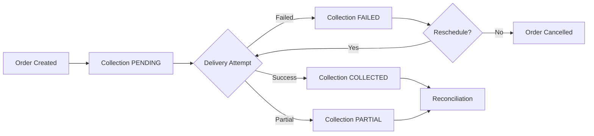
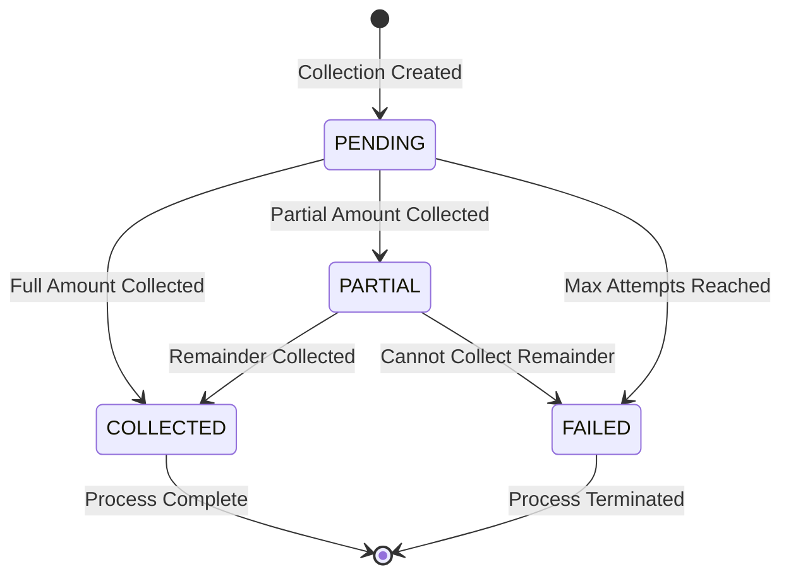

# Tasks 49-56: Collection Model & Fields

> **Phase:** 09 - Integrations & Sri Lanka Localizations  
> **SubPhase:** 06 - Cash on Delivery (COD)  
> **Group:** D - Delivery & Collection  
> **Document:** 01 of 02  
> **Tasks Covered:** 49, 50, 51, 52, 53, 54, 55, 56

---

## Navigation

- **↑ Parent:** [00_GROUP_OVERVIEW.md](00_GROUP_OVERVIEW.md)
- **→ Next Document:** [02_Tasks-57-62_Attempt-Reschedule-Verify.md](02_Tasks-57-62_Attempt-Reschedule-Verify.md)

---

## Document Overview

This document covers the creation of the CODCollection model that tracks cash collection from customers for COD orders. The model includes order relationship, expected and actual collection amounts, collection status tracking, collection date recording, delivery agent reference, and collection notes for documentation. This enables complete tracking of cash collection workflow in Sri Lanka's COD delivery ecosystem.

### Tasks in This Document
| Task # | Task Name | Complexity | Est. Time |
|--------|-----------|------------|-----------|
| 49 | Create CODCollection Model | Medium | 45 min |
| 50 | Create Collection Order FK | Low | 15 min |
| 51 | Create Collection Amount | Low | 15 min |
| 52 | Create Collected Amount | Low | 15 min |
| 53 | Create Collection Status | Low | 20 min |
| 54 | Create Collection Date | Low | 15 min |
| 55 | Create Agent Reference | Low | 20 min |
| 56 | Create Collection Notes | Low | 15 min |

---

## Task 49: Create CODCollection Model

### Overview
Create the CODCollection model in the payments app to track cash collection from customers for COD orders. This model serves as the central entity for managing the entire collection lifecycle, from expected amount calculation through final collection recording. The model integrates with Order model and supports delivery attempt tracking, agent identification, and reconciliation workflows.

### Dependencies
- Phase-04 Order model created
- Phase-09 SubPhase-06 Task 48 (COD fee configuration complete)
- Django ORM and django-tenants configured
- PostgreSQL database setup complete

### Instructions

1. **Create model file structure**
   - Navigate to `backend/apps/payments/models/` directory
   - Create new file named `cod_collection.py`
   - Set up proper Python module structure

2. **Import required dependencies**
   - Import Django model base classes and fields
   - Import timezone utilities for date handling
   - Import Order model from orders app
   - Import User model for agent tracking

3. **Define CODCollection model class**
   - Inherit from TenantAwareModel base class
   - Add model docstring explaining purpose
   - Set appropriate Meta class options

4. **Configure Meta class options**
   - Set `db_table` to "payments_cod_collection"
   - Set `verbose_name` to "COD Collection"
   - Set `verbose_name_plural` to "COD Collections"
   - Define ordering (most recent first)
   - Add indexes for common queries

5. **Plan field structure**
   - Order relationship (ForeignKey)
   - Amount tracking fields (expected, collected)
   - Status tracking (CharField with choices)
   - Date tracking (collection_date, created_at, updated_at)
   - Agent identification (agent_reference)
   - Notes field (TextField)

6. **Add model methods**
   - `__str__` method returning meaningful representation
   - `is_fully_collected` property checking completion
   - `is_partial_collection` property for partial status
   - `collection_shortfall` property calculating difference

7. **Add validation methods**
   - `clean` method for model-level validation
   - Validate collected amount doesn't exceed expected
   - Validate status transitions are logical
   - Ensure collection date is set for collected status

8. **Configure admin integration preparation**
   - Plan admin display fields
   - Plan filter options for admin
   - Plan search fields for quick lookup

### Model Purpose and Context

| Aspect | Details |
|--------|---------|
| Primary Purpose | Track cash collection from COD orders |
| Business Context | Sri Lanka delivery agent collects cash on delivery |
| Integration Points | Orders, delivery agents, courier APIs |
| Reconciliation | Links to payment reconciliation reports |

### Sri Lanka Delivery Context

```
Order Flow with COD Collection
━━━━━━━━━━━━━━━━━━━━━━━━━━━━━
1. Customer places COD order
2. CODCollection record created (PENDING)
3. Order dispatched to delivery agent
4. Agent attempts delivery (3 max attempts)
5. On success: Agent collects cash
6. Agent updates collection status
7. Collection recorded with amount
8. Agent deposits to collection point
9. Reconciliation process verifies
```

### Collection Lifecycle States



### Model Responsibilities

| Responsibility | Description |
|----------------|-------------|
| Amount Tracking | Store expected and actual collection amounts |
| Status Management | Track collection progress through workflow |
| Agent Linking | Reference delivery agent handling collection |
| Audit Trail | Record dates and notes for tracking |
| Validation | Ensure data integrity and business rules |

### Related Models

| Model | Relationship | Purpose |
|-------|--------------|---------|
| Order | ForeignKey | Links to specific order |
| DeliveryAttempt | Reverse FK | Tracks delivery attempts |
| User | ForeignKey (optional) | Internal agent assignment |
| PaymentReconciliation | Indirect | Links through reconciliation |

### Collection Amount Calculation

```
Expected Collection Amount Formula
━━━━━━━━━━━━━━━━━━━━━━━━━━━━━
Expected Amount = Order Total + COD Fee

Components:
├── Order Total (subtotal + tax + shipping)
├── COD Fee (percentage or fixed)
└── Total Expected Collection

Example (Sri Lanka):
├── Order Total: ₨5,000.00
├── COD Fee (2%): ₨100.00
└── Expected Collection: ₨5,100.00
```

### Database Performance Considerations

| Consideration | Implementation |
|---------------|----------------|
| Query Optimization | Index on order_id, status, collection_date |
| Tenant Isolation | Inherits from TenantAwareModel |
| Date Queries | Index on created_at for reporting |
| Agent Queries | Index on agent_reference |

### Expected Outcome
- CODCollection model class defined with proper structure
- Inherits from TenantAwareModel for multi-tenancy
- All fields planned and ready for implementation
- Model methods and properties outlined
- Validation logic planned
- Ready for field implementation in subsequent tasks

### Verification Checklist
- [ ] `backend/apps/payments/models/cod_collection.py` file created
- [ ] CODCollection model class defined
- [ ] Inherits from TenantAwareModel
- [ ] Model Meta class configured properly
- [ ] Model docstring added
- [ ] `__str__` method implemented
- [ ] Property methods planned
- [ ] Validation method structure added
- [ ] Imports are correct and complete

---

## Task 50: Create Collection Order FK

### Overview
Create the foreign key relationship between CODCollection and Order models. This field links each collection record to its corresponding order, enabling tracking of which order's payment is being collected. The relationship uses PROTECT on delete to prevent accidental data loss and maintains referential integrity.

### Dependencies
- Task 49: Create CODCollection Model
- Phase-04 Order model exists

### Instructions

1. **Add order field to model**
   - Open `cod_collection.py` file
   - Add ForeignKey field named `order`
   - Set related model to Order

2. **Configure ForeignKey parameters**
   - Set `on_delete=models.PROTECT` to prevent deletion
   - Set `related_name='cod_collections'`
   - Add `verbose_name='Order'`
   - Set `help_text` describing the relationship

3. **Add database indexing**
   - Ensure `db_index=True` for query performance
   - Include in Meta class indexes if using compound indexes

4. **Configure order access from collection**
   - Collection can access: `collection.order`
   - Order can access: `order.cod_collections.all()`

5. **Add validation logic**
   - Verify order has COD payment method
   - Check order isn't already linked to collection
   - Ensure order belongs to same tenant

6. **Plan query patterns**
   - Query collections by order: `CODCollection.objects.filter(order=order_instance)`
   - Query order's collections: `order.cod_collections.all()`
   - Join queries for reporting

### Foreign Key Configuration

| Parameter | Value | Purpose |
|-----------|-------|---------|
| on_delete | PROTECT | Prevent order deletion if collection exists |
| related_name | 'cod_collections' | Reverse access from Order |
| db_index | True | Query performance optimization |
| null | False | Collection must have order |
| blank | False | Required in forms/admin |

### Relationship Diagram

```
Order (1) ←──────→ (Many) CODCollection
   │                        │
   │ order_id               │ id
   │ payment_method=COD     │ order (FK)
   │ total_amount           │ expected_amount
   │                        │ collected_amount
   │                        │ status
   │                        │
   └────── Related Collections
           order.cod_collections.all()
```

### PROTECT vs CASCADE Rationale

| Deletion Strategy | Risk | Reason for PROTECT |
|-------------------|------|-------------------|
| CASCADE | High | Would delete collection records |
| PROTECT | Safe | Preserves financial audit trail |
| SET_NULL | Medium | Breaks collection-order link |
| DO_NOTHING | Unsafe | Database integrity violation |

### Query Usage Examples

| Query Pattern | Description |
|---------------|-------------|
| Filter by Order | Find collection for specific order |
| Reverse Lookup | Get all collections for an order |
| Join Queries | Report collections with order details |
| Status Queries | Find pending collections for orders |

### Validation Rules

| Rule | Check | Error Message |
|------|-------|---------------|
| Order Exists | ForeignKey constraint | "Order does not exist" |
| Payment Method | order.payment_method == COD | "Order is not COD payment" |
| Single Collection | One collection per order | "Order already has collection" |
| Tenant Match | order.tenant == collection.tenant | "Tenant mismatch" |

### Sri Lanka Business Context

```
Typical Order-Collection Flow
━━━━━━━━━━━━━━━━━━━━━━━━━━━━
1. Customer orders laptop (₨85,000)
2. Selects COD payment method
3. Order created with total ₨85,000
4. CODCollection created automatically
   ├── order = Order #12345
   ├── expected_amount = ₨86,700 (with 2% fee)
   └── status = PENDING
5. Order dispatched for delivery
6. Agent collects ₨86,700 cash
7. Collection status → COLLECTED
```

### Expected Outcome
- Order foreign key field added to CODCollection model
- Relationship configured with PROTECT on delete
- Related name set for reverse access
- Database indexing enabled
- Validation rules implemented
- Ready to link collections to orders

### Verification Checklist
- [ ] `order` ForeignKey field added to CODCollection model
- [ ] `on_delete=models.PROTECT` configured
- [ ] `related_name='cod_collections'` set
- [ ] `db_index=True` for performance
- [ ] Field is not nullable
- [ ] Validation logic added
- [ ] Can access order from collection
- [ ] Can access collections from order
- [ ] Help text and verbose name added

---

## Task 51: Create Collection Amount

### Overview
Create the `expected_amount` field in CODCollection model to store the total amount expected to be collected from the customer. This amount includes the order total plus COD fee, and serves as the baseline for collection verification and reconciliation. The field uses DecimalField for precise currency handling.

### Dependencies
- Task 49: Create CODCollection Model
- Task 50: Create Collection Order FK

### Instructions

1. **Add expected_amount field**
   - Open `cod_collection.py` file
   - Add DecimalField named `expected_amount`
   - Set precision for currency handling

2. **Configure field parameters**
   - Set `max_digits=10` for amounts up to ₨99,999,999.99
   - Set `decimal_places=2` for paisa precision
   - Set `verbose_name='Expected Amount'`
   - Add descriptive help text

3. **Set field constraints**
   - Set `null=False` (required field)
   - Set `blank=False` (required in forms)
   - Add validators for positive amounts

4. **Add validation logic**
   - Create validator ensuring amount is positive
   - Add custom validation in model's clean method
   - Verify amount matches order total + COD fee

5. **Implement calculation helper**
   - Create static method to calculate expected amount
   - Formula: order.total_amount + cod_fee
   - COD fee from settings or order's COD configuration

6. **Add display formatting**
   - Create property for formatted display
   - Include currency symbol (₨)
   - Format with thousand separators

### Field Configuration

| Parameter | Value | Purpose |
|-----------|-------|---------|
| Field Type | DecimalField | Precise currency values |
| max_digits | 10 | Support amounts up to ₨99M |
| decimal_places | 2 | Paisa (cent) precision |
| null | False | Always required |
| blank | False | Required in forms/admin |
| validators | MinValueValidator(0.01) | Must be positive |

### Amount Calculation Logic

```
Expected Amount Calculation
━━━━━━━━━━━━━━━━━━━━━━━━━━
Expected Amount = Order Total + COD Fee

Order Total Components:
├── Subtotal (items)
├── Tax amount
├── Shipping charges
└── Discounts (negative)
    = Order Total

COD Fee Calculation:
├── Option 1: Percentage (e.g., 2% of total)
├── Option 2: Fixed amount (e.g., ₨100)
└── Based on tenant configuration

Example Calculation:
├── Order Subtotal: ₨5,000.00
├── Tax (8%): ₨400.00
├── Shipping: ₨300.00
├── Order Total: ₨5,700.00
├── COD Fee (2%): ₨114.00
└── Expected Amount: ₨5,814.00
```

### Sri Lanka Currency Context

| Aspect | Details |
|--------|---------|
| Currency | Sri Lankan Rupee (LKR) |
| Symbol | ₨ |
| Subunit | Paisa (1/100 of rupee) |
| Common Amounts | ₨100 to ₨100,000 for typical orders |
| Large Orders | Up to ₨99,999,999.99 supported |

### Amount Precision Requirements

| Requirement | Implementation | Reason |
|-------------|----------------|--------|
| Decimal Precision | 2 decimal places | Paisa precision |
| Max Digits | 10 total digits | Support large orders |
| Positive Only | MinValueValidator | No negative collections |
| Rounding | ROUND_HALF_UP | Standard accounting |

### Validation Rules

| Rule | Check | Error Message |
|------|-------|---------------|
| Positive Amount | value > 0 | "Expected amount must be positive" |
| Matches Calculation | Equals order total + fee | "Amount mismatch with order" |
| Reasonable Range | Within 0.01 to 99M | "Amount out of acceptable range" |
| Decimal Places | Max 2 decimals | "Invalid decimal precision" |

### Display Formatting

```
Amount Display Formats
━━━━━━━━━━━━━━━━━━━━
Database Storage:
└── 5814.00 (Decimal)

Display Formats:
├── Admin: ₨5,814.00
├── API JSON: "5814.00" (string)
├── Receipt: Rs. 5,814.00
└── SMS: LKR 5,814.00
```

### Query and Reporting Usage

| Use Case | Query Example | Purpose |
|----------|---------------|---------|
| Total Expected | Sum of expected_amount | Daily collection targets |
| High Value | Filter amount > threshold | Flag large collections |
| Average Collection | Average expected_amount | Business metrics |
| Variance Analysis | Compare expected vs collected | Audit discrepancies |

### Expected Outcome
- expected_amount field added with proper DecimalField configuration
- Precision set for Sri Lankan currency handling
- Validation ensures positive amounts only
- Calculation helper method implemented
- Display formatting available
- Ready to store expected collection amounts

### Verification Checklist
- [ ] `expected_amount` DecimalField added
- [ ] max_digits=10, decimal_places=2 configured
- [ ] Field is non-nullable and non-blank
- [ ] MinValueValidator added for positive amounts
- [ ] Help text and verbose name set
- [ ] Calculation method implemented
- [ ] Display formatting method created
- [ ] Validation in model's clean method
- [ ] Supports Sri Lankan Rupee amounts

---

## Task 52: Create Collected Amount

### Overview
Create the `collected_amount` field in CODCollection model to store the actual amount of cash collected from the customer by the delivery agent. This field may differ from expected_amount in cases of partial collection, customer disputes, or collection issues. The field enables variance tracking and reconciliation reporting.

### Dependencies
- Task 49: Create CODCollection Model
- Task 51: Create Collection Amount (expected_amount)

### Instructions

1. **Add collected_amount field**
   - Open `cod_collection.py` file
   - Add DecimalField named `collected_amount`
   - Use same precision as expected_amount

2. **Configure field parameters**
   - Set `max_digits=10` for consistency
   - Set `decimal_places=2` for paisa precision
   - Set `default=Decimal('0.00')` for initial state
   - Set `verbose_name='Collected Amount'`

3. **Set field constraints**
   - Set `null=False` with default value
   - Set `blank=True` (optional until collection)
   - Add validators for non-negative amounts

4. **Add validation logic**
   - Validate collected amount doesn't exceed expected
   - Allow partial collections (less than expected)
   - Prevent negative amounts
   - Validate against order total range

5. **Implement comparison properties**
   - Create `collection_shortfall` property
   - Create `collection_surplus` property
   - Create `is_exact_collection` property
   - Create `collection_variance_percentage` property

6. **Add status synchronization**
   - Auto-update status when collected amount set
   - COLLECTED if equals expected amount
   - PARTIAL if less than expected amount
   - FAILED if remains zero after attempt

### Field Configuration

| Parameter | Value | Purpose |
|-----------|-------|---------|
| Field Type | DecimalField | Precise currency values |
| max_digits | 10 | Match expected_amount |
| decimal_places | 2 | Paisa precision |
| default | Decimal('0.00') | Initial state |
| null | False | Always has value |
| blank | True | Optional until collected |
| validators | MinValueValidator(0) | Allow zero, no negatives |

### Collection Scenarios

```
Collection Amount Scenarios
━━━━━━━━━━━━━━━━━━━━━━━━━━
Scenario 1: Full Collection
├── Expected: ₨5,814.00
├── Collected: ₨5,814.00
├── Variance: ₨0.00
└── Status: COLLECTED

Scenario 2: Partial Collection
├── Expected: ₨5,814.00
├── Collected: ₨5,000.00
├── Shortfall: ₨814.00
└── Status: PARTIAL

Scenario 3: Over Collection (Rare)
├── Expected: ₨5,814.00
├── Collected: ₨5,820.00
├── Surplus: ₨6.00
└── Status: COLLECTED (flagged for review)

Scenario 4: Failed Collection
├── Expected: ₨5,814.00
├── Collected: ₨0.00
├── Shortfall: ₨5,814.00
└── Status: FAILED
```

### Variance Tracking

| Property | Calculation | Use Case |
|----------|-------------|----------|
| collection_shortfall | expected - collected | Track missing amounts |
| collection_surplus | collected - expected | Identify overpayments |
| is_exact_collection | collected == expected | Perfect collections |
| variance_percentage | (variance / expected) × 100 | Percentage difference |

### Sri Lanka Collection Context

```
Common Partial Collection Reasons
━━━━━━━━━━━━━━━━━━━━━━━━━━━━━━━
1. Customer has insufficient cash
   └── Collects ₨4,000 of ₨5,814
   
2. Change unavailable
   └── Customer has ₨10,000 note only
   
3. Disputed charges
   └── Customer disputes COD fee
   
4. Product inspection issues
   └── Damaged item, reduced price
   
5. Negotiated discount
   └── Agent approval for discount
```

### Validation Rules

| Rule | Check | Action |
|------|-------|--------|
| Non-Negative | collected >= 0 | Reject negative |
| Not Exceeds Expected | collected <= expected * 1.1 | Flag surplus >10% |
| Reasonable Range | 0 to expected amount | Validate range |
| Status Sync | Update status on change | Auto-status update |

### Status Synchronization Logic

```
Collected Amount → Status Mapping
━━━━━━━━━━━━━━━━━━━━━━━━━━━━━━
if collected_amount == 0:
    └── Status remains PENDING or FAILED
    
if collected_amount == expected_amount:
    └── Status = COLLECTED
    
if 0 < collected_amount < expected_amount:
    └── Status = PARTIAL
    
if collected_amount > expected_amount:
    └── Status = COLLECTED
    └── Flag for reconciliation review
```

### Reconciliation Reporting

| Report Type | Query | Purpose |
|-------------|-------|---------|
| Variance Report | Compare expected vs collected | Identify discrepancies |
| Collection Rate | (Collected / Expected) × 100 | Success metrics |
| Shortfall Summary | Sum of shortfalls | Outstanding amounts |
| Agent Performance | By agent_reference | Agent evaluation |

### Expected Outcome
- collected_amount field added with DecimalField configuration
- Default value of zero for initial state
- Validation prevents negative and excessive amounts
- Comparison properties for variance tracking
- Status synchronization logic implemented
- Ready to track actual collection amounts

### Verification Checklist
- [ ] `collected_amount` DecimalField added
- [ ] max_digits=10, decimal_places=2 configured
- [ ] Default value set to Decimal('0.00')
- [ ] MinValueValidator added (zero or positive)
- [ ] Comparison properties implemented
- [ ] Variance calculation methods created
- [ ] Status synchronization logic added
- [ ] Help text and verbose name set
- [ ] Validation in model's clean method
- [ ] Reconciliation queries planned

---

## Task 53: Create Collection Status

### Overview
Create the `status` field in CODCollection model to track the current state of the collection process. The field uses choices to ensure data integrity and enable workflow tracking. Status values include PENDING (awaiting collection), COLLECTED (successfully collected), PARTIAL (partial amount collected), and FAILED (collection failed after attempts). Status transitions follow business rules and integrate with delivery attempt tracking.

### Dependencies
- Task 49: Create CODCollection Model
- Task 52: Create Collected Amount (for status logic)

### Instructions

1. **Define status choices**
   - Create TextChoices class named `CollectionStatus`
   - Define four status values with labels
   - Use descriptive labels for admin display

2. **Add status field**
   - Add CharField with choices parameter
   - Set max_length to accommodate longest choice
   - Set default to PENDING status
   - Make field required (non-nullable)

3. **Configure field parameters**
   - Set `choices=CollectionStatus.choices`
   - Set `default=CollectionStatus.PENDING`
   - Set `max_length=20`
   - Add verbose_name and help_text

4. **Implement status transition validation**
   - Create method to validate status changes
   - Enforce business rules for transitions
   - Prevent invalid state changes
   - Log status change history

5. **Add status query managers**
   - Create queryset methods for each status
   - Enable easy filtering: `CODCollection.objects.pending()`
   - Add compound status queries

6. **Implement status-triggered actions**
   - Update collection_date when status changes to COLLECTED
   - Trigger notifications on status changes
   - Update order status if collection failed
   - Create audit log entries

7. **Add status display helpers**
   - Create method for colored status badges
   - Add status icon mapping
   - Implement status description text

### Status Choices Definition

| Status Value | Label | Description |
|--------------|-------|-------------|
| PENDING | Pending Collection | Awaiting delivery and collection |
| COLLECTED | Collected | Cash successfully collected from customer |
| PARTIAL | Partially Collected | Some amount collected, remainder outstanding |
| FAILED | Collection Failed | Failed to collect after max attempts |

### Status Transition Rules

```
Valid Status Transitions
━━━━━━━━━━━━━━━━━━━━━━
PENDING
   ├──→ COLLECTED (full collection)
   ├──→ PARTIAL (partial collection)
   └──→ FAILED (after 3 attempts)

PARTIAL
   ├──→ COLLECTED (remainder collected)
   └──→ FAILED (cannot collect remainder)

COLLECTED
   └──→ (Terminal state, no transitions)

FAILED
   └──→ (Terminal state, no transitions)
```

### Status Workflow Diagram



### Status Business Rules

| Rule | Condition | Action |
|------|-----------|--------|
| Auto-COLLECTED | collected_amount == expected_amount | Set status COLLECTED |
| Auto-PARTIAL | 0 < collected < expected | Set status PARTIAL |
| Auto-FAILED | attempts >= 3 AND collected == 0 | Set status FAILED |
| Collection Date | Status → COLLECTED or PARTIAL | Set collection_date to now |
| Order Update | Status → FAILED | Update order status |

### Query Manager Methods

| Method | Query | Use Case |
|--------|-------|----------|
| pending() | status=PENDING | Find collections awaiting pickup |
| collected() | status=COLLECTED | Successfully completed collections |
| partial() | status=PARTIAL | Collections needing follow-up |
| failed() | status=FAILED | Failed collections for analysis |
| active() | PENDING or PARTIAL | Collections in progress |

### Status Display Configuration

```
Status Display Styling
━━━━━━━━━━━━━━━━━━━━
PENDING
├── Color: Yellow/Orange
├── Icon: clock-icon
└── Badge: "Awaiting Collection"

COLLECTED
├── Color: Green
├── Icon: check-circle
└── Badge: "Collected"

PARTIAL
├── Color: Blue
├── Icon: alert-circle
└── Badge: "Partial (₨X/₨Y)"

FAILED
├── Color: Red
├── Icon: x-circle
└── Badge: "Failed"
```

### Sri Lanka Collection Status Context

```
Typical Status Flow (Sri Lanka)
━━━━━━━━━━━━━━━━━━━━━━━━━━━━
Day 1:
├── Collection created → PENDING
└── Agent dispatched with order

Day 2:
├── Attempt 1: Customer not home → PENDING
└── Reschedule for tomorrow

Day 3:
├── Attempt 2: Customer has partial cash → PARTIAL
├── Collected ₨3,000 of ₨5,814
└── Reschedule for remainder

Day 4:
├── Attempt 3: Collected remainder ₨2,814 → COLLECTED
└── Total collection complete

Alternative Failure Flow:
├── Attempt 1: Wrong address → PENDING
├── Attempt 2: Customer refuses → PENDING
└── Attempt 3: Customer unreachable → FAILED
```

### Status-Triggered Integrations

| Trigger | Integration | Action |
|---------|-------------|--------|
| → COLLECTED | Payment System | Record payment received |
| → COLLECTED | Order System | Update order to completed |
| → PARTIAL | Notification | Alert customer for remainder |
| → FAILED | Order System | Cancel order or refund |
| Any Change | Audit Log | Record status transition |

### Expected Outcome
- Status field added with TextChoices configuration
- Four status values defined with clear meanings
- Status transition validation implemented
- Query manager methods for filtering
- Status display helpers created
- Integration triggers planned

### Verification Checklist
- [ ] CollectionStatus TextChoices class defined
- [ ] Four status choices created (PENDING, COLLECTED, PARTIAL, FAILED)
- [ ] `status` CharField added with choices
- [ ] Default status set to PENDING
- [ ] Status transition validation method created
- [ ] Query manager methods implemented
- [ ] Status display helpers added
- [ ] Status-triggered actions implemented
- [ ] Help text and verbose name set
- [ ] Admin display configured for status

---

## Task 54: Create Collection Date

### Overview
Create the `collection_date` field in CODCollection model to record when the cash collection occurred. This field is automatically set when the status changes to COLLECTED or PARTIAL, providing an audit trail for financial reconciliation. The field is nullable until collection occurs and uses timezone-aware datetime for accurate tracking across Sri Lanka's timezone.

### Dependencies
- Task 49: Create CODCollection Model
- Task 53: Create Collection Status (status field)

### Instructions

1. **Add collection_date field**
   - Add DateTimeField named `collection_date`
   - Configure for timezone awareness
   - Set as nullable initially

2. **Configure field parameters**
   - Set `null=True` (not set until collection)
   - Set `blank=True` (optional in forms)
   - Set `verbose_name='Collection Date'`
   - Add descriptive help_text

3. **Implement auto-population logic**
   - Override save method or use signals
   - Set collection_date when status changes to COLLECTED
   - Set collection_date when status changes to PARTIAL
   - Use timezone.now() for current timestamp

4. **Add timezone handling**
   - Ensure timezone awareness is enabled
   - Use Asia/Colombo timezone for Sri Lanka
   - Store in UTC, display in local time

5. **Create date query helpers**
   - Add method to query collections by date range
   - Create today's collections queryset
   - Add week/month collection querysets

6. **Implement date validation**
   - Ensure collection date isn't in future
   - Validate collection date is after order creation
   - Prevent backdating beyond reasonable limit

7. **Add date display formatting**
   - Create property for formatted date display
   - Include Sri Lankan date format
   - Add relative time display ("2 hours ago")

### Field Configuration

| Parameter | Value | Purpose |
|-----------|-------|---------|
| Field Type | DateTimeField | Store date and time |
| null | True | Not set until collection |
| blank | True | Optional in forms |
| db_index | True | Query optimization |
| auto_now | False | Manual control |
| auto_now_add | False | Set on status change |

### Auto-Population Trigger

```
Collection Date Setting Logic
━━━━━━━━━━━━━━━━━━━━━━━━━━━
Status Change Detection:
├── If status changes to COLLECTED:
│   └── Set collection_date = timezone.now()
│
├── If status changes to PARTIAL:
│   └── Set collection_date = timezone.now()
│       (first partial collection)
│
└── If collection_date already set:
    └── Don't update (preserve first collection time)

Implementation:
└── Override save() method or use pre_save signal
```

### Timezone Handling

| Aspect | Configuration |
|--------|---------------|
| Storage | UTC in database |
| Display | Asia/Colombo (Sri Lanka) |
| Setting | timezone.now() (UTC-aware) |
| Conversion | Auto via Django settings |

### Sri Lanka Time Context

```
Sri Lanka Time Configuration
━━━━━━━━━━━━━━━━━━━━━━━━━━
Timezone: Asia/Colombo
UTC Offset: +05:30
DST: None (no daylight saving)

Example Timestamps:
├── UTC: 2026-01-31 10:30:00 UTC
└── LK Time: 2026-01-31 16:00:00 +0530

Collection Time Tracking:
├── Agent collects at 4:00 PM local
├── Stored as 10:30 AM UTC
└── Displayed as 4:00 PM +0530
```

### Date Query Patterns

| Query Type | Filter | Use Case |
|------------|--------|----------|
| Today's Collections | collection_date__date=today | Daily tracking |
| Date Range | collection_date__range=[start, end] | Period reports |
| This Week | collection_date__week=week_num | Weekly summary |
| This Month | collection_date__month=month_num | Monthly reports |
| Before Date | collection_date__lt=date | Historical data |

### Validation Rules

| Rule | Check | Error Message |
|------|-------|---------------|
| Not Future | collection_date <= now | "Collection date cannot be in future" |
| After Order | collection_date >= order.created_at | "Collection before order creation" |
| Reasonable Range | Within 30 days of order | "Collection date too far in past" |
| Status Consistency | Set only for COLLECTED/PARTIAL | "Invalid status for collection date" |

### Date Display Formats

```
Collection Date Display Formats
━━━━━━━━━━━━━━━━━━━━━━━━━━━━
Admin Display:
└── Jan 31, 2026, 4:00 PM

API Response (ISO 8601):
└── "2026-01-31T16:00:00+05:30"

Receipt Print:
└── 31/01/2026 04:00 PM

SMS Notification:
└── 31-Jan-2026 4:00PM

Relative Display:
├── "2 hours ago"
├── "Today at 4:00 PM"
└── "Yesterday"
```

### Reconciliation Integration

| Use Case | Query | Purpose |
|----------|-------|---------|
| Daily Reconciliation | collection_date__date=today | Match daily deposits |
| Agent Report | Filter by date + agent | Agent collection tracking |
| Revenue Report | Sum amounts by date | Financial reporting |
| Audit Trail | Order by collection_date | Chronological review |

### Collection Time Analytics

```
Collection Time Pattern Analysis
━━━━━━━━━━━━━━━━━━━━━━━━━━━━
Typical Collection Times (Sri Lanka):
├── Morning (9 AM - 12 PM): 25%
├── Afternoon (12 PM - 3 PM): 35%
├── Evening (3 PM - 6 PM): 30%
└── Night (6 PM - 9 PM): 10%

Use Cases:
├── Optimize delivery schedules
├── Staff planning
└── Customer preference analysis
```

### Expected Outcome
- collection_date field added as nullable DateTimeField
- Auto-population when status changes to collected/partial
- Timezone-aware handling for Sri Lanka
- Query helpers for date-based filtering
- Display formatting for various contexts
- Validation prevents invalid dates

### Verification Checklist
- [ ] `collection_date` DateTimeField added
- [ ] Field is nullable and blank
- [ ] Auto-population logic implemented
- [ ] Timezone awareness configured
- [ ] Asia/Colombo timezone used
- [ ] Date validation rules added
- [ ] Query helper methods created
- [ ] Display formatting methods added
- [ ] Help text and verbose name set
- [ ] Database index added for queries

---

## Task 55: Create Agent Reference

### Overview
Create the `agent_reference` field in CODCollection model to store the delivery agent's identifier. This field links the collection to the courier service's agent ID, enabling tracking of which agent handled the delivery and collection. The field supports both internal user references and external courier agent IDs for Sri Lanka's delivery ecosystem.

### Dependencies
- Task 49: Create CODCollection Model

### Instructions

1. **Add agent_reference field**
   - Add CharField named `agent_reference`
   - Set appropriate max_length for agent IDs
   - Make field nullable for flexibility

2. **Configure field parameters**
   - Set `max_length=100` for various ID formats
   - Set `null=True, blank=True` (optional field)
   - Set `verbose_name='Delivery Agent Reference'`
   - Add help_text describing purpose

3. **Add database indexing**
   - Set `db_index=True` for agent queries
   - Enable efficient agent performance reports

4. **Plan agent reference formats**
   - Internal user: User ID or username
   - External courier: Courier-provided agent ID
   - Format examples: "USER-123", "PRONTO-AG-7845"

5. **Add agent reference validation**
   - Validate format if using structured IDs
   - Allow flexible formats for various couriers
   - Prevent injection attacks on ID field

6. **Create agent lookup helpers**
   - Method to resolve agent reference to User
   - Method to get agent display name
   - Handle missing or invalid references

7. **Implement agent reporting queries**
   - Query collections by agent reference
   - Agent performance metrics
   - Agent collection totals

### Field Configuration

| Parameter | Value | Purpose |
|-----------|-------|---------|
| Field Type | CharField | Alphanumeric IDs |
| max_length | 100 | Support various formats |
| null | True | Optional field |
| blank | True | Optional in forms |
| db_index | True | Agent query performance |

### Agent Reference Formats

```
Agent Reference Format Examples
━━━━━━━━━━━━━━━━━━━━━━━━━━━━
Internal Agent (LCC Employee):
├── Format: USER-{user_id}
├── Example: "USER-42"
└── Links to: User model

External Courier (Pronto):
├── Format: PRONTO-AG-{agent_id}
├── Example: "PRONTO-AG-7845"
└── Source: Pronto API

External Courier (DHL):
├── Format: DHL-{agent_code}
├── Example: "DHL-CMB-1234"
└── Source: DHL integration

Third-Party (Pickup):
├── Format: PICKUP-{driver_id}
├── Example: "PICKUP-D-982"
└── Source: Pickup API
```

### Sri Lanka Courier Context

| Courier Service | Agent ID Format | Integration |
|-----------------|-----------------|-------------|
| Pronto Lanka | PRONTO-AG-{num} | API integration |
| DHL Sri Lanka | DHL-{location}-{num} | API integration |
| Pickup | PICKUP-D-{num} | API integration |
| Internal Delivery | USER-{id} | LCC staff |
| Other/Manual | FREE-TEXT | Manual entry |

### Agent Reference Usage

```
Agent Reference Lifecycle
━━━━━━━━━━━━━━━━━━━━━━━━
Order Dispatch:
├── Courier API assigns agent
├── Agent ID retrieved from API
└── Stored in agent_reference

Collection Process:
├── Agent delivers order
├── Agent collects cash
├── Agent reference logged
└── Links collection to agent

Reporting:
├── Query by agent_reference
├── Calculate agent metrics:
│   ├── Total collections
│   ├── Success rate
│   ├── Average collection time
│   └── Failed deliveries
└── Agent performance reports
```

### Agent Lookup Logic

| Scenario | Lookup Method | Result |
|----------|---------------|--------|
| Internal Agent | Match USER-{id} pattern | User object |
| External Agent | Query courier API | Agent name/info |
| Invalid Reference | Return None | Display raw reference |
| Null Reference | No lookup | Display "Unknown Agent" |

### Agent Performance Queries

| Metric | Query | Purpose |
|--------|-------|---------|
| Agent Collections | Filter by agent_reference | List agent's collections |
| Total Amount | Sum expected_amount | Agent collection volume |
| Success Rate | COLLECTED / Total attempts | Agent effectiveness |
| Average Time | Avg(collection_date - created_at) | Delivery speed |
| Failed Collections | Status=FAILED by agent | Problem identification |

### Agent Display Helpers

```
Agent Display Methods
━━━━━━━━━━━━━━━━━━━━
get_agent_display_name():
├── If USER-{id} format:
│   └── Return: "John Perera (Internal)"
│
├── If PRONTO-AG-{id} format:
│   └── Return: "Pronto Agent #7845"
│
├── If external format:
│   └── Return: Courier + ID
│
└── If null or invalid:
    └── Return: "Unknown Agent"

get_agent_contact():
├── Internal: User email/phone
├── External: Courier contact info
└── Return: Contact information
```

### Agent Reference Validation

| Validation | Check | Purpose |
|------------|-------|---------|
| Length Check | <= 100 characters | Prevent overflow |
| Character Whitelist | Alphanumeric + "-" "_" | Prevent injection |
| Format Check (optional) | Regex pattern match | Enforce standards |
| Courier Verification | API lookup | Validate external IDs |

### Reporting and Analytics

```
Agent Performance Report (Example)
━━━━━━━━━━━━━━━━━━━━━━━━━━━━━━
Agent: PRONTO-AG-7845
Period: January 2026

Metrics:
├── Total Collections: 127
├── Successful: 115 (90.6%)
├── Failed: 8 (6.3%)
├── Partial: 4 (3.1%)
├── Total Amount: ₨1,487,250.00
├── Avg Collection: ₨11,710.24
└── Avg Delivery Time: 2.3 days
```

### Expected Outcome
- agent_reference field added for agent identification
- Flexible format supports various courier systems
- Database indexing for efficient agent queries
- Lookup helpers for agent information retrieval
- Reporting queries for agent performance metrics
- Ready to track Sri Lankan delivery agents

### Verification Checklist
- [ ] `agent_reference` CharField added
- [ ] max_length=100 configured
- [ ] Field is nullable and blank (optional)
- [ ] Database index added
- [ ] Agent display helper methods created
- [ ] Agent lookup logic implemented
- [ ] Performance query methods added
- [ ] Format validation added
- [ ] Help text and verbose name set
- [ ] Supports multiple courier formats

---

## Task 56: Create Collection Notes

### Overview
Create the `notes` field in CODCollection model to store free-text notes about the collection process. This field captures important information such as delivery challenges, customer feedback, partial collection reasons, special instructions followed, or any issues encountered. Notes provide valuable context for customer service, reconciliation, and dispute resolution.

### Dependencies
- Task 49: Create CODCollection Model

### Instructions

1. **Add notes field**
   - Add TextField named `notes`
   - Allow long-form text entry
   - Make field optional

2. **Configure field parameters**
   - Set `null=True, blank=True` (optional)
   - Set `verbose_name='Collection Notes'`
   - Add help_text with examples
   - Consider max_length if needed

3. **Add character limit validation**
   - Set reasonable max_length (e.g., 1000 characters)
   - Add validation to prevent excessive text
   - Display character count in forms

4. **Implement notes templates**
   - Create common note templates for agents
   - Standard phrases for common scenarios
   - Multi-language support (English, Sinhala)

5. **Add search functionality**
   - Enable full-text search on notes
   - Index notes field for quick searches
   - Support keyword searching in admin

6. **Create notes display formatting**
   - Format notes for admin display
   - Truncate long notes with "Read more"
   - Preserve line breaks in display

7. **Implement notes history**
   - Track notes changes if needed
   - Consider using versioned notes
   - Link to audit log for changes

### Field Configuration

| Parameter | Value | Purpose |
|-----------|-------|---------|
| Field Type | TextField | Long-form text |
| max_length | 1000 | Reasonable limit |
| null | True | Optional field |
| blank | True | Optional in forms |
| db_index | False | Full-text search instead |

### Common Notes Examples

```
Collection Notes Examples (Sri Lanka)
━━━━━━━━━━━━━━━━━━━━━━━━━━━━━━━
Successful Collection:
└── "Customer paid exact amount. No issues."

Partial Collection:
├── "Customer had only ₨3,000 cash available."
├── "Agreed to collect ₨2,814 on next visit."
└── "Rescheduled for 02-Feb-2026."

Delivery Issues:
├── "Address was incorrect. Called customer for directions."
├── "Customer not home. Left note at door."
└── "Security guard refused entry. Need special access."

Customer Requests:
├── "Customer requested invoice copy. Provided."
├── "Customer complained about late delivery."
└── "Customer asked about return policy. Explained."

Product Issues:
├── "Customer noticed minor packaging damage. Accepted."
├── "Customer refused item due to wrong size."
└── "Product seal broken. Returned to warehouse."
```

### Notes Templates

| Template ID | Template Text | Use Case |
|-------------|---------------|----------|
| SUCCESS_FULL | "Customer paid full amount. No issues." | Successful collection |
| PARTIAL_CASH | "Customer had insufficient cash. Collected ₨{amount}." | Partial payment |
| NOT_HOME | "Customer not available. Rescheduled for {date}." | Delivery reschedule |
| REFUSED | "Customer refused delivery. Reason: {reason}" | Refused order |
| DAMAGED | "Product damage noted: {details}. Accepted/Rejected." | Product issues |

### Sinhala Language Support

```
Multi-Language Notes (Example)
━━━━━━━━━━━━━━━━━━━━━━━━━━━
English:
└── "Customer paid exact amount. No issues."

Sinhala (Unicode):
└── "ගනුදෙනුකරු නිවැරදි මුදල ගෙවා ඇත. ගැටලු නැත."

Sinhaglish (Romanized):
└── "Customer nivaeradi mudala geva atha. Gatalu naetha."

Storage:
└── UTF-8 encoding supports all languages
```

### Notes Search and Filtering

| Search Type | Implementation | Use Case |
|-------------|----------------|----------|
| Keyword Search | notes__icontains=keyword | Find specific issues |
| Full-Text Search | PostgreSQL full-text | Advanced search |
| Admin Search | Include in search_fields | Quick admin lookup |
| Regex Search | notes__regex=pattern | Complex patterns |

### Notes Display Formatting

```
Notes Display Strategies
━━━━━━━━━━━━━━━━━━━━━
Admin List View:
├── Truncate to 50 characters
├── Show "..." for longer notes
└── Click to view full notes

Detail View:
├── Display full notes
├── Preserve line breaks
└── Show character count

API Response:
├── Return full notes
└── Client handles formatting

Receipt/Print:
├── Include notes if present
└── Format for readability
```

### Validation Rules

| Rule | Check | Purpose |
|------|-------|---------|
| Max Length | <= 1000 characters | Prevent database issues |
| Character Encoding | Valid UTF-8 | Support Sinhala |
| HTML Escaping | Escape HTML tags | Security |
| Profanity Filter (optional) | Check for inappropriate text | Content moderation |

### Notes Usage Patterns

```
When to Add Notes
━━━━━━━━━━━━━━━━━
Required Notes:
├── Partial collection (explain shortfall)
├── Failed delivery (explain reason)
├── Customer complaints (document issue)
└── Product problems (describe defect)

Optional Notes:
├── Successful collection (if noteworthy)
├── Customer feedback (positive/negative)
├── Special handling (followed special instructions)
└── Contact attempts (multiple call attempts)
```

### Integration with Customer Service

| Integration Point | Use Case | Benefit |
|-------------------|----------|---------|
| CS Dashboard | Display notes in order view | Quick context |
| Dispute Resolution | Reference notes in disputes | Evidence trail |
| Refund Processing | Check notes for refund reason | Decision support |
| Agent Training | Analyze notes for training | Improve service |

### Expected Outcome
- notes TextField added for collection documentation
- Character limit validation prevents excessive entries
- Common templates available for quick entry
- Multi-language support for Sri Lankan context
- Search functionality for finding specific notes
- Display formatting for various contexts

### Verification Checklist
- [ ] `notes` TextField added
- [ ] max_length=1000 configured
- [ ] Field is nullable and blank (optional)
- [ ] Help text with examples added
- [ ] Character validation implemented
- [ ] Notes templates created
- [ ] Search functionality enabled
- [ ] Display formatting methods added
- [ ] UTF-8 encoding for Sinhala support
- [ ] Verbose name set properly

---

## Summary

This document established the CODCollection model with complete field structure for tracking cash collection from COD orders. The model includes order relationship, expected and collected amount tracking, status management, collection date recording, agent reference linking, and flexible notes documentation. These fields provide comprehensive tracking and audit trail for Sri Lanka's cash-on-delivery payment workflow.

### Completed Tasks
1. ✓ Created CODCollection model structure
2. ✓ Created order foreign key relationship
3. ✓ Created expected_amount field for collection targets
4. ✓ Created collected_amount field for actual collections
5. ✓ Created status field with workflow states
6. ✓ Created collection_date field for audit trail
7. ✓ Created agent_reference field for agent tracking
8. ✓ Created notes field for documentation

### Collection Model Summary

| Field | Type | Purpose |
|-------|------|---------|
| order | ForeignKey | Links to Order |
| expected_amount | DecimalField | Target collection amount |
| collected_amount | DecimalField | Actual amount collected |
| status | CharField | Collection workflow state |
| collection_date | DateTimeField | When collection occurred |
| agent_reference | CharField | Delivery agent ID |
| notes | TextField | Collection documentation |

### Next Steps
Proceed to [02_Tasks-57-62_Attempt-Reschedule-Verify.md](02_Tasks-57-62_Attempt-Reschedule-Verify.md) to create the DeliveryAttempt model for tracking delivery attempts, implement attempt status and failure reasons, set max attempts limit, create reschedule logic for customer convenience, and verify the complete delivery and collection flow.

