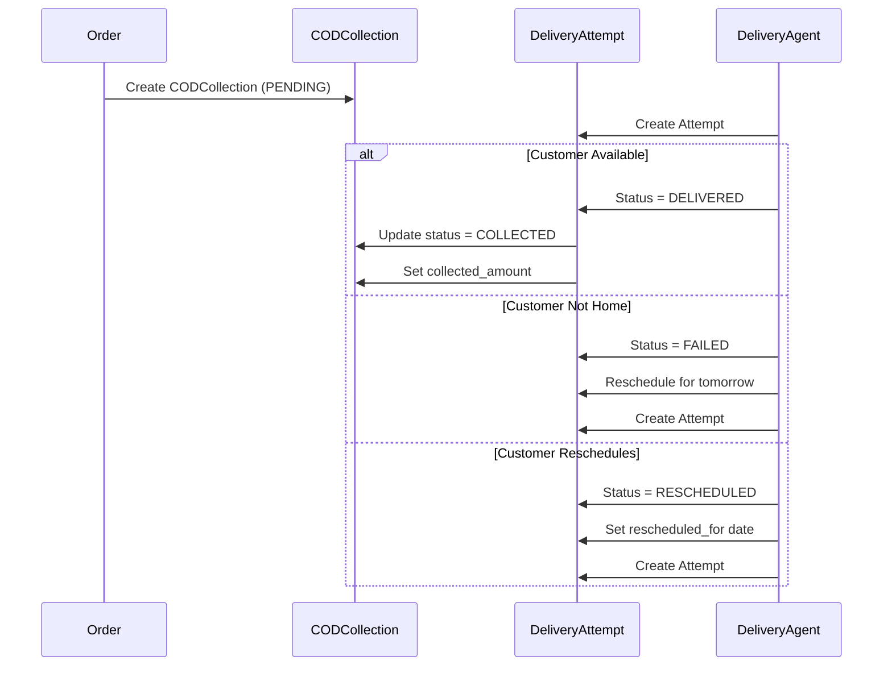
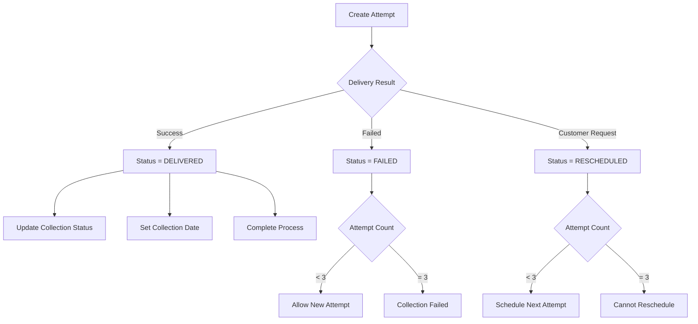
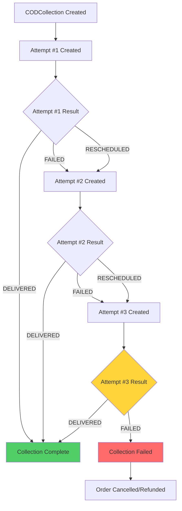
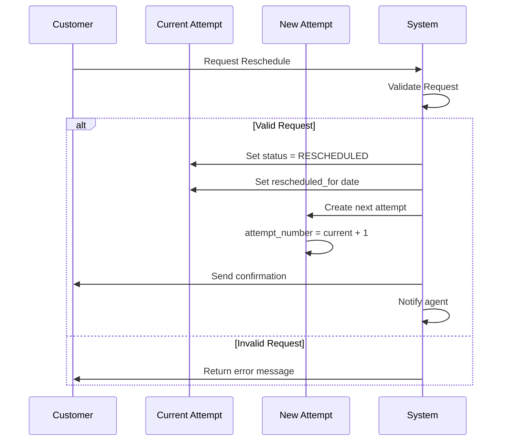

# Tasks 57-62: Delivery Attempt, Reschedule & Verification

> **Phase:** 09 - Integrations & Sri Lanka Localizations  
> **SubPhase:** 06 - Cash on Delivery (COD)  
> **Group:** D - Delivery & Collection  
> **Document:** 02 of 02  
> **Tasks Covered:** 57, 58, 59, 60, 61, 62

---

## Navigation

- **↑ Parent:** [00_GROUP_OVERVIEW.md](00_GROUP_OVERVIEW.md)
- **← Previous Document:** [01_Tasks-49-56_Collection-Model.md](01_Tasks-49-56_Collection-Model.md)

---

## Document Overview

This document covers the creation of the DeliveryAttempt model for tracking delivery attempts and customer reschedule requests. The model includes attempt status tracking (delivered/failed/rescheduled), failure reason documentation, max attempts enforcement (3 attempts limit), reschedule logic for customer convenience, and comprehensive verification of the delivery-collection workflow. This completes the COD delivery tracking system for Sri Lanka's delivery ecosystem.

### Tasks in This Document
| Task # | Task Name | Complexity | Est. Time |
|--------|-----------|------------|-----------|
| 57 | Create Delivery Attempt Model | Medium | 45 min |
| 58 | Create Attempt Status | Low | 20 min |
| 59 | Create Failure Reason | Low | 25 min |
| 60 | Create Max Attempts | Low | 20 min |
| 61 | Create Reschedule Logic | Medium | 40 min |
| 62 | Verify Delivery Collection | Low | 30 min |

---

## Task 57: Create Delivery Attempt Model

### Overview
Create the DeliveryAttempt model to track each delivery attempt for a COD collection. This model records every time a delivery agent attempts to deliver an order and collect payment, including successful deliveries, failed attempts, and rescheduled deliveries. The model supports max attempts enforcement, failure tracking, and provides complete audit trail for delivery operations.

### Dependencies
- Task 56: Create Collection Notes (CODCollection model complete)
- User model exists for agent assignment
- Django timezone utilities configured

### Instructions

1. **Create model file**
   - Navigate to `backend/apps/payments/models/` directory
   - Create new file named `delivery_attempt.py`
   - Set up proper Python module structure

2. **Import required dependencies**
   - Import Django model base classes
   - Import CODCollection model
   - Import timezone utilities
   - Import User model for agent tracking

3. **Define DeliveryAttempt model class**
   - Inherit from TenantAwareModel
   - Add comprehensive docstring
   - Configure Meta class options

4. **Configure Meta class**
   - Set `db_table` to "payments_delivery_attempt"
   - Set verbose names
   - Define ordering (chronological)
   - Add unique_together constraint if needed
   - Add indexes for queries

5. **Plan field structure**
   - collection (ForeignKey to CODCollection)
   - attempt_number (IntegerField, 1-3)
   - status (CharField with choices)
   - failure_reason (CharField, nullable)
   - attempted_at (DateTimeField)
   - attempted_by (ForeignKey to User, optional)
   - rescheduled_for (DateTimeField, nullable)
   - notes (TextField, optional)

6. **Add model methods**
   - `__str__` method with attempt info
   - `is_successful` property
   - `is_final_attempt` property
   - `can_reschedule` method

7. **Add validation methods**
   - Validate attempt_number range (1-3)
   - Ensure chronological attempt order
   - Validate status transitions
   - Check max attempts not exceeded

### Model Purpose and Context

| Aspect | Details |
|--------|---------|
| Primary Purpose | Track individual delivery attempts |
| Business Context | Sri Lanka allows max 3 delivery attempts |
| Integration Points | CODCollection, delivery agents, scheduling |
| Audit Trail | Complete history of delivery attempts |

### Delivery Attempt Workflow

```
Delivery Attempt Lifecycle
━━━━━━━━━━━━━━━━━━━━━━━━━━
Order Dispatched:
└── CODCollection created (PENDING)

Attempt 1:
├── DeliveryAttempt #1 created
├── Agent goes to address
├── Outcome: Success/Failed/Rescheduled
└── Status and notes recorded

Attempt 2 (if needed):
├── DeliveryAttempt #2 created
├── Agent makes second attempt
├── Outcome: Success/Failed/Rescheduled
└── Status updated

Attempt 3 (final):
├── DeliveryAttempt #3 created
├── Final delivery attempt
├── Outcome: Success/Failed (no more reschedules)
└── If failed: Collection status → FAILED
```

### Attempt Tracking Flow



### Model Responsibilities

| Responsibility | Description |
|----------------|-------------|
| Attempt Tracking | Record each delivery attempt |
| Status Recording | Capture outcome of each attempt |
| Failure Documentation | Log why delivery failed |
| Reschedule Management | Track rescheduled delivery dates |
| Agent Assignment | Link attempts to delivery agents |
| Max Attempts Enforcement | Prevent >3 attempts |

### Related Models

| Model | Relationship | Purpose |
|-------|--------------|---------|
| CODCollection | ForeignKey | Links to collection record |
| User | ForeignKey | Internal agent assignment |
| Order | Indirect (via collection) | Original order |

### Attempt Number Tracking

```
Attempt Numbering Logic
━━━━━━━━━━━━━━━━━━━━━
Auto-Increment Approach:
├── Query existing attempts for collection
├── Count attempts: count = attempts.count()
├── New attempt number = count + 1
└── Ensure <= 3 attempts

Example:
Collection ID: ABC123
├── Attempt #1: 2026-01-31 10:00 AM
├── Attempt #2: 2026-02-01 02:00 PM
└── Attempt #3: 2026-02-02 04:30 PM
    └── Final attempt (max reached)
```

### Sri Lanka Delivery Context

| Context | Details |
|---------|---------|
| Max Attempts | 3 attempts per order (industry standard) |
| Attempt Timing | Usually next-day reschedules |
| Working Hours | 9 AM - 6 PM typical delivery window |
| Common Issues | Wrong address, customer not home, phone off |

### Database Performance

| Consideration | Implementation |
|---------------|----------------|
| Query Optimization | Index on collection_id, attempt_number |
| Tenant Isolation | Inherits TenantAwareModel |
| Date Queries | Index on attempted_at |
| Counting | Efficient count queries for max attempts |

### Expected Outcome
- DeliveryAttempt model created with proper structure
- Foreign key relationship to CODCollection established
- Attempt numbering logic planned
- Status and timing fields ready
- Validation for max attempts prepared
- Ready for status and reason field implementation

### Verification Checklist
- [ ] `backend/apps/payments/models/delivery_attempt.py` file created
- [ ] DeliveryAttempt model class defined
- [ ] Inherits from TenantAwareModel
- [ ] Meta class configured
- [ ] Model docstring added
- [ ] `__str__` method implemented
- [ ] Property methods planned
- [ ] Validation structure added
- [ ] Imports are correct

---

## Task 58: Create Attempt Status

### Overview
Create the `status` field in DeliveryAttempt model to track the outcome of each delivery attempt. The field uses choices to ensure data integrity with three possible values: DELIVERED (successful delivery and collection), FAILED (unsuccessful attempt), and RESCHEDULED (customer requested reschedule). Status drives workflow logic and max attempts enforcement.

### Dependencies
- Task 57: Create Delivery Attempt Model

### Instructions

1. **Define status choices**
   - Create TextChoices class named `AttemptStatus`
   - Define three status values
   - Use clear, descriptive labels

2. **Add status field**
   - Add CharField with choices
   - Set appropriate max_length
   - Make field required

3. **Configure field parameters**
   - Set `choices=AttemptStatus.choices`
   - No default value (must be set explicitly)
   - Set `max_length=20`
   - Add verbose_name and help_text

4. **Implement status validation**
   - Validate status is set on creation
   - Ensure final attempt cannot be RESCHEDULED
   - Validate DELIVERED sets collection status

5. **Add status query methods**
   - Create queryset for successful attempts
   - Create queryset for failed attempts
   - Create queryset for rescheduled attempts

6. **Implement status-triggered actions**
   - DELIVERED: Update CODCollection status
   - DELIVERED: Set collection_date
   - FAILED: Check max attempts
   - RESCHEDULED: Create next attempt record

7. **Add status display helpers**
   - Status badge colors
   - Status icons
   - Status descriptions

### Status Choices Definition

| Status Value | Label | Description |
|--------------|-------|-------------|
| DELIVERED | Delivered | Order delivered and payment collected |
| FAILED | Failed | Delivery attempt failed |
| RESCHEDULED | Rescheduled | Customer requested reschedule |

### Status Business Rules

```
Attempt Status Business Rules
━━━━━━━━━━━━━━━━━━━━━━━━━━━
DELIVERED:
├── Payment must be collected
├── Update CODCollection.status → COLLECTED/PARTIAL
├── Set CODCollection.collection_date
├── No more attempts needed
└── Mark order as completed

FAILED:
├── Check attempt count
├── If < 3 attempts: Allow reschedule
├── If = 3 attempts: Set Collection.status → FAILED
├── Document failure reason (required)
└── May create next attempt

RESCHEDULED:
├── Customer requested new date
├── Set rescheduled_for date
├── Create next DeliveryAttempt record
├── Cannot reschedule on 3rd attempt
└── Customer communication required
```

### Status Workflow Diagram



### Status-Triggered Actions

| Status | Action | Side Effects |
|--------|--------|--------------|
| DELIVERED | Update collection | CODCollection.status = COLLECTED |
| DELIVERED | Record date | CODCollection.collection_date = now |
| DELIVERED | Complete order | Order.status = COMPLETED |
| FAILED | Check attempts | If 3rd: Collection.status = FAILED |
| FAILED | Notify customer | Send failure notification |
| RESCHEDULED | Create attempt | Generate next DeliveryAttempt |
| RESCHEDULED | Schedule | Set rescheduled_for date |

### Sri Lanka Delivery Status Context

```
Typical Delivery Outcomes (Sri Lanka)
━━━━━━━━━━━━━━━━━━━━━━━━━━━━━━━━
DELIVERED (60-70%):
├── Customer available
├── Payment collected
├── Order handed over
└── Process complete

FAILED (20-25%):
├── Customer not home
├── Wrong address
├── Phone not reachable
├── Customer changed mind
└── Security issues

RESCHEDULED (10-15%):
├── Customer requests specific time
├── Customer traveling
├── Customer at work
├── Wants evening delivery
└── Prefers weekend delivery
```

### Status Validation Rules

| Rule | Condition | Error Message |
|------|-----------|---------------|
| Status Required | status is not None | "Attempt status is required" |
| No Reschedule on 3rd | attempt_number == 3 AND status == RESCHEDULED | "Cannot reschedule final attempt" |
| Collected Amount | status == DELIVERED AND collected == 0 | "Delivered must have collection" |
| Failure Reason | status == FAILED AND reason is None | "Failed attempts need reason" |

### Query Manager Methods

| Method | Filter | Use Case |
|--------|--------|----------|
| delivered() | status=DELIVERED | Successful deliveries |
| failed() | status=FAILED | Failed attempts for analysis |
| rescheduled() | status=RESCHEDULED | Pending rescheduled deliveries |
| final_attempts() | attempt_number=3 | Last chance deliveries |

### Status Display Configuration

```
Status Display Styling
━━━━━━━━━━━━━━━━━━━━
DELIVERED:
├── Color: Green (#10B981)
├── Icon: check-circle
├── Badge: "✓ Delivered"
└── Description: "Successfully delivered"

FAILED:
├── Color: Red (#EF4444)
├── Icon: x-circle
├── Badge: "✗ Failed"
└── Description: "Delivery failed"

RESCHEDULED:
├── Color: Blue (#3B82F6)
├── Icon: calendar
├── Badge: "↻ Rescheduled"
└── Description: "Rescheduled for {date}"
```

### Integration Points

| Integration | Trigger | Action |
|-------------|---------|--------|
| CODCollection | Status = DELIVERED | Update collection status |
| Order | Status = DELIVERED | Mark order completed |
| Notification | Status = FAILED | Alert customer of failure |
| Notification | Status = RESCHEDULED | Confirm reschedule with customer |
| Analytics | All statuses | Track delivery metrics |

### Expected Outcome
- Status field added with three clear choices
- Business rules enforce proper workflow
- Status-triggered actions implemented
- Query methods for filtering by status
- Display helpers for UI presentation
- Integration with CODCollection complete

### Verification Checklist
- [ ] AttemptStatus TextChoices class defined
- [ ] Three status choices created (DELIVERED, FAILED, RESCHEDULED)
- [ ] `status` CharField added with choices
- [ ] Field is required (non-nullable)
- [ ] Status validation rules implemented
- [ ] Query manager methods created
- [ ] Status-triggered actions added
- [ ] Display helpers implemented
- [ ] Help text and verbose name set
- [ ] Cannot reschedule 3rd attempt enforced

---

## Task 59: Create Failure Reason

### Overview
Create the `failure_reason` field in DeliveryAttempt model to capture why a delivery attempt failed. This field stores predefined failure reason codes that help identify common delivery issues, improve operations, and provide customer service insights. The field is required when status is FAILED and supports both predefined codes and custom text.

### Dependencies
- Task 57: Create Delivery Attempt Model
- Task 58: Create Attempt Status (status field)

### Instructions

1. **Define failure reason choices**
   - Create TextChoices class named `FailureReason`
   - Define common failure scenarios
   - Use clear, descriptive codes

2. **Add failure_reason field**
   - Add CharField with choices
   - Make field nullable (only required for FAILED status)
   - Set appropriate max_length

3. **Configure field parameters**
   - Set `choices=FailureReason.choices`
   - Set `null=True, blank=True`
   - Set `max_length=100`
   - Add verbose_name and help_text

4. **Implement conditional validation**
   - Require failure_reason when status=FAILED
   - Allow null for DELIVERED and RESCHEDULED
   - Validate reason code is from choices

5. **Add reason categorization**
   - Group reasons by category (customer, address, product, logistics)
   - Create helper methods for category queries
   - Enable reporting by reason category

6. **Create reason display helpers**
   - Method to get reason display name
   - Method to get reason category
   - Method for customer-facing message

7. **Implement reason analytics**
   - Query most common failure reasons
   - Calculate reason percentages
   - Track reason trends over time

### Failure Reason Choices

| Reason Code | Display Label | Category |
|-------------|---------------|----------|
| CUSTOMER_NOT_HOME | Customer Not Home | Customer |
| CUSTOMER_UNAVAILABLE | Customer Unavailable | Customer |
| CUSTOMER_REFUSED | Customer Refused Order | Customer |
| PHONE_OFF | Phone Switched Off | Customer |
| PHONE_NO_ANSWER | Phone Not Answered | Customer |
| WRONG_ADDRESS | Wrong/Incomplete Address | Address |
| ADDRESS_NOT_FOUND | Address Not Found | Address |
| SECURITY_DENIED | Security/Guard Denied Entry | Address |
| PRODUCT_DAMAGED | Product Damaged | Product |
| WRONG_ITEM | Wrong Item Delivered | Product |
| INSUFFICIENT_CASH | Customer Has Insufficient Cash | Payment |
| CASH_DENOMINATION | Cash Denomination Issue | Payment |
| WEATHER_CONDITION | Adverse Weather | Logistics |
| VEHICLE_BREAKDOWN | Vehicle Breakdown | Logistics |
| AREA_UNSAFE | Area Unsafe to Deliver | Logistics |
| OTHER | Other Reason | Other |

### Sri Lanka Specific Failure Reasons

```
Common Failure Reasons in Sri Lanka
━━━━━━━━━━━━━━━━━━━━━━━━━━━━━━━
Top 5 Failure Reasons (by frequency):

1. CUSTOMER_NOT_HOME (35%)
   └── Customer away from home
   
2. PHONE_OFF (20%)
   └── Phone switched off or unreachable
   
3. WRONG_ADDRESS (15%)
   └── Incorrect or incomplete address
   
4. CUSTOMER_UNAVAILABLE (12%)
   └── Customer busy or unable to receive
   
5. INSUFFICIENT_CASH (10%)
   └── Customer doesn't have enough cash
   
Other Reasons (8%)
└── Various situational issues
```

### Failure Reason Categorization

```
Reason Categories
━━━━━━━━━━━━━━━━━
Customer Issues (47%):
├── CUSTOMER_NOT_HOME
├── CUSTOMER_UNAVAILABLE
├── CUSTOMER_REFUSED
├── PHONE_OFF
└── PHONE_NO_ANSWER

Address Issues (25%):
├── WRONG_ADDRESS
├── ADDRESS_NOT_FOUND
└── SECURITY_DENIED

Product Issues (10%):
├── PRODUCT_DAMAGED
└── WRONG_ITEM

Payment Issues (10%):
├── INSUFFICIENT_CASH
└── CASH_DENOMINATION

Logistics Issues (5%):
├── WEATHER_CONDITION
├── VEHICLE_BREAKDOWN
└── AREA_UNSAFE

Other (3%):
└── OTHER
```

### Validation Rules

| Rule | Condition | Action |
|------|-----------|--------|
| Required for Failed | status=FAILED | failure_reason must be set |
| Null for Success | status=DELIVERED | failure_reason must be null |
| Valid Choice | reason in choices | Reject invalid codes |
| Other Needs Note | reason=OTHER | notes field should explain |

### Reason-Based Actions

| Reason | Recommended Action | Auto-Reschedule |
|--------|-------------------|-----------------|
| CUSTOMER_NOT_HOME | Reschedule next day | Yes (if < 3 attempts) |
| PHONE_OFF | Try different contact | Yes |
| WRONG_ADDRESS | Contact customer for correct address | Hold until verified |
| CUSTOMER_REFUSED | Cancel order, process refund | No |
| PRODUCT_DAMAGED | Return to warehouse | No |
| INSUFFICIENT_CASH | Offer partial payment or reschedule | Yes |
| WEATHER_CONDITION | Reschedule when clear | Yes |

### Reason Display Messages

```
Customer-Facing Messages by Reason
━━━━━━━━━━━━━━━━━━━━━━━━━━━━━━━
CUSTOMER_NOT_HOME:
└── "We attempted delivery but you were not home. 
     We'll try again tomorrow."

PHONE_OFF:
└── "We couldn't reach you by phone. Please ensure 
     your phone is on for the next delivery attempt."

WRONG_ADDRESS:
└── "The delivery address appears incorrect. Please 
     verify your address in your order details."

CUSTOMER_REFUSED:
└── "Our delivery agent reports the order was refused. 
     Please contact support if this is incorrect."

INSUFFICIENT_CASH:
└── "Delivery requires ₨{amount} cash payment. Please 
     have exact amount ready for next attempt."
```

### Failure Reason Analytics

| Metric | Query | Purpose |
|--------|-------|---------|
| Top Reasons | Count by failure_reason | Identify common issues |
| Category Breakdown | Group by category | Strategic improvements |
| Reason Trends | Time series by reason | Seasonal patterns |
| Agent Comparison | Reasons by agent | Training needs |
| Success After Reason | Next attempt success rate | Resolution effectiveness |

### Reporting Queries

```
Failure Reason Analysis Queries
━━━━━━━━━━━━━━━━━━━━━━━━━━━━
Query 1: Top 5 Failure Reasons
├── SELECT failure_reason, COUNT(*)
├── FROM delivery_attempt
├── WHERE status = 'FAILED'
├── GROUP BY failure_reason
└── ORDER BY COUNT(*) DESC LIMIT 5

Query 2: Failure Rate by Category
├── Calculate failures per category
├── Compare against total attempts
└── Identify systematic issues

Query 3: Resolution Rate
├── Track what happens after each failure reason
├── DELIVERED on next attempt vs FAILED again
└── Measure reason-specific success rates
```

### Expected Outcome
- failure_reason field added with comprehensive choices
- Validation requires reason for failed attempts
- Categorization enables grouped analysis
- Display helpers provide customer-friendly messages
- Analytics queries identify improvement areas
- Sri Lanka-specific reasons captured

### Verification Checklist
- [ ] FailureReason TextChoices class defined
- [ ] Comprehensive failure reasons listed
- [ ] `failure_reason` CharField added
- [ ] Field is nullable (required only for FAILED)
- [ ] Conditional validation implemented
- [ ] Reason categorization methods created
- [ ] Display helper methods added
- [ ] Customer-facing messages defined
- [ ] Analytics query methods planned
- [ ] Help text and verbose name set

---

## Task 60: Create Max Attempts

### Overview
Create validation and enforcement logic to limit delivery attempts to a maximum of 3 per order. This task implements the business rule that prevents excessive delivery attempts, automatically marks collections as FAILED after the third unsuccessful attempt, and provides clear feedback to agents and customers about attempt limits. The logic integrates with attempt creation, status updates, and collection workflow.

### Dependencies
- Task 57: Create Delivery Attempt Model
- Task 58: Create Attempt Status
- Task 59: Create Failure Reason

### Instructions

1. **Add attempt_number field**
   - Add IntegerField named `attempt_number`
   - Set to auto-increment based on collection
   - Range 1-3

2. **Configure attempt_number**
   - Set validators for range [1, 3]
   - Make field required
   - Add to unique_together with collection

3. **Implement max attempts validation**
   - Create validator method
   - Check existing attempts before creation
   - Prevent creation if 3 attempts exist
   - Raise ValidationError with clear message

4. **Add attempt counting helpers**
   - Method to get current attempt count
   - Property to check if max reached
   - Method to get remaining attempts

5. **Implement auto-failure logic**
   - Check if 3rd attempt failed
   - Auto-update CODCollection status to FAILED
   - Prevent further attempt creation
   - Notify customer and admin

6. **Add attempt creation logic**
   - Auto-assign attempt_number on creation
   - Query existing attempts for collection
   - Increment to next number
   - Validate not exceeding max

7. **Implement reschedule restrictions**
   - Allow reschedule on attempts 1 and 2
   - Prevent reschedule on attempt 3
   - Display warning on final attempt
   - Enforce in status validation

### Attempt Number Configuration

| Parameter | Value | Purpose |
|-----------|-------|---------|
| Field Type | IntegerField | Store attempt count |
| Min Value | 1 | First attempt |
| Max Value | 3 | Maximum allowed |
| Required | Yes | Always set |
| Auto-Assign | Yes | Calculate on creation |

### Max Attempts Business Rules

```
Max Attempts Enforcement Rules
━━━━━━━━━━━━━━━━━━━━━━━━━━━━
Rule 1: Maximum 3 Attempts
├── Each collection limited to 3 delivery attempts
├── Prevent creation of 4th attempt
└── Raise error: "Maximum delivery attempts reached"

Rule 2: Auto-Failure on 3rd Failed Attempt
├── If attempt #3 status = FAILED
├── Set CODCollection.status = FAILED
├── No more attempts allowed
└── Trigger cancellation workflow

Rule 3: No Reschedule on 3rd Attempt
├── Attempts 1-2: Can be RESCHEDULED
├── Attempt 3: Only DELIVERED or FAILED
├── Prevent status = RESCHEDULED on attempt #3
└── Error: "Final attempt cannot be rescheduled"

Rule 4: Attempt Numbering
├── Query existing attempts for collection
├── Next attempt = count + 1
├── Ensure sequential numbering
└── Prevent gaps or duplicates
```

### Attempt Lifecycle with Max Attempts



### Attempt Counting Methods

| Method | Returns | Purpose |
|--------|---------|---------|
| get_attempt_count() | Integer | Count existing attempts |
| is_max_attempts_reached() | Boolean | Check if 3 attempts exist |
| get_remaining_attempts() | Integer | Calculate attempts left |
| can_create_attempt() | Boolean | Validate new attempt allowed |

### Auto-Assignment Logic

```
Attempt Number Auto-Assignment
━━━━━━━━━━━━━━━━━━━━━━━━━━━━
On DeliveryAttempt Creation:

1. Query existing attempts:
   attempts = collection.delivery_attempts.all()
   
2. Count attempts:
   count = attempts.count()
   
3. Validate not at max:
   if count >= 3:
       raise ValidationError("Max attempts reached")
   
4. Assign next number:
   attempt_number = count + 1
   
5. Save attempt:
   Save with calculated attempt_number

Example:
Collection ABC123:
├── No attempts exist → attempt_number = 1
├── 1 attempt exists → attempt_number = 2
├── 2 attempts exist → attempt_number = 3
└── 3 attempts exist → Error!
```

### Validation Error Messages

| Scenario | Error Message | User Action |
|----------|---------------|-------------|
| 4th Attempt | "Maximum 3 delivery attempts allowed" | Contact customer support |
| 3rd Reschedule | "Final delivery attempt cannot be rescheduled" | Deliver or mark failed |
| Invalid Number | "Attempt number must be between 1 and 3" | System corrects automatically |

### Sri Lanka Max Attempts Context

```
Sri Lanka Delivery Attempt Standards
━━━━━━━━━━━━━━━━━━━━━━━━━━━━━━━━
Industry Standard: 3 Attempts
├── Most courier services: 3 attempts
├── Some premium: 4-5 attempts
└── LCC Policy: 3 attempts (standard)

Attempt Timing (Typical):
├── Attempt 1: Same day / Next day
├── Attempt 2: Day after 1st attempt
└── Attempt 3: Day after 2nd attempt
    (Usually 1-3 day span total)

Cost Consideration:
├── Each attempt costs courier fee
├── 3 attempts balances service vs cost
└── Reduces failed delivery losses
```

### Final Attempt Warnings

```
Final Attempt Notifications
━━━━━━━━━━━━━━━━━━━━━━━━
To Customer (SMS/Email):
└── "This is your final delivery attempt for Order #12345.
     Please ensure you are available at {address} on {date}
     at {time}. Contact: {phone}. This is attempt 3 of 3."

To Delivery Agent (App):
└── "⚠️ FINAL ATTEMPT - Order #12345
     This is the last delivery attempt. Ensure customer 
     contact before leaving depot. Cannot reschedule."

Admin Dashboard:
└── Highlight attempt #3 in red/yellow
    Show "FINAL ATTEMPT" badge
```

### Post-Max-Attempts Actions

| Action | When | Purpose |
|--------|------|---------|
| Update Collection | 3rd attempt failed | Set status to FAILED |
| Cancel Order | Collection failed | Initiate cancellation |
| Refund Customer | If prepaid fees | Process refund |
| Notify Customer | Collection failed | Explain next steps |
| Return Product | In warehouse | Restock inventory |
| Agent Report | After 3rd attempt | Record in agent metrics |

### Expected Outcome
- attempt_number field added with validation
- Max 3 attempts enforced at model level
- Auto-assignment of attempt numbers
- Clear validation errors for exceeding max
- Auto-failure after 3rd failed attempt
- Reschedule blocked on final attempt
- Customer and agent warnings implemented

### Verification Checklist
- [ ] `attempt_number` IntegerField added
- [ ] Min/max validators set (1-3)
- [ ] Auto-assignment logic implemented
- [ ] Max attempts validation added
- [ ] Attempt counting methods created
- [ ] 3rd attempt auto-failure logic added
- [ ] Reschedule restriction on attempt #3
- [ ] Validation error messages defined
- [ ] Customer warning notifications planned
- [ ] Help text and verbose name set

---

## Task 61: Create Reschedule Logic

### Overview
Create comprehensive reschedule logic that allows customers to request delivery on a different date/time within business constraints. The logic handles customer-initiated reschedules, validates reschedule requests, manages rescheduled_for dates, creates new delivery attempt records, and ensures reschedules don't bypass max attempts limit. Includes notification system and admin workflow integration.

### Dependencies
- Task 57: Create Delivery Attempt Model
- Task 58: Create Attempt Status
- Task 60: Create Max Attempts

### Instructions

1. **Add rescheduled_for field**
   - Add DateTimeField named `rescheduled_for`
   - Nullable (only set when rescheduled)
   - Store customer's preferred delivery time

2. **Configure rescheduled_for field**
   - Set `null=True, blank=True`
   - Add validator for future dates
   - Add validator for business hours
   - Set verbose_name and help_text

3. **Implement reschedule validation**
   - Validate rescheduled date is in future
   - Check date is within allowed window (e.g., 14 days)
   - Verify date is not a holiday
   - Ensure time is within delivery hours
   - Validate attempt count allows reschedule

4. **Create reschedule request handler**
   - Accept reschedule request from customer
   - Validate request parameters
   - Update current attempt status to RESCHEDULED
   - Set rescheduled_for date
   - Create next attempt record
   - Send confirmation notification

5. **Add reschedule business rules**
   - Allow reschedule on attempts 1 and 2
   - Block reschedule on attempt 3
   - Limit reschedules per attempt (e.g., once per attempt)
   - Enforce minimum advance notice (e.g., 2 hours)

6. **Implement next attempt creation**
   - Auto-create next DeliveryAttempt
   - Copy relevant data from current attempt
   - Set scheduled_for based on rescheduled_for
   - Increment attempt_number
   - Link to same CODCollection

7. **Add reschedule notifications**
   - Send SMS to customer confirming new date
   - Notify delivery agent of reschedule
   - Update admin dashboard
   - Create audit log entry

### Rescheduled_for Field Configuration

| Parameter | Value | Purpose |
|-----------|-------|---------|
| Field Type | DateTimeField | Store scheduled date/time |
| null | True | Only set when rescheduled |
| blank | True | Optional initially |
| validators | Future date, business hours | Valid scheduling |

### Reschedule Validation Rules

```
Reschedule Request Validation
━━━━━━━━━━━━━━━━━━━━━━━━━━━
Rule 1: Future Date Only
├── rescheduled_for > current_time + 2 hours
└── Error: "Reschedule time must be at least 2 hours ahead"

Rule 2: Within Allowed Window
├── rescheduled_for <= current_date + 14 days
└── Error: "Cannot reschedule more than 14 days ahead"

Rule 3: Business Days Only
├── Check if date is working day (Mon-Sat in Sri Lanka)
├── Exclude Sundays and public holidays
└── Error: "Cannot schedule for holidays or Sundays"

Rule 4: Delivery Hours
├── Time between 9:00 AM - 6:00 PM
└── Error: "Delivery only available 9 AM to 6 PM"

Rule 5: Attempt Limit
├── Current attempt_number < 3
└── Error: "Final attempt cannot be rescheduled"
```

### Reschedule Workflow



### Sri Lanka Business Context

```
Sri Lanka Delivery Scheduling
━━━━━━━━━━━━━━━━━━━━━━━━━━
Working Days:
├── Monday - Saturday: Delivery days
└── Sunday: No delivery (standard)

Delivery Hours:
├── 9:00 AM - 6:00 PM: Standard window
├── 9:00 AM - 12:00 PM: Morning slot
├── 12:00 PM - 3:00 PM: Afternoon slot
└── 3:00 PM - 6:00 PM: Evening slot

Public Holidays (No Delivery):
├── Poya Days (monthly)
├── Sinhala/Tamil New Year
├── Vesak
├── Christmas
└── Other national holidays

Advance Notice:
└── Minimum 2 hours before scheduled time
```

### Reschedule Request Handler

| Step | Action | Validation |
|------|--------|------------|
| 1. Receive Request | Parse reschedule data | Required fields present |
| 2. Validate Date | Check date rules | Future, business day, delivery hours |
| 3. Validate Attempt | Check attempt number | Not attempt #3 |
| 4. Update Attempt | Set status, date | Status = RESCHEDULED |
| 5. Create Next | New attempt record | attempt_number + 1 |
| 6. Notify | Send confirmations | Customer, agent |
| 7. Audit Log | Record reschedule | Who, when, why |

### Next Attempt Creation

```
Create Next Delivery Attempt
━━━━━━━━━━━━━━━━━━━━━━━━
Input: Current attempt (RESCHEDULED)

Steps:
1. Get collection from current attempt
2. Count existing attempts: n
3. Validate n < 3
4. Create new DeliveryAttempt:
   ├── collection = same collection
   ├── attempt_number = n + 1
   ├── status = PENDING (initial)
   ├── scheduled_for = rescheduled_for
   ├── notes = "Rescheduled from attempt #{n}"
   └── created by system
5. Save new attempt
6. Return new attempt ID

Example:
Current Attempt #1 → RESCHEDULED
└── Create Attempt #2 with scheduled date
```

### Reschedule Notifications

```
Reschedule Confirmation Messages
━━━━━━━━━━━━━━━━━━━━━━━━━━━━━
SMS to Customer:
└── "Your delivery for Order #12345 has been rescheduled
     to {date} at {time} as requested. Delivery attempt 
     {n} of 3. Track: {link}"

Email to Customer:
├── Subject: "Delivery Rescheduled - Order #12345"
├── Body: Confirm new date/time
├── Include: Order details, tracking link
└── Note: Remaining attempts

Agent Notification (App):
└── "⚠️ Rescheduled - Order #12345
     New delivery: {date} {time}
     Address: {address}
     Attempt {n} of 3"

Admin Dashboard:
└── Activity: "Order #12345 rescheduled to {date}"
    Reason: "Customer request"
```

### Reschedule Business Rules

| Rule | Limit | Enforcement |
|------|-------|-------------|
| Max Reschedules | Once per attempt | Track reschedule count |
| Advance Notice | 2 hours minimum | Validate time difference |
| Max Future Date | 14 days ahead | Validate date range |
| Business Days | Mon-Sat only | Holiday calendar check |
| Delivery Hours | 9 AM - 6 PM | Validate time of day |
| Final Attempt | No reschedule | Block on attempt #3 |

### Reschedule Analytics

| Metric | Query | Purpose |
|--------|-------|---------|
| Reschedule Rate | RESCHEDULED / Total attempts | Customer behavior |
| Reason Analysis | Group by reschedule reason | Identify patterns |
| Time Preferences | Group by scheduled_for hour | Optimize delivery slots |
| Success After Reschedule | Next attempt status | Reschedule effectiveness |

### Expected Outcome
- rescheduled_for field added to store preferred dates
- Comprehensive validation for reschedule requests
- Automatic next attempt creation
- Business hours and holiday validation
- Customer and agent notifications
- Block reschedule on final attempt
- Full audit trail of reschedule activity

### Verification Checklist
- [ ] `rescheduled_for` DateTimeField added
- [ ] Field is nullable and blank
- [ ] Date/time validation implemented
- [ ] Business day validation added
- [ ] Delivery hours validation added
- [ ] Holiday calendar check implemented
- [ ] Attempt #3 reschedule blocked
- [ ] Next attempt auto-creation logic added
- [ ] Customer notification system created
- [ ] Agent notification system created
- [ ] Advance notice validation (2 hours)
- [ ] Help text and verbose name set

---

## Task 62: Verify Delivery Collection

### Overview
Create comprehensive verification procedures to test the complete delivery and collection workflow. This task validates that all components work together correctly: CODCollection creation, delivery attempt tracking, status transitions, max attempts enforcement, reschedule logic, and final collection recording. Includes test scenarios, verification checklists, and data integrity checks.

### Dependencies
- All previous tasks (49-61) complete
- CODCollection model complete
- DeliveryAttempt model complete
- All business rules implemented

### Instructions

1. **Create test scenarios**
   - Define comprehensive test cases
   - Cover happy path and edge cases
   - Include failure scenarios
   - Document expected outcomes

2. **Implement verification functions**
   - Create model validation checks
   - Add data integrity verifications
   - Implement business rule checks
   - Create report generation functions

3. **Add admin verification tools**
   - Create admin action for verification
   - Add collection status dashboard
   - Implement anomaly detection
   - Create reconciliation reports

4. **Create test data generators**
   - Build realistic test data
   - Generate various scenarios
   - Simulate agent actions
   - Create load test data

5. **Implement automated checks**
   - Cron job for daily verification
   - Detect stuck collections
   - Find orphaned attempts
   - Identify inconsistent states

6. **Add monitoring and alerts**
   - Set up collection failure alerts
   - Monitor max attempts reached
   - Track success rates
   - Alert on anomalies

7. **Create verification documentation**
   - Document verification process
   - List all test scenarios
   - Provide troubleshooting guide
   - Define success criteria

### Test Scenarios

```
Comprehensive Test Scenarios
━━━━━━━━━━━━━━━━━━━━━━━━━━
Scenario 1: Successful Collection (First Attempt)
├── Create CODCollection (PENDING)
├── Create DeliveryAttempt #1
├── Set status = DELIVERED
├── Verify: Collection.status = COLLECTED
├── Verify: Collection.collection_date set
└── Verify: Collection.collected_amount = expected_amount

Scenario 2: Success After Reschedule
├── Create CODCollection (PENDING)
├── Create DeliveryAttempt #1
├── Set status = RESCHEDULED
├── Verify: Attempt #2 created
├── Attempt #2 status = DELIVERED
├── Verify: Collection.status = COLLECTED
└── Verify: Total attempts = 2

Scenario 3: Partial Collection
├── Create CODCollection (expected = ₨5,814)
├── Attempt #1: DELIVERED
├── Set collected_amount = ₨3,000
├── Verify: Collection.status = PARTIAL
├── Verify: Collection.collection_shortfall = ₨2,814
└── Verify: Can create follow-up collection

Scenario 4: Maximum Attempts Failure
├── Create CODCollection (PENDING)
├── Attempt #1: status = FAILED
├── Attempt #2: status = FAILED
├── Attempt #3: status = FAILED
├── Verify: Collection.status = FAILED
├── Verify: Cannot create Attempt #4
└── Verify: Order status updated

Scenario 5: Reschedule on Final Attempt (Blocked)
├── Create CODCollection
├── Attempts #1 and #2 failed
├── Attempt #3: Try to reschedule
├── Verify: ValidationError raised
└── Verify: Status can only be DELIVERED or FAILED
```

### Verification Checklist

| Check | Description | Expected Result |
|-------|-------------|-----------------|
| Model Creation | CODCollection created with order | Success, all fields set |
| Status Transitions | Status changes follow rules | Valid transitions only |
| Amount Validation | Collected <= Expected | Validation passes |
| Attempt Counting | Max 3 attempts enforced | Error on 4th attempt |
| Reschedule Logic | Reschedule creates next attempt | New attempt created |
| Final Attempt Block | Attempt #3 cannot reschedule | ValidationError |
| Date Auto-Set | collection_date set on COLLECTED | Date matches collection |
| Agent Reference | Agent ID stored correctly | Reference retrievable |
| Notes Storage | Notes saved and retrieved | Text preserved |

### Data Integrity Checks

```
Data Integrity Verification
━━━━━━━━━━━━━━━━━━━━━━━━━
Check 1: Orphaned Attempts
├── Query: DeliveryAttempts without CODCollection
└── Expected: None found

Check 2: Attempt Sequence
├── Query: Gaps in attempt_number sequence
└── Expected: 1, 2, 3 (no gaps)

Check 3: Status Consistency
├── Query: COLLECTED collections with 0 collected_amount
└── Expected: None found

Check 4: Date Consistency
├── Query: collection_date set but status != COLLECTED
└── Expected: None found

Check 5: Max Attempts
├── Query: Collections with > 3 attempts
└── Expected: None found

Check 6: Final Attempt Reschedule
├── Query: Attempt #3 with status = RESCHEDULED
└── Expected: None found
```

### Automated Verification Script

| Verification | Frequency | Action on Failure |
|--------------|-----------|-------------------|
| Stuck Collections | Daily | Alert admin, list pending >7 days |
| Orphaned Attempts | Daily | Report and suggest cleanup |
| Status Mismatches | Daily | Flag for manual review |
| Amount Discrepancies | Daily | Create reconciliation task |
| Max Attempts Violations | Real-time | Block and log error |

### Test Data Generator

```
Generate Test Data
━━━━━━━━━━━━━━━━━
Function: generate_test_collections(count)

For each collection:
1. Create Order
2. Set payment_method = COD
3. Create CODCollection
   ├── expected_amount = Order.total + COD_fee
   ├── status = PENDING
   └── Random agent_reference
   
4. Generate attempts (1-3):
   ├── Randomly: DELIVERED (60%)
   ├── Randomly: FAILED (25%)
   └── Randomly: RESCHEDULED (15%)
   
5. Update collection based on attempts
6. Set realistic dates and times

Usage:
└── generate_test_collections(100)
    Creates 100 collections with varied scenarios
```

### Monitoring Dashboard

```
Collection Monitoring Dashboard
━━━━━━━━━━━━━━━━━━━━━━━━━━━
Metrics Display:

Today's Collections:
├── Total Collections: 145
├── Successful (COLLECTED): 98 (67.6%)
├── Failed (FAILED): 12 (8.3%)
├── Partial (PARTIAL): 8 (5.5%)
└── Pending: 27 (18.6%)

Delivery Attempts:
├── Total Attempts: 223
├── Successful: 98 (43.9%)
├── Failed: 75 (33.6%)
└── Rescheduled: 50 (22.4%)

Alerts:
├── 3 collections stuck > 5 days
├── 2 collections with amount mismatch
└── 1 collection at max attempts

Agent Performance:
└── Top agents by success rate
```

### Sri Lanka Specific Verifications

| Verification | Check | Context |
|--------------|-------|---------|
| Currency Format | All amounts in LKR | ₨ symbol, 2 decimals |
| Timezone | All dates in Asia/Colombo | +05:30 offset |
| Business Days | No Sunday deliveries | Check reschedule dates |
| Delivery Hours | 9 AM - 6 PM only | Validate scheduled times |
| Agent Format | Valid agent reference format | Internal/external IDs |

### Success Criteria

```
Verification Success Criteria
━━━━━━━━━━━━━━━━━━━━━━━━━
✓ All test scenarios pass
✓ No data integrity violations
✓ Status transitions valid
✓ Max attempts enforced
✓ Reschedule logic works
✓ Notifications sent correctly
✓ Reports generate without errors
✓ Performance acceptable (<100ms queries)
✓ No orphaned records
✓ Audit trail complete
```

### Troubleshooting Guide

| Issue | Possible Cause | Solution |
|-------|---------------|----------|
| Collection stuck PENDING | No attempts created | Check attempt creation logic |
| 4th attempt created | Validation bypass | Review pre-save hooks |
| Wrong collection amount | Calculation error | Verify order total + COD fee |
| Reschedule failed | Invalid date | Check business day validation |
| Status not updating | Signal not firing | Review signal connections |
| Missing collection_date | Auto-set not working | Check save method override |

### Expected Outcome
- Comprehensive test scenarios executed successfully
- All verification checks pass
- Data integrity maintained
- Automated monitoring in place
- Alerts configured for anomalies
- Documentation complete
- Workflow validated end-to-end

### Verification Checklist
- [ ] Test scenarios defined and documented
- [ ] Happy path tests pass
- [ ] Edge case tests pass
- [ ] Failure scenario tests pass
- [ ] Data integrity checks implemented
- [ ] Verification script created
- [ ] Test data generator working
- [ ] Admin verification tools added
- [ ] Monitoring dashboard configured
- [ ] Alerts set up for anomalies
- [ ] Troubleshooting guide created
- [ ] Performance benchmarks met
- [ ] All business rules verified
- [ ] Integration points tested
- [ ] Documentation complete

---

## Summary

This document completed the delivery attempt tracking and reschedule logic for COD collections. The DeliveryAttempt model tracks each delivery with status tracking, failure reason documentation, and max attempts enforcement (3 attempts). Reschedule logic enables customer-requested date changes with business rule validation. Comprehensive verification ensures the complete delivery-collection workflow operates correctly for Sri Lanka's COD ecosystem.

### Completed Tasks
1. ✓ Created DeliveryAttempt model structure
2. ✓ Created attempt status field with workflow states
3. ✓ Created failure reason field with common codes
4. ✓ Implemented max attempts enforcement (3 attempts)
5. ✓ Created reschedule logic with date validation
6. ✓ Verified complete delivery-collection workflow

### DeliveryAttempt Model Summary

| Field | Type | Purpose |
|-------|------|---------|
| collection | ForeignKey | Links to CODCollection |
| attempt_number | IntegerField | Attempt sequence (1-3) |
| status | CharField | Attempt outcome |
| failure_reason | CharField | Why attempt failed |
| attempted_at | DateTimeField | When attempt occurred |
| rescheduled_for | DateTimeField | Customer's preferred date |
| notes | TextField | Attempt documentation |

### Key Features
- Maximum 3 delivery attempts enforced
- Automatic failure after 3rd unsuccessful attempt
- Customer reschedule with business validation
- Comprehensive failure reason tracking
- Full audit trail of delivery attempts
- Sri Lanka business hours and holiday support

### Workflow Complete
The Group-D Delivery & Collection implementation is now complete with full COD collection tracking and delivery attempt management ready for Sri Lankan delivery operations.

